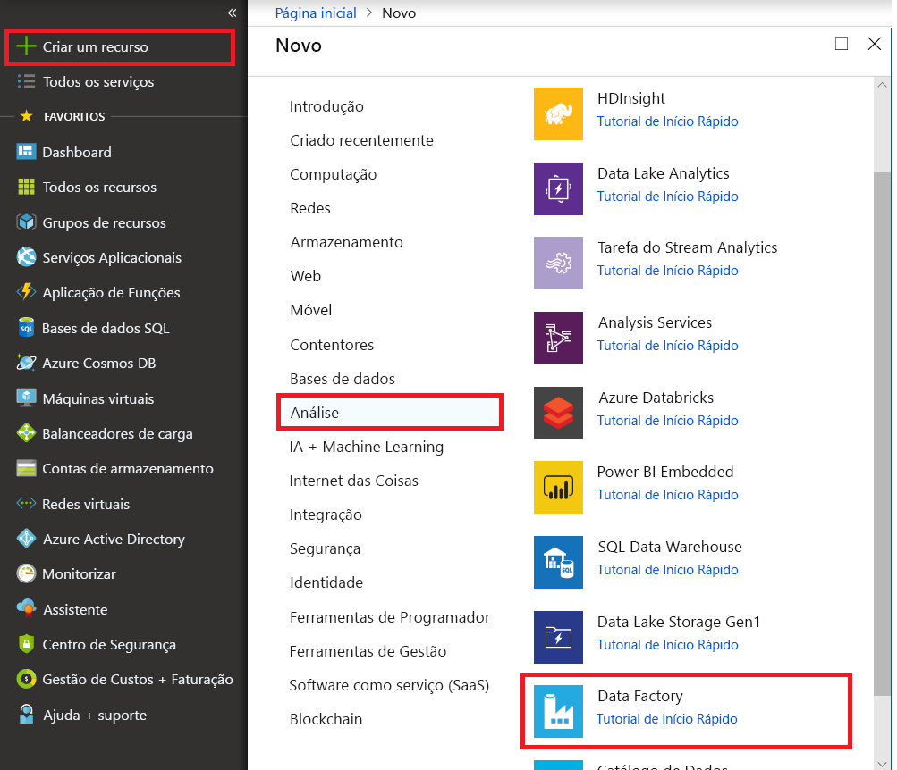

# Início rápido: usar a ferramenta de Copiar Dados para copiar dados

> [!div class="op_single_selector" title1="Selecione a versão do serviço de Data Factory que você está usando:"]
> * [Versão 1](v1/data-factory-copy-data-from-azure-blob-storage-to-sql-database.md)
> * [Versão atual](quickstart-create-data-factory-copy-data-tool.md)

Neste início rápido, irá utilizar o portal do Azure para criar uma fábrica de dados. Utilize a ferramenta Copiar Dados para criar um pipeline que copia dados de uma pasta num armazenamento de Blobs do Azure para outra pasta. 

> [!NOTE]
> Se não estiver familiarizado com o Azure Data Factory, veja [Introdução ao Azure Data Factory](data-factory-introduction.md) antes de começar o início rápido. 

[!INCLUDE [data-factory-quickstart-prerequisites](../../includes/data-factory-quickstart-prerequisites.md)] 

## Criar uma fábrica de dados

1. Abra o browser **Microsoft Edge** ou **Google Chrome**. Atualmente, a IU do Data Factory é suportada apenas nos browsers Microsoft Edge e Google Chrome.
1. Aceda ao [Portal do Azure](https://portal.azure.com). 
1. No menu portal do Azure, selecione **criar um recurso**.

    

1. Selecione **análise**e, em seguida, selecione **Data Factory**.

   

1. Na página **Nova fábrica de dados**, introduza **ADFTutorialDataFactory** em **Nome**. 
 
   O nome do Azure Data Factory deve ser *globalmente exclusivo*. Se receber o seguinte erro, altere o nome da fábrica de dados (por exemplo, **&lt;oseunome&gt;ADFTutorialDataFactory**) e tente criá-la novamente. Para regras de nomenclatura de artefactos do Data Factory, veja o artigo [Data Factory – Regras de Nomenclatura](naming-rules.md).
  
   
1. Em **Subscrição**, selecione a sua subscrição do Azure na qual pretende criar a fábrica de dados. 
1. Em **Grupo de Recursos**, siga um destes passos:
     
   - Selecione **Utilizar existente** e selecione um grupo de recursos já existente na lista. 
   - Selecione **Criar novo** e introduza o nome de um grupo de recursos.   
         
   Para saber mais sobre os grupos de recursos, veja [Utilizar grupos de recursos para gerir os recursos do Azure](../azure-resource-manager/resource-group-overview.md).  
1. Em **Versão**, selecione **V2**.
1. Em **Localização**, selecione a localização para a fábrica de dados.

   A lista mostra apenas as localizações suportadas pelo Data Factory e onde serão armazenados os seus metadados do Azure Data Factory. Os armazenamentos de dados associados (como o armazenamento do Microsoft Azure e o Azure SQL Database) e computações (como o Azure HDInsight) que o Data Factory usa podem ser executados em outras regiões.

1. Selecione **Criar**.

1. Após concluir a criação, verá a página **Data Factory**. Selecione o mosaico **Criar e Monitorizar** para iniciar a aplicação de interface de utilizador (IU) do Azure Data Factory num separador à parte.
   
   

## Iniciar a ferramenta Copiar Dados

1. Na página **Vamos começar**, selecione o mosaico **Copiar Dados** para iniciar a ferramenta Copiar Dados. 

   

1. Na página **Propriedades** da ferramenta Copiar Dados, pode especificar um nome para o pipeline e a respetiva descrição e, em seguida, selecionar **Seguinte**. 

   
1. Na página **Arquivo de dados de origem**, conclua os seguintes passos:

    a. Clique em **+ Criar nova ligação** para adicionar uma ligação.

    b. Selecione **armazenamento de BLOBs do Azure** na galeria e selecione **continuar**.

    c. Na página **novo serviço vinculado (armazenamento de BLOBs do Azure)** , especifique um nome para o serviço vinculado. Selecione sua conta de armazenamento na lista **nome da conta de armazenamento** , testar conexão e, em seguida, selecione **concluir**. 

   

    d. Selecione o serviço vinculado recém-criado como fonte e clique em **Avançar**.

1. Na página **Escolher o ficheiro ou pasta de entrada**, complete os seguintes passos:

   a. Clique em **procurar** para navegar até a pasta **adftutorial/entrada** , selecione o arquivo **EMP. txt** e clique em **escolher**. 

   d. Marque a caixa de seleção **cópia binária** para copiar o arquivo como está e, em seguida, selecione **Avançar**. 

   

1. Na página **armazenamento de dados de destino** , selecione o serviço vinculado **do armazenamento de BLOBs do Azure** que você criou e, em seguida, selecione **Avançar**. 

1. Na página **escolher o arquivo de saída ou a pasta** , insira **adftutorial/output** para o caminho da pasta e, em seguida, selecione **Avançar**. 

    

1. Na página **Definições**, selecione **Seguinte** para utilizar as configurações predefinidas. 

1. Reveja todas as definições na página **Resumo** e selecione **Seguinte**. 

1. Na página **Implementação concluída**, selecione **Monitorização** para monitorizar o pipeline que criou. 

    

1. O aplicativo alterna para a guia **Monitor** . Você vê o status do pipeline nesta guia. Selecione **Atualizar** para atualizar a lista. 
    
1. Selecione a ligação **Ver Execuções de Atividades** na coluna **Ações**. O pipeline apenas tem uma atividade do tipo **Cópia**. 
    
1. Para ver os detalhes da operação de cópia, selecione a ligação **Detalhes** (imagem de óculos), na coluna **Ações**. Para obter os detalhes das propriedades, veja [Copy Activity overview](copy-activity-overview.md) (Descrição geral da Atividade Copy).

1. Verifique se é criado um ficheiro **emp.txt** na pasta **saída** do contentor **adftutorial**. Se a pasta de saída não existir, o serviço de Data Factory a criará automaticamente. 

1. Mude para o separador **Criar** acima do **Monitor** no painel esquerdo, para que possa editar os serviços ligados, conjuntos de dados e pipelines. Para saber mais sobre a edição dos mesmos na IU do Data Factory, consulte [Criar uma fábrica de dados através do portal do Azure](quickstart-create-data-factory-portal.md).

## Passos seguintes
O pipeline neste exemplo copia dados de uma localização para outra localização num armazenamento de Blobs do Azure. Para saber como utilizar o Data Factory em mais cenários, aceda aos [tutoriais](tutorial-copy-data-portal.md). 