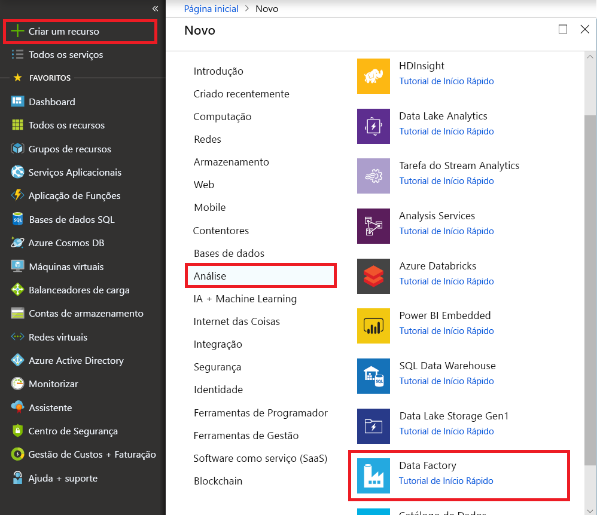

# Copiar ficheiros novos e alterados com base no LastModifiedDate com a ferramenta copiar dados de forma incremental

Neste tutorial, irá utilizar o portal do Azure para criar uma fábrica de dados. Em seguida, usará a ferramenta copiar dados para criar um pipeline de forma incremental copia arquivos novos e alterados apenas, com base na respetiva **LastModifiedDate** do armazenamento de Blobs do Azure para o armazenamento de Blobs do Azure.

Ao fazê-lo, ADF irá analisar todos os ficheiros de arquivo de origem, aplique o filtro de ficheiros pelo respetivo LastModifiedDate e copie o ficheiro de novo e atualizado apenas desde a última vez para o arquivo de destino.  Tenha em atenção que se permitir que enormes quantidades da ADF análise de ficheiros, mas apenas copiar alguns arquivos para o destino, ainda esperaria que a duração de tempo devido a análise do ficheiro é demorada também.   

> [!NOTE]
> Se não estiver familiarizado com o Azure Data Factory, veja [Introdução ao Azure Data Factory](introduction.md).

Neste tutorial, irá executar as seguintes tarefas:

> [!div class="checklist"]
> * Criar uma fábrica de dados.
> * Utilizar a ferramenta Copiar Dados para criar um pipeline.
> * Monitorizar o pipeline e execuções de atividades.

## Pré-requisitos

* **Subscrição do Azure**: Se não tiver uma subscrição do Azure, crie uma [conta gratuita](https://azure.microsoft.com/free/) antes de começar.
* **Conta de armazenamento do Azure**: Utilizar o armazenamento de BLOBs como o _origem_ e _sink_ arquivo de dados. Se não tem uma conta de armazenamento do Azure, veja as instruções apresentadas em [Criar uma conta de armazenamento](../storage/common/storage-quickstart-create-account.md).

### Criar dois contentores no armazenamento de BLOBs

Prepare seu armazenamento de BLOBs para o tutorial ao efetuar estes passos.

1. Criar um contentor com o nome **origem**. Pode utilizar várias ferramentas para realizar esta tarefa, tal como [Explorador de armazenamento do Azure](https://storageexplorer.com/).

2. Criar um contentor com o nome **destino**. 

## Criar uma fábrica de dados

1. No menu da esquerda, selecione **criar um recurso** > **dados + análise** > **Data Factory**: 
   
   

2. Na página **Nova fábrica de dados**, em **Nome**, introduza **ADFTutorialDataFactory**. 
      
     
 
   O nome da fábrica de dados tem de ser _globalmente exclusivo_. Poderá receber a seguinte mensagem de erro:
   
   

   Se receber uma mensagem de erro relacionada com o valor do nome, introduza um nome diferente para a fábrica de dados. Por exemplo, utilize o nome _**oseunome**_**ADFTutorialDataFactory**. Para ter acesso às regras de nomenclatura para artefactos do Data Factory, veja [Regras de nomenclatura do Data Factory](naming-rules.md).
3. Selecione o Azure **subscrição** no qual irá criar a nova fábrica de dados. 
4. Em **Grupo de Recursos**, efetue um destes passos:
     
    * Selecione **Utilizar existente** e selecione um grupo de recursos já existente na lista pendente.

    * Selecione **Criar novo** e introduza o nome de um grupo de recursos. 
         
    Para saber mais sobre grupos de recursos, veja [Utilizar grupos de recursos para gerir os recursos do Azure](../azure-resource-manager/resource-group-overview.md).

5. Sob **versão**, selecione **V2**.
6. Em **Localização**, selecione a localização da fábrica de dados. Apenas são apresentadas as localizações suportadas na lista pendente. Os arquivos de dados (por exemplo, armazenamento do Azure e base de dados SQL) e as computações (por exemplo, o Azure HDInsight) que a fábrica de dados utiliza podem estar noutras localizações e regiões.
7. Selecione **Afixar ao dashboard**. 
8. Selecione **Criar**.
9. No dashboard, consulte a **implementar o Data Factory** mosaico para ver o estado do processo.

    
10. Depois de concluída a criação, é apresentada a home page **Fábrica de Dados**.
   
    
11. Para abrir a interface de utilizador (IU) do Azure Data Factory num separador à parte, selecione o **criar e monitorizar** mosaico. 

## Utilizar a ferramenta Copiar Dados para criar um pipeline

1. Sobre o **Vamos começar** página, selecione a **copiar dados** title para abrir a ferramenta copiar dados. 

   
   
2. Sobre o **propriedades** página, siga os passos seguintes:

    a. Sob **nome da tarefa**, introduza **DeltaCopyFromBlobPipeline**.

    b. Sob **cadência de tarefas** ou **agenda de tarefa**, selecione **regularmente executada numa agenda**.

    c. Sob **tipo de Acionador**, selecione **janela em cascata**.
    
    d. Sob **periodicidade**, introduza **minuto (s 15)**. 
    
    e. Selecione **Seguinte**. 
    
    A IU do Data Factory cria um pipeline com o nome de tarefa especificado. 

    
    
3. Na página **Arquivo de dados de origem**, conclua os seguintes passos:

    a. Selecione **+ criar nova ligação**, para adicionar uma ligação.
    
    

    b. Selecione **armazenamento de Blobs do Azure** da Galeria e, em seguida, selecione **continuar**.
    
    

    c. Sobre o **novo serviço ligado** , selecione a sua conta de armazenamento da **nome da conta de armazenamento** lista e, em seguida, selecione **concluir**.
    
    
    
    d. Selecione o serviço ligado criado recentemente e, em seguida, selecione **seguinte**. 
    
   

4. Na página **Escolher o ficheiro ou pasta de entrada**, complete os seguintes passos:
    
    a. Procure e selecione o **origem** e, em seguida, selecione **escolha**.
    
    
    
    b. Sob **comportamento de carregamento do ficheiro**, selecione **carga Incremental: LastModifiedDate**.
    
    
    
    c. Verifique **cópia binária** e selecione **próxima**.
    
     
     
5. Sobre o **o arquivo de dados de destino** página, selecione **AzureBlobStorage**. Esta é a mesma conta de armazenamento como o arquivo de dados de origem. Em seguida, selecione **Seguinte**.

    
    
6. Na página **Escolher o ficheiro ou pasta de saída**, complete os seguintes passos:
    
    a. Procure e selecione o **destino** e, em seguida, selecione **escolha**.
    
    
    
    b. Selecione **Seguinte**.
    
     
    
7. Na página **Definições**, selecione **Seguinte**. 

    
    
8. Sobre o **resumo** página, reveja as definições e, em seguida, selecione **próxima**.

    
    
9. Na **Página de implementação**, selecione **Monitorizar** para monitorizar o pipeline (tarefa).

    
    
10. Tenha em atenção que o separador **Monitorização** à esquerda é selecionado automaticamente. A coluna **Ações** inclui ligações para ver os detalhes de execução da atividade e voltar a executar o pipeline. Selecione **Atualize** para atualizar a lista e selecione o **ver execuções de atividades** ligação no **ações** coluna. 

    

11. Há apenas uma atividade (atividade de cópia) no pipeline, pelo que vai ver apenas uma entrada. Para ver os detalhes da operação de cópia, selecione a ligação **Detalhes** (ícone de óculos) na coluna **Ações**. 

    
    
    Porque não existe nenhum ficheiro no **origem** contentor na sua conta de armazenamento de BLOBs, não verá qualquer ficheiro copiado para o **destino** contentor na sua conta de armazenamento de Blobs.
    
    
    
12. Crie um ficheiro de texto vazio e nomeie- **file1.txt**. Carregar este ficheiro de texto para o **origem** contentor na sua conta de armazenamento. Pode utilizar várias ferramentas para executar estas tarefas, como o [Explorador de Armazenamento do Azure](https://storageexplorer.com/).   

    
    
13. Voltar para o **execuções de Pipeline** visualizar, selecione **todas as execuções de Pipeline**e aguarde até mesmo pipeline sejam acionadas automaticamente novamente.  

    

14. Selecione **vista de execução da atividade** para o segundo pipeline executado quando vê-lo. Em seguida, reveja os detalhes da mesma forma que fez para a primeira execução de pipeline.  

    

    Irá consulte o artigo um ficheiro (file1.txt) foram copiado dos **origem** contentor para o **destino** contentor da conta de armazenamento de Blobs.
    
    
    
15. Crie outro ficheiro de texto vazio e nomeie- **file2.txt**. Carregar este ficheiro de texto para o **origem** contentor na sua conta de armazenamento de Blobs.   
    
16. Repita os passos 13 e 14 para este ficheiro de texto de segundo. Verá que apenas o ficheiro novo (file2.txt) foram copiado dos **origem** contentor para o **destino** contentor da conta de armazenamento na próxima execução de pipeline.  
    
    

    Também pode verificar isto utilizando [Explorador de armazenamento do Azure](https://storageexplorer.com/) para analisar os ficheiros.
    
    

    
## Passos Seguintes
Avance para o tutorial seguinte para saber como transformar dados através de um cluster do Apache Spark no Azure:

> [!div class="nextstepaction"]
>[Transformar dados na cloud através de um cluster do Apache Spark](tutorial-transform-data-spark-portal.md)