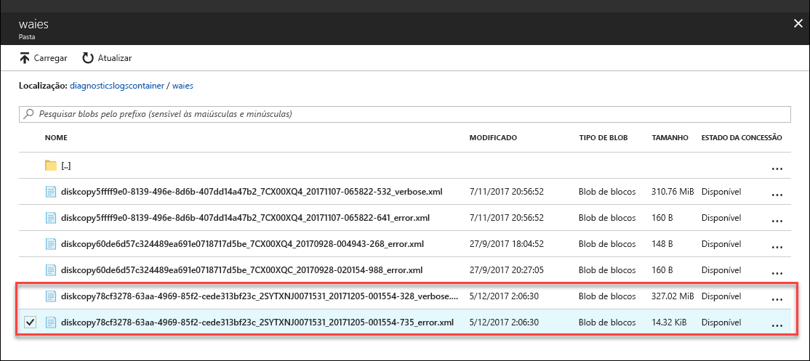

# <a name="understand-logs-to-troubleshoot-data-upload-issues-in-azure-data-box-disk"></a>Compreender os registos para resolver problemas de carregamento de dados no disco do Azure Data Box

Este artigo aplica-se para o disco do Microsoft Azure Data Box e descreve os problemas que vê ao carregar dados para o Azure.

## <a name="data-upload-logs"></a>Registos de carregamento de dados

Quando os dados são carregados para o Azure no datacenter, `_error.xml` e `_verbose.xml` ficheiros são gerados. Estes registos são carregados para a mesma conta de armazenamento que foi utilizada para carregar dados. Um exemplo do `_error.xml` é mostrado abaixo.
    
```xml
 <?xml version="1.0" encoding="utf-8"?>
    <DriveLog Version="2018-10-01">
      <DriveId>18041C582D7E</DriveId>
      <Summary>
     <!--Summary for validation and data copy to Azure -->
        <ValidationErrors>
          <None Count="8" />
        </ValidationErrors>
        <CopyErrors>
          <Completed Count="5" Description="No errors encountered" />
          <ContainerRenamed Count="3" Description="Renamed the container as the original container name does not follow Azure conventions." />
        </CopyErrors>
      </Summary>
    <!--List of renamed containers with the new names, new file path in Azure, original invalid file path, and size -->
      <Blob Status="ContainerRenamed">
        <BlobPath>databox-c2073fd1cc379d83e03d6b7acce23a6cf29d1eef/private.vhd</BlobPath>
        <OriginalFilePath>\PageBlob\pageblob test\private.vhd</OriginalFilePath>
        <SizeInBytes>10490880</SizeInBytes>
      </Blob>
      <Blob Status="ContainerRenamed">
        <BlobPath>databox-c2073fd1cc379d83e03d6b7acce23a6cf29d1eef/resource.vhd</BlobPath>
        <OriginalFilePath>\PageBlob\pageblob test\resource.vhd</OriginalFilePath>
        <SizeInBytes>71528448</SizeInBytes>
      </Blob>
      <Blob Status="ContainerRenamed">
        <BlobPath>databox-c2073fd1cc379d83e03d6b7acce23a6cf29d1eef/role.vhd</BlobPath>
        <OriginalFilePath>\PageBlob\pageblob test\role.vhd</OriginalFilePath>
        <SizeInBytes>10490880</SizeInBytes>
      </Blob>
      <Status>CompletedWithErrors</Status>
    </DriveLog>
```

## <a name="download-logs"></a>Transferir registos

Existem duas formas de localizar e transferir os registos de diagnóstico.

- Se houver algum erro ao carregar os dados para o Azure, o portal apresenta um caminho para a pasta onde estão localizados os registos de diagnóstico.

    

- Vá para a conta de armazenamento associada a sua encomenda do Data Box. Aceda a **Serviço Blob > Procurar blobs** e procure o blob correspondente à conta de armazenamento. Aceda a **waies**.

    

Em cada caso, consulte os registos de erros e os registos verbosos. Selecione cada registo e transferir uma cópia local.


## <a name="data-upload-errors"></a>Erros de carregamento de dados

Os erros gerados quando o carregamento dos dados para o Azure estão resumidos na tabela seguinte.

| Código de erro | Descrição                        |
|-------------|------------------------------|
|`None` |  Foi concluída com êxito.           |
|`Renamed` | Mudar o nome com êxito o blob.  |                                                            |
|`CompletedWithErrors` | Carregamento concluído com erros. Os detalhes dos ficheiros de erro são incluídos no ficheiro de registo.  |
|`Corrupted`|CRC calculado durante a ingestão de dados não corresponde ao CRC calculado durante o carregamento.  |  
|`StorageRequestFailed` | Falha no pedido de armazenamento do Azure.   |     |
|`LeasePresent` | Este item é concedido e está a ser utilizado por outro utilizador. |
|`StorageRequestForbidden` |Não foi possível carregar devido a problemas de autenticação. |
|`ManagedDiskCreationTerminalFailure` | Não foi possível carregar como discos geridos. Os ficheiros estão disponíveis na conta de armazenamento de teste como blobs de páginas. Pode converter manualmente os blobs de páginas para discos geridos.  |
|`DiskConversionNotStartedTierInfoMissing` | Uma vez que o ficheiro VHD foi copiado fora as pastas de escalão pré-criada, não foi criado um disco gerido. O ficheiro é carregado como blob de página para a conta de armazenamento de teste conforme especificado durante a criação de ordem. Pode convertê-lo manualmente para um disco gerido.|
|`InvalidWorkitem` | Não foi possível carregar os dados à medida que ele não está em conformidade com a nomenclatura do Azure e limita as convenções.|
|`InvalidPageBlobUploadAsBlockBlob` | Carregar como blobs de blocos num contentor com o prefixo `databoxdisk-invalid-pb-`.|
|`InvalidAzureFileUploadAsBlockBlob` | Carregar como blobs de blocos num contentor com o prefixo `databoxdisk-invalid-af`-.|
|`InvalidManagedDiskUploadAsBlockBlob` | Carregar como blobs de blocos num contentor com o prefixo `databoxdisk-invalid-md`-.|
|`InvalidManagedDiskUploadAsPageBlob` |Carregar como blobs de páginas num contentor com o prefixo `databoxdisk-invalid-md-`. |
|`MovedToOverflowShare` |Os ficheiros carregados para uma nova partilha de tamanho da partilha original excederam o limite de tamanho máximo do Azure. O novo nome de partilha de ficheiros tem o nome original com o sufixo `-2`.   |
|`MovedToDefaultAzureShare` |Ficheiros carregados que não estavam uma parte de qualquer pasta numa partilha de predefinição. O nome da partilha começa com `databox-`. |
|`ContainerRenamed` |O contentor para estes ficheiros não está em conformidade com as convenções de nomenclatura do Azure e é alterado. O novo nome começa com `databox-` e é o sufixo com o hash SHA1 do nome original |
|`ShareRenamed` |A partilha para esses ficheiros não está em conformidade com as convenções de nomenclatura do Azure e é alterada. O novo nome começa com `databox-` e é o sufixo com o hash SHA1 do nome original. |
|`BlobRenamed` |Estes ficheiros não está em conformidade com as convenções de nomenclatura do Azure e foram renomeados. Verifique o `BlobPath` campo para o novo nome. |
|`FileRenamed` |Estes ficheiros não está em conformidade com as convenções de nomenclatura do Azure e foram renomeados. Verifique o `FileStoragePath` campo para o novo nome. |
|`DiskRenamed` |Estes ficheiros não está em conformidade com as convenções de nomenclatura do Azure e foram renomeados. Verifique o `BlobPath` campo para o novo nome. |


## <a name="next-steps"></a>Passos Seguintes

- [Abra um pedido de suporte para problemas de disco Data Box](data-box-disk-contact-microsoft-support.md).
