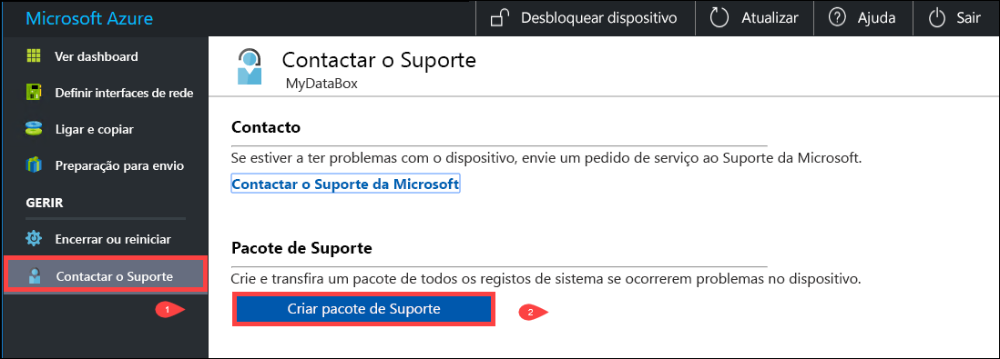
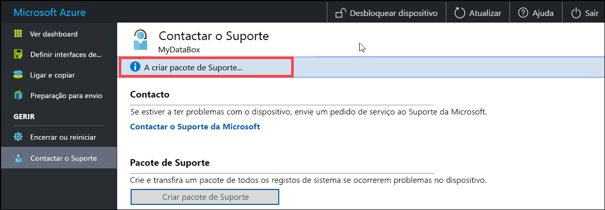
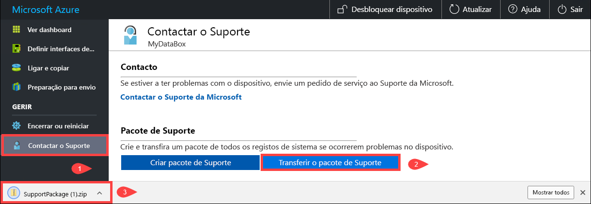
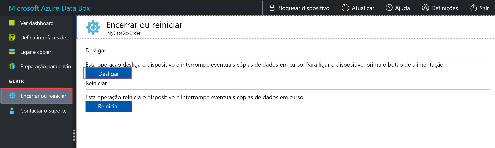
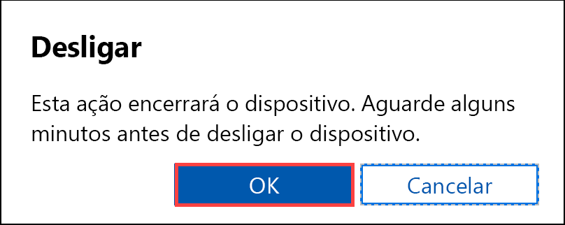
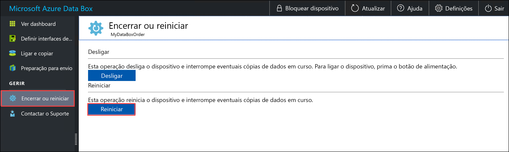
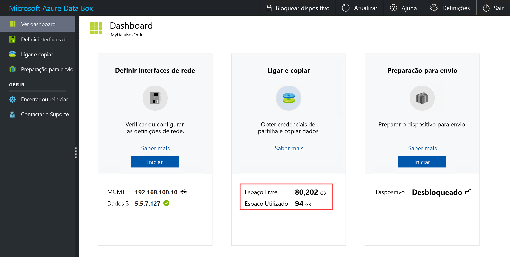
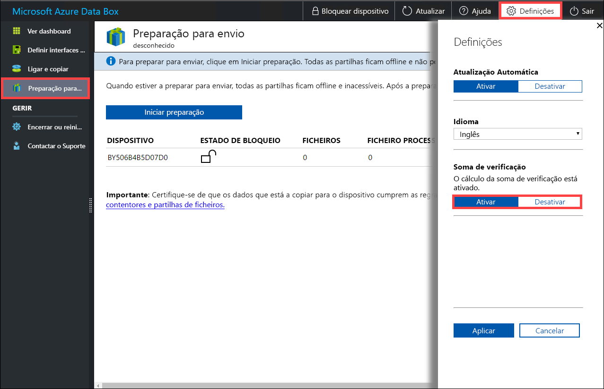

# <a name="use-the-local-web-ui-to-administer-your-data-box-and-data-box-heavy"></a>Utilize o UI web local para administrar a sua Caixa de Dados e Caixa de Dados Pesada

Este artigo descreve algumas das tarefas de configuração e gestão realizadas em dispositivos Data Box e Data Box Heavy. Pode gerir os dispositivos Data Box e Data Box Heavy através do portal Azure UI e da UI web local para o dispositivo. Este artigo centra-se nas tarefas realizadas através da UI web local.

A UI web local para a Caixa de Dados e para Data Box Heavy é utilizada para a configuração inicial do dispositivo. Também pode utilizar o UI web local para desligar ou reiniciar o dispositivo, executar testes de diagnóstico, atualizar software, ver registos de cópias, apagar dados locais do dispositivo e gerar um pacote de suporte para o Microsoft Support. Num dispositivo Data Box Heavy com dois nós independentes, pode aceder a duas UI locais separadas correspondentes a cada nó do dispositivo.

## <a name="generate-support-package"></a>Gerar Pacote de suporte

Se surgir qualquer problema com o dispositivo, pode criar um Pacote de suporte a partir dos registos do sistema. A equipa de Suporte da Microsoft utiliza este pacote para resolver o problema.

Para gerar um pacote de suporte, tome os seguintes passos:

1. Na UI web local, aceda ao **Contact Support**. Opcionalmente, **selecione Inclua os depósitos de memória**. Em seguida, **selecione Criar pacote de suporte**.

    Um depósito de memória é o conteúdo da memória do seu dispositivo, guardado após uma falha do sistema.

    Não deve selecionar a opção **incluir opção de despejo de memória** a menos que o Suporte peça uma. Leva muito tempo para recolher um pacote de suporte que inclui despejos de memória, e dados sensíveis são incluídos.

    

    Um Pacote de suporte é recolhido. Esta operação demora alguns minutos se incluir apenas registos do sistema. Se incluir depósitos de memória, demora muito mais tempo.

    

2. Assim que a criação do pacote de suporte estiver concluída, selecione **pacote de Suporte ao Download**.

    

3. Procure e selecione a localização de transferência. Abra a pasta para ver os conteúdos.

    

## <a name="erase-local-data-from-your-device"></a>Apagar dados locais do seu dispositivo

Pode utilizar a UI web local para apagar os dados locais do seu dispositivo antes de os devolver ao datacenter Azure.

> [!IMPORTANT]
> Uma eliminação de dados não pode ser revertida. Antes de apagar os dados locais do seu dispositivo, certifique-se de fazer o back up dos ficheiros.

Para apagar os dados locais do seu dispositivo, execute estes passos:

1. Na UI web local, vá ao **Data apagar.**
2. Introduza a palavra-passe do dispositivo e **selecione dados de apagamento**.

    

3. Na solicitação de confirmação, selecione **Sim** para continuar. Uma apagamento de dados pode demorar até 50 minutos.

   Certifique-se de fazer o seu back up antes de apagá-lo do dispositivo. Uma eliminação de dados não pode ser revertida.

    

## <a name="shut-down-or-restart-your-device"></a>Encerrar ou reiniciar o dispositivo

Pode desligar ou reiniciar o seu dispositivo utilizando a UI web local. Recomendamos que, antes de reiniciar, desative as ações do hospedeiro e, em seguida, do dispositivo. Ao fazê-lo, minimiza qualquer possibilidade de corrupção de dados. Certifique-se de que a cópia de dados não está em andamento quando desligar o dispositivo.

Para desligar o seu dispositivo, tome os seguintes passos.

1. Na IU de Web local, aceda a **Encerrar ou reiniciar**.

2. Selecione **Desligar**.

    

3. Quando solicitado para confirmação, selecione **OK** para continuar.

    

Depois de o dispositivo ser encerrado, utilize o botão para ligar/desligar no painel frontal para o ativar.

Para reiniciar o Data Box, execute os passos seguintes.

1. Na IU de Web local, aceda a **Encerrar ou reiniciar**.
2. **Selecione Reiniciar**.

    

3. Quando solicitado para confirmação, selecione **OK** para continuar.

   O dispositivo é desligado e, em seguida, reinicia-se.

## <a name="download-bom-or-manifest-files"></a>Descarregue ficheiros BOM ou manifesto

O BOM ou os ficheiros manifestos contêm a lista dos ficheiros que são copiados para a Caixa de Dados ou Caixa de Dados Pesada. Estes ficheiros são gerados para uma ordem de importação quando se prepara o dispositivo para o envio.

Antes de começar, siga estes passos para descarregar ficheiros BOM ou manifestos para a sua encomenda de importação:

1. Vá à uI local para o seu dispositivo. Verifique se o seu dispositivo completou o **passo de preparação para o envio.** Quando a preparação do dispositivo estiver concluída, o estado do dispositivo é apresentado como **Pronto para enviar**.

    

2. Selecione Baixar a **lista de ficheiros** para descarregar a lista de ficheiros que foram copiados na sua Caixa de Dados.

    <!--  -->

3. No File Explorer, são geradas listas separadas de ficheiros dependendo do protocolo utilizado para ligar ao dispositivo e ao tipo de Armazenamento Azure utilizado.

    <!--  -->
    

   A tabela que se segue mapeia os nomes dos ficheiros para o tipo de Armazenamento Azure e para o protocolo de ligação utilizado.

    |Nome de ficheiro  |Tipo de armazenamento Azure  |Protocolo de ligação utilizado |
    |---------|---------|---------|
    |utSAC1_202006051000_BlockBlob-BOM.txt     |Blobs de blocos         |SMB/NFS         |
    |utSAC1_202006051000_PageBlob-BOM.txt     |Blobs de páginas         |SMB/NFS         |
    |utSAC1_202006051000_AzFile-BOM.txt    |Ficheiros do Azure         |SMB/NFS         |
    |utsac1_PageBlock_Rest-BOM.txt     |Blobs de páginas         |REST        |
    |utsac1_BlockBlock_Rest-BOM.txt    |Blobs de blocos         |REST         |

Utilize esta lista para verificar os ficheiros enviados para a conta de Armazenamento Azure após a retorna da Caixa de Dados ao centro de dados Azure. Um ficheiro manifesto de amostra é mostrado abaixo.

> [!NOTE]
> Numa Caixa de Dados Pesada, estão presentes dois conjuntos de listas de ficheiros (ficheiros BOM) correspondentes aos dois nós do dispositivo.

```xml
<file size="52689" crc64="0x95a62e3f2095181e">\databox\media\data-box-deploy-copy-data\prepare-to-ship2.png</file>
<file size="22117" crc64="0x9b160c2c43ab6869">\databox\media\data-box-deploy-copy-data\connect-shares-file-explorer2.png</file>
<file size="57159" crc64="0x1caa82004e0053a4">\databox\media\data-box-deploy-copy-data\verify-used-space-dashboard.png</file>
<file size="24777" crc64="0x3e0db0cd1ad438e0">\databox\media\data-box-deploy-copy-data\prepare-to-ship5.png</file>
<file size="162006" crc64="0x9ceacb612ecb59d6">\databox\media\data-box-cable-options\cabling-dhcp-data-only.png</file>
<file size="155066" crc64="0x051a08d36980f5bc">\databox\media\data-box-cable-options\cabling-2-port-setup.png</file>
<file size="150399" crc64="0x66c5894ff328c0b1">\databox\media\data-box-cable-options\cabling-with-switch-static-ip.png</file>
<file size="158082" crc64="0xbd4b4c5103a783ea">\databox\media\data-box-cable-options\cabling-mgmt-only.png</file>
<file size="148456" crc64="0xa461ad24c8e4344a">\databox\media\data-box-cable-options\cabling-with-static-ip.png</file>
<file size="40417" crc64="0x637f59dd10d032b3">\databox\media\data-box-portal-admin\delete-order1.png</file>
<file size="33704" crc64="0x388546569ea9a29f">\databox\media\data-box-portal-admin\clone-order1.png</file>
<file size="5757" crc64="0x9979df75ee9be91e">\databox\media\data-box-safety\japan.png</file>
<file size="998" crc64="0xc10c5a1863c5f88f">\databox\media\data-box-safety\overload_tip_hazard_icon.png</file>
<file size="5870" crc64="0x4aec2377bb16136d">\databox\media\data-box-safety\south-korea.png</file>
<file size="16572" crc64="0x05b13500a1385a87">\databox\media\data-box-safety\taiwan.png</file>
<file size="999" crc64="0x3f3f1c5c596a4920">\databox\media\data-box-safety\warning_icon.png</file>
<file size="1054" crc64="0x24911140d7487311">\databox\media\data-box-safety\read_safety_and_health_information_icon.png</file>
<file size="1258" crc64="0xc00a2d5480f4fcec">\databox\media\data-box-safety\heavy_weight_hazard_icon.png</file>
<file size="1672" crc64="0x4ae5cfa67c0e895a">\databox\media\data-box-safety\no_user_serviceable_parts_icon.png</file>
<file size="3577" crc64="0x99e3d9df341b62eb">\databox\media\data-box-safety\battery_disposal_icon.png</file>
<file size="993" crc64="0x5a1a78a399840a17">\databox\media\data-box-safety\tip_hazard_icon.png</file>
<file size="1028" crc64="0xffe332400278f013">\databox\media\data-box-safety\electrical_shock_hazard_icon.png</file>
<file size="58699" crc64="0x2c411d5202c78a95">\databox\media\data-box-deploy-ordered\data-box-ordered.png</file>
<file size="46816" crc64="0x31e48aa9ca76bd05">\databox\media\data-box-deploy-ordered\search-azure-data-box1.png</file>
<file size="24160" crc64="0x978fc0c6e0c4c16d">\databox\media\data-box-deploy-ordered\select-data-box-option1.png</file>
<file size="115954" crc64="0x0b42449312086227">\databox\media\data-box-disk-deploy-copy-data\data-box-disk-validation-tool-output.png</file>
<file size="6093" crc64="0xadb61d0d7c6d4deb">\databox\data-box-cable-options.md</file>
<file size="6499" crc64="0x080add29add367d9">\databox\data-box-deploy-copy-data-via-nfs.md</file>
<file size="11089" crc64="0xc3ce6b13a4fe3001">\databox\data-box-deploy-copy-data-via-rest.md</file>
<file size="9126" crc64="0x820856b5a54321ad">\databox\data-box-overview.md</file>
<file size="10963" crc64="0x5e9a14f9f4784fd8">\databox\data-box-safety.md</file>
<file size="5941" crc64="0x8631d62fbc038760">\databox\data-box-security.md</file>
<file size="12536" crc64="0x8c8ff93e73d665ec">\databox\data-box-system-requirements-rest.md</file>
<file size="3220" crc64="0x7257a263c434839a">\databox\data-box-system-requirements.md</file>
<file size="2823" crc64="0x63db1ada6fcdc672">\databox\index.yml</file>
<file size="4364" crc64="0x62b5710f58f00b8b">\databox\data-box-local-web-ui-admin.md</file>
<file size="3603" crc64="0x7e34c25d5606693f">\databox\TOC.yml</file>
```

Este ficheiro contém a lista de todos os ficheiros que foram copiados na Caixa de Dados ou Caixa de Dados Pesada. Neste ficheiro, o valor *crc64* diz respeito à caixa de verificação gerada para o ficheiro correspondente.

## <a name="view-available-capacity-of-the-device"></a>Ver a capacidade disponível do dispositivo

Pode utilizar o dashboard do dispositivo para ver a capacidade disponível e a utilizada do dispositivo.

1. Na IU de Web local, aceda a **Ver o dashboard**.
2. Em **Ligar e copiar**, é mostrado o espaço livre e utilizado no dispositivo.

    

## <a name="skip-checksum-validation"></a>Ignorar a validação da soma de verificação

As datas de verificação são geradas para os seus dados por padrão quando se prepara para enviar. Em certos casos raros, dependendo do tipo de dados (tamanhos de ficheiros pequenos), o desempenho pode ser lento. Nesses casos, pode ignorar a soma de verificação.

O cálculo da caixa de controlo durante a preparação do navio é feito apenas para encomendas de importação e não para encomendas de exportação.

Recomendamos vivamente que não desative a parte de verificação a menos que o desempenho seja severamente afetado.

1. No canto superior direito da UI web local do seu dispositivo, vá para **Definições**.

    

2. **Desativar** validação da soma de verificação
3. Selecione **Aplicar**.

> [!NOTE]
> A opção de cálculo skip checksum só está disponível quando a Caixa de Dados Azure estiver desbloqueada. Não verá esta opção quando o dispositivo estiver bloqueado.

## <a name="enable-smb-signing"></a>Ativar a assinatura de SMB

A assinatura do bloco de mensagens do servidor (SMB) é uma funcionalidade através da qual as comunicações que utilizam o SMB podem ser assinadas digitalmente ao nível do pacote. Esta assinatura previne ataques que modificam pacotes SMB em trânsito.

Para obter mais informações relacionadas com a assinatura do SMB, consulte [a visão geral da assinatura do Bloco de Mensagens do Servidor](https://support.microsoft.com/help/887429/overview-of-server-message-block-signing).

Para ativar a sessão de SMB no seu Dispositivo Azure:

1. No canto superior direito da UI web local do seu dispositivo, selecione **Definições**.

    

2. **Ativar** SMB Assinando.

    

3. Selecione **Aplicar**.
4. Na IU de Web local, aceda a **Encerrar ou reiniciar**.
5. **Selecione Reiniciar**.

## <a name="enable-backup-operator-privileges"></a>Ativar privilégios do operador de backup

Os seus utilizadores de UI da web têm privilégios de Backup Operator em ações SMB por padrão. Se não quiser, utilize **os privilégios do Operador De Trás** para desativar ou ativar os privilégios.

Para obter informações, consulte os operadores de backup em [Grupos de Segurança do Diretório Ativo](/windows/security/identity-protection/access-control/active-directory-security-groups#backup-operators).

Para ativar os privilégios do Operador de Backup no seu Dispositivo Azure:

1. No canto superior direito da UI web local do seu dispositivo, selecione **Definições**.

   

2. **Ativar** Privilégios de backup do operador.

   

3. **Selecione Aplicar**.
4. Na IU de Web local, aceda a **Encerrar ou reiniciar**.
5. **Selecione Reiniciar**.

## <a name="enable-acls-for-azure-files"></a>Ativar ACLs para Ficheiros Azure

Os metadados em ficheiros são transferidos por padrão quando os utilizadores fazem o upload de dados via SMB para a sua Caixa de Dados. Os metadados incluem listas de controlo de acesso (ACLs), atributos de ficheiros e timetamps. Se não quiser isto, utilize **ACLs para ficheiros Azure** para desativar ou ativar esta funcionalidade.

<!--For more information about metadata that is transferred, see [Preserving the ACLs and metadata with Azure Data Box](./data-box-local-web-ui-admin.md#enable-backup-operator-privileges) - IN DEVELOPMENT-->

> [!Note]
> Para transferir metadados com ficheiros, tem de ser um Operador de Cópia de Segurança. Quando utilizar esta funcionalidade, certifique-se de que os utilizadores locais da UI web são Operadores de Reserva. Consulte [os privilégios do Operador de Backup](#enable-backup-operator-privileges).

Para permitir a transferência de ACLs para ficheiros Azure:

1. No canto superior direito da UI web local do seu dispositivo, selecione **Definições**.

    

2. **Ativar** ACLs para ficheiros Azure.

     
  
3. Selecione **Aplicar**.
4. Na IU de Web local, aceda a **Encerrar ou reiniciar**.
5. **Selecione Reiniciar**.

## <a name="enable-tls-11"></a>Ativar TLS 1.1

Por padrão, a Azure Data Box utiliza a Segurança da Camada de Transporte (TLS) 1.2 para encriptação porque é mais segura do que a TSL 1.1. No entanto, se você ou os seus clientes usarem um browser para aceder a dados que não suportem TLS 1.2, poderá ativar o TLS 1.1.

Para obter mais informações relacionadas com o TLS, consulte [a segurança do Gateway da Caixa de Dados Azure](../databox-gateway/data-box-gateway-security.md).

Para ativar o TLS 1.1 no seu dispositivo Azure:

1. No canto superior direito da UI web local do seu dispositivo, selecione **Definições**.

    

2. **Ativar** TLS 1.1.

    

3. Selecione **Aplicar**.
4. Na IU de Web local, aceda a **Encerrar ou reiniciar**.
5. **Selecione Reiniciar**.

## <a name="next-steps"></a>Passos seguintes

- Saiba como gerir a Caixa de [Dados e a Caixa de Dados Pesada através do portal Azure](data-box-portal-admin.md).
