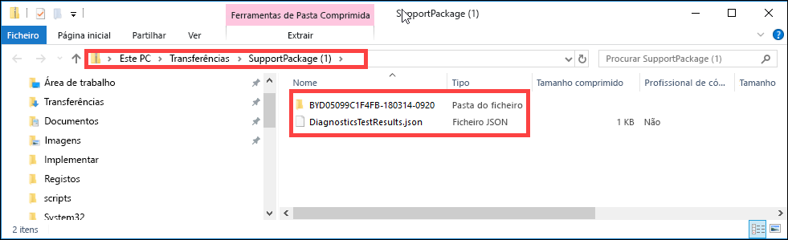

# <a name="use-the-local-web-ui-to-administer-your-data-box-and-data-box-heavy"></a>Use a UI web local para administrar a sua Caixa de Dados e Caixa de Dados Pesada

Este artigo descreve algumas das tarefas de configuração e gestão que podem ser executadas nos dispositivos Data Box e Data Box Heavy. Pode gerir os dispositivos Data Box e Data Box Heavy através do portal Azure UI e da UI web local para o dispositivo. Este artigo aborda em especial as tarefas que pode efetuar com a IU de Web local.

A UI web local para a Caixa de Dados e Caixa de Dados Heavy é utilizada para a configuração inicial do dispositivo. Também pode utilizar o UI web local para desligar ou reiniciar o dispositivo, executar testes de diagnóstico, atualizar software, ver registos de cópias e gerar um pacote de registo sonorizador para o Microsoft Support. Num dispositivo Data Box Heavy com dois nós independentes, pode aceder a dois UIs web locais separados correspondentes a cada nó do dispositivo.

Este artigo inclui os seguintes tutoriais:

- Gerar um pacote de Suporte
- Encerrar ou reiniciar o dispositivo
- Baixar ficheiros BOM ou manifestos
- Ver a capacidade disponível do dispositivo
- Ignorar a validação da soma de verificação

## <a name="generate-support-package"></a>Gerar Pacote de suporte

Se surgir qualquer problema com o dispositivo, pode criar um Pacote de suporte a partir dos registos do sistema. A equipa de Suporte da Microsoft utiliza este pacote para resolver o problema. Para gerar um pacote de Suporte, tome os seguintes passos:

1. Na IU de Web local, aceda a **Contactar o Suporte** e clique em **Criar Pacote de suporte**.

    

2. Um Pacote de suporte é recolhido. Esta operação poderá demorar alguns minutos.

    

3. Depois de concluída a criação do Pacote de suporte, clique em **Transferir pacote de suporte**. 

    

4. Procure e selecione a localização de transferência. Abra a pasta para ver os conteúdos.

    


## <a name="shut-down-or-restart-your-device"></a>Encerrar ou reiniciar o dispositivo

Pode desligar ou reiniciar o seu dispositivo utilizando a UI web local. Recomendamos que antes de reiniciar, coloque as partilhas offline no anfitrião e, em seguida, no dispositivo. Isto minimiza qualquer possibilidade de danos em dados. Certifique-se de que a cópia de dados não está em curso quando encerra o dispositivo.

Para desligar o dispositivo, tome os seguintes passos.

1. Na IU de Web local, aceda a **Encerrar ou reiniciar**.
2. Clique em **Encerrar**.

    

3. Quando lhe for pedida a confirmação, clique em **OK** para continuar.

    

Depois de o dispositivo ser encerrado, utilize o botão para ligar/desligar no painel frontal para o ativar.

Para reiniciar o Data Box, execute os passos seguintes.

1. Na IU de Web local, aceda a **Encerrar ou reiniciar**.
2. Clique em **Reiniciar**.

    

3. Quando lhe for pedida a confirmação, clique em **OK** para continuar.

   O dispositivo é desligado e, em seguida, reinicia-se.

## <a name="download-bom-or-manifest-files"></a>Baixar ficheiros BOM ou manifestos

A Nota de Material (BOM) ou os ficheiros manifestos contêm a lista dos ficheiros que são copiados para a Caixa de Dados ou Caixa de Dados Pesada. Estes ficheiros são gerados quando prepara o dispositivo para enviar.

Antes de começar, certifique-se de que o seu dispositivo completou **Prepare-se para o** passo do navio. Siga estes passos para descarregar BOM ou manifestos arquivos:

1. Vá à UI da web local para o seu dispositivo. Verá que o dispositivo completou a preparação para o navio. Quando a preparação do dispositivo estiver completa, o estado do dispositivo é apresentado como **Pronto para enviar**.

    

2. Clique na **lista de ficheiros de Download** para descarregar a lista de ficheiros que foram copiados na sua Caixa de Dados.

    

3. No File Explorer, verá que a lista separada de ficheiros é gerada dependendo do protocolo utilizado para ligar ao dispositivo e ao tipo de Armazenamento Azure utilizado.

    

   A tabela seguinte mapeia os nomes dos ficheiros para o tipo de Armazenamento Azure e o protocolo de ligação utilizado.

    |Nome de ficheiro  |Tipo de armazenamento azure  |Protocolo de ligação utilizado |
    |---------|---------|---------|
    |databoxe2etest_BlockBlob.txt     |Blobs de blocos         |SMB/NFS         |
    |databoxe2etest_PageBlob.txt     |Blobs de páginas         |SMB/NFS         |
    |databoxe2etest_AzFile-BOM.txt    |Ficheiros do Azure         |SMB/NFS         |
    |databoxe2etest_PageBlock_Rest-BOM.txt     |Blobs de páginas         |REST        |
    |databoxe2etest_BlockBlock_Rest-BOM.txt    |Blobs de blocos         |REST         |
    |mydbmdrg1_MDisk-BOM.txt    |Disco Gerido         |SMB/NFS         |
    |mydbmdrg2_MDisk-BOM.txt     |Disco Gerido         |SMB/NFS         |

Utiliza esta lista para verificar os ficheiros enviados na conta De armazenamento do Azure depois de a Caixa de Dados regressar ao centro de dados do Azure. Um ficheiro manifesto de amostra é mostrado abaixo.

> [!NOTE]
> Numa Caixa de Dados Pesada, estão presentes dois conjuntos de listas de ficheiros (ficheiros BOM) correspondentes aos dois nós do dispositivo.

```xml
<file size="52689" crc64="0x95a62e3f2095181e">\databox\media\data-box-deploy-copy-data\prepare-to-ship2.png</file>
<file size="22117" crc64="0x9b160c2c43ab6869">\databox\media\data-box-deploy-copy-data\connect-shares-file-explorer2.png</file>
<file size="57159" crc64="0x1caa82004e0053a4">\databox\media\data-box-deploy-copy-data\verify-used-space-dashboard.png</file>
<file size="24777" crc64="0x3e0db0cd1ad438e0">\databox\media\data-box-deploy-copy-data\prepare-to-ship5.png</file>
<file size="162006" crc64="0x9ceacb612ecb59d6">\databox\media\data-box-cable-options\cabling-dhcp-data-only.png</file>
<file size="155066" crc64="0x051a08d36980f5bc">\databox\media\data-box-cable-options\cabling-2-port-setup.png</file>
<file size="150399" crc64="0x66c5894ff328c0b1">\databox\media\data-box-cable-options\cabling-with-switch-static-ip.png</file>
<file size="158082" crc64="0xbd4b4c5103a783ea">\databox\media\data-box-cable-options\cabling-mgmt-only.png</file>
<file size="148456" crc64="0xa461ad24c8e4344a">\databox\media\data-box-cable-options\cabling-with-static-ip.png</file>
<file size="40417" crc64="0x637f59dd10d032b3">\databox\media\data-box-portal-admin\delete-order1.png</file>
<file size="33704" crc64="0x388546569ea9a29f">\databox\media\data-box-portal-admin\clone-order1.png</file>
<file size="5757" crc64="0x9979df75ee9be91e">\databox\media\data-box-safety\japan.png</file>
<file size="998" crc64="0xc10c5a1863c5f88f">\databox\media\data-box-safety\overload_tip_hazard_icon.png</file>
<file size="5870" crc64="0x4aec2377bb16136d">\databox\media\data-box-safety\south-korea.png</file>
<file size="16572" crc64="0x05b13500a1385a87">\databox\media\data-box-safety\taiwan.png</file>
<file size="999" crc64="0x3f3f1c5c596a4920">\databox\media\data-box-safety\warning_icon.png</file>
<file size="1054" crc64="0x24911140d7487311">\databox\media\data-box-safety\read_safety_and_health_information_icon.png</file>
<file size="1258" crc64="0xc00a2d5480f4fcec">\databox\media\data-box-safety\heavy_weight_hazard_icon.png</file>
<file size="1672" crc64="0x4ae5cfa67c0e895a">\databox\media\data-box-safety\no_user_serviceable_parts_icon.png</file>
<file size="3577" crc64="0x99e3d9df341b62eb">\databox\media\data-box-safety\battery_disposal_icon.png</file>
<file size="993" crc64="0x5a1a78a399840a17">\databox\media\data-box-safety\tip_hazard_icon.png</file>
<file size="1028" crc64="0xffe332400278f013">\databox\media\data-box-safety\electrical_shock_hazard_icon.png</file>
<file size="58699" crc64="0x2c411d5202c78a95">\databox\media\data-box-deploy-ordered\data-box-ordered.png</file>
<file size="46816" crc64="0x31e48aa9ca76bd05">\databox\media\data-box-deploy-ordered\search-azure-data-box1.png</file>
<file size="24160" crc64="0x978fc0c6e0c4c16d">\databox\media\data-box-deploy-ordered\select-data-box-option1.png</file>
<file size="115954" crc64="0x0b42449312086227">\databox\media\data-box-disk-deploy-copy-data\data-box-disk-validation-tool-output.png</file>
<file size="6093" crc64="0xadb61d0d7c6d4deb">\databox\data-box-cable-options.md</file>
<file size="6499" crc64="0x080add29add367d9">\databox\data-box-deploy-copy-data-via-nfs.md</file>
<file size="11089" crc64="0xc3ce6b13a4fe3001">\databox\data-box-deploy-copy-data-via-rest.md</file>
<file size="9126" crc64="0x820856b5a54321ad">\databox\data-box-overview.md</file>
<file size="10963" crc64="0x5e9a14f9f4784fd8">\databox\data-box-safety.md</file>
<file size="5941" crc64="0x8631d62fbc038760">\databox\data-box-security.md</file>
<file size="12536" crc64="0x8c8ff93e73d665ec">\databox\data-box-system-requirements-rest.md</file>
<file size="3220" crc64="0x7257a263c434839a">\databox\data-box-system-requirements.md</file>
<file size="2823" crc64="0x63db1ada6fcdc672">\databox\index.yml</file>
<file size="4364" crc64="0x62b5710f58f00b8b">\databox\data-box-local-web-ui-admin.md</file>
<file size="3603" crc64="0x7e34c25d5606693f">\databox\TOC.yml</file>
```

Este ficheiro contém a lista de todos os ficheiros que foram copiados na Caixa de Dados ou na Caixa de Dados Heavy. Neste ficheiro, o valor *crc64* diz respeito ao cheque gerado para o ficheiro correspondente.

## <a name="view-available-capacity-of-the-device"></a>Ver a capacidade disponível do dispositivo

Pode utilizar o dashboard do dispositivo para ver a capacidade disponível e a utilizada do dispositivo.

1. Na IU de Web local, aceda a **Ver o dashboard**.
2. Em **Ligar e copiar**, é mostrado o espaço livre e utilizado no dispositivo.

    

## <a name="skip-checksum-validation"></a>Ignorar a validação da soma de verificação

Os cheques são gerados para os seus dados por padrão quando se prepara para enviar. Em certos casos raros, dependendo do tipo de dados (tamanhos de ficheiros pequenos), o desempenho pode ser lento. Nesses casos, pode ignorar a soma de verificação.

Recomendamos vivamente que não desative a soma de verificação, a não ser que o desempenho tenha sido bastante afetado.

1. No canto superior direito da UI web local do seu dispositivo, vá para **Definições**.

    

2. **Desativar** validação da soma de verificação
3. Clique em **Aplicar**.

## <a name="next-steps"></a>Passos seguintes

- Saiba como gerir a Caixa de Dados e caixa de [dados pesada através do portal Azure](data-box-portal-admin.md).

