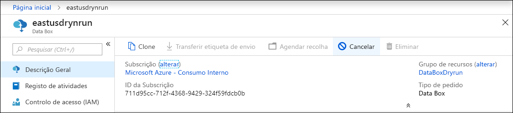
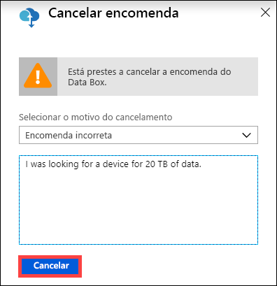
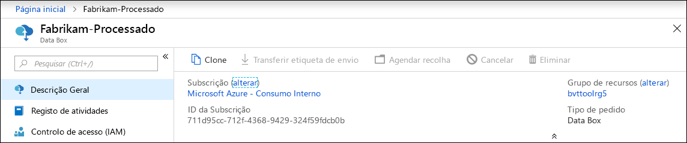
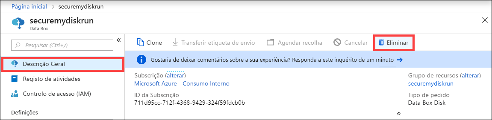
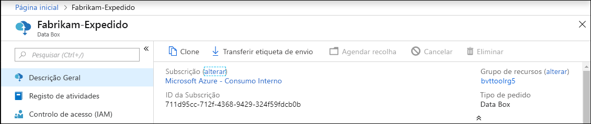
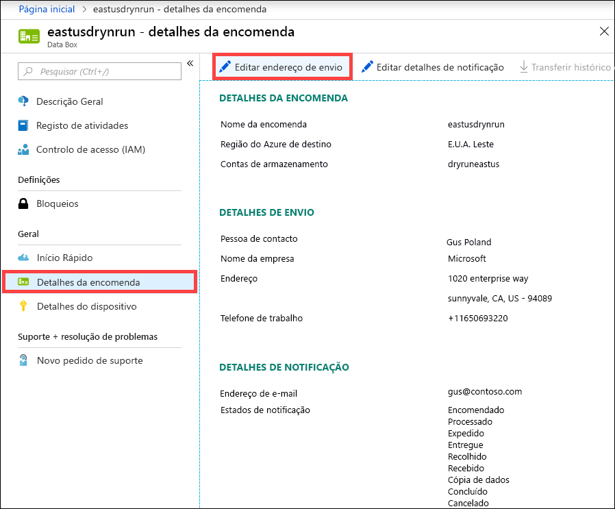
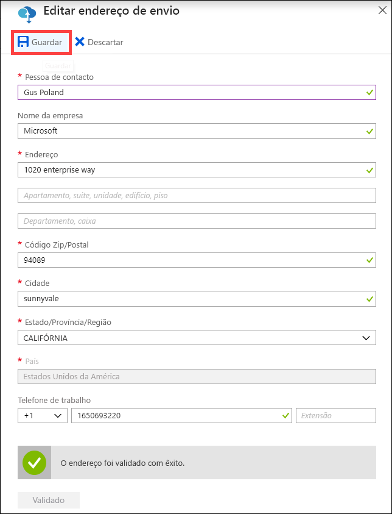
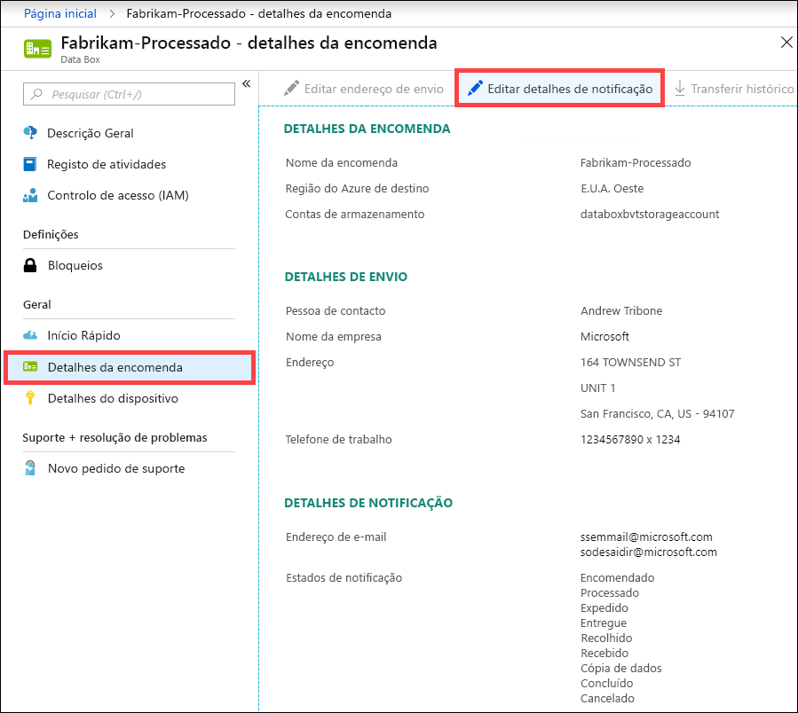
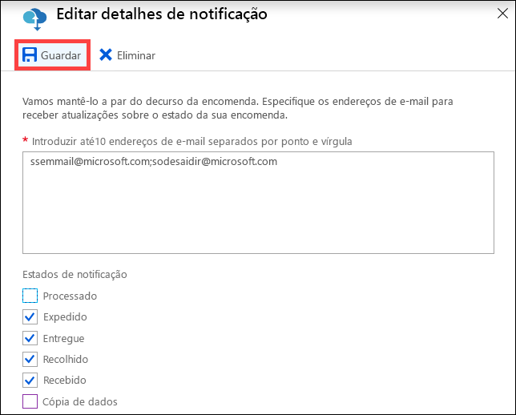

# <a name="use-the-azure-portal-to-administer-your-azure-data-box"></a>Utilizar o portal do Azure para administrar o Azure Data Box

Este artigo descreve alguns dos fluxos de trabalho complexos e tarefas de gestão que podem ser executadas no Azure Data Box. Pode gerir o Data Box através do portal do Azure ou da IU da Web local.

Este artigo aborda em especial as tarefas que pode efetuar com o portal do Azure. Utilize o portal do Azure para gerir encomendas, gerir o Data Box e controlar o estado da encomenda à medida que avança para a conclusão.


## <a name="cancel-an-order"></a>Cancelar uma encomenda

Poderá ter de cancelar uma encomenda por vários motivos depois de fazer a encomenda. Só pode cancelar a encomenda antes de ser processada. Assim que a encomenda for processada e o Data Box preparado, deixa de ser possível cancelar a encomenda. 

Execute os seguintes passos para cancelar uma encomenda.

1.  Aceda a **Descrição Geral > Cancelar**. 

    

2.  Escreva um motivo para cancelar a encomenda.  

    

3.  Assim que a encomenda é cancelada, o portal atualiza o estado da encomenda e apresenta-o como **Cancelado**. 

## <a name="clone-an-order"></a>Clonar uma encomenda

A clonagem é útil em determinadas situações. Por exemplo, um utilizador utilizou o Data Box para transferir alguns dados. À medida que são gerados mais dados, é necessário outro Data Box para transferir esses dados para o Azure. Neste caso, a mesma encomenda pode ser clonada.

Execute os seguintes passos para clonar uma encomenda.

1.  Aceda a **Descrição Geral > Clone**. 

    

2.  Todos os detalhes da encomenda permanecem iguais. O nome da encomenda é o nome da encomenda original anexada por *-Clone*. Selecione a caixa de verificação para confirmar que reviu as informações de privacidade. Clique em **Criar**.

O clone é criado em apenas alguns minutos e o portal é atualizado para mostrar a nova encomenda.


## <a name="delete-order"></a>Eliminar encomenda

Pode querer eliminar uma encomenda quando a encomenda for concluída. A encomenda contém as suas informações pessoais, como o nome, o endereço e as informações de contacto. Estas informações pessoais são eliminadas quando a encomenda é eliminada.

Só pode eliminar as encomendas que foram concluídas ou canceladas. Execute os seguintes passos para eliminar uma encomenda.

1. Vá para **Todos os recursos**. Procure a sua encomenda.

2. Clique na encomenda que pretende eliminar e aceda a **Descrição Geral**. Na barra de comandos, clique em **Eliminar**.

    

3. Introduza o nome da encomenda quando lhe for pedido para confirmar a eliminação da encomenda. Clique em **Eliminar**.

## <a name="download-shipping-label"></a>Transferir etiqueta de envio

Terá de descarregar a etiqueta de envio caso o visor E-ink do Data Box não esteja a funcionar e não apresente a etiqueta de envio para devolução. 

Execute os seguintes passos para transferir uma etiqueta de envio.

1.  Aceda a **Descrição Geral > Transferir etiqueta de envio**. Esta opção só fica disponível após o dispositivo ser enviado. 

    

2.  Esta ação transfere a seguinte etiqueta de envio para devolução. Guarde a etiqueta e imprima-a. Dobre e insira a etiqueta na bolsa transparente do dispositivo. Certifique-se de que a etiqueta está visível. Remova quaisquer etiquetas de envios anteriores existentes no dispositivo.

    

## <a name="edit-shipping-address"></a>Editar o endereço de envio

Poderá ter de editar o endereço de envio assim que a encomenda for feita. Isto só está disponível até o dispositivo ser expedido. Depois de expedir o dispositivo, esta opção deixa de estar disponível.

Execute os seguintes passos para editar a encomenda.

1. Aceda a **Detalhes da encomenda > Editar endereço de envio**.

    

2. Edite e valide o endereço de envio e, em seguida, guarde as alterações.

    

## <a name="edit-notification-details"></a>Editar detalhes de notificação

Poderá ter de alterar os utilizadores que pretende que recebam os e-mails de estado da encomenda. Por exemplo, um utilizador tem de manter-se informado sobre quando o dispositivo é entregue ou recolhido. Outro utilizador poderá ter de manter-se informado sobre quando a cópia de dados é concluída, para poder verificar que os dados estão na conta de armazenamento do Azure antes de os eliminar da origem. Nestes casos, pode editar os detalhes de notificação.

Execute os seguintes passos para editar os detalhes de notificação.

1. Aceda a **Detalhes da encomenda > Editar detalhes de notificação**.

    

2. Pode agora editar os detalhes de notificação e, em seguida, guardar as alterações.
 
    


## <a name="download-order-history"></a>Transferir histórico de encomendas

Assim que a encomenda do Data Box estiver concluída, os dados nos discos de dispositivo são apagados. Quando a limpeza do dispositivo estiver concluída, pode transferir o histórico de encomendas no portal do Azure.

Execute os seguintes passos para transferir o histórico de encomendas.

1. Na sua encomenda do Data Box, aceda a **Descrição geral**. Certifique-se de que a encomenda é concluída. Se a encomenda estiver concluída e a limpeza do dispositivo também, então aceda a **Detalhes da encomenda**. A opção **Transferir histórico de encomendas** está disponível.

    

2. Clique em **Transferir histórico de encomendas**. No histórico transferido, verá um registo dos registos de controlo da operadora. Se deslocar para baixo para a parte inferior deste registo, pode ver as ligações para:
    
   - **Copiar registos** - tenha a lista de ficheiros que obtiveram erros durante a cópia de dados do Data Box para a sua conta de armazenamento do Azure.
   - **Registos de auditoria** - contêm informações sobre a ativação e partilha de acesso no Data Box quando este está fora do datacenter do Azure.
   - **Ficheiros BOM** - tenha a lista de ficheiros (também conhecida como manifesto de ficheiro), que pode transferir durante a **Preparação para envio** e tem os nomes de ficheiros, tamanhos dos ficheiros e as somas de verificação dos ficheiros.

       ```
       -------------------------------
       Microsoft Data Box Order Report
       -------------------------------
       Name                                               : DataBoxTestOrder                              
       StartTime(UTC)                                     : 10/31/2018 8:49:23 AM +00:00                       
       DeviceType                                         : DataBox                                           
       -------------------
       Data Box Activities
       -------------------
       Time(UTC)                 | Activity                       | Status          | Description  
       
       10/31/2018 8:49:26 AM     | OrderCreated                   | Completed       |                                                   
       11/2/2018 7:32:53 AM      | DevicePrepared                 | Completed       |                                                   
       11/3/2018 1:36:43 PM      | ShippingToCustomer             | InProgress      | Shipment picked up. Local Time : 11/3/2018 1:36:43        PM at AMSTERDAM-NLD                                                                                
       11/4/2018 8:23:30 PM      | ShippingToCustomer             | InProgress      | Processed at AMSTERDAM-NLD. Local Time : 11/4/2018        8:23:30 PM at AMSTERDAM-NLD                                                                        
       11/4/2018 11:43:34 PM     | ShippingToCustomer             | InProgress      | Departed Facility in AMSTERDAM-NLD. Local Time :          11/4/2018 11:43:34 PM at AMSTERDAM-NLD                                                               
       11/5/2018 1:38:20 AM      | ShippingToCustomer             | InProgress      | Arrived at Sort Facility LEIPZIG-DEU. Local Time :        11/5/2018 1:38:20 AM at LEIPZIG-DEU                                                                
       11/5/2018 2:31:07 AM      | ShippingToCustomer             | InProgress      | Processed at LEIPZIG-DEU. Local Time : 11/5/2018          2:31:07 AM at LEIPZIG-DEU                                                                            
       11/5/2018 4:05:58 AM      | ShippingToCustomer             | InProgress      | Departed Facility in LEIPZIG-DEU. Local Time :            11/5/2018 4:05:58 AM at LEIPZIG-DEU                                                                    
       11/5/2018 4:35:43 AM      | ShippingToCustomer             | InProgress      | Transferred through LUTON-GBR. Local Time :              11/5/2018 4:35:43 AM at LUTON-GBR                                                                         
       11/5/2018 4:52:15 AM      | ShippingToCustomer             | InProgress      | Departed Facility in LUTON-GBR. Local Time :              11/5/2018 4:52:15 AM at LUTON-GBR                                                                        
       11/5/2018 5:47:58 AM      | ShippingToCustomer             | InProgress      | Arrived at Sort Facility LONDON-HEATHROW-GBR.            Local Time : 10/5/2018 5:47:58 AM at LONDON-HEATHROW-GBR                                                
       11/5/2018 6:27:37 AM      | ShippingToCustomer             | InProgress      | Processed at LONDON-HEATHROW-GBR. Local Time :            11/5/2018 6:27:37 AM at LONDON-HEATHROW-GBR                                                            
       11/5/2018 6:39:40 AM      | ShippingToCustomer             | InProgress      | Departed Facility in LONDON-HEATHROW-GBR. Local          Time : 11/5/2018 6:39:40 AM at LONDON-HEATHROW-GBR                                                    
       11/5/2018 8:13:49 AM      | ShippingToCustomer             | InProgress      | Arrived at Delivery Facility in LAMBETH-GBR. Local        Time : 11/5/2018 8:13:49 AM at LAMBETH-GBR                                                         
       11/5/2018 9:13:24 AM      | ShippingToCustomer             | InProgress      | With delivery courier. Local Time : 11/5/2018            9:13:24 AM at LAMBETH-GBR                                                                               
       11/5/2018 12:03:04 PM     | ShippingToCustomer             | Completed       | Delivered - Signed for by. Local Time : 11/5/2018        12:03:04 PM at LAMBETH-GBR                                                                          
       1/25/2019 3:19:25 PM      | ShippingToDataCenter           | InProgress      | Shipment picked up. Local Time : 1/25/2019 3:19:25        PM at LAMBETH-GBR                                                                                       
       1/25/2019 8:03:55 PM      | ShippingToDataCenter           | InProgress      | Processed at LAMBETH-GBR. Local Time : 1/25/2019          8:03:55 PM at LAMBETH-GBR                                                                            
       1/25/2019 8:04:58 PM      | ShippingToDataCenter           | InProgress      | Departed Facility in LAMBETH-GBR. Local Time :            1/25/2019 8:04:58 PM at LAMBETH-GBR                                                                    
       1/25/2019 9:06:09 PM      | ShippingToDataCenter           | InProgress      | Arrived at Sort Facility LONDON-HEATHROW-GBR.            Local Time : 1/25/2019 9:06:09 PM at LONDON-HEATHROW-GBR                                                
       1/25/2019 9:48:54 PM      | ShippingToDataCenter           | InProgress      | Processed at LONDON-HEATHROW-GBR. Local Time :            1/25/2019 9:48:54 PM at LONDON-HEATHROW-GBR                                                            
       1/25/2019 10:30:20 PM     | ShippingToDataCenter           | InProgress      | Departed Facility in LONDON-HEATHROW-GBR. Local          Time : 1/25/2019 10:30:20 PM at LONDON-HEATHROW-GBR                                                   
       1/26/2019 2:17:10 PM      | ShippingToDataCenter           | InProgress      | Arrived at Sort Facility BRUSSELS-BEL. Local Time        : 1/26/2019 2:17:10 PM at BRUSSELS-BEL                                                              
       1/26/2019 2:31:57 PM      | ShippingToDataCenter           | InProgress      | Processed at BRUSSELS-BEL. Local Time : 1/26/2019        2:31:57 PM at BRUSSELS-BEL                                                                          
       1/26/2019 3:37:53 PM      | ShippingToDataCenter           | InProgress      | Processed at BRUSSELS-BEL. Local Time : 1/26/2019        3:37:53 PM at BRUSSELS-BEL                                                                          
       1/27/2019 11:01:45 AM     | ShippingToDataCenter           | InProgress      | Departed Facility in BRUSSELS-BEL. Local Time :          1/27/2019 11:01:45 AM at BRUSSELS-BEL                                                                 
       1/28/2019 7:11:35 AM      | ShippingToDataCenter           | InProgress      | Arrived at Delivery Facility in AMSTERDAM-NLD.            Local Time : 1/28/2019 7:11:35 AM at AMSTERDAM-NLD                                                     
       1/28/2019 9:07:57 AM      | ShippingToDataCenter           | InProgress      | With delivery courier. Local Time : 1/28/2019            9:07:57 AM at AMSTERDAM-NLD                                                                             
       1/28/2019 1:35:56 PM      | ShippingToDataCenter           | InProgress      | Scheduled for delivery. Local Time : 1/28/2019            1:35:56 PM at AMSTERDAM-NLD                                                                            
       1/28/2019 2:57:48 PM      | ShippingToDataCenter           | Completed       | Delivered - Signed for by. Local Time : 1/28/2019        2:57:48 PM at AMSTERDAM-NLD                                                                         
       1/29/2019 2:18:43 PM      | PhysicalVerification           | Completed       |                                              
       1/29/2019 3:49:50 PM      | DeviceBoot                     | Completed       | Appliance booted up successfully                  
       1/29/2019 3:49:51 PM      | AnomalyDetection               | Completed       | No anomaly detected.                               
       1/29/2019 4:55:00 PM      | DataCopy                       | Started         |                                                 
       2/2/2019 7:07:34 PM       | DataCopy                       | Completed       | Copy Completed.                                   
       2/4/2019 7:47:32 PM       | SecureErase                    | Started         |                                                  
       2/4/2019 8:01:10 PM      | SecureErase                    | Completed       | Azure Data Box:DEVICESERIALNO has been sanitized          according to NIST 800-88 Rev 1.                                                                       

       ------------------
       Data Box Log Links
       ------------------

       Account Name         : Gus                                                       
       Copy Logs Path       : databoxcopylog/DataBoxTestOrder_CHC533180024_CopyLog_73a81b2d613547a28ecb7b1612fe93ca.xml
       Audit Logs Path      : azuredatabox-chainofcustodylogs\7fc6cac9-9cd6-4dd8-ae22-1ce479666282\chc533180024
       BOM Files Path       : azuredatabox-chainofcustodylogs\7fc6cac9-9cd6-4dd8-ae22-1ce479666282\chc533180024      
       ```
     Pode, em seguida, aceder à sua conta de armazenamento e ver os registos de cópia.


Também pode ver a cadeia de registos de custódia que incluem os registos de auditoria e os ficheiros BOM.


## <a name="view-order-status"></a>Ver o estado da encomenda

Quando o estado do dispositivo no portal mudar, será notificado através de uma mensagem de e-mail.

|Estado da encomenda |Descrição |
|---------|---------|
|Encomendado     | Fez uma encomenda com êxito. <br>Se o dispositivo estiver disponível, a Microsoft identifica um dispositivo para envio e prepara-o. <br> Se o dispositivo não estiver disponível de imediato, a encomenda será processada quando o dispositivo ficar disponível. A encomenda pode demorar entre vários dias a alguns meses a ser processada. Se não for possível satisfazer a encomenda num prazo de 90 dias, a mesma será cancelada e o requerente será notificado.         |
|Processado     | O processamento da encomenda está concluído. De acordo com a sua encomenda, o dispositivo está preparado para envio no datacenter.         |
|Expedido     | A encomenda foi enviada. Utilize o ID de controlo apresentado na encomenda no portal para controlar o envio.        |
|Entregue     | A encomenda enviada foi entregue no endereço especificado na encomenda.        |
|Recolhido     |O envio de devolução foi recolhido e selecionado e analisado pela transportadora.         |
|Recebido     | O dispositivo é recebido e analisado no datacenter do Azure. <br> Após a inspeção, será iniciado o carregamento do dispositivo.      |
|Cópia de dados     | A cópia dos dados está em curso. Controle o progresso da cópia da sua encomenda no portal do Azure. <br> Aguarde até que a cópia de dados esteja concluída. |
|Concluído       |A encomenda foi concluída com êxito.<br> Verifique se os seus dados estão no Azure antes de eliminar os dados no local dos servidores.         |
|Concluído com erros| A cópia de dados foi concluída, mas ocorreram erros durante a cópia. <br> Reveja os registos de cópia com o caminho indicado no portal do Azure.   |
|Cancelado            |A encomenda foi cancelada. <br> Cancelou a encomenda ou foi encontrado um erro e o serviço cancelou a encomenda. Se não for possível satisfazer a encomenda num prazo de 90 dias, a mesma também será cancelada e o requerente será notificado.     |
|Limpeza | Os dados nos discos de dispositivo são apagados. A limpeza de dispositivo será considerada como concluída quando o histórico da encomenda ficar disponível para transferência no portal do Azure.|


## <a name="next-steps"></a>Passos Seguintes

- Saiba como [Resolver problemas do Data Box](data-box-faq.md).
