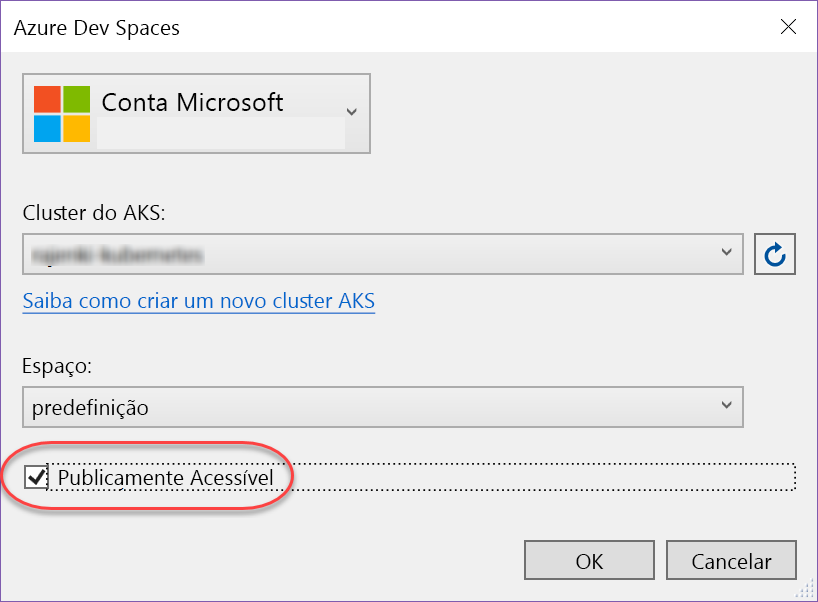
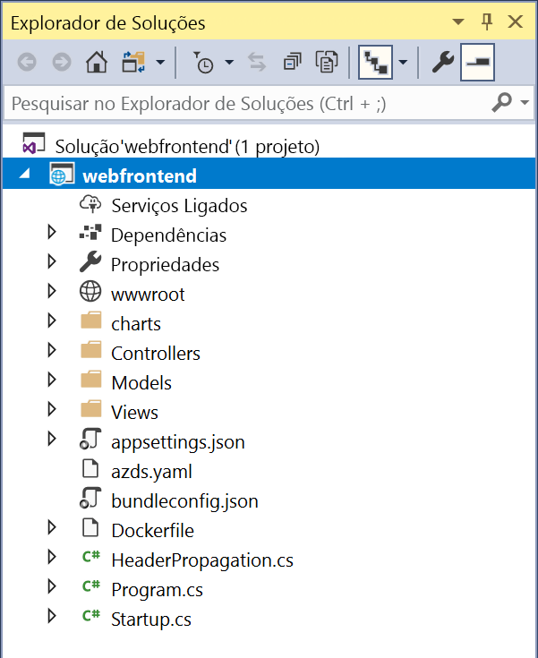

# <a name="create-a-kubernetes-dev-space-visual-studio-and-net-core-with-azure-dev-spaces"></a>Criar um espaço kubernetes dev: Visual Studio e .NET Core com Azure Dev Spaces

[!INCLUDE [Azure Dev Spaces deprecation](../../includes/dev-spaces-deprecation.md)]

Neste guia, vai aprender a:

- Configurar os Espaços de Programador do Azure com um cluster Kubernetes gerido no Azure.
- Utilizar o Visual Studio para desenvolver iterativamente código em contentores.
- Desenvolver de modo independente dois serviços separados e utilizar a deteção do serviço DNS de Kubernetes para fazer uma chamada para outro serviço.
- Desenvolver e testar de forma produtiva o seu código num ambiente de equipa.

> [!NOTE]
> **Se ficar preso** a qualquer momento, consulte a secção [de resolução de problemas.](troubleshooting.md)

## <a name="install-the-azure-cli"></a>Instalar a CLI do Azure
O Azure Dev Spaces só precisa de configuração mínima do computador local. A maior parte da configuração do espaço de desenvolvimento é armazenada na cloud e é partilhável com outros utilizadores. Comece por transferir e executar a [CLI do Azure](/cli/azure/install-azure-cli?view=azure-cli-latest).

### <a name="sign-in-to-azure-cli"></a>Iniciar sessão na CLI do Azure
Inicie sessão no Azure. Escreva o seguinte comando numa janela de terminal:

```azurecli
az login
```

> [!NOTE]
> Se não tiver uma subscrição do Azure, pode criar uma [conta gratuita.](https://azure.microsoft.com/free)

#### <a name="if-you-have-multiple-azure-subscriptions"></a>Se tiver várias subscrições do Azure...
Pode ver as suas subscrições ao executar: 

```azurecli
az account list --output table
```

Localize a subscrição que tem *True* for *IsDefault*.
Se esta não for a subscrição que pretende utilizar, pode alterar a subscrição predefinida:

```azurecli
az account set --subscription <subscription ID>
```

## <a name="create-a-kubernetes-cluster-enabled-for-azure-dev-spaces"></a>Criar um cluster do Kubernetes ativado para os Espaços de Programador do Azure

No comando, crie o grupo de recursos numa [região que suporte espaços Azure Dev][supported-regions].

```azurecli
az group create --name MyResourceGroup --location <region>
```

Crie um cluster do Kubernetes com o seguinte comando:

```azurecli
az aks create -g MyResourceGroup -n MyAKS --location <region> --generate-ssh-keys
```

A criação do cluster demora alguns minutos.

### <a name="configure-your-aks-cluster-to-use-azure-dev-spaces"></a>Configurar o seu cluster do AKS para utilizar os espaços de desenvolvimento do Azure

Introduza o seguinte comando da CLI do Azure com o grupo de recursos que contém o cluster do AKS e o nome do cluster do AKS. O comando configura o seu cluster com suporte para espaços de desenvolvimento do Azure.

   ```azurecli
   az aks use-dev-spaces -g MyResourceGroup -n MyAKS
   ```
   
> [!IMPORTANT]
> O processo de configuração do Azure Dev Spaces removerá o `azds` espaço de nome no cluster, se existir.

## <a name="get-the-visual-studio-tools"></a>Obter as ferramentas do Visual Studio
Instale a versão mais recente do [Visual Studio 2019](https://www.visualstudio.com/vs/) no Windows com a carga de trabalho do Azure Development.

## <a name="create-a-web-app-running-in-a-container"></a>Criar uma aplicação Web em execução num contentor

Nesta secção, você vai criar uma aplicação web core ASP.NET e fazê-la funcionar em um recipiente em Kubernetes.

### <a name="create-an-aspnet-web-app"></a>Criar uma aplicação Web ASP.NET

A partir do Estúdio Visual, crie um novo projeto. Atualmente, o projeto tem de ser uma **aplicação Web ASP.NET Core**. Atribua o nome "**webfrontend**" ao projeto.


Selecione o modelo **Web Application (Model-View-Controller)** (Aplicação Web (Controlador de Vista de Modelo)) e certifique-se de que está a apontar para **.NET Core** e **ASP.NET Core 2.0** nos dois menus pendentes na parte superior da caixa de diálogo. Clique em **OK** para criar o projeto.


### <a name="enable-dev-spaces-for-an-aks-cluster"></a>Ativar os Espaços de Programador para um cluster do AKS

Com o projeto que acabou de criar, selecione **Azure Dev Spaces** no menu pendente de definições de início, conforme mostrado abaixo.


Na caixa de diálogo apresentada a seguir, certifique-se de que tem sessão iniciada com a conta adequada e, em seguida, selecione um cluster Kubernetes existente.


Por agora, deixe o menu pendente **Space** (Espaço) com a predefinição `default`. Vai aprender mais sobre esta opção posteriormente. Selecione a caixa de verificação **Publicly Accessible** (Acessível Publicamente) para que a aplicação Web seja acessível a partir de um ponto final público. Esta definição não é obrigatória, mas será útil para demonstrar alguns conceitos mais adiante nestas instruções. Mas não se preocupe. Em qualquer caso, poderá depurar o seu site com o Visual Studio.



Clique em **OK** para selecionar ou criar o cluster.

Se optar por um cluster que não tenha sido preparado para funcionar com o Azure Dev Spaces, ser-lhe-á apresentada uma mensagem a perguntar se pretende configurá-lo.


Escolha **OK**.

> [!IMPORTANT]
> O processo de configuração do Azure Dev Spaces removerá o `azds` espaço de nome no cluster, se existir.

 Será iniciada uma tarefa em segundo plano para executar essa configuração. Esta operação demorará alguns minutos a ser concluída. Para ver se ainda está a ser criado, faça pairar o ponteiro sobre o ícone **Background tasks** (Tarefas em segundo plano) no canto inferior esquerdo da barra de tarefas, conforme mostrado na imagem abaixo.


> [!NOTE]
> Não pode depurar a sua aplicação enquanto o espaço não estiver criado.

### <a name="look-at-the-files-added-to-project"></a>Ver os ficheiros adicionados ao projeto
Enquanto aguarda pela criação do espaço de programador, veja os ficheiros que foram adicionados ao projeto quando optou por utilizar o espaço de programador.

Em primeiro lugar, pode ver que foi adicionada uma pasta com o nome `charts` e que, dentro desta, foi estruturado um [gráfico de Helm](https://docs.helm.sh) para a sua aplicação. Estes ficheiros são utilizados para implementar a aplicação no espaço de programador.

Verá que foi adicionado um ficheiro com o nome `Dockerfile`. Este ficheiro tem as informações necessárias para empacotar a aplicação no formato padrão do Docker.

Por último, verá um ficheiro denominado `azds.yaml`, que contém a configuração em tempo de desenvolvimento que é exigida pelo espaço de programador.



## <a name="debug-a-container-in-kubernetes"></a>Depurar um contentor no Kubernetes
Assim que o ambiente de programador estiver criado, pode depurar a aplicação. Defina um ponto de interrupção no código, por exemplo, na linha 20 do ficheiro `HomeController.cs` no qual está definida a variável `Message`. Clique em **F5** para iniciar a depuração. 

O Visual Studio vai comunicar com o espaço de programador para criar e implementar a aplicação e, em seguida, vai abrir um browser com a aplicação Web em execução. Poderá parecer que o contentor está a ser executado localmente. Contudo, na verdade, está a ser executado no espaço de programador no Azure. O motivo para o endereço localhost deve-se ao facto de o Azure Dev Spaces criar um túnel SSH temporário para o contentor que está a ser executado no AKS.

Clique na ligação **About** (Acerca de) na parte superior da página para acionar o ponto de interrupção. Tem acesso total às informações de depuração, tal como aconteceria se o código estivesse a ser executado localmente, como, por exemplo, a pilha de chamadas, as variáveis locais, informações de exceção, etc.

## <a name="iteratively-develop-code"></a>Desenvolver código de forma iterativa

O Azure Dev Spaces não se limita apenas a pôr o código em execução no Kubernetes. Tem que ver com permitir-lhe ver, de forma rápida e iterativa, as alterações ao código serem aplicadas num ambiente do Kubernetes na cloud.

### <a name="update-a-content-file"></a>Atualizar um ficheiro de conteúdo


1. Localize o ficheiro `./Views/Home/Index.cshtml` e faça uma edição ao HTML. Por exemplo, mude [a linha `<h2>Application uses</h2>` 73 que lê](https://github.com/Azure/dev-spaces/blob/master/samples/dotnetcore/getting-started/webfrontend/Views/Home/Index.cshtml#L73) para algo como: 
  
    ```html
    <h2>Hello k8s in Azure!</h2>`
    ```

2. Guarde o ficheiro.
3. Aceda ao seu browser e atualize a página. Deverá ver a página Web mostrar o código HTML atualizado.

O que aconteceu? As edições aos ficheiros de conteúdos, como HTML e CSS, não requerem a recompilação numa aplicação Web .NET Core, pelo que uma sessão F5 ativa sincroniza automaticamente qualquer ficheiro de conteúdos modificado com o contentor em execução no AKS, de modo a que possa ver as edições aos conteúdos de imediato.

### <a name="update-a-code-file"></a>Atualizar um ficheiro de código
A atualização de ficheiros de código exige mais algum trabalho, porque a aplicação .NET Core tem de ser recompilada e produzir binários de aplicação atualizados.

1. Pare o depurador no Visual Studio.
1. Abra o ficheiro de código com o nome `Controllers/HomeController.cs` e edite a mensagem que a página About (Sobre) vai apresentar: `ViewData["Message"] = "Your application description page.";`
1. Guarde o ficheiro.
1. Prima **F5** para iniciar novamente a depuração. 

Em vez de reconstruir e reimplementar uma imagem de contentor nova sempre que forem feitas edições ao código, o que, muitas vezes, irá demorar um tempo considerável, o Azure Dev Spaces recompilará incrementalmente o código dentro do contentor existente para proporcionar um ciclo de edição/depuração mais rápido.

Atualize a aplicação Web no browser e aceda à página About (Sobre). Deverá ver a mensagem personalizada apresentada na IU.

## <a name="next-steps"></a>Passos seguintes

Saiba mais sobre o funcionamento da Azure Dev Spaces.

> [!div class="nextstepaction"]
> [Como funciona o Azure Dev Spaces](how-dev-spaces-works.md)


[supported-regions]: https://azure.microsoft.com/global-infrastructure/services/?products=kubernetes-service
