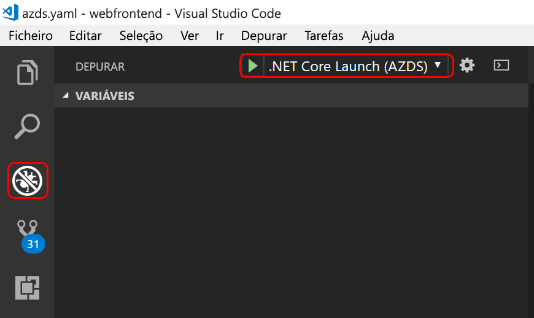

# <a name="create-a-kubernetes-dev-space-visual-studio-code-and-net-core-with-azure-dev-spaces"></a>Criar um kubernetes dev Space: Visual Studio Code e .NET Core com Azure Dev Spaces

Neste guia, vai aprender a:

- Criar um ambiente baseado no Kubernetes no Azure otimizado para o desenvolvimento - um _espaço de programação_.
- Utilizar o VS Code e a linha de comandos para desenvolver iterativamente código em contentores.
- Desenvolver e testar de forma produtiva o seu código num ambiente de equipa.

> [!Note]
> **Se você ficar preso** a qualquer momento, consulte a seção [solução de problemas](troubleshooting.md) .

## <a name="install-the-azure-cli"></a>Instalar a CLI do Azure
O Azure Dev Spaces só precisa de configuração mínima do computador local. A maior parte da configuração do espaço de desenvolvimento é armazenada na cloud e é partilhável com outros utilizadores. Comece por transferir e executar a [CLI do Azure](/cli/azure/install-azure-cli?view=azure-cli-latest).

### <a name="sign-in-to-azure-cli"></a>Iniciar sessão na CLI do Azure
Inicie sessão no Azure. Escreva o seguinte comando numa janela de terminal:

```cmd
az login
```

> [!Note]
> Se não tiver uma subscrição do Azure, pode [criar uma conta gratuita](https://azure.microsoft.com/free).

#### <a name="if-you-have-multiple-azure-subscriptions"></a>Se tiver várias subscrições do Azure...
Pode ver as suas subscrições ao executar: 

```cmd
az account list --output table
```

Localize a assinatura que tem *true* para *IsDefault*.
Se esta não for a subscrição que pretende utilizar, pode alterar a subscrição predefinida:

```cmd
az account set --subscription <subscription ID>
```

## <a name="create-a-kubernetes-cluster-enabled-for-azure-dev-spaces"></a>Criar um cluster do Kubernetes ativado para os Espaços de Programador do Azure

No prompt de comando, crie o grupo de recursos em uma [região que ofereça suporte a Azure dev Spaces][supported-regions].

```cmd
az group create --name MyResourceGroup --location <region>
```

Crie um cluster do Kubernetes com o seguinte comando:

```cmd
az aks create -g MyResourceGroup -n MyAKS --location <region> --disable-rbac --generate-ssh-keys
```

A criação do cluster demora alguns minutos.

### <a name="configure-your-aks-cluster-to-use-azure-dev-spaces"></a>Configurar o seu cluster do AKS para utilizar os espaços de desenvolvimento do Azure

Introduza o seguinte comando da CLI do Azure com o grupo de recursos que contém o cluster do AKS e o nome do cluster do AKS. O comando configura o seu cluster com suporte para espaços de desenvolvimento do Azure.

   ```cmd
   az aks use-dev-spaces -g MyResourceGroup -n MyAKS
   ```
   
> [!IMPORTANT]
> O processo de configuração de Azure Dev Spaces removerá o namespace `azds` no cluster, se existir.

## <a name="get-kubernetes-debugging-for-vs-code"></a>Depurar o Kubernetes para o VS Code
Estão disponíveis funcionalidades avançadas, como a depuração do Kubernetes, para programadores de .NET Core e o Node.js com o VS Code.

1. Se não tiver, instale o [VS Code](https://code.visualstudio.com/Download).
1. Baixe e instale o [VS Azure dev Spaces](https://marketplace.visualstudio.com/items?itemName=azuredevspaces.azds) e [C#](https://marketplace.visualstudio.com/items?itemName=ms-vscode.csharp) extensões. Para cada extensão, clique em instalar na página do Marketplace da extensão e, novamente, em VS Code.

## <a name="create-a-web-app-running-in-a-container"></a>Criar uma aplicação Web em execução num contentor

Nesta seção, você criará um aplicativo Web ASP.NET Core e o tornará em execução em um contêiner no kubernetes.

### <a name="create-an-aspnet-core-web-app"></a>Criar uma aplicação Web ASP.NET Core
Clone ou baixe o [Azure dev Spaces aplicativo de exemplo](https://github.com/Azure/dev-spaces). Este artigo usa o código no diretório *Samples/dotnetcore/getfront-Started/de WebFrontEnd* .

## <a name="preparing-code-for-docker-and-kubernetes-development"></a>Preparar o código para implementação do Docker e Kubernetes
Neste momento, tem uma aplicação Web básica que pode ser executada localmente. Agora, irá colocá-la em contentor ao criar recursos que definem o contentor da aplicação e como esta será implementada no Kubernetes. É fácil executar esta tarefa com o Azure Dev Spaces: 

1. Inicie o VS Code e abra a pasta `webfrontend`. (Pode ignorar os pedidos predefinidos para adicionar recursos de erro ou restaurar o projeto.)
1. Abra o Terminal Integrado no VS Code (através do menu **Ver > Terminal Integrado**).
1. Execute este comando (certifique-se de que **webfrontend** é a sua pasta atual):

    ```cmd
    azds prep --public
    ```

O comando `azds prep` da CLI do Azure gera recursos do Docker e Kubernetes com as predefinições:
* `./Dockerfile` descreve a imagem de contentor da aplicação e como o código-fonte é construído e executado no contentor.
* Um [gráfico Helm](https://docs.helm.sh) em `./charts/webfrontend` descreve como implementar o contentor no Kubernetes.

Por enquanto, não é necessário entender o conteúdo completo desses ficheiros. No entanto, importa realçar que **os mesmos recursos de configuração como código do Kubernetes e do Docker podem ser utilizados do desenvolvimento à produção, dando maior consistência em diferentes ambientes.**
 
É também geral um ficheiro com o nome `./azds.yaml` pelo comando `prep`, que é o ficheiro de configuração do Azure Dev Spaces. Este complementa os artefactos do Docker e do Kubernetes com uma configuração adicional que permite uma experiência de desenvolvimento iterativa no Azure.

## <a name="build-and-run-code-in-kubernetes"></a>Criar e executar códigos no Kubernetes
Vamos executar o nosso código! Na janela do terminal, execute este comando a partir da **pasta de código raiz**, webfrontend:

```cmd
azds up
```

Fique de olho no resultado do comando, vai reparar em várias coisas à medida que progride:
- O código fonte é sincronizado com o espaço de programação no Azure.
- É criada uma imagem de contentor no Azure, conforme especificado pelos ativos do Docker na sua pasta de códigos.
- São criados objetos do Kubernetes que utilizam a imagem do contentor, conforme especificado pelo gráfico Helm na sua pasta de códigos.
- São apresentadas as informações sobre o(s) ponto(s) final(ais) do contentor. No nosso caso, contamos com um URL HTTP público.
- Assumindo que os estágios acima sejam concluídos com sucesso, deve começar a ver o resultado `stdout` (e `stderr`), à medida que o contentor é iniciado.

> [!Note]
> Estes passos vão demorar mais tempo quando o comando `up` é executado pela primeira vez, mas as execuções seguintes deverão ser mais rápidas.

### <a name="test-the-web-app"></a>Testar a aplicação Web
Examine a saída do console para a mensagem *iniciada do aplicativo* , confirmando que o comando `up` foi concluído:

```
Service 'webfrontend' port 80 (TCP) is available at 'http://localhost:<port>'
Service 'webfrontend' port 'http' is available at http://webfrontend.1234567890abcdef1234.eus.azds.io/
Microsoft (R) Build Engine version 15.9.20+g88f5fadfbe for .NET Core
Copyright (C) Microsoft Corporation. All rights reserved.

  webfrontend -> /src/bin/Debug/netcoreapp2.2/webfrontend.dll
  webfrontend -> /src/bin/Debug/netcoreapp2.2/webfrontend.Views.dll

Build succeeded.
    0 Warning(s)
    0 Error(s)

Time Elapsed 00:00:00.94
[...]
webfrontend-5798f9dc44-99fsd: Now listening on: http://[::]:80
webfrontend-5798f9dc44-99fsd: Application started. Press Ctrl+C to shut down.
```

Identifique a URL pública para o serviço na saída do comando `up`. Termina em `.azds.io`. No exemplo acima, a URL pública é `http://webfrontend.1234567890abcdef1234.eus.azds.io/`.

Para ver seu aplicativo Web, abra a URL pública em um navegador. Além disso, observe `stdout` e `stderr` saída é transmitida para a janela do terminal de *rastreamento de azds* enquanto você interage com seu aplicativo Web. Você também verá informações de rastreamento para solicitações HTTP à medida que eles passam pelo sistema. Isso facilita o acompanhamento de chamadas complexas de vários serviços durante o desenvolvimento. A instrumentação adicionada por espaços de desenvolvimento fornece esse acompanhamento de solicitação.


> [!Note]
> Além da URL pública, você pode usar a URL de `http://localhost:<portnumber>` alternativa que é exibida na saída do console. Se utilizar o URL de anfitrião local, poderá parecer que o contentor está a ser executado localmente, contudo, está a ser executado no AKS. Azure Dev Spaces usa a funcionalidade *de encaminhamento de porta* kubernetes para mapear a porta localhost para o contêiner em execução no AKs. Isso facilita a interação com o serviço do computador local.

### <a name="update-a-content-file"></a>Atualizar um ficheiro de conteúdo
O Azure Dev Spaces não se limita apenas a pôr o código em execução no Kubernetes. Tem que ver com permitir-lhe ver, de forma rápida e iterativa, as alterações ao código serem aplicadas num ambiente do Kubernetes na cloud.

1. Localize o ficheiro `./Views/Home/Index.cshtml` e faça uma edição ao HTML. Por exemplo, altere a [linha 73 que lê `<h2>Application uses</h2>`](https://github.com/Azure/dev-spaces/blob/master/samples/dotnetcore/getting-started/webfrontend/Views/Home/Index.cshtml#L73) para algo como: 

    ```html
    <h2>Hello k8s in Azure!</h2>
    ```

1. Guarde o ficheiro. Pouco depois, na janela do terminal, verá uma mensagem que diz que um ficheiro no contentor em execução foi atualizado.
1. Aceda ao seu browser e atualize a página. Deverá ver a página Web mostrar o código HTML atualizado.

O que aconteceu? As edições aos ficheiros de conteúdos, como HTML e CSS, não requerem a recompilação numa aplicação Web .NET Core, pelo que um comando `azds up` ativo sincroniza automaticamente qualquer ficheiro de conteúdos modificado com o contentor em execução no Azure, de modo a que possa ver as edições aos conteúdos de imediato.

### <a name="update-a-code-file"></a>Atualizar um ficheiro de código
A atualização de ficheiros de código exige mais algum trabalho, porque a aplicação .NET Core tem de ser recompilada e produzir binários de aplicação atualizados.

1. Na janela de terminal, prima `Ctrl+C` (para parar `azds up`).
1. Abra o ficheiro de código com o nome `Controllers/HomeController.cs` e edite a mensagem que a página About (Sobre) vai apresentar: `ViewData["Message"] = "Your application description page.";`
1. Guarde o ficheiro.
1. Execute `azds up` na janela de terminal. 

Este comando recria a imagem do contentor e reimplementa o gráfico Helm. Para ver as alterações ao código entrarem em vigor na aplicação em execução, aceda ao menu About (Sobre) na aplicação Web.

Mas existe um *método ainda mais rápido* para programar código, que vai explorar na próxima secção. 

## <a name="debug-a-container-in-kubernetes"></a>Depurar um contentor no Kubernetes

Nesta secção, ai utilizar o VS Code para depurar diretamente o nosso contentor em execução no Azure. Também vai aprender como obter um ciclo de edição-execução-teste mais rápido.


> [!Note]
> **Se ficar bloqueado** em qualquer altura, veja a secção [Resolução de problemas](troubleshooting.md) ou publique um comentário nesta página.

### <a name="initialize-debug-assets-with-the-vs-code-extension"></a>Inicializar ativos de depuração com a extensão do VS Code
Primeiro tem de configurar o seu projeto de código para que o VS Code comunique com o nosso espaço de programação no Azure. A extensão do VS Code para Espaços de Programação do Azure oferece um comando auxiliar para contribuir para a configuração da depuração. 

Abra a **Paleta de Comandos** (através do menu **Ver | Paleta de Comandos**), e utilize o preenchimento automático para escrever e selecione este comando: `Azure Dev Spaces: Prepare configuration files for Azure Dev Spaces`. 

Esta ação adiciona a configuração de depuração para os Espaços de Programação do Azure na pasta `.vscode`. Este comando não deve ser confundido com o comando `azds prep`, que configura o projeto para implementação.


### <a name="select-the-azds-debug-configuration"></a>Selecionar a configuração de depuração do AZDS
1. Para abrir a vista Debug (Depuração), clique no ícone Debug em **Activity Bar** (Barra de Atividades), no lado do VS Code.
1. Selecione **.NET Core Launch (AZDS)** (Iniciar .NET Core [AZDS]) como a configuração de depuração ativa.



> [!Note]
> Se não vir nenhum comando do Azure Dev Spaces em Command Palette (Paleta de Comandos), confirme que tem instalada a extensão do VS Code para o Azure Dev Spaces. Lembre-se de que a área de trabalho que abriu no VS Code é a pasta que contém azds.yaml.


### <a name="debug-the-container-in-kubernetes"></a>Depurar o contentor no Kubernetes
Prima **F5** para depurar o código no Kubernetes.

Tal como sucede com o comando `up`, o código é sincronizado com o espaço de programador e é criado e implementado um contentor no Kubernetes. Desta vez, obviamente, o depurador está ligado ao contentor remoto.

> [!Tip]
> A barra de status VS Code ficará laranja, indicando que o depurador está anexado. Ele também exibirá uma URL clicável, que você pode usar para abrir seu site.


Defina um ponto de interrupção num ficheiro de código do lado do servidor, como, por exemplo, a função `About()` no ficheiro de origem `Controllers/HomeController.cs`. Atualizar a página do browser faz com que o ponto de interrupção seja atingido.

Tem acesso total às informações da depuração, tal como aconteceria se o código estivesse a ser executado localmente, como, por exemplo, a pilha de chamadas, as variáveis locais, as informações de exceção, etc.

### <a name="edit-code-and-refresh"></a>Editar o código e atualizar
Com o depurador ativo, faça uma edição ao código. Por exemplo, modifique a mensagem da página About (Sobre), em `Controllers/HomeController.cs`. 

```csharp
public IActionResult About()
{
    ViewData["Message"] = "My custom message in the About page.";
    return View();
}
```

Salve o arquivo e, no **painel Ações de depuração**, clique no botão **reiniciar** . 


Em vez de reconstruir e reimplementar uma imagem de contentor nova sempre que forem feitas edições ao código, o que, muitas vezes, irá demorar um tempo considerável, o Azure Dev Spaces recompilará incrementalmente o código dentro do contentor existente para proporcionar um ciclo de edição/depuração mais rápido.

Atualize a aplicação Web no browser e aceda à página About (Sobre). Deverá ver a mensagem personalizada apresentada na IU.

**Agora, tem um método para iterar rapidamente no código e depurar diretamente no Kubernetes.** Em seguida, irá ver como pode criar e chamar um segundo contentor.

## <a name="next-steps"></a>Passos seguintes

> [!div class="nextstepaction"]
> [Saiba mais sobre o desenvolvimento de vários serviços](multi-service-netcore.md)


[supported-regions]: about.md#supported-regions-and-configurations