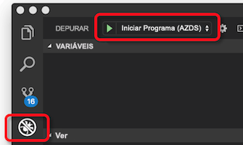

# Como funciona a depuração remota do seu código com a Azure Dev Spaces

A Azure Dev Spaces fornece-lhe múltiplas formas de iterar e depurar rapidamente aplicações kubernetes e colaborar com a sua equipa num cluster do Serviço Azure Kubernetes (AKS). Uma vez que o seu projeto está em execução num espaço de v, a Azure Dev Spaces fornece uma forma de anexar e depurar uma aplicação em execução no AKS.

Este artigo descreve como funciona a depuração remota com a Dev Spaces.

## Desinime o seu código

Para as aplicações Java, .NET Core e Node.js, pode desinviar a sua aplicação a funcionar diretamente no seu espaço de dev utilizando o Visual Studio Code ou o Visual Studio. O Visual Studio Code e o Visual Studio fornecem ferramentas para se conectarem ao seu espaço de dev, lançarem a sua aplicação e anexarem um debugger. Depois `azds prep`de correr, pode abrir o seu projeto em Visual Studio Code ou Visual Studio. O Visual Studio Code ou o Visual Studio gerarão os `azds prep`seus próprios ficheiros de configuração para a ligação que é diferente de executar . A partir de visual studio code ou estúdio visual, você pode definir breakpoints e lançar a sua aplicação para o seu espaço de v.

Quando lança a sua aplicação utilizando o Visual Studio Code ou o Visual Studio para depuração, eles lidam com o lançamento e a ligação ao seu espaço de dev da mesma forma que correr `azds up`. Além disso, a ferramenta do lado do cliente no Visual Studio Code e Visual Studio fornece um parâmetro adicional com informações específicas para depuração. O parâmetro contém o nome da imagem de debugger, a localização do desbugger dentro da imagem do depurador, e a localização de destino dentro do recipiente da aplicação para montar a pasta de debugger.

A imagem de debugger é automaticamente determinada pela ferramenta do lado do cliente. Utiliza um método semelhante ao utilizado durante o Dockerfile `azds prep`e o gráfico Helm geram quando estão a correr . Depois de o desbugger ser montado na imagem `azds exec`da aplicação, é executado utilizando .

## Passos seguintes

Para começar a usar o Azure Dev Spaces para depurar remotamente o seu projeto, consulte os seguintes quickstarts:

* [Iterado e depurado rapidamente com Código de Estúdio Visual e Java][quickstart-java]
* [Iterado e depurado rapidamente com Código de Estúdio Visual e .NET][quickstart-netcore]
* [Iterado e depurado rapidamente com Código de Estúdio Visual e Node.js][quickstart-node]
* [Iterado e depurado rapidamente com Visual Studio e .NET Core][quickstart-vs]

[quickstart-java]: quickstart-java.md
[quickstart-netcore]: quickstart-netcore.md
[quickstart-node]: quickstart-nodejs.md
[quickstart-vs]: quickstart-netcore-visualstudio.md
