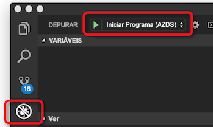

# <a name="how-azure-dev-spaces-works-and-is-configured"></a>Como os espaços de desenvolvimento do Azure funciona e é configurado

Desenvolvendo um aplicativo de Kubernetes pode ser um desafio. Terá de ficheiros de configuração do Docker e Kubernetes. Precisa descobrir como testar a aplicação localmente e interagir com outros serviços dependentes. Poderá ter de lidar com desenvolvimento e teste em vários serviços ao mesmo tempo e com uma equipe de desenvolvedores.

Espaços de desenvolvimento do Azure ajuda-o a desenvolver, implementar e depurar aplicações do Kubernetes diretamente da Kubernetes do Azure Service (AKS). Espaços de desenvolvimento do Azure também permite que uma equipa partilhar um espaço de desenvolvimento. Partilhar um espaço de desenvolvimento numa equipe permite que os membros da Equipe individuais desenvolver isoladamente sem a necessidade de replicar ou simular dependências ou outras aplicações no cluster.

Espaços de desenvolvimento do Azure cria e utiliza um ficheiro de configuração para implementar, executar e depurar seus aplicativos de Kubernetes no AKS. Este ficheiro de configuração reside com o código de seu aplicativo e pode ser adicionado ao seu sistema de controle de versão.

Este artigo descreve os processos que espaços de desenvolvimento do Azure power e como esses processos são configurados no arquivo de configuração de espaços de desenvolvimento do Azure. Para obter os espaços de desenvolvimento do Azure em execução rapidamente e vê-lo na prática, execute um dos inícios rápidos:

* [Java com a CLI e o Visual Studio Code](quickstart-java.md)
* [.NET core com a CLI e o Visual Studio Code](quickstart-netcore.md)
* [.NET core com o Visual Studio 2017](quickstart-netcore-visualstudio.md)
* [NODE. js com a CLI e o Visual Studio Code](quickstart-nodejs.md)

## <a name="how-azure-dev-spaces-works"></a>Como funciona a espaços de desenvolvimento do Azure

Espaços de desenvolvimento do Azure tem dois componentes distintos que interagem com: o controlador e as ferramentas do lado do cliente.


O controlador executa as seguintes ações:

* Gerencia a criação de espaço de desenvolvimento e a seleção.
* Instala o gráfico do Helm do seu aplicativo e cria objetos de Kubernetes.
* Compilações de imagem de contentor do seu aplicativo.
* Implementa a aplicação do AKS.
* Não as compilações incrementais e reinicia quando seu código-fonte é alterado.
* Gere registos e rastreios HTTP.
* Reencaminha stdout e stderr para as ferramentas do lado do cliente.
* Permite que os membros da Equipe criar espaços de desenvolvimento de subordinado derivados de um espaço de desenvolvimento principal.
* Configura o encaminhamento para aplicativos dentro de um espaço, bem como entre espaços principais e subordinados.

O controlador reside fora do AKS. Orienta o comportamento e a comunicação entre as ferramentas do lado do cliente e o cluster do AKS. O controlador está ativado com a CLI do Azure quando preparar o seu cluster para utilizar os espaços de desenvolvimento do Azure. Assim que estiver ativada, pode interagir com eles usando as ferramentas do lado do cliente.

As ferramentas do lado do cliente permite que o usuário:
* Gerar um Dockerfile, gráfico Helm e o ficheiro de configuração de espaços de desenvolvimento do Azure para a aplicação.
* Crie principais e subordinados espaços de desenvolvimento.
* Informe o controlador para compilar e iniciar a sua aplicação.

Enquanto a aplicação está em execução, o lado do cliente de ferramentas também:
* Recebe e apresenta o stdout e stderr do seu aplicativo em execução no AKS.
* Utiliza [porta-forward](https://kubernetes.io/docs/tasks/access-application-cluster/port-forward-access-application-cluster/) para permitir o acesso web ao seu aplicativo com http://locahost.
* Anexa um depurador a sua aplicação em execução no AKS.
* Sincronizações código-fonte para seu espaço de desenvolvimento quando é detetada uma alteração para as compilações incrementais, permitindo a rápida iteração.

Pode usar o lado do cliente de ferramentas da linha de comando como parte do `azds` comando. Também pode utilizar o lado do cliente de ferramentas com:

* Visual Studio Code com o [extensão do Azure Dev espaços](https://marketplace.visualstudio.com/items?itemName=azuredevspaces.azds).
* Visual Studio 2017 com [ferramentas do Visual Studio para Kubernetes](https://aka.ms/get-vsk8stools).

Eis o fluxo básico para configurar e utilizar espaços de desenvolvimento do Azure:
1. Preparar o seu cluster do AKS para espaços de desenvolvimento do Azure
1. Preparar o seu código para executar em espaços de desenvolvimento do Azure
1. Executar o código num espaço de desenvolvimento
1. Depurar seu código num espaço de desenvolvimento
1. Partilhar um espaço de desenvolvimento

Abordaremos mais detalhes sobre como funciona o Azure Dev espaços em cada um do abaixo secções.

## <a name="prepare-your-aks-cluster"></a>Preparar o seu cluster do AKS

Preparar o seu cluster do AKS envolve:
* A verificar o AKS cluster está numa região [suportado pelo Azure Dev espaços](https://docs.microsoft.com/azure/dev-spaces/#a-rapid,-iterative-kubernetes-development-experience-for-teams).
* A verificar que está a executar o Kubernetes 1.10.3 ou posterior.
* Ativar espaços de desenvolvimento do Azure no seu cluster com `az aks use-dev-spaces`

Para obter mais informações sobre como criar e configurar um cluster do AKS para espaços de desenvolvimento do Azure, consulte um dos guias de introdução ao obter:
* [Começar a trabalhar com os espaços de desenvolvimento do Azure com Java](get-started-java.md)
* [Começar a trabalhar com os espaços de desenvolvimento do Azure com .NET Core e o Visual Studio](get-started-netcore-visualstudio.md)
* [Começar a trabalhar com os espaços de desenvolvimento do Azure com .NET Core](get-started-netcore.md)
* [Começar a trabalhar com os espaços de desenvolvimento do Azure com node. js](get-started-nodejs.md)

Quando os espaços de desenvolvimento do Azure está ativado no seu cluster do AKS, ele instala o controlador para o seu cluster. O controlador é um recurso do Azure separado fora do cluster e faz o seguinte aos recursos no seu cluster:

* Cria ou designa um espaço de nomes do Kubernetes para utilizar como um espaço de desenvolvimento.
* Remove qualquer espaço de nomes do Kubernetes com o nome *azds*, se ela existe e cria um novo.
* Implementa um objeto do inicializador de Kubernetes.

! [Preparar cluster de espaços de desenvolvimento do azure]] (media/how-dev-spaces-works/prepare-cluster.svg)

Para utilizar espaços de desenvolvimento do Azure, tem de existir pelo menos um espaço de desenvolvimento. Os espaços de desenvolvimento do Azure utilizam espaços de nomes do Kubernetes no seu cluster do AKS para espaços de desenvolvimento. Quando está a ser instalado um controlador, pede-lhe para criar um novo espaço de nomes do Kubernetes ou escolha um espaço de nomes existente para utilizar como seu primeiro espaço de desenvolvimento. Quando um espaço de nomes é designado como um espaço de desenvolvimento, o controlador adiciona a *azds.io/space=true* etiqueta para esse espaço de nomes para identificá-lo como um espaço de desenvolvimento. O espaço de desenvolvimento inicial cria ou designar está selecionado por predefinição, depois de preparar o seu cluster. Quando é selecionado um espaço, é utilizado por espaços de desenvolvimento do Azure para a criação de novas cargas de trabalho.

Por predefinição, o controlador cria um espaço de desenvolvimento com o nome *predefinição* atualizando os existentes *padrão* espaço de nomes do Kubernetes. Pode utilizar as ferramentas do lado do cliente para criar novos espaços de desenvolvimento e remover os espaços existentes de desenvolvimento. Devido a uma limitação no Kubernetes, o *predefinição* não é possível remover o espaço de desenvolvimento. O controlador também remove quaisquer espaços de nomes do Kubernetes existentes com o nome *azds* para evitar conflitos com a `azds` comando utilizado pelas ferramentas do lado do cliente.

O objeto do inicializador de Kubernetes é usado para inserir os pods com três contentores durante a implementação de instrumentação: um contentor de devspaces proxy, um contentor de inicialização da proxy devspaces e um contentor de compilação devspaces. **Executam todos os três destes contentores com acesso à raiz do seu cluster do AKS.**


O contentor de devspaces proxy é um contentor de sidecar que lida com todo o tráfego TCP para dentro e fora do contentor da aplicação e ajuda a executar o encaminhamento. O contentor de devspaces proxy redireciona as mensagens HTTP se determinadas espaços estão a ser utilizados. Por exemplo, pode ajudar a rotear mensagens HTTP entre aplicativos nos espaços de principais e subordinados. Todo o tráfego não-HTTP passa através do proxy de devspaces sem modificações. O contentor de devspaces proxy também registra todas as mensagens HTTP de entrada e saídas e as envia para o lado do cliente de ferramentas como rastreios. Estes rastreios, em seguida, podem ser visualizados pelo programador inspecionar o comportamento do aplicativo.

O contêiner de inicialização da proxy devspaces é um [init contentor](https://kubernetes.io/docs/concepts/workloads/pods/init-containers/) que adiciona as regras de encaminhamento adicionais com base na hierarquia de espaço para o contentor da sua aplicação. Ele adiciona regras de encaminhamento ao atualizar o contentor da aplicação */etc/resolv.conf* configuração de ficheiro e iptables antes de iniciar. As atualizações */etc/resolv.conf* permitir a resolução de DNS de serviços nos espaços de principal. As atualizações de configuração de iptables Certifique-se a todo o tráfego TCP em e fora do contentor da aplicação são encaminhadas entanto devspaces e de proxy. Todas as atualizações de inicialização da proxy devspaces acontecem, além das regras que adiciona o Kubernetes.

O contentor de devspaces-build é um contentor de init e tem o código de origem do projeto e o socket de Docker montado. O código de origem do projeto e o acesso ao Docker permite que o contêiner de aplicativo que serão criados diretamente pelo pod.

> [!NOTE]
> Os espaços de desenvolvimento do Azure utilizam o mesmo nó para criar o contentor da sua aplicação e executá-lo. Como resultado, espaços de desenvolvimento do Azure não necessita de um registo de contentor externo para a criação e execução da sua aplicação.

O objeto do inicializador de Kubernetes escuta de quaisquer novos pod, que é criado no cluster do AKS. Se esse pod for implementada para qualquer espaço de nomes com o *azds.io/space=true* etiqueta, ele injeta desse pod com os contentores adicionais. O contentor de compilação devspaces é injetado apenas se o contentor da aplicação é executada usando as ferramentas do lado do cliente.

Depois de preparar o cluster do AKS, pode utilizar as ferramentas do lado do cliente para preparar e executar o código no seu espaço de desenvolvimento.

## <a name="prepare-your-code"></a>Preparar o seu código

Para executar seu aplicativo num espaço de desenvolvimento, ele precisa ser em contentores, e precisa definir a forma como deve ser implementada para o Kubernetes. Para colocar a aplicação num contentor, precisa de um Dockerfile. Para definir a forma como a aplicação é implementada para o Kubernetes, é necessário um [gráfico Helm](https://docs.helm.sh/). Para auxiliar na criação de um gráfico o Dockerfile e o Helm para a sua aplicação, as ferramentas do lado do cliente fornecem o `prep` comando:

```cmd
azds prep --public
```

O `prep` comando irá examinar os arquivos no seu projeto e tente criar o gráfico Dockerfile e Helm para execução da sua aplicação no Kubernetes. Atualmente, o `prep` comando irá gerar um gráfico de Dockerfile e Helm com os seguintes idiomas:

* Java
* Node.js
* .NET Core

*Tem* executar o `prep` comando a partir de um diretório que contém o código-fonte. A executar o `prep` comando no diretório correto permite que as ferramentas do lado do cliente identificar o idioma e criar um Dockerfile adequado para colocar a aplicação num contentor. Também pode executar o `prep` comando a partir de um diretório que contém um *pom* ficheiro para projetos de Java.

Se executar o `prep` comando a partir do diretório que não contém o código-fonte, as ferramentas do lado do cliente não irá gerar um Dockerfile. Ele também mostra uma indicação de erro: *Não foi possível gerar o Dockerfile devido a linguagem não suportada*. Este erro ocorre também se as ferramentas do lado do cliente não reconhecem o tipo de projeto.

Quando executa o `prep` comando, tem a opção de especificar o `--public` sinalizador. Este sinalizador indica o controlador para criar um ponto final acessível pela internet para este serviço. Se não especificar este sinalizador, o serviço só é acessível a partir de dentro do cluster ou utilizar o túnel de localhost criados pelas ferramentas do lado do cliente. Pode ativar ou desativar esse comportamento depois de ser executada a `prep` comando atualizando o gráfico Helm gerado.

O `prep` comando não irá substituir qualquer gráfico Dockerfiles ou Helm existente tiver no seu projeto. Se um gráfico de Dockerfile ou Helm existente utiliza a mesma Convenção de nomenclatura, como os arquivos gerados pelos `prep` comando, o `prep` comando irá ignorar a geração desses ficheiros. Caso contrário, o `prep` comando irá gerar seu próprio Dockerfile ou Helm do gráfico junto com os ficheiros existentes.

O `prep` comando também irá gerar um `azds.yaml` ficheiro na raiz do seu projeto. Espaços de desenvolvimento do Azure utiliza este ficheiro para criar, instalar, configurar e executar a sua aplicação. Este ficheiro de configuração apresenta a localização do gráfico Dockerfile e Helm e também fornece uma configuração adicional sobre esses artefactos.

Eis um exemplo de arquivo de azds.yaml criado usando [aplicação de exemplo do .NET Core](https://github.com/Azure/dev-spaces/tree/master/samples/dotnetcore/getting-started/webfrontend):

```yaml
kind: helm-release
apiVersion: 1.1
build:
  context: .
  dockerfile: Dockerfile
install:
  chart: charts/webfrontend
  values:
  - values.dev.yaml?
  - secrets.dev.yaml?
  set:
    replicaCount: 1
    image:
      repository: webfrontend
      tag: $(tag)
      pullPolicy: Never
    ingress:
      annotations:
        kubernetes.io/ingress.class: traefik-azds
      hosts:
        # This expands to [space.s.][rootSpace.]webfrontend.<random suffix>.<region>.azds.io
        - $(spacePrefix)$(rootSpacePrefix)webfrontend$(hostSuffix)
configurations:
  develop:
    build:
      dockerfile: Dockerfile.develop
      useGitIgnore: true
      args:
        BUILD_CONFIGURATION: ${BUILD_CONFIGURATION:-Debug}
    container:
      sync:
      - "**/Pages/**"
      - "**/Views/**"
      - "**/wwwroot/**"
      - "!**/*.{sln,csproj}"
      command: [dotnet, run, --no-restore, --no-build, --no-launch-profile, -c, "${BUILD_CONFIGURATION:-Debug}"]
      iterate:
        processesToKill: [dotnet, vsdbg]
        buildCommands:
        - [dotnet, build, --no-restore, -c, "${BUILD_CONFIGURATION:-Debug}"]
```

O `azds.yaml` ficheiro gerado pelo `prep` comando deve funcionar bem para um cenário de desenvolvimento do projeto simples e única. Se o seu projeto específico aumentou a complexidade, poderá ter de atualizar este ficheiro depois de ser executada a `prep` comando. Por exemplo, o seu projeto pode exigem alguns ajustes para sua compilação ou iniciar o processo com base no seu desenvolvimento ou necessidades de depuração. Também pode ter vários aplicativos em seu projeto, que requerem vários processos de compilação ou um conteúdo de compilação diferentes.

## <a name="run-your-code"></a>Executar o seu código

Para executar o código num espaço de desenvolvimento, emita os `up` no mesmo diretório do seu `azds.yaml` ficheiro:

```cmd
azds up
```

O `up` comando carrega os ficheiros de origem da aplicação e outros artefactos necessários para criar e executar o seu projeto para o espaço de desenvolvimento. A partir daí, o controlador no seu espaço de desenvolvimento:

1. Cria os objetos de Kubernetes para implementar a sua aplicação.
1. Cria o contentor para a sua aplicação.
1. Implanta seu aplicativo para o espaço de desenvolvimento.
1. Cria um nome DNS acessível ao público para o ponto final da aplicação, se configurado.
1. Utiliza *porta-forward* para fornecer acesso ao seu ponto final de aplicação com http://locahost.
1. Reencaminha stdout e stderr para as ferramentas do lado do cliente.


### <a name="starting-a-service"></a>A partir de um serviço

Quando inicia um serviço num espaço de desenvolvimento, as ferramentas do lado do cliente e o controlador de trabalham em coordenação para sincronizar os arquivos de origem, criar os seus contentores e objetos de Kubernetes e execute a sua aplicação.

Num nível mais granular, eis o que acontece quando executa `azds up`:

1. Ficheiros são sincronizados a partir do computador do usuário para um armazenamento de ficheiros do Azure que seja exclusivo para o cluster do AKS do utilizador. O código-fonte, gráfico Helm e ficheiros de configuração são carregados. Obter mais detalhes sobre o processo de sincronização estão disponíveis na secção seguinte.
1. O controlador cria um pedido para iniciar uma nova sessão. Este pedido contém várias propriedades, incluindo um ID exclusivo, o nome do espaço, o caminho para o código-fonte e um sinalizador de depuração.
1. O controlador substitui o *$(tag)* marcador de posição no gráfico Helm com o ID de sessão único e instala o Helm do gráfico para o seu serviço. Adicionar uma referência para o ID de sessão único para o gráfico Helm permite que o contêiner implementada no cluster do AKS para esta sessão específico ser novamente associadas ao pedido de sessão e associados informações.
1. Durante a instalação do gráfico Helm, o objeto do inicializador de Kubernetes adiciona contentores adicionais para pod do seu aplicativo para a instrumentação e acesso ao código-fonte do seu projeto. O devspaces proxy e contentores de inicialização da proxy devspaces são adicionados para fornecer rastreamento de HTTP e o encaminhamento de espaço. O contentor de compilação devspaces é adicionado ao fornecer o pod com acesso para a instância de Docker e o código de origem do projeto para criar o contentor da sua aplicação.
1. Quando pod do aplicativo é iniciado, o contentor de devspaces-build e o contentor de inicialização da proxy devspaces são utilizados para criar o contentor da aplicação. O contentor da aplicação e os contentores de devspaces proxy, em seguida, são iniciadas.
1. Depois do contentor da aplicação é iniciada, a funcionalidade do lado do cliente utiliza o Kubernetes *porta-forward* funcionalidade para fornecer acesso HTTP ao seu aplicativo em http://localhost. Este encaminhamento de porta liga-se a sua máquina de desenvolvimento para o serviço no seu espaço de desenvolvimento.
1. Quando todos os contentores no pod tem iniciado, o serviço está em execução. Neste momento, a funcionalidade do lado do cliente começa a transmitir em fluxo a rastreios, stdout e stderr do HTTP. Estas informações são apresentadas pela funcionalidade do lado do cliente para o desenvolvedor.

### <a name="updating-a-running-service"></a>A atualizar um serviço em execução

Durante a execução de um serviço, espaços de desenvolvimento do Azure tem a capacidade de atualizar esse serviço se qualquer um dos ficheiros de origem de projeto alterar. Espaços de desenvolvimento também processa a atualizar o serviço de forma diferente consoante o tipo de ficheiro que é alterado. Existem três formas de que espaços de desenvolvimento pode atualizar um serviço em execução:

* Diretamente a atualizar um ficheiro
* A reconstrução e reiniciar o processo do aplicativo no interior do contentor da aplicação em execução
* Reconstruir e Reimplementar o contentor da aplicação


Determinados arquivos de projeto que estão ativos estáticos, como html, css e ficheiros de cshtml, podem ser atualizados diretamente no contêiner do aplicativo sem reiniciar qualquer coisa. Se mudar de um recurso estático, o novo ficheiro é sincronizado com o espaço de desenvolvimento e, em seguida, utilizado por contentor em execução.

Alterações aos ficheiros, tais como o código-fonte ou ficheiros de configuração de aplicativo podem ser aplicadas ao reiniciar o processo do aplicativo dentro do contentor em execução. Assim que estes ficheiros são sincronizados, o processo do aplicativo é reiniciado dentro do contentor em execução com o *devhostagent* processo. Ao criar inicialmente o contentor da aplicação, o controlador substitui o comando de arranque para a aplicação com um processo diferente chamado *devhostagent*. O processo do aplicativo real, em seguida, é executado como um processo filho sob *devhostagent*, e o respetivo resultado é enviada por pipe usando *devhostagent*de saída. O *devhostagent* processo também é parte do desenvolvimento espaços e pode executar comandos em contentor em execução em nome de espaços de desenvolvimento. Ao efetuar um reinício *devhostagent*:

* Interrompe o processo atual ou os processos associados à aplicação
* Recria a aplicação
* Reinicia o processo ou processos associados à aplicação

A maneira *devhostagent* executa anterior passos está configurado no `azds.yaml` ficheiro de configuração. Esta configuração é detalhada numa seção posterior.

Atualizações a ficheiros de projeto como Dockerfiles, ficheiros csproj ou qualquer parte do gráfico Helm necessitam de contentor do aplicativo ser reconstruídos e implantados novamente. Quando um desses arquivos é sincronizado para o espaço de desenvolvimento, o controlador executa o [atualização do helm](https://helm.sh/docs/helm/#helm-upgrade) comando e um contentor do aplicativo é recriado e implantados novamente.

### <a name="file-synchronization"></a>Sincronização de ficheiros

Na primeira vez que um aplicativo é iniciado num espaço de desenvolvimento, arquivos de origem do aplicativo são carregados. Enquanto a aplicação está em execução e em reinícios posteriores, apenas os ficheiros alterados são carregados. Dois arquivos são usados para coordenar esse processo: um ficheiro do lado do cliente e um ficheiro de controlador de lado.

O ficheiro do lado do cliente é armazenado num diretório temporário e com o nome com base num hash de diretório do projeto que estiver a executar em espaços de desenvolvimento. Por exemplo, no Windows, teria possui um arquivo, como *Users\USERNAME\AppData\Local\Temp\1234567890abcdef1234567890abcdef1234567890abcdef1234567890abcdef.synclog* para o seu projeto. No Linux, o ficheiro de lado do cliente é armazenado na */tmp* diretório. Pode encontrar o diretório no macOS, executando o `echo $TMPDIR` comando.

Este ficheiro está no formato JSON e contém:

* Uma entrada para cada ficheiro de projeto que está sincronizado com o espaço de desenvolvimento
* Um ID de sincronização
* O carimbo de hora da última operação de sincronização

Cada entrada de arquivo do projeto contém um caminho para o arquivo e seu timestamp.

O ficheiro do lado do controlador é armazenado no cluster do AKS. Contém o ID de sincronização e o carimbo de hora da última sincronização.

Uma sincronização acontece quando os carimbos de data / sincronização não corresponde entre o cliente e os ficheiros de controlador de lado. Durante uma sincronização, as ferramentas do lado do cliente itera as entradas do arquivo no ficheiro do lado do cliente. Se for timestamp do ficheiro após o período de tempo de sincronização, esse arquivo está sincronizado com o espaço de desenvolvimento. Quando a sincronização estiver concluída, os carimbos de sincronização foram atualizados em ambos os ficheiros de controlador de lado e do lado do cliente.

Todos os arquivos de projeto são sincronizados, se o ficheiro do lado do cliente não está presente. Este comportamento permite-lhe forçar uma sincronização completa ao eliminar o ficheiro do lado do cliente.

### <a name="how-routing-works"></a>Como funciona o encaminhamento

Um espaço do programador baseia-se no AKS e utiliza as mesmas [conceitos de rede](../aks/concepts-network.md). Espaços de desenvolvimento do Azure também tem um centralizado *ingressmanager* de serviço e implementa o seu próprio controlador de entrada para o cluster do AKS. O *ingressmanager* monitores AKS clusters com espaços de desenvolvimento e aumenta o controlador de entrada do Azure Dev espaços no cluster com objetos de entrada para o encaminhamento para pods de aplicação de serviço. O contentor de devspaces proxy em cada pod adiciona um `azds-route-as` cabeçalho HTTP para o tráfego HTTP para um espaço de desenvolvimento com base no URL. Por exemplo, um pedido para o URL *http://azureuser.s.default.serviceA.fedcba09...azds.io* obteria um cabeçalho HTTP com `azds-route-as: azureuser`. O contentor de devspaces proxy não adicionará um `azds-route-as` cabeçalho se já estiver presente.

Quando uma solicitação HTTP é feita para um serviço a partir de fora do cluster, o pedido vai para o controlador de entrada. O controlador de entrada encaminha o pedido diretamente para o pod apropriado com base em seus objetos de entrada e regras. O contentor de devspaces proxy no pod recebe o pedido, adiciona o `azds-route-as` cabeçalho com base no URL e, em seguida, encaminha o pedido para o contentor da aplicação.

Quando uma solicitação HTTP é feita a um serviço de outro serviço dentro do cluster, primeiro enviado por meio do contentor de devspaces proxy o serviço de chamada. O contentor de devspaces proxy examina o pedido HTTP e verificações a `azds-route-as` cabeçalho. Com base no cabeçalho, o contentor de devspaces proxy irá procurar o endereço IP do serviço associado com o valor do cabeçalho. Se não for encontrado um endereço IP, o contentor de devspaces proxy redireciona o pedido para esse endereço IP. Se um endereço IP não for encontrado, o contentor de devspaces proxy encaminha o pedido para o contentor da aplicação principal.

Por exemplo, os aplicativos *serviceA* e *serviceB* são implementados para um espaço de desenvolvimento principal chamado *predefinição*. *serviceA* depende *serviceB* e faz chamadas HTTP para o mesmo. Utilizador do Azure cria um espaço de desenvolvimento de subordinados com base na *predefinição* espaço chamado *azureuser*. Utilizador do Azure também implementa a sua própria versão da *serviceA* para o seu espaço de subordinados. Quando é efetuado um pedido para *http://azureuser.s.default.serviceA.fedcba09...azds.io*:


1. O controlador de entrada procura o IP para o pod associado com o URL, que é *serviceA.azureuser*.
1. O controlador de entrada localiza o IP para o pod no espaço de desenvolvimento do utilizador do Azure e encaminha o pedido para o *serviceA.azureuser* pod.
1. O contentor de devspaces proxy no *serviceA.azureuser* pod recebe o pedido e adiciona `azds-route-as: azureuser` como um cabeçalho HTTP.
1. O contentor de devspaces proxy no *serviceA.azureuser* pod encaminha o pedido para o *serviceA* contentor da aplicação no *serviceA.azureuser* pod.
1. O *serviceA* aplicativo o *serviceA.azureuser* pod faz uma chamada para *serviceB*. O *serviceA* aplicativo também contém o código para preservar o existente `azds-route-as` cabeçalho, que neste caso é `azds-route-as: azureuser`.
1. O contentor de devspaces proxy no *serviceA.azureuser* pod recebe a solicitação e procura o IP *serviceB* com base no valor da `azds-route-as` cabeçalho.
1. O contentor de devspaces proxy no *serviceA.azureuser* pod não encontra um IP para *serviceB.azureuser*.
1. O contentor de devspaces proxy no *serviceA.azureuser* pod procura o IP *serviceB* no espaço de principal, que é *serviceB.default*.
1. O contentor de devspaces proxy no *serviceA.azureuser* pod localiza o IP *serviceB.default* e encaminha o pedido para o *serviceB.default* pod.
1. O contentor de devspaces proxy no *serviceB.default* pod recebe a solicitação e encaminha o pedido para o *serviceB* contentor da aplicação no *serviceB.default*pod.
1. O *serviceB* aplicativo o *serviceB.default* pod devolve uma resposta para o *serviceA.azureuser* pod.
1. O contentor de devspaces proxy no *serviceA.azureuser* pod recebe a resposta e encaminha a resposta para o *serviceA* contentor da aplicação no *serviceA.azureuser* pod.
1. O *serviceA* aplicativo recebe a resposta e, em seguida, retorna sua própria resposta.
1. O contentor de devspaces proxy no *serviceA.azureuser* pod recebe a resposta do *serviceA* contentor da aplicação e encaminha a resposta para o chamador original fora do cluster.

Todos os outros tráfegos TCP que não seja HTTP passa através do controlador de entradas e contentores de devspaces proxy sem modificações.

### <a name="how-running-your-code-is-configured"></a>Como a execução do seu código está configurado

Os espaços de desenvolvimento do Azure utilizam o `azds.yaml` arquivo para instalar e configurar o seu serviço. As utilizações de controlador a `install` propriedade no `azds.yaml` arquivo para instalar o gráfico Helm e criar os objetos de Kubernetes:

```yaml
...
install:
  chart: charts/webfrontend
  values:
  - values.dev.yaml?
  - secrets.dev.yaml?
  set:
    replicaCount: 1
    image:
      repository: webfrontend
      tag: $(tag)
      pullPolicy: Never
    ingress:
      annotations:
        kubernetes.io/ingress.class: traefik-azds
      hosts:
      # This expands to [space.s.][rootSpace.]webfrontend.<random suffix>.<region>.azds.io
      - $(spacePrefix)$(rootSpacePrefix)webfrontend$(hostSuffix)
...
```

Por predefinição, o `prep` comando irá gerar o gráfico do Helm. Ela também define a *install.chart* propriedade para o diretório do gráfico Helm. Se quisesse usar um gráfico do Helm numa localização diferente, pode atualizar esta propriedade para utilizar essa localização.

Ao instalar os gráficos do Helm, espaços de desenvolvimento do Azure fornece uma maneira de substituir os valores no gráfico Helm. Os valores predefinidos para o gráfico Helm estão em `charts/APP_NAME/values.yaml`.

Utilizar o *install.values* propriedade, pode listar um ou mais ficheiros que definem valores que pretende substituído no gráfico do Helm. Por exemplo, se quisesse uma configuração de nome de anfitrião ou a base de dados especificamente ao executar seu aplicativo num espaço de desenvolvimento, pode utilizar esta funcionalidade de substituição. Também pode adicionar um *?* no final de qualquer um dos nomes de ficheiro para o definir como opcional.

O *install.set* propriedade permite-lhe configurar um ou mais valores que pretende substituído no gráfico do Helm. Quaisquer valores configurados no *install.set* irão substituir os valores nos arquivos listados na *install.values*. As propriedades sob *install.set* dependem os valores no gráfico Helm e pode ser diferente consoante o gráfico Helm gerado.

No exemplo acima, o *install.set.replicaCount* propriedade indica o controlador de número de instâncias de seu aplicativo seja executado no seu espaço de desenvolvimento. Dependendo do seu cenário, pode aumentar este valor, mas ele terá impacto nos conectar um depurador ao pod do seu aplicativo. Para obter mais informações, consulte a [artigo de resolução de problemas](troubleshooting.md).

O gráfico do Helm gerado, a imagem de contentor é definida como *{{. Values.Image.Repository}} :{{. Values.Image.tag}}*. O `azds.yaml` arquivo define *install.set.image.tag* propriedade como *$(tag)* por padrão, que é utilizado como o valor de *{{. Values.Image.tag}}*. Definindo a *install.set.image.tag* propriedade desta forma, ele permite que a imagem de contentor para a sua aplicação sejam etiquetados de forma distinta durante a execução de espaços de desenvolvimento do Azure. Nesse caso específico, a imagem é marcada como  *<value from image.repository>: $(tag)*. Tem de utilizar o *$(tag)* variável como o valor de *install.set.image.tag* para que os espaços de desenvolvimento reconhecer e localizar o contentor do cluster do AKS.

No exemplo acima, `azds.yaml` define *install.set.ingress.hosts*. O *install.set.ingress.hosts* propriedade define um formato de nome de anfitrião para pontos finais públicos. Esta propriedade também usa *$(spacePrefix)*, *$(rootSpacePrefix)*, e *$(hostSuffix)*, quais são os valores fornecidos pelo controlador. 

O *$(spacePrefix)* é o nome do espaço de desenvolvimento filho, que assume a forma de *SPACENAME.s*. O *$(rootSpacePrefix)* é o nome do espaço de principal. Por exemplo, se *azureuser* é um espaço de subordinado de *predefinido*, o valor de *$(rootSpacePrefix)* é *padrão* e o valor de *$(spacePrefix)* é *azureuser.s*. Se o espaço não é um espaço de subordinado *$(spacePrefix)* está em branco. Por exemplo, se o *padrão* espaço não tem principal espaço, o valor de *$(rootSpacePrefix)* é *predefinição* e o valor de *$(spacePrefix)* está em branco. O *$(hostSuffix)* é um sufixo DNS que aponta para o controlador de entrada de espaços de desenvolvimento de Azure que é executada no cluster do AKS. Este sufixo DNS corresponde a uma entrada DNS de caráter universal, por exemplo  *\*. RANDOM_VALUE.eus.azds.IO*, que foi criada quando o controlador de espaços de desenvolvimento do Azure foi adicionado ao seu cluster do AKS.

No acima `azds.yaml` ficheiro, também pode atualizar *install.set.ingress.hosts* para alterar o nome de anfitrião do seu aplicativo. Por exemplo, se quisesse simplificar o nome do anfitrião da sua aplicação da *$(spacePrefix)$(rootSpacePrefix)webfrontend$(hostSuffix)* para *$(spacePrefix)$(rootSpacePrefix)web$(hostSuffix)*.

Para criar o contentor para a sua aplicação, o controlador utiliza o abaixo seções do `azds.yaml` ficheiro de configuração:

```yaml
build:
  context: .
  dockerfile: Dockerfile
...
configurations:
  develop:
    build:
      dockerfile: Dockerfile.develop
      useGitIgnore: true
      args:
        BUILD_CONFIGURATION: ${BUILD_CONFIGURATION:-Debug}
...
```

O controlador utiliza um Dockerfile para criar e executar seu aplicativo.

O *build.context* listas de propriedades do diretório onde os Dockerfiles existe. O *build.dockerfile* propriedade define o nome do Dockerfile para compilar a versão de produção do aplicativo. O *configurations.develop.build.dockerfile* propriedade configura o nome do Dockerfile para a versão de desenvolvimento do aplicativo.

Ter diferentes Dockerfiles para desenvolvimento e produção permite-lhe ativar determinadas coisas durante o desenvolvimento e desativar os itens para implementações de produção. Por exemplo, pode ativar a depuração ou o registo mais verboso durante o desenvolvimento e desativar num ambiente de produção. Também pode atualizar essas propriedades se sua Dockerfiles são nomeados de forma diferente ou numa localização diferente.

Para ajudar a iterar rapidamente durante o desenvolvimento, espaços de desenvolvimento do Azure irá sincronizar as alterações do seu projeto local e atualizar de forma incremental a sua aplicação. A abaixo da secção o `azds.yaml` ficheiro de configuração é utilizado para configurar a sincronização e atualizar:

```yaml
...
configurations:
  develop:
    ...
    container:
      sync:
      - "**/Pages/**"
      - "**/Views/**"
      - "**/wwwroot/**"
      - "!**/*.{sln,csproj}"
      command: [dotnet, run, --no-restore, --no-build, --no-launch-profile, -c, "${BUILD_CONFIGURATION:-Debug}"]
      iterate:
        processesToKill: [dotnet, vsdbg]
        buildCommands:
        - [dotnet, build, --no-restore, -c, "${BUILD_CONFIGURATION:-Debug}"]
...
```

Os ficheiros e diretórios que irão sincronizar as alterações estão listados na *configurations.develop.container.sync* propriedade. Esses diretórios são sincronizados inicialmente quando executa o `up` comando, bem como quando forem detetadas alterações. Se existirem adicionais ou outros diretórios que gostaria de ter sincronizados com o seu espaço de desenvolvimento, pode alterar esta propriedade.

O *configurations.develop.container.iterate.buildCommands* propriedade especifica como criar o aplicativo num cenário de desenvolvimento. O *configurations.develop.container.command* propriedade fornece o comando para executar o aplicativo num cenário de desenvolvimento. Pode querer atualizar qualquer uma destas propriedades se existem sinalizadores de compilação ou tempo de execução adicionais ou parâmetros que pretende utilizar durante o desenvolvimento.

O *configurations.develop.container.iterate.processesToKill* apresenta uma lista de processos ao cancelar o para parar a aplicação. Pode querer atualizar esta propriedade se pretender alterar o comportamento de reinício da aplicação durante o desenvolvimento. Por exemplo, se atualizou os *configurations.develop.container.iterate.buildCommands* ou *configurations.develop.container.command* propriedades para alterar como a aplicação é criada ou iniciado, poderá alterar quais processos estão parados.

Quando preparar o seu código com o `azds prep` comando, tem a opção de adicionar o `--public` sinalizador. Adicionar o `--public` sinalizador cria um URL acessível publicamente para a sua aplicação. Se omitir este sinalizador, o aplicativo só é acessível em cluster ou utilizar o túnel de localhost. Depois de executar o `azds prep` comando, pode alterar esta definição, modificando o *ingress.enabled* propriedade no `charts/APPNAME/values.yaml`:

```yaml
ingress:
  enabled: true
```

## <a name="debug-your-code"></a>Depurar seu código

Para aplicações de Java, .NET e node. js, pode depurar seu aplicativo em execução diretamente no seu espaço de desenvolvimento com o Visual Studio Code ou o Visual Studio 2017. O Visual Studio Code e o Visual Studio 2017 fornecem as ferramentas para ligar ao seu espaço de desenvolvimento, inicie a sua aplicação e anexar um depurador. Após a execução `azds prep`, pode abrir seu projeto no Visual Studio Code ou o Visual Studio 2017. Visual Studio Code ou o Visual Studio 2017 irão gerar seus próprios arquivos de configuração para ligar-se de que é separada da execução `azds prep`. De dentro do Visual Studio Code ou o Visual Studio 2017, pode definir pontos de interrupção e iniciar a aplicação no seu espaço de desenvolvimento.



Quando inicia a sua aplicação com o Visual Studio Code ou o Visual Studio 2017 para depuração, eles manipulam iniciar e estabelecer uma ligação para o seu espaço de desenvolvimento da mesma forma como executar `azds up`. As ferramentas do lado do cliente no Visual Studio Code e o Visual Studio 2017 também fornecem um parâmetro adicional com informações específicas para depuração. O parâmetro contém o nome da imagem do depurador, a localização do depurador na imagem do depurador e a localização de destino dentro do contêiner do aplicativo para montar a pasta de depurador. 

A imagem do depurador automaticamente é determinada pelas ferramentas do lado do cliente. Ele usa um método semelhante ao utilizado durante o Dockerfile e gráfico Helm gerar durante a execução `azds prep`. Depois que o depurador esteja montado em imagem do aplicativo, é executado usando `azds exec`.

## <a name="sharing-a-dev-space"></a>Um espaço de desenvolvimento de partilha

Ao trabalhar com uma equipe, pode [partilhar um espaço de desenvolvimento numa equipe inteira](how-to/share-dev-spaces.md) e criar espaços de desenvolvimento derivada. Um espaço de desenvolvimento pode ser utilizado por qualquer pessoa com acesso de Contribuidor ao grupo de recursos do espaço de desenvolvimento.

Também pode criar um novo espaço de desenvolvimento, que é derivado de outro espaço de desenvolvimento. Quando cria um espaço de desenvolvimento derivado, o *azds.io/principal-espaço = nome do espaço do principal* etiqueta é adicionada ao espaço de nomes do espaço de desenvolvimento derivada. Além disso, todas as aplicações a partir do espaço de desenvolvimento principal são partilhadas com o espaço de desenvolvimento derivada. Se implementar uma versão atualizada de um aplicativo para o espaço de desenvolvimento derivada, só existirá no espaço de desenvolvimento derivada e o espaço de desenvolvimento principal será afetada. Pode ter um máximo de três níveis de espaços de desenvolvimento derivada ou *avô* espaços.

O espaço de desenvolvimento derivada inteligentemente também irá encaminhar os pedidos entre as suas próprias aplicações e as aplicações partilhadas do pai. O roteamento funciona através da tentativa de pedido de rota para uma aplicação no espaço de desenvolvimento derivada e reverter para a aplicação partilhada do espaço de desenvolvimento principal. O encaminhamento irá reverter para a aplicação partilhada no espaço de avô se a aplicação não está no espaço de principal.

Por exemplo:
* O espaço de desenvolvimento *predefinição* possui aplicativos *serviceA* e *serviceB* .
* O espaço de desenvolvimento *azureuser* deriva *padrão*.
* Uma versão atualizada da *serviceA* for implementada *azureuser*.

Ao usar *azureuser*, todos os pedidos para *serviceA* serão encaminhados para a versão atualizada no *azureuser*. Um pedido para *serviceB* irão tentar primeiro a ser encaminhado para o *azureuser* versão do *serviceB*. Uma vez que ainda não existir, será encaminhado para o *predefinição* versão do *serviceB*. Se o *azureuser* versão do *serviceA* for removido, todos os pedidos para *serviceA* irá reverter para utilizar o *padrão* versão do *serviceA*.

## <a name="next-steps"></a>Passos Seguintes

Para começar a utilizar espaços de desenvolvimento do Azure, veja os inícios Rápidos seguintes:

* [Java com a CLI e o Visual Studio Code](quickstart-java.md)
* [.NET core com a CLI e o Visual Studio Code](quickstart-netcore.md)
* [.NET core com o Visual Studio 2017](quickstart-netcore-visualstudio.md)
* [NODE. js com a CLI e o Visual Studio Code](quickstart-nodejs.md)

Para começar a utilizar com o desenvolvimento em equipe, consulte os seguintes artigos de procedimentos:

* [Desenvolvimento em equipe - Java com a CLI e o Visual Studio Code](team-development-java.md)
* [Desenvolvimento em equipe - .NET Core com a CLI e o Visual Studio Code](team-development-netcore.md)
* [Desenvolvimento em equipe - .NET Core com o Visual Studio 2017](team-development-netcore-visualstudio.md)
* [Desenvolvimento em equipe - node. js com a CLI e o Visual Studio Code](team-development-nodejs.md)
