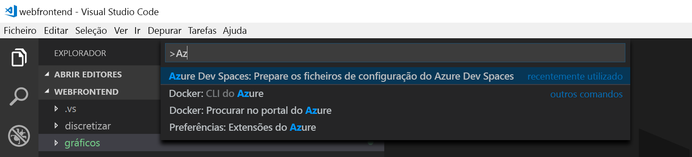

# <a name="quickstart-debug-and-iterate-on-kubernetes-with-visual-studio-code-and-java---azure-dev-spaces"></a>Início rápido: Depurar e iterar em kubernetes com Visual Studio Code e Java-Azure Dev Spaces

Neste arranque rápido, você configura os Espaços Azure Dev com um cluster Kubernetes gerido, e usa uma aplicação Java em Visual Studio Code para desenvolver iterativamente código de depuração em recipientes. A Azure Dev Spaces permite-lhe depurar e testar todos os componentes da sua aplicação no Serviço Azure Kubernetes (AKS) com a configuração mínima da máquina de desenvolvimento. 

## <a name="prerequisites"></a>Pré-requisitos

- Uma conta Azure com uma subscrição ativa. [Crie uma conta gratuitamente.](https://azure.microsoft.com/free/?ref=microsoft.com&utm_source=microsoft.com&utm_medium=docs&utm_campaign=visualstudio) 
- Kit de [Desenvolvimento Java (JDK) 1.8.0+](https://aka.ms/azure-jdks).
- [Maven 3.5.0+](https://maven.apache.org/download.cgi).
- [Visual Studio Code](https://code.visualstudio.com/download).
- Os [Espaços Azure Dev](https://marketplace.visualstudio.com/items?itemName=azuredevspaces.azds) e [Java Debugger para Azure Dev Spaces](https://marketplace.visualstudio.com/items?itemName=vscjava.vscode-java-debugger-azds) extensões para Visual Studio Code.
- [CLI do Azure](/cli/azure/install-azure-cli?view=azure-cli-latest).
- [Git](https://www.git-scm.com/downloads).

## <a name="create-an-azure-kubernetes-service-cluster"></a>Criar um cluster do serviço kubernetes do Azure

Você precisa criar um cluster AKS em uma [região com suporte][supported-regions]. Os seguintes comandos criam um grupo de recursos chamado *MyResourceGroup* e um cluster AKS chamado *MyAKS*.

```cmd
az group create --name MyResourceGroup --location eastus
az aks create -g MyResourceGroup -n MyAKS --location eastus --disable-rbac --generate-ssh-keys
```

## <a name="enable-azure-dev-spaces-on-your-aks-cluster"></a>Habilitar Azure Dev Spaces em seu cluster AKS

Use o comando `use-dev-spaces` para habilitar espaços de desenvolvimento em seu cluster AKS e siga os prompts. O seguinte comando permite a Dev Spaces no cluster *MyAKS* no grupo *MyResourceGroup* e cria um espaço de v *padrão.*

> [!NOTE]
> O comando `use-dev-spaces` também instalará a CLI do Azure Dev Spaces, se ainda não estiver instalada. Não é possível instalar o Azure Dev Spaces CLI na Casca de Nuvem Azure.

```cmd
$ az aks use-dev-spaces -g MyResourceGroup -n MyAKS


'An Azure Dev Spaces Controller' will be created that targets resource 'MyAKS' in resource group 'MyResourceGroup'. Continue? (y/N): y

Creating and selecting Azure Dev Spaces Controller 'MyAKS' in resource group 'MyResourceGroup' that targets resource 'MyAKS' in resource group 'MyResourceGroup'...2m 24s

Select a dev space or Kubernetes namespace to use as a dev space.
 [1] default
Type a number or a new name: 1

Kubernetes namespace 'default' will be configured as a dev space. This will enable Azure Dev Spaces instrumentation for new workloads in the namespace. Continue? (Y/n): Y

Configuring and selecting dev space 'default'...3s

Managed Kubernetes cluster 'MyAKS' in resource group 'MyResourceGroup' is ready for development in dev space 'default'. Type `azds prep` to prepare a source directory for use with Azure Dev Spaces and `azds up` to run.
```

## <a name="get-sample-application-code"></a>Obter código do aplicativo de exemplo

Neste artigo, você usa o [Azure dev Spaces aplicativo de exemplo](https://github.com/Azure/dev-spaces) para demonstrar o uso de Azure dev Spaces.

Clone o aplicativo do GitHub.

```cmd
git clone https://github.com/Azure/dev-spaces
```

## <a name="prepare-the-sample-application-in-visual-studio-code"></a>Preparar o aplicativo de exemplo no Visual Studio Code

Open Visual Studio Code, selecione **File** em **seguida, Abra,** navegue para o *dev-spaces/samples/java/getting-start/webfrontend* diretório, e selecione **Open**.

Agora você tem o projeto de *WebFrontEnd* aberto no Visual Studio Code. Para executar o aplicativo em seu espaço de desenvolvimento, gere os ativos do gráfico do Docker e do Helm usando a extensão Azure Dev Spaces na paleta de comandos.

Para abrir a Paleta de Comando no Código do Estúdio Visual, selecione **Ver** e ntão **Paleta de Comando**. Comece a digitar `Azure Dev Spaces` e **selecione Espaços Azure Dev: Prepare ficheiros de configuração para espaços Azure Dev**.



Quando Visual Studio Code também solicita que você configure suas imagens base, porta exposta e ponto de extremidade público, escolha `Azul Zulu OpenJDK for Azure (Free LTS)` para a imagem base, `8080` para a porta exposta e `Yes` para habilitar um ponto de extremidade público.


Este comando prepara seu projeto para ser executado no Azure Dev Spaces gerando um gráfico Dockerfile e Helm. Ele também gera um diretório *. vscode* com a configuração de depuração na raiz do seu projeto.

> [!TIP]
> O [gráfico Dockerfile e Helm](how-dev-spaces-works.md#prepare-your-code) para o seu projeto é usado pela Azure Dev Spaces para construir e executar o seu código, mas pode modificar estes ficheiros se quiser alterar a forma como o projeto é construído e executado.

## <a name="build-and-run-code-in-kubernetes-from-visual-studio-code"></a>Compilar e executar código no kubernetes da Visual Studio Code

Selecione o ícone **Debug** à esquerda e selecione **Launch Java Program (AZDS)** na parte superior.


Esse comando cria e executa seu serviço no Azure Dev Spaces. A janela do **terminal** na parte inferior mostra a saída da compilação e as URLs para o serviço que está executando Azure dev Spaces. O **console de depuração** mostra a saída do log.

> [!Note]
> Se você não vir nenhum comando Azure Dev Spaces na **paleta de comandos**, certifique-se de ter instalado a [extensão de Visual Studio Code para Azure dev Spaces](https://marketplace.visualstudio.com/items?itemName=azuredevspaces.azds). Verifique também se você abriu o diretório *dev-Spaces/samples/java/guia de introdução/WebFrontEnd* no Visual Studio Code.

Você pode ver o serviço em execução abrindo a URL pública.

Selecione **Debug** e, em seguida, **pare de depuração** para parar o debugger.

## <a name="update-code"></a>Atualizar código

Para implantar uma versão atualizada do serviço, você pode atualizar qualquer arquivo em seu projeto e executar novamente o **programa Java de inicialização (AZDS)** . Por exemplo:

1. Se a sua aplicação ainda estiver em funcionamento, selecione **Debug** e, em seguida, **pare de depuração** para o impedir.
1. Atualize a [linha 19 em `src/main/java/com/ms/sample/webfrontend/Application.java`](https://github.com/Azure/dev-spaces/blob/master/samples/java/getting-started/webfrontend/src/main/java/com/ms/sample/webfrontend/Application.java#L19) para:
    
    ```java
    return "Hello from webfrontend in Azure!";
    ```

1. Guarde as alterações.
1. Execute novamente o **programa Java de inicialização (AZDS)** .
1. Navegue até o serviço em execução e observe as alterações.
1. Selecione **Debug** e, em seguida, **pare de depuração** para parar a sua aplicação.

## <a name="setting-and-using-breakpoints-for-debugging"></a>Configurando e usando pontos de interrupção para depuração

Inicie o serviço usando **Iniciar programa Java (AZDS)** . Isso também executa o serviço no modo de depuração.

Navegue de volta à vista **Explorer** selecionando **Vista** e **explorer**. Abra *o src/main/java/java/com/ms/sample/webfrontend/Application.java* e clique em algum lugar na linha 19 para colocar o cursor lá. Para definir um ponto de rutura, prima **F9** ou selecione **Debug** e, em seguida, **Toggle Breakpoint**.

Abra seu serviço em um navegador e observe que nenhuma mensagem é exibida. Retorne para Visual Studio Code e observe que a linha 19 está realçada. O ponto de interrupção que você definiu pausou o serviço na linha 19. Para retomar o serviço, prima **F5** ou selecione **Debug** **e,** em seguida, Continue . Retorne ao seu navegador e observe que a mensagem agora é exibida.

Ao executar o serviço no kubernetes com um depurador anexado, você tem acesso completo para depurar informações como a pilha de chamadas, variáveis locais e informações de exceção.

Retire o ponto de rutura colocando o cursor na linha 19 na *linha sRC/main/java/com/ms/sample/webfrontend/Application.java* e pressionando **F9**.

## <a name="update-code-from-visual-studio-code"></a>Atualizar código de Visual Studio Code

Enquanto o serviço estiver em execução no modo de depuração, atualize a linha 19 no *src/main/java/com/ms/sample/webfrontend/Application.java*. Por exemplo:
```java
return "Hello from webfrontend in Azure while debugging!";
```

Guarde o ficheiro. Selecione **Debug** e, em seguida, **reiniciar depuração** ou na barra de **ferramentas Debug,** selecione o botão **Restart Debugging.**


Abra seu serviço em um navegador e observe que a mensagem atualizada é exibida.

Em vez de recompilar e reimplantar uma nova imagem de contêiner cada vez que são feitas edições de código, Azure Dev Spaces recompila incrementalmente o código dentro do contêiner existente para fornecer um loop de edição/depuração mais rápido.

## <a name="clean-up-your-azure-resources"></a>Limpar os recursos do Azure

```cmd
az group delete --name MyResourceGroup --yes --no-wait
```

## <a name="next-steps"></a>Passos seguintes

Saiba como Azure Dev Spaces ajuda a desenvolver aplicativos mais complexos em vários contêineres e como você pode simplificar o desenvolvimento colaborativo trabalhando com diferentes versões ou branches do seu código em espaços diferentes.

> [!div class="nextstepaction"]
> [Working with multiple containers and team development](multi-service-java.md) (Trabalhar com vários contentores e o desenvolvimento em equipa)


[supported-regions]: https://azure.microsoft.com/global-infrastructure/services/?products=kubernetes-service
