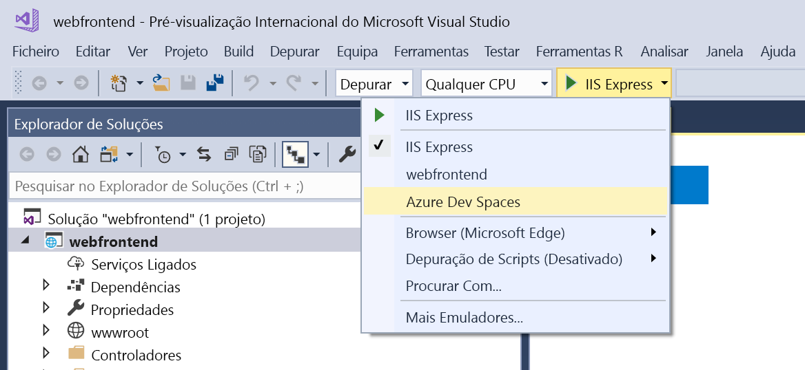
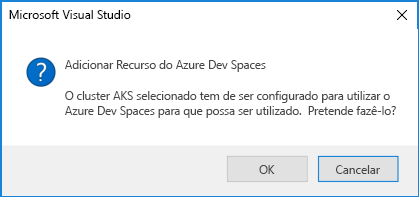

# <a name="quickstart-develop-with-net-core-on-kubernetes-with-azure-dev-spaces-visual-studio-2017"></a>Início rápido: Programar com .NET Core no Kubernetes com os espaços de desenvolvimento do Azure (Visual Studio 2017)

Neste guia, vai aprender a:

- Configurar os Espaços de Programador do Azure com um cluster Kubernetes gerido no Azure.
- Iterativamente desenvolva o código em contentores com o Visual Studio 2017.
- Depure código em execução no seu cluster com o Visual Studio 2017.

## <a name="prerequisites"></a>Pré-requisitos

- Uma subscrição do Azure. Se não tiver uma, poderá [criar uma conta gratuita](https://azure.microsoft.com/free).
- Visual Studio 2017, no Windows com a carga de trabalho de desenvolvimento para a Web instalada. Se não a tiver instalado, transfira-a [aqui](https://aka.ms/vsdownload?utm_source=mscom&utm_campaign=msdocs).
- [O Visual Studio Tools para o Kubernetes](https://aka.ms/get-vsk8stools) instalado.

## <a name="create-an-azure-kubernetes-service-cluster"></a>Criar um cluster do Azure Kubernetes Service

Tem de criar um cluster do AKS numa [suportada região](https://docs.microsoft.com/azure/dev-spaces/#a-rapid,-iterative-kubernetes-development-experience-for-teams). Para criar um cluster:

1. Inicie sessão no [portal do Azure](https://portal.azure.com)
1. Selecione *+ criar um recurso > serviço do Kubernetes*. 
1. Introduza o _subscrição_, _grupo de recursos_, _nome do cluster de Kubernetes_, _região_, _deversãodoKubernetes_, e _prefixo de nome DNS_.

    

1. Clique em *Rever + criar*.
1. Clique em *Criar*.

## <a name="enable-azure-dev-spaces-on-your-aks-cluster"></a>Ativar os espaços de desenvolvimento do Azure no seu cluster do AKS

Navegue para o seu cluster do AKS no portal do Azure e clique em *Dev espaços*. Alteração *ativar espaços de desenvolvimento* ao *Sim* e clique em *guardar*.


## <a name="create-a-new-aspnet-web-app"></a>Criar uma nova aplicação web ASP.NET

1. Abra o Visual Studio 2017.
1. Criar um projeto novo.
1. Escolher *aplicação Web ASP.NET Core* e dê o nome do projeto *webfrontend*.
1. Clique em *OK*.
1. Quando lhe for pedido, escolha *aplicação Web (Model-View-Controller)* para o modelo.
1. Selecione *.NET Core* e *ASP.NET Core 2.0* na parte superior.
1. Clique em *OK*.

## <a name="connect-your-project-to-your-dev-space"></a>Ligue o seu projeto para o seu espaço de desenvolvimento

No seu projeto, selecione **do Azure Dev espaços** na lista pendente lançamento definições conforme mostrado abaixo.



Na caixa de diálogo espaços de desenvolvimento do Azure, selecione seu *subscrição* e *Cluster de Kubernetes do Azure*. Deixe *espaço* definida como *predefinição* e ativar o *acessível publicamente* caixa de verificação. Clique em *OK*.


Este processo implementa o seu serviço para o *predefinição* espaço de desenvolvimento com um URL acessível publicamente. Se optar por um cluster que não tenha sido configurado para funcionar com Azure Dev Spaces, verá uma mensagem a perguntar se pretende configurá-lo. Clique em *OK*.



O URL público para o serviço em execução *predefinição* espaço de desenvolvimento é apresentado na *saída* janela:

```cmd
Starting warmup for project 'webfrontend'.
Waiting for namespace to be provisioned.
Using dev space 'default' with target 'MyAKS'
...
Successfully built 1234567890ab
Successfully tagged webfrontend:devspaces-11122233344455566
Built container image in 39s
Waiting for container...
36s

Service 'webfrontend' port 'http' is available at http://webfrontend.1234567890abcdef1234.eus.azds.io/
Service 'webfrontend' port 80 (http) is available at http://localhost:62266
Completed warmup for project 'webfrontend' in 125 seconds.
```

No exemplo acima, é o URL público http://webfrontend.1234567890abcdef1234.eus.azds.io/. Navegue para o URL público do seu serviço e interagir com o serviço em execução no seu espaço de desenvolvimento.

## <a name="update-code"></a>Atualizar código

Se o Visual Studio 2017 ainda está ligado ao seu espaço de desenvolvimento, clique no botão Parar. Altere a linha 20 no `Controllers/HomeController.cs` para:
    
```csharp
ViewData["Message"] = "Your application description page in Azure.";
```

Guardar as alterações e começar a utilizar o serviço **do Azure Dev espaços** na lista pendente de definições de lançamento. Abra o URL público do seu serviço num navegador e clique em *sobre*. Observe que é apresentada a mensagem atualizada.

Em vez de reconstruir e Reimplementar uma nova imagem de contentor sempre que o código edições são feitas, espaços de desenvolvimento do Azure de forma incremental as recompilações código dentro do contentor existente para fornecer um loop de editar/depuração mais rápido.

## <a name="setting-and-using-breakpoints-for-debugging"></a>Configuração e seu uso de pontos de interrupção para depuração

Se o Visual Studio 2017 ainda está ligado ao seu espaço de desenvolvimento, clique no botão Parar. Abra `Controllers/HomeController.cs` e clique em algum lugar na linha 20 para colocar o cursor aqui. Para definir um ponto de interrupção atingido *F9* ou clique em *depurar* , em seguida, *Ativar/desativar ponto de interrupção*. Para iniciar o serviço no modo de depuração no seu espaço de desenvolvimento, pressionar *F5* ou clique em *depurar* , em seguida, *iniciar depuração*.

Abra o serviço num navegador e que nenhuma mensagem será exibida. Regresse ao Visual Studio 2017 e observe a linha 20 é realçada. Definir o ponto de interrupção foi colocado em pausa o serviço na linha 20. Para retomar o serviço, pressionar *F5* ou clique em *depurar* , em seguida, *continuar*. Regresse ao seu navegador e tenha em atenção que agora é apresentada a mensagem.

Enquanto executa o seu serviço no Kubernetes com um depurador anexado, tem acesso total ao depurar informações como a pilha de chamadas, variáveis locais e informações de exceção.

Remover o ponto de interrupção ao colocar o cursor na linha 20 `Controllers/HomeController.cs` e pressionando *F9*.

## <a name="clean-up-your-azure-resources"></a>Limpar os recursos do Azure

Navegue para o grupo de recursos no portal do Azure e clique em *eliminar grupo de recursos*. Em alternativa, pode utilizar o [eliminar az aks](/cli/azure/aks#az-aks-delete) comando:

```cmd
az group delete --name MyResourceGroup --yes --no-wait
```

## <a name="next-steps"></a>Passos Seguintes

> [!div class="nextstepaction"]
> [Working with multiple containers and team development](multi-service-netcore-visualstudio.md) (Trabalhar com vários contentores e o desenvolvimento em equipa)
