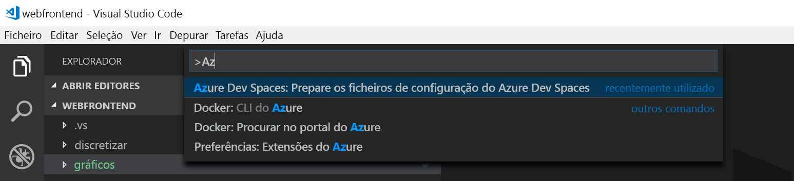
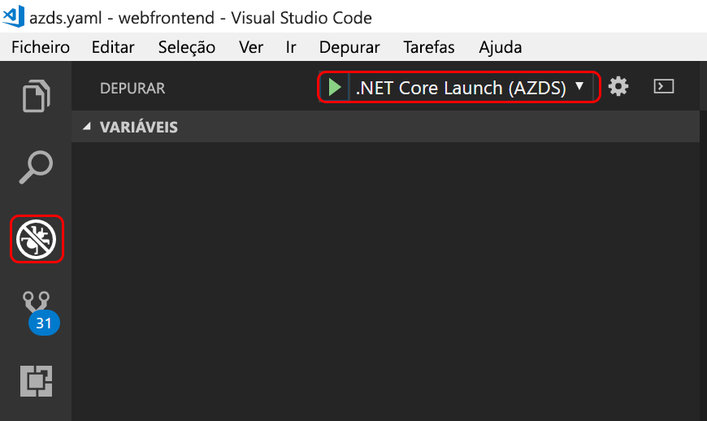

# <a name="quickstart-develop-with-net-core-on-kubernetes-using-azure-dev-spaces-visual-studio-code"></a>Início rápido: Programar com .NET Core no Kubernetes com espaços de desenvolvimento do Azure (Visual Studio Code)

Neste guia, vai aprender a:

- Configurar os Espaços de Programador do Azure com um cluster Kubernetes gerido no Azure.
- Desenvolva iterativamente código em contentores através do Visual Studio Code e a linha de comandos.
- Depure o código no seu espaço de desenvolvimento do Visual Studio Code.

## <a name="prerequisites"></a>Pré-requisitos

- Uma subscrição do Azure. Se não tiver uma, poderá [criar uma conta gratuita](https://azure.microsoft.com/free).
- [Visual Studio Code instalado](https://code.visualstudio.com/download).
- O [do Azure Dev espaços](https://marketplace.visualstudio.com/items?itemName=azuredevspaces.azds) e [ C# ](https://marketplace.visualstudio.com/items?itemName=ms-vscode.csharp) extensões para Visual Studio Code instalado.
- A [CLI do Azure instalada](/cli/azure/install-azure-cli?view=azure-cli-latest).

## <a name="create-an-azure-kubernetes-service-cluster"></a>Criar um cluster do Azure Kubernetes Service

Tem de criar um cluster do AKS numa [suportada região](https://docs.microsoft.com/azure/dev-spaces/#a-rapid,-iterative-kubernetes-development-experience-for-teams). Os comandos abaixo, crie um grupo de recursos chamado *MyResourceGroup* e um cluster do AKS chamado *MyAKS*.

```cmd
az group create --name MyResourceGroup --location eastus
az aks create -g MyResourceGroup -n MyAKS --location eastus --node-count 1 --generate-ssh-keys
```

## <a name="enable-azure-dev-spaces-on-your-aks-cluster"></a>Ativar os espaços de desenvolvimento do Azure no seu cluster do AKS

Utilize o `use-dev-spaces` comando para ativar os espaços de desenvolvimento no seu cluster do AKS e siga as instruções. O comando abaixo permite que os espaços de desenvolvimento no *MyAKS* cluster no *MyResourceGroup* agrupar e cria um *padrão* espaço de desenvolvimento.

```cmd
$ az aks use-dev-spaces -g MyResourceGroup -n MyAKS

'An Azure Dev Spaces Controller' will be created that targets resource 'MyAKS' in resource group 'MyResourceGroup'. Continue? (y/N): y

Creating and selecting Azure Dev Spaces Controller 'MyAKS' in resource group 'MyResourceGroup' that targets resource 'MyAKS' in resource group 'MyResourceGroup'...2m 24s

Select a dev space or Kubernetes namespace to use as a dev space.
 [1] default
Type a number or a new name: 1

Kubernetes namespace 'default' will be configured as a dev space. This will enable Azure Dev Spaces instrumentation for new workloads in the namespace. Continue? (Y/n): Y

Configuring and selecting dev space 'default'...3s

Managed Kubernetes cluster 'MyAKS' in resource group 'MyResourceGroup' is ready for development in dev space 'default'. Type `azds prep` to prepare a source directory for use with Azure Dev Spaces and `azds up` to run.
```

## <a name="get-sample-application-code"></a>Obter o código de aplicativo de exemplo

Neste artigo, vai utilizar o [aplicação de exemplo do Azure Dev espaços](https://github.com/Azure/dev-spaces) para demonstrar a utilização de espaços de desenvolvimento do Azure.

Clonar a aplicação a partir do GitHub e navegue para o *dev-espaços/exemplos/dotnetcore/obter-iniciada/webfrontend* diretório:

```cmd
git clone https://github.com/Azure/dev-spaces
cd dev-spaces/samples/dotnetcore/getting-started/webfrontend
```

## <a name="prepare-the-application"></a>Para preparar a aplicação

Gerar os ativos de gráfico do Docker e o Helm para executar a aplicação no Kubernetes com o `azds prep` comando:

```cmd
azds prep --public
```

Tem de executar o `prep` comando a partir do *dev-espaços/exemplos/dotnetcore/obter-iniciada/webfrontend* diretório ao gerar corretamente os ativos de gráfico do Docker e o Helm.

## <a name="build-and-run-code-in-kubernetes"></a>Criar e executar códigos no Kubernetes

Criar e executar seu código no AKS com o `azds up` comando:

```cmd
$ azds up
Synchronizing files...4s
Using dev space 'default' with target 'MyAKS'
Installing Helm chart...2s
Waiting for container image build...1m 43s
Building container image...
Step 1/12 : FROM microsoft/dotnet:2.2-sdk
Step 2/12 : ARG BUILD_CONFIGURATION=Debug
Step 3/12 : ENV ASPNETCORE_ENVIRONMENT=Development
Step 4/12 : ENV DOTNET_USE_POLLING_FILE_WATCHER=true
Step 5/12 : EXPOSE 80
Step 6/12 : WORKDIR /src
Step 7/12 : COPY ["webfrontend.csproj", "./"]
Step 8/12 : RUN dotnet restore "webfrontend.csproj"
Step 9/12 : COPY . .
Step 10/12 : RUN dotnet build --no-restore -c $BUILD_CONFIGURATION
Step 11/12 : RUN echo "exec dotnet run --no-build --no-launch-profile -c $BUILD_CONFIGURATION -- \"\$@\"" > /entrypoint.sh
Step 12/12 : ENTRYPOINT ["/bin/bash", "/entrypoint.sh"]
Built container image in 3m 44s
Waiting for container...13s
Service 'webfrontend' port 'http' is available at http://webfrontend.1234567890abcdef1234.eus.azds.io/
Service 'webfrontend' port 80 (http) is available at http://localhost:54256
...
```

Pode ver o serviço em execução, abrindo a URL pública, o que é apresentada no resultado do `azds up` comando. Neste exemplo, é o URL público *http://webfrontend.1234567890abcdef1234.eus.azds.io/*.

Se parar a `azds up` através de comandos *Ctrl + c*, o serviço continua em execução no AKS e público URL permanecerão disponível.

## <a name="update-code"></a>Atualizar código

Para implementar uma versão atualizada do seu serviço, pode atualizar qualquer arquivo em seu projeto e execute novamente o `azds up` comando. Por exemplo:

1. Se `azds up` ainda está em execução, prima *Ctrl + c*.
1. Atualização [linha 20 no `Controllers/HomeController.cs` ](https://github.com/Azure/dev-spaces/blob/master/samples/dotnetcore/getting-started/webfrontend/Controllers/HomeController.cs#L20) para:
    
    ```csharp
    ViewData["Message"] = "Your application description page in Azure.";
    ```

1. Guarde as alterações.
1. Volte a executar o `azds up` comando:

    ```cmd
    $ azds up
    Using dev space 'default' with target 'MyAKS'
    Synchronizing files...1s
    Installing Helm chart...3s
    Waiting for container image build...
    ...    
    ```

1. Navegue para o serviço em execução e clique em *sobre*.
1. Observe as alterações.
1. Prima *Ctrl + c* para parar o `azds up` comando.

## <a name="enable-visual-studio-code-to-debug-in-kubernetes"></a>Ativar o Visual Studio Code para depurar no Kubernetes

Abra o Visual Studio Code, clique em *arquivo* , em seguida, *abra...* , navegue para o *dev-espaços/exemplos/dotnetcore/obter-iniciada/webfrontend* diretório e clique em *aberto*.

Agora tem o *webfrontend* projeto aberto no Visual Studio Code, que é o mesmo serviço que foi executada com o `azds up` comando. Para este serviço no AKS com o Visual Studio Code, em vez do uso de depurar `azds up` diretamente, tem de preparar este projeto para utilizar o Visual Studio Code para comunicar com o seu espaço de desenvolvimento.

Para abrir a paleta de comandos no Visual Studio Code, clique em *View* , em seguida, *paleta de comandos*. Comece a escrever `Azure Dev Spaces` e clique em `Azure Dev Spaces: Prepare configuration files for Azure Dev Spaces`.



Esse comando Prepare seu projeto para executar nos espaços de desenvolvimento do Azure diretamente a partir do Visual Studio Code. Ele também gera uma *.vscode* diretório com a depuração de configuração na raiz do seu projeto.

## <a name="build-and-run-code-in-kubernetes-from-visual-studio"></a>Criar e executar o código no Kubernetes a partir do Visual Studio

Clique nas *depurar* ícone à esquerda e clique em *.NET Core iniciar (AZDS)* na parte superior.



Este comando é compilada e executada o seu serviço nos espaços de desenvolvimento do Azure no modo de depuração. O *Terminal* janela na parte inferior mostra os URLs e de saída da compilação para o seu serviço com espaços de desenvolvimento do Azure. O *consola de depuração* mostra a saída de registo.

> [!Note]
> Se não vir quaisquer comandos de espaços de desenvolvimento do Azure no *paleta de comandos*, certifique-se de que instalou o [extensão do Visual Studio Code para espaços de desenvolvimento do Azure](https://marketplace.visualstudio.com/items?itemName=azuredevspaces.azds). Verifique também se tiver aberto o *dev-espaços/exemplos/dotnetcore/obter-iniciada/webfrontend* diretório no Visual Studio Code.

## <a name="setting-and-using-breakpoints-for-debugging"></a>Configuração e seu uso de pontos de interrupção para depuração

Inicie o serviço no usando o modo de depuração *.NET Core iniciar (AZDS)*.

Navegue de volta para o *Explorer* vista clicando *vista* , em seguida, *Explorer*. Abra `Controllers/HomeController.cs` e clique em algum lugar na linha 20 para colocar o cursor aqui. Para definir um ponto de interrupção atingido *F9* ou clique em *depurar* , em seguida, *Ativar/desativar ponto de interrupção*.

Abra o serviço num navegador e que nenhuma mensagem será exibida. Regresse ao Visual Studio Code e observe a linha 20 é realçada. Definir o ponto de interrupção foi colocado em pausa o serviço na linha 20. Para retomar o serviço, pressionar *F5* ou clique em *depurar* , em seguida, *continuar*. Regresse ao seu navegador e tenha em atenção que agora é apresentada a mensagem.

Enquanto executa o seu serviço no Kubernetes com um depurador anexado, tem acesso total ao depurar informações como a pilha de chamadas, variáveis locais e informações de exceção.

Remover o ponto de interrupção ao colocar o cursor na linha 20 `Controllers/HomeController.cs` e pressionando *F9*.

## <a name="update-code-from-visual-studio-code"></a>Atualizar o código do Visual Studio Code

Enquanto o serviço está em execução no modo de depuração, atualizar linha 20 no `Controllers/HomeController.cs`. Por exemplo:

```csharp
ViewData["Message"] = "Your application description page in Azure while debugging!";
```

Guarde o ficheiro. Clique em *depurar* , em seguida, *reiniciar depuração* ou no *barra de ferramentas de depuração*, clique no *reiniciar depuração* botão.


Abra o serviço num navegador e que a sua mensagem atualizada é exibida.

Em vez de reconstruir e Reimplementar uma nova imagem de contentor sempre que o código edições são feitas, espaços de desenvolvimento do Azure de forma incremental as recompilações código dentro do contentor existente para fornecer um loop de editar/depuração mais rápido.

## <a name="clean-up-your-azure-resources"></a>Limpar os recursos do Azure

```cmd
az group delete --name MyResourceGroup --yes --no-wait
```

## <a name="next-steps"></a>Passos Seguintes

Saiba como os espaços de desenvolvimento do Azure ajuda-o a desenvolver aplicativos mais complexos em vários contentores, e como pode simplificar o desenvolvimento colaborativo, trabalhando com diferentes versões ou ramos do seu código em diferentes espaços. 

> [!div class="nextstepaction"]
> [Working with multiple containers and team development](multi-service-netcore.md) (Trabalhar com vários contentores e o desenvolvimento em equipa)
