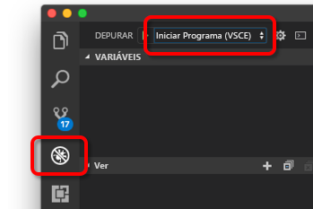

# <a name="quickstart-debug-and-iterate-on-kubernetes-with-visual-studio-code-and-nodejs---azure-dev-spaces"></a>Quickstart: Debug e iterate em Kubernetes com Visual Studio Code e Node.js - Azure Dev Spaces

Neste arranque rápido, você configura os Espaços Azure Dev com um cluster Kubernetes gerido, e usa uma aplicação Node.js em Visual Studio Code para desenvolver iterativamente código de depuração em recipientes. A Azure Dev Spaces permite-lhe depurar e testar todos os componentes da sua aplicação no Serviço Azure Kubernetes (AKS) com a configuração mínima da máquina de desenvolvimento. 

## <a name="prerequisites"></a>Pré-requisitos

- Uma conta Azure com uma subscrição ativa. [Crie uma conta gratuitamente.](https://azure.microsoft.com/free/?ref=microsoft.com&utm_source=microsoft.com&utm_medium=docs&utm_campaign=visualstudio) 
- [Versão mais recente do Node.js.](https://nodejs.org/download/)
- [Visual Studio Code](https://code.visualstudio.com/download).
- A extensão [Azure Dev Spaces](https://marketplace.visualstudio.com/items?itemName=azuredevspaces.azds) para Visual Studio Code.
- [CLI do Azure](/cli/azure/install-azure-cli?view=azure-cli-latest).
- [Git](https://www.git-scm.com/downloads).

## <a name="create-an-azure-kubernetes-service-cluster"></a>Criar um cluster de serviço Azure Kubernetes

É preciso criar um aglomerado AKS numa [região apoiada.][supported-regions] Os seguintes comandos criam um grupo de recursos chamado *MyResourceGroup* e um cluster AKS chamado *MyAKS*.

```azurecli
az group create --name MyResourceGroup --location eastus
az aks create -g MyResourceGroup -n MyAKS --location eastus --generate-ssh-keys
```

## <a name="enable-azure-dev-spaces-on-your-aks-cluster"></a>Enable Azure Dev Spaces no seu cluster AKS

Utilize o comando `use-dev-spaces` para ativar os Espaços Dev no seu cluster AKS e seguir as instruções. O seguinte comando permite a Dev Spaces no cluster *MyAKS* no grupo *MyResourceGroup* e cria um espaço de v *padrão.*

> [!NOTE]
> O comando `use-dev-spaces` também instalará o Azure Dev Spaces CLI se ainda não estiver instalado. Não é possível instalar o Azure Dev Spaces CLI na Casca de Nuvem Azure.

```azurecli
az aks use-dev-spaces -g MyResourceGroup -n MyAKS
```

```output
'An Azure Dev Spaces Controller' will be created that targets resource 'MyAKS' in resource group 'MyResourceGroup'. Continue? (y/N): y

Creating and selecting Azure Dev Spaces Controller 'MyAKS' in resource group 'MyResourceGroup' that targets resource 'MyAKS' in resource group 'MyResourceGroup'...2m 24s

Select a dev space or Kubernetes namespace to use as a dev space.
 [1] default
Type a number or a new name: 1

Kubernetes namespace 'default' will be configured as a dev space. This will enable Azure Dev Spaces instrumentation for new workloads in the namespace. Continue? (Y/n): Y

Configuring and selecting dev space 'default'...3s

Managed Kubernetes cluster 'MyAKS' in resource group 'MyResourceGroup' is ready for development in dev space 'default'. Type `azds prep` to prepare a source directory for use with Azure Dev Spaces and `azds up` to run.
```

## <a name="get-sample-application-code"></a>Obter código de aplicação de amostra

Neste artigo, utiliza a aplicação de amostra seleção [Azure Dev Spaces](https://github.com/Azure/dev-spaces) para demonstrar a utilização de Espaços Azure Dev.

Clone a aplicação do GitHub.

```cmd
git clone https://github.com/Azure/dev-spaces
```

## <a name="prepare-the-sample-application-in-visual-studio-code"></a>Prepare a aplicação da amostra no Código do Estúdio Visual

Open Visual Studio Code, selecione **File** em **seguida, Abra,** navegue para os *espaços de v/amostras/nodejs/iniciar/webfrontend* diretório, e selecione **Open**.

Tem agora o projeto *webfrontend* aberto no Código do Estúdio Visual. Para executar a aplicação no seu espaço de v, gere os ativos da tabela Docker e Helm utilizando a extensão dos Espaços Azure Dev na Paleta de Comando.

Para abrir a Paleta de Comando no Código do Estúdio Visual, selecione **Ver** e ntão **Paleta de Comando**. Comece a digitar `Azure Dev Spaces` e **selecione Espaços Azure Dev: Prepare ficheiros de configuração para espaços Azure Dev**.


Quando o Visual Studio Code também o incita a configurar o seu ponto final público, escolha `Yes` para ativar um ponto final público.


Este comando prepara o seu projeto para funcionar em Espaços Azure Dev gerando um gráfico de Dockerfile e Helm. Também gera um diretório *.vscode* com configuração de depuração na raiz do seu projeto.

> [!TIP]
> O [gráfico Dockerfile e Helm](how-dev-spaces-works.md#prepare-your-code) para o seu projeto é usado pela Azure Dev Spaces para construir e executar o seu código, mas pode modificar estes ficheiros se quiser alterar a forma como o projeto é construído e executado.

## <a name="build-and-run-code-in-kubernetes-from-visual-studio-code"></a>Construir e executar código em Kubernetes do Visual Studio Code

Selecione o ícone **Debug** à esquerda e selecione **Launch Server (AZDS)** na parte superior.



Este comando constrói e executa o seu serviço em Espaços Azure Dev. A janela **terminal** na parte inferior mostra a saída de construção e URLs para o seu serviço funcionando os Espaços Azure Dev. A **Consola Debug** mostra a saída de registo.

> [!Note]
> Se não vir nenhum comando da Azure Dev Spaces na Paleta de **Comando,** certifique-se de ter instalado a extensão do Código do [Estúdio Visual para espaços Azure Dev](https://marketplace.visualstudio.com/items?itemName=azuredevspaces.azds). Verifique também que abriu o *dev-spaces/samples/nodejs/start-start/webfrontend* diretório no Visual Studio Code.

Pode ver o serviço a funcionar abrindo o URL público.

Selecione **Debug** e, em seguida, **pare de depuração** para parar o debugger.

## <a name="update-code"></a>Atualizar código

Para implementar uma versão atualizada do seu serviço, pode atualizar qualquer ficheiro no seu projeto e reexecutar o **Launch Server**. Por exemplo:

1. Se a sua aplicação ainda estiver em funcionamento, selecione **Debug** e, em seguida, **pare de depuração** para o impedir.
1. Atualizar [a linha 13 em `server.js`:](https://github.com/Azure/dev-spaces/blob/master/samples/nodejs/getting-started/webfrontend/server.js#L13)
    
    ```javascript
        res.send('Hello from webfrontend in Azure');
    ```

1. Guarde as alterações.
1. Reexecutar **o servidor**de lançamento .
1. Navegue para o seu serviço de funcionamento e observe as suas alterações.
1. Selecione **Debug** e, em seguida, **pare de depuração** para parar a sua aplicação.

## <a name="setting-and-using-breakpoints-for-debugging"></a>Definição e utilização de pontos de rutura para depuração

Inicie o seu serviço utilizando o Servidor de **Lançamento (AZDS)** .

Navegue de volta à vista Explorer selecionando **Vista** e **explorer**. Abra *o servidor.js* e clique em algum lugar na linha 13 para colocar o cursor lá. Para definir um ponto de rutura, prima **F9** ou selecione **Debug** e, em seguida, **Toggle Breakpoint**.

Abra o seu serviço num browser e note que não é apresentada nenhuma mensagem. O regresso ao Código do Estúdio Visual e a linha 13 de observação estão em destaque. O ponto de rutura que definiu fez uma pausa no serviço na linha 13. Para retomar o serviço, prima **F5** ou selecione **Debug** **e,** em seguida, Continue . Volte ao seu navegador e note que a mensagem está agora apresentada.

Enquanto executa o seu serviço em Kubernetes com um debugger anexado, você tem acesso total a informações dedepuração tais como a pilha de chamadas, variáveis locais e informações de exceção.

Retire o ponto de rutura colocando o cursor na linha 13 no *servidor.js* e pressionando **F9**.

Selecione **Debug** e, em seguida, **pare de depuração** para parar o debugger.

## <a name="update-code-from-visual-studio-code"></a>Código de atualização do Código do Estúdio Visual

Altere o modo de depuração para **ligar a um Servidor (AZDS)** e inicie o serviço:


Este comando constrói e executa o seu serviço em Espaços Azure Dev. Também inicia um processo [de nodemon](https://nodemon.io) no recipiente do seu serviço e anexa o Código VS ao mesmo. O processo *nodemon* permite reiniciar automaticamente quando são feitas alterações de código fonte, permitindo um desenvolvimento mais rápido do loop interno semelhante ao desenvolvimento na sua máquina local.

Depois de o serviço começar, navegue para ele usando o seu navegador e interaja com ele.

Enquanto o serviço estiver em execução, volte ao Código VS e atualize a linha 13 no *servidor.js*. Por exemplo:
```javascript
    res.send('Hello from webfrontend in Azure while debugging!');
```

Guarde o ficheiro e volte ao seu serviço num browser. Interaja com o serviço e note que a sua mensagem atualizada é exibida.

Durante a execução *do nodemónio,* o processo do Nó é automaticamente reiniciado assim que quaisquer alterações de código são detetadas. Este processo de reinício automático é semelhante à experiência de edição e reinício do seu serviço na sua máquina local, proporcionando uma experiência de desenvolvimento de loop interior.

## <a name="clean-up-your-azure-resources"></a>Limpe os seus recursos Azure

```azurecli
az group delete --name MyResourceGroup --yes --no-wait
```

## <a name="next-steps"></a>Passos seguintes

Saiba como o Azure Dev Spaces o ajuda a desenvolver aplicações mais complexas em vários recipientes e como pode simplificar o desenvolvimento colaborativo trabalhando com diferentes versões ou ramos do seu código em diferentes espaços.

> [!div class="nextstepaction"]
> [Working with multiple containers and team development](multi-service-nodejs.md) (Trabalhar com vários contentores e o desenvolvimento em equipa)


[supported-regions]: https://azure.microsoft.com/global-infrastructure/services/?products=kubernetes-service
