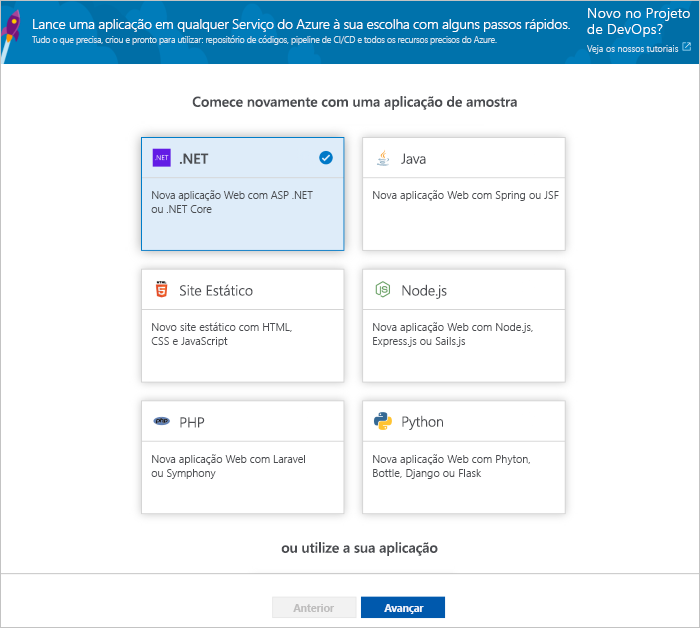

# Criar um pipeline de CI/CD para .NET com Azure DevOps Projects

Configure a CI (integração contínua) e o CD (entrega contínua) para seu aplicativo .NET Core ou ASP.NET com DevOps Projects. Projetos de DevOps simplifica a configuração inicial de um pipeline de compilação e versão nos Pipelines do Azure.

Se não tiver uma subscrição do Azure, pode obter uma subscrição gratuita através do [Visual Studio Dev Essentials](https://visualstudio.microsoft.com/dev-essentials/).

## Iniciar sessão no portal do Azure

Projetos de DevOps cria um pipeline CI/CD no Azure DevOps. Pode criar uma nova organização de DevOps do Azure ou utilizar uma organização existente. Projetos de DevOps também cria os recursos do Azure na subscrição do Azure à sua escolha.

1. Inicie sessão no [Portal do Microsoft Azure](https://portal.azure.com).

1. No painel esquerdo, selecione **criar um recurso** ícone na barra de navegação esquerda e, em seguida, procure **projetos de DevOps**.  

3.  Selecione **Criar**.

    

## Selecione um exemplo de aplicação e serviço do Azure

1. Selecione o exemplo de aplicação **.NET**. Os exemplos de .NET incluem uma escolha da arquitetura de ASP.NET open source ou da arquitetura de .NET Core para várias plataformas.

   

2. Este exemplo corresponde a uma aplicação MVC ASP.NET Core. Selecione a estrutura do aplicativo **.NET Core** e, em seguida, selecione **Avançar**.    
    
3. Selecione **aplicativo Web do Windows** como um destino de implantação e, em seguida, selecione **Avançar**. Opcionalmente, você pode escolher outros serviços do Azure para sua implantação. A estrutura do aplicativo, que você escolheu anteriormente, dita o tipo de destino de implantação do serviço do Azure disponível aqui.

## Configurar o Azure DevOps e uma subscrição do Azure 

1. Insira um **nome de projeto**.

2. Crie uma nova **organização gratuita do Azure DevOps** ou escolha uma organização existente na lista suspensa.

3. Selecione sua **assinatura do Azure**, insira um nome para seu **aplicativo Web** ou use o padrão e, em seguida, selecione **concluído**. Após alguns minutos, a visão geral da implantação de DevOps Projects é exibida na portal do Azure. 

4. Selecione **ir para o recurso** para exibir o painel do projeto DevOps. No canto superior direito, fixe o **projeto** ao seu painel para acesso rápido. Um aplicativo de exemplo é configurado em um repositório em sua **organização DevOps do Azure**. Uma compilação é executada e seu aplicativo é implantado no Azure.

5. O painel fornece visibilidade do seu repositório de código, seu pipeline de CI/CD e seu aplicativo no Azure. À direita, em recursos do Azure, selecione **procurar** para exibir seu aplicativo em execução.

    

## Consolidar as alterações de código e executar o CI/CD

Projetos de DevOps criado um repositório de Git em repositórios do Azure ou do GitHub. Para exibir o repositório e fazer alterações de código em seu aplicativo, faça o seguinte:

1. À esquerda do dashboard de projetos de DevOps, selecione a ligação para o seu **mestre** ramo. Esta ligação abre uma vista para o repositório Git recentemente criado.

2. Nas próximas etapas, você pode usar o navegador da Web para fazer e confirmar alterações de código diretamente no Branch **mestre** . Você também pode clonar seu repositório git em seu IDE favorito selecionando **clonar** no canto superior direito da página do repositório. 

3. À esquerda, navegue na estrutura do arquivo de aplicativo para **Application/ASPNET-Core-dotnet-Core/pages/index. cshtml**.

4. Selecione **Editar**e, em seguida, faça uma alteração no título H2. Por exemplo, digite introdução **imediatamente com o Azure DevOps Projects** ou faça alguma outra alteração.

      

5. Selecione **confirmar**, deixe um comentário e selecione **confirmar** novamente.

6. No seu browser, aceda ao dashboard do projeto de DevOps do Azure.  Deverá agora ver que está em curso uma compilação. As alterações que efetuou são automaticamente criadas e implementadas por meio de um pipeline CI/CD.

## Examine o pipeline de CI/CD

Na etapa anterior, Azure DevOps Projects configurou automaticamente um pipeline de CI/CD completo. Explore e personalize o pipeline, conforme necessário. Siga os passos seguintes para familiarizar-se com a compilação de DevOps do Azure e lançar pipelines.

1. Na parte superior do dashboard de projetos de DevOps, selecione **criar Pipelines**.  
Esse link abre um separador do browser e o Azure DevOps criar pipeline para o novo projeto.

1. Selecione as reticências (...).  Essa ação abre um menu em que você pode iniciar várias atividades, como enfileirar uma nova compilação, pausar uma compilação e editar o pipeline de compilação.

1. Selecione **Editar**.

    

1. Neste painel, pode examinar as várias tarefas para o seu pipeline de compilação.  
 A compilação executa várias tarefas, como busca de fontes do repositório git, restauração de dependências e publicação de saídas usadas para implantações.

1. Na parte superior do pipeline de compilação, selecione o nome do pipeline de compilação.

1. Altere o nome do seu pipeline de compilação para algo mais descritivo, selecione **guardar e colocar em fila**e, em seguida, selecione **guardar**.

1. No nome do pipeline de compilação, selecione **Histórico**.   
Na **histórico** painel, verá uma trilha de auditoria das alterações recentes para a compilação.  Pipelines do Azure mantém um registro de quaisquer alterações efetuadas no pipeline de compilação e permite-lhe comparar versões.

1. Selecione **Acionadores**.  
Projetos de DevOps criado automaticamente um acionador de CI e cada consolidação no repositório inicia uma nova compilação.  Opcionalmente, pode optar por incluir ou excluir os ramos do processo de CI.

1. Selecione **Retenção**.  
Dependendo do seu cenário, pode especificar políticas de manter ou remover um determinado número de compilações.

1. Selecione **Compilar e liberar e**, em seguida, selecione **versões**.  
DevOps Projects cria um pipeline de liberação para gerenciar implantações no Azure.

1.  À esquerda, selecione as reticências (...) ao lado de seu pipeline de lançamento e, em seguida, selecione **Editar**.  
O pipeline de lançamento contém um pipeline, que define o processo de liberação.  

1. Em **Artefactos**, selecione **Remover**.  O pipeline de compilação que examinou nos passos anteriores produz a saída utilizada para o artefacto. 

1. Junto a **Drop** ícone, selecione a **acionador de implementação contínua**.  
Esta versão de pipeline tem um acionador de CD ativado, o que é executada uma implantação sempre que houver um artefacto de compilação nova disponível. Opcionalmente, pode desativar o acionador para que as suas implementações exigem execução manual.  

1. No lado esquerdo, selecione **tarefas**.   
As tarefas são as atividades que executa o processo de implementação. Neste exemplo, uma tarefa foi criada para ser implantada no serviço Azure App.

1. À direita, selecione **ver versões**. Esta vista mostra um histórico das versões.

1. Selecione as reticências (...) junto a um dos seus lançamentos e, em seguida, selecione **aberto**.  
Existem vários menus para explorar, como um resumo de lançamento, itens de trabalho associados e testes.

1. Selecione **Consolidações**.   
Esta vista mostra as confirmações de código que estão associadas a implementação específica. 

1. Selecionar **Registos**.  
Os registos contêm informações úteis sobre o processo de implementação. Podem ser vistos durante e após as implementações.

## Limpar recursos

É possível eliminar o serviço de aplicações do Azure e outros recursos relacionados que criou quando não precisar delas. Utilize o **eliminar** funcionalidade no dashboard de projetos de DevOps.

## Passos Seguintes

Para saber mais sobre como modificar os pipelines de compilação e de lançamento para satisfazer as necessidades da sua equipa, veja este tutorial:

> [!div class="nextstepaction"]
> [Personalizar o processo de CD](https://docs.microsoft.com/azure/devops/pipelines/release/define-multistage-release-process?view=vsts)

## Os meus vídeos

> [!VIDEO https://www.youtube.com/embed/itwqMf9aR0w]
