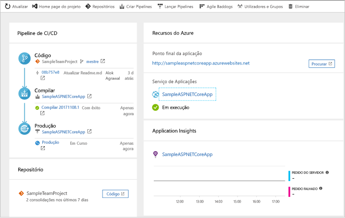
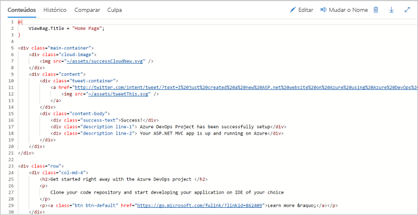
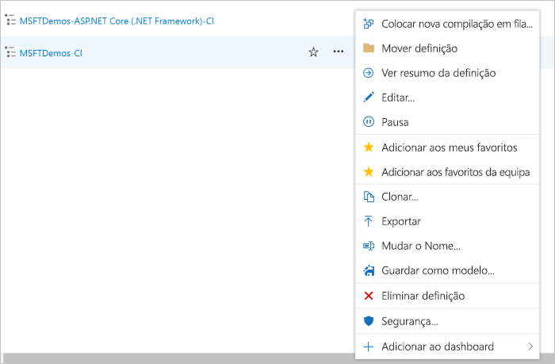

# Criar um pipeline de CI/CD para .NET com o Azure DevOps Starter

Configure a integração contínua (CI) e a entrega contínua (CD) para a sua aplicação de núcleo .NET ou ASP.NET com o DevOps Starter. O DevOps Starter simplifica a configuração inicial de um gasoduto de construção e libertação em Pipelines Azure.

Se não tiver uma subscrição do Azure, pode obter uma subscrição gratuita através do [Visual Studio Dev Essentials](https://visualstudio.microsoft.com/dev-essentials/).

## Iniciar sessão no portal do Azure

DevOps Starter cria um oleoduto CI/CD em Azure DevOps. Pode criar uma nova organização Azure DevOps ou utilizar uma organização existente. DevOps Starter também cria recursos Azure na subscrição Azure da sua escolha.

1. Inicie sessão no [portal do Microsoft Azure](https://portal.azure.com).

1. Na caixa de pesquisa, escreva **DevOps Starter** e, em seguida, selecione. Clique em **Adicionar** para criar um novo. 

    

## Selecione um exemplo de aplicação e serviço do Azure

1. Selecione o exemplo de aplicação **.NET**. Os exemplos de .NET incluem uma escolha da arquitetura de ASP.NET open source ou da arquitetura de .NET Core para várias plataformas.

   
   
   > [!NOTE]
   > A opção padrão para configurar o arranque DevOps é com **o GitHub**, mas esta definição pode ser alterada a partir do assistente.
2. Este exemplo corresponde a uma aplicação MVC ASP.NET Core. Selecione a estrutura de aplicação **.NET Core** e, em seguida, selecione **Seguinte**.    
    
3. Selecione **a Aplicação Web do Windows** como um alvo de implementação e, em seguida, selecione **Next**. Opcionalmente, pode escolher outros serviços Azure para a sua implantação. O quadro de aplicação, que escolheu anteriormente, dita o tipo de alvo de implantação de serviço Azure disponível aqui.

## Configurar Azure DevOps e uma subscrição da Azure 

1. Insira um **nome de projeto**.

2. Crie uma nova **Organização Azure DevOps** gratuita ou escolha uma organização existente a partir do dropdown.

3. Selecione a sua **Subscrição Azure,** insira um nome para a sua **aplicação Web** ou tome o padrão e, em seguida, selecione **Fazer**. Após alguns minutos, a visão geral de implementação do devOps é exibida no portal Azure. 

4. Selecione **Vá para** o recurso para ver o painel de arranque de devOps. No canto superior direito, coloque o **Projeto** no seu painel de instrumentos para um acesso rápido. Uma aplicação de amostra é criada num repo na sua **Azure DevOps Organization**. Uma construção é executada e a sua aplicação é implantada para Azure.

5. O dashboard fornece visibilidade para o seu repo de código, o seu pipeline CI/CD e a sua aplicação em Azure. À direita sob os recursos Azure, **selecione Procurar** para ver a sua aplicação de execução.

    

## Consolidar as alterações de código e executar o CI/CD

DevOps Starter criou um repositório git em Azure Repos ou GitHub. Para ver o repositório e fazer alterações de código na sua aplicação, faça o seguinte:

1. À esquerda do painel de arranque de DevOps, selecione o link para o seu ramo **principal.** Esta ligação abre uma vista para o repositório Git recentemente criado.

2. Nos próximos passos, pode utilizar o navegador web para escoar e comprometer alterações de código diretamente para o ramo **principal.** Também pode clonar o seu repositório Git no seu IDE favorito selecionando **Clone** a partir do canto superior direito da página do repositório. 

3. À esquerda, navegue na estrutura do ficheiro de aplicação para **Aplicação/aspnet-core-dotnet-core/Pages/Index.cshtml**.

4. **Selecione Editar** e, em seguida, faça uma alteração na posição h2. Por exemplo, **escreva Começar imediatamente com o Azure DevOps Starter** ou fazer outra alteração.

      

5. **Selecione Cometer,** deixe um comentário e selecione **Comprometa** novamente.

6. No seu navegador, vá ao painel de arranque do Azure DevOps.  Deverá agora ver que está em curso uma compilação. As alterações efetuadas são automaticamente construídas e implementadas através de um gasoduto CI/CD.

## Examinar o gasoduto CI/CD

No passo anterior, o Azure DevOps Starter configurau automaticamente um gasoduto CI/CD completo. Explore e personalize o pipeline, conforme necessário. Tome os seguintes passos para se familiarizar com os Azure DevOps construir e soltar oleodutos.

1. No topo do painel de arranque de DevOps, selecione **Build Pipelines**. Este link abre um separador de navegador e o Azure DevOps constrói o pipeline para o seu novo projeto.

1. Selecione a elipse (...).  Esta ação abre um menu onde pode iniciar várias atividades como fazer fila de uma nova construção, fazer uma pausa numa construção e editar o pipeline de construção.

1. Selecione **Editar**.

    

1. Neste painel, pode examinar as várias tarefas para o seu oleoduto de construção. A construção executa várias tarefas, tais como buscar fontes do repositório git, restaurar dependências e publicar saídas usadas para implantações.

1. Na parte superior do pipeline de compilação, selecione o nome do pipeline de compilação.

1. Mude o nome do seu pipeline de construção para algo mais descritivo, **selecione Save & fila** e, em seguida, selecione **Guardar**.

1. No nome do pipeline de compilação, selecione **Histórico**.   
No painel **história,** você vê um rasto de auditoria das suas recentes alterações para a construção.  A Azure Pipelines regista quaisquer alterações que sejam feitas ao oleoduto de construção, e permite comparar versões.

1. Selecione **Triggers**. O DevOps Starter criou automaticamente um gatilho de CI, e cada compromisso com o repositório inicia uma nova construção. Opcionalmente, pode optar por incluir ou excluir os ramos do processo de CI.

1. Selecione **Retenção**. Dependendo do seu cenário, pode especificar políticas para manter ou remover um determinado número de construções.

1. Selecione **Construir e Soltar** e, em seguida, selecione **Versões**.  
O DevOps Starter cria um oleoduto de libertação para gerir as implementações para o Azure.

1.  À esquerda, selecione a elipse (...) ao lado do seu pipeline de libertação e, em seguida, **selecione Editar**. O pipeline de lançamento contém um pipeline, que define o processo de lançamento.  

1. Em **Artefactos**, selecione **Remover**. O pipeline de compilação que examinou nos passos anteriores produz a saída utilizada para o artefacto. 

1. Ao lado do ícone **Drop,** selecione o **gatilho de implementação contínua**. Este oleoduto de lançamento tem um gatilho de CD ativado, que executa uma implantação sempre que há um novo artefacto de construção disponível. Opcionalmente, pode desativar o gatilho para que as suas implementações exijam uma execução manual.  

1. À esquerda, selecione **Tarefas**.  As tarefas são as atividades que o seu processo de implantação realiza. Neste exemplo, foi criada uma tarefa para implementar no Azure App Service.

1. À direita, **selecione Ver lançamentos**. Esta vista mostra um histórico das versões.

1. Selecione a elipse (...) ao lado de uma das suas versões e, em seguida, selecione **Abrir**. Existem vários menus para explorar, como um resumo de lançamento, itens de trabalho associados e testes.

1. Selecione **Consolidações**. Esta visão mostra compromissos de código que estão associados à implementação específica. 

1. Selecionar **Registos**. Os registos contêm informações úteis sobre o processo de implementação. Podem ser vistos durante e após as implementações.

## Limpar os recursos

Pode eliminar o Azure App Service e outros recursos relacionados que criou quando já não precisa deles. Utilize a funcionalidade **Eliminar** no painel de arranque de devOps.

## Passos seguintes

Para saber mais sobre como modificar os pipelines de compilação e de lançamento para satisfazer as necessidades da sua equipa, veja este tutorial:

> [!div class="nextstepaction"]
> [Personalizar o processo de CD](/azure/devops/pipelines/release/define-multistage-release-process?view=vsts)

## Vídeos

> [!VIDEO https://www.youtube.com/embed/itwqMf9aR0w]
