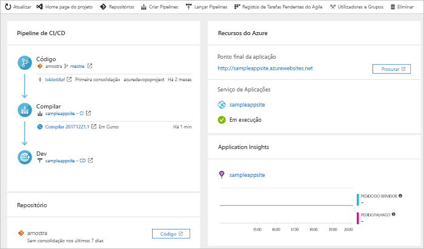

# Crie um pipeline CI/CD para ir usando a Azure DevOps Starter

Configure a integração contínua (CI) e a entrega contínua (CD) para a sua aplicação Go utilizando o Azure DevOps Starter. O DevOps Starter simplifica a configuração inicial de um gasoduto de construção e libertação de Azure DevOps.

Se não tiver uma subscrição do Azure, pode obter uma subscrição gratuita através do [Visual Studio Dev Essentials](https://visualstudio.microsoft.com/dev-essentials/).

## Iniciar sessão no portal do Azure

DevOps Starter cria um gasoduto CI/CD em Pipelines Azure. Pode criar uma nova organização Azure DevOps ou utilizar uma organização existente. DevOps Starter também cria recursos Azure na subscrição Azure da sua escolha.

1. Inicie sessão no [portal do Azure](https://portal.azure.com).

1. Na caixa de pesquisa, escreva **DevOps Starter** e, em seguida, selecione. Clique em **Adicionar** para criar um novo.

    

## Selecione uma aplicação de amostra e serviço Azure

1. Selecione a aplicação de amostra **Go** e, em seguida, selecione **Seguinte**.  
    
1. **A Aplicação Go simples** é a estrutura predefinida. Selecione **Seguinte**.  O quadro de aplicações, que escolheu anteriormente, dita o tipo de alvos de implementação do serviço Azure que estão disponíveis para implantação. 
    
1. Deixe o serviço Azure predefinido e selecione **Next**.

## Configurar Azure DevOps e uma subscrição da Azure 

1. Crie uma nova organização gratuita da Azure DevOps ou escolha uma organização existente. 

1. Insira um nome para o seu projeto Azure DevOps. 

1. Selecione a subscrição e localização do Azure, introduza um nome para a sua aplicação e, em seguida, selecione **Fazer**. Após alguns minutos, o painel de arranque de DevOps é apresentado no portal Azure. Uma aplicação de amostra é criada num repo na sua organização Azure DevOps, uma construção é executada, e a sua app é implementada para a Azure. 

    O dashboard fornece visibilidade para o seu repo de código, o seu pipeline CI/CD e a sua aplicação em Azure. À direita, **selecione Procurar** para ver a sua aplicação de execução.

     

## Cometa as alterações de código e execute o CI/CD

DevOps Starter cria um git repo em Azure Repos ou GitHub. Para ver o repo e fazer alterações de código na sua app, faça o seguinte:

1. No DevOps Starter, à esquerda, selecione o link para o seu ramo principal. O link abre uma vista para o recém-criado Git repo.

1. Para ver o URL do clone de repo, selecione **Clone** no topo direito. Pode clonar o seu git repo no seu IDE favorito. Nos próximos passos, pode utilizar o navegador web para escoar e comprometer alterações de código diretamente para o ramo principal.

1. À esquerda, vá para o *ficheiro visualizações/index.html* e, em seguida, selecione **Editar**.

1. Faça uma alteração no ficheiro. Por exemplo, modifique algum texto dentro de uma das tags div.

1. **Selecione Cometer** e, em seguida, guarde as suas alterações.

1. No seu navegador, vá ao painel de projetos de DevOps. Uma construção deve estar em andamento. As alterações efetuadas são automaticamente construídas e implementadas através de um gasoduto CI/CD.

## Examinar o gasoduto CI/CD

O DevOps Starter configura automaticamente um gasoduto CI/CD completo em Azure Repos. Explore e personalize o pipeline, conforme necessário. Para se familiarizar com os oleodutos Azure DevOps, faça o seguinte:

1. Vá ao painel de arranque do DevOps.

1. No topo, **selecione Construir oleodutos**. Um separador de navegador exibe o pipeline de construção para o seu novo projeto.

1. Aponte para o campo **Status** e, em seguida, selecione a elipse (...). Um menu apresenta várias opções, como fazer fila de uma nova construção, parar uma construção e editar o pipeline de construção.

1. Selecione **Editar**.

1. Neste painel, pode examinar as várias tarefas para o seu oleoduto de construção. A construção executa várias tarefas, tais como buscar fontes do repo Git, restaurar dependências e publicar saídas usadas para implementações.

1. Na parte superior do pipeline de compilação, selecione o nome do pipeline de compilação.

1. Mude o nome do seu pipeline de construção para algo mais descritivo, **selecione Save & fila** e, em seguida, selecione **Guardar**.

1. No nome do pipeline de compilação, selecione **Histórico**. Este painel apresenta um rasto de auditoria das suas recentes alterações para a construção. O Azure DevOps regista quaisquer alterações feitas ao pipeline de construção, e permite comparar versões.

1. Selecione **Triggers**. O DevOps Starter cria automaticamente um gatilho de CI, e cada compromisso com o repo inicia uma nova construção. Opcionalmente, pode optar por incluir ou excluir os ramos do processo de IC.

1. Selecione **Retenção**. Dependendo do seu cenário, pode especificar políticas para manter ou remover um determinado número de construções.

1. Selecione **Construir e Soltar** e, em seguida, selecione **Versões**.  O DevOps Starter cria um oleoduto de libertação para gerir as implementações para o Azure.

1. Selecione a elipse (...) ao lado do seu pipeline de lançamento e, em seguida, **selecione Editar**. O pipeline de lançamento contém um *pipeline*, que define o processo de lançamento.

1. Em **Artefactos**, selecione **Remover**. O oleoduto de construção que examinou anteriormente produz a saída que é usada para o artefacto. 

1. À direita do ícone **Drop,** selecione **o gatilho de implementação contínua**. Este oleoduto de lançamento tem um disparador de CD ativado, que executa uma implantação sempre que um novo artefacto de construção está disponível. Opcionalmente, pode desativar o gatilho para que as suas implementações exijam uma execução manual. 

1. À esquerda, selecione **Tarefas**. As tarefas são as atividades que o seu processo de implantação realiza. Neste exemplo, foi criada uma tarefa para implementar no Azure App Service.

1. À direita, **selecione Ver ver lançamentos** para exibir um histórico de lançamentos.

1. Selecione a elipse (...) ao lado de uma versão e, em seguida, selecione **Abrir**. Pode explorar vários menus, como um resumo de lançamento, itens de trabalho associados e testes.

1. Selecione **Consolidações**. Esta visão mostra compromissos de código que estão associados a esta implementação. 

1. Selecionar **Registos**. Os registos contêm informações úteis sobre o processo de implementação. Pode vê-los durante e após as missões.

## Limpar os recursos

Quando já não são necessários, pode eliminar a instância do Serviço de Aplicações Azure e os recursos relacionados que criou neste arranque rápido. Para tal, utilize a funcionalidade **Eliminar** no painel de arranque de DevOps.

## Passos seguintes

Para saber mais sobre a modificação dos oleodutos de construção e libertação para atender às necessidades da sua equipa, consulte:

> [!div class="nextstepaction"]
> [Defina o seu pipeline de implantação contínua em várias fases (CD)](/azure/devops/pipelines/release/define-multistage-release-process)