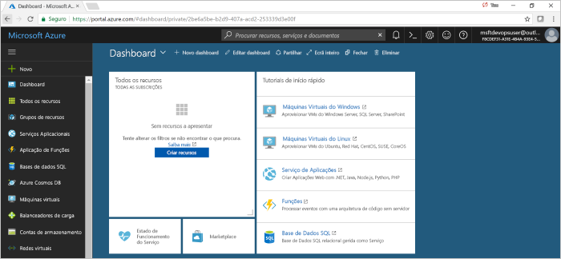

# Início rápido: Configurar um pipeline de CI/CD para um aplicativo Java com Azure DevOps Projects

Neste artigo de início rápido, você usa Azure DevOps Projects "experiência simplificada para configurar um pipeline de integração contínua (CI) e entrega contínua (CD) para seu aplicativo Java no Azure Pipelines. Você também pode usar Azure DevOps Projects para criar outros recursos do Azure.  

Se você não tiver uma assinatura do Azure, poderá obter uma gratuitamente por meio de [Visual Studio dev Essentials](https://visualstudio.microsoft.com/dev-essentials/).

## Iniciar sessão no portal do Azure

  DevOps Projects cria um pipeline de CI/CD no Azure Pipelines. Você pode criar uma nova organização de DevOps do Azure ou usar uma organização existente. Projetos de DevOps também cria os recursos do Azure na subscrição do Azure à sua escolha.

1. Inicie sessão no [Portal do Microsoft Azure](https://portal.azure.com).

1. No painel esquerdo, selecione **criar um recurso**e procure **DevOps Projects**.  

2. Selecione **Criar**.

    

## Selecione um exemplo de aplicação e serviço do Azure

1. Selecione o aplicativo de exemplo Java.  
Os exemplos de Java incluem várias opções de arquiteturas de aplicações.

1. A estrutura de exemplo padrão é Spring. Deixe a configuração padrão e, em seguida, selecione **Avançar**.  O aplicativo Web para contêineres é o destino de implantação padrão. A estrutura do aplicativo, que você escolheu anteriormente, dita o tipo de destino de implantação de serviço do Azure disponível aqui. 

2. Deixe o serviço padrão e, em seguida, selecione **Avançar**.
 
## Configurar o Azure DevOps e uma subscrição do Azure 

1. Crie uma nova organização de DevOps do Azure ou escolha uma organização existente. 

    a. Escolha um nome para o seu projeto. 

    b. Selecione a subscrição do Azure e a localização, escolha um nome para a sua aplicação e, em seguida, selecione **feito**.  
    Depois de alguns minutos, o painel de DevOps Projects é exibido na portal do Azure. Um aplicativo de exemplo é configurado em um repositório em sua organização DevOps do Azure, uma compilação é executada e seu aplicativo é implantado no Azure. Este dashboard fornece visibilidade para o repositório de código, o pipeline de CI/CD e a sua aplicação no Azure.
    

2. Selecione **procurar** para exibir o aplicativo em execução.

     
    
   DevOps Projects configurou automaticamente um gatilho de Build e versão de CI.  Agora, está pronto para colaborar com uma equipa na sua aplicação Java com um processo de CI/CD que implementa automaticamente o seu trabalho mais recente no seu site.

## Consolidar as alterações de código e executar o CI/CD

DevOps Projects cria um repositório git no Azure Repos ou no GitHub. Para exibir o repositório e fazer alterações de código em seu aplicativo, faça o seguinte:

1. À esquerda do painel de DevOps Projects, selecione o link para o Branch mestre.  
Esta ligação abre uma vista para o repositório Git recentemente criado.

1. Para exibir a URL de clone do repositório, selecione **clonar** na parte superior direita do navegador.   
    Pode clonar o repositório Git no seu IDE preferido. Nos próximos passos, pode utilizar o browser para fazer e consolidar alterações de código diretamente no ramo principal.

1. No lado esquerdo do navegador, vá para o arquivo **src/main/webapp/index.html** .

1. Selecione **Editar**e, em seguida, faça uma alteração em algum texto.
    Por exemplo, altere algum texto para uma das etiquetas div.

1. Selecione **consolidar**e, em seguida, guarde as alterações.

1. No navegador, vá para o painel de DevOps Projects.   
Agora você deve ver uma compilação em andamento. As alterações que você acabou de fazer são criadas automaticamente e implantadas por meio de um pipeline de CI/CD.

## Examine o pipeline de CI/CD

 Na etapa anterior, DevOps Projects configurou automaticamente um pipeline de CI/CD completo. Explore e personalize o pipeline, conforme necessário. Execute as etapas a seguir para se familiarizar com os pipelines de compilação e versão.

1. Na parte superior do dashboard de projetos de DevOps, selecione **criar Pipelines**.  
Esse link abre uma guia do navegador e o pipeline de compilação para seu novo projeto.

1. Aponte para o campo **status** e, em seguida, selecione as reticências (...).  
    Essa ação abre um menu em que você pode iniciar várias atividades, como enfileirar uma nova compilação, pausar uma compilação e editar o pipeline de compilação.

1. Selecione **Editar**.

1. Neste painel, pode examinar as várias tarefas para o seu pipeline de compilação.  
A compilação executa uma variedade de tarefas, como busca de fontes do repositório git, restauração de dependências e publicação de saídas que são usadas para implantações.

1. Na parte superior do pipeline de compilação, selecione o nome do pipeline de compilação.

1. Altere o nome do seu pipeline de compilação para algo mais descritivo, selecione **guardar e colocar em fila**e, em seguida, selecione **guardar**.

1. No nome do pipeline de compilação, selecione **Histórico**.   
Na **histórico** painel, verá uma trilha de auditoria das alterações recentes para a compilação.  Pipelines do Azure mantém um registro de quaisquer alterações efetuadas no pipeline de compilação e permite-lhe comparar versões.

1. Selecione **Acionadores**.   
 Projetos de DevOps criado automaticamente um acionador de CI e cada consolidação no repositório inicia uma nova compilação.  Opcionalmente, pode optar por incluir ou excluir os ramos do processo de CI.

1. Selecione **Retenção**.   
Dependendo do seu cenário, pode especificar políticas de manter ou remover um determinado número de compilações.

1. Selecione **Compilar e liberar**e, em seguida, selecione **versões**.  
 DevOps Projects cria um pipeline de liberação para gerenciar implantações no Azure.

1. À esquerda, selecione as reticências (...) ao lado de seu pipeline de lançamento e, em seguida, selecione **Editar**.  
O pipeline de lançamento contém um pipeline, que define o processo de liberação.  
    
12. Em **Artefactos**, selecione **Remover**.  
O pipeline de Build que você examinou nas etapas anteriores produz a saída usada para o artefato. 

1. Junto a **Drop** ícone, selecione a **acionador de implementação contínua**.  
Esta versão de pipeline tem um acionador de CD ativado, o que é executada uma implantação sempre que houver um artefacto de compilação nova disponível. Opcionalmente, pode desativar o acionador para que as suas implementações exigem execução manual. 

1. No lado esquerdo, selecione **tarefas**.   
As tarefas são as atividades que executa o processo de implementação. Neste exemplo, uma tarefa foi criada para ser implantada no serviço Azure App.

1. À direita, selecione **ver versões**.  
Esta vista mostra um histórico das versões.

1. Selecione as reticências (...) junto a um dos seus lançamentos e, em seguida, selecione **aberto**.  
Existem vários menus para explorar, como um resumo de lançamento, itens de trabalho associados e testes.

1. Selecione **Consolidações**.   
Esta vista mostra as confirmações de código que estão associadas a implementação específica. 

1. Selecionar **Registos**.  
Os registos contêm informações úteis sobre o processo de implementação. Podem ser vistos durante e após as implementações.

## Limpar recursos

Você pode excluir Azure App serviço e outros recursos relacionados quando não precisar mais deles. Utilize o **eliminar** funcionalidade no dashboard de projetos de DevOps.

## Passos Seguintes

Quando você configurou o processo de CI/CD, os pipelines de compilação e de versão foram criados automaticamente. Pode modificar estes pipelines de compilação e de lançamento para satisfazer as necessidades da sua equipa. Para saber mais sobre o pipeline de CI/CD, consulte:

> [!div class="nextstepaction"]
> [Personalizar o processo de CD](https://docs.microsoft.com/azure/devops/pipelines/release/define-multistage-release-process?view=vsts)
