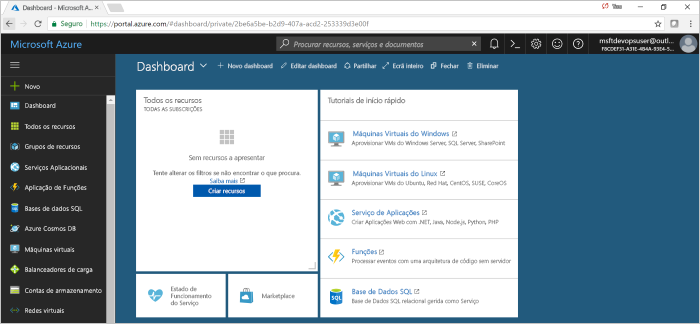

# Criar um oleoduto CI/CD para PHP com projetos Azure DevOps

A Azure DevOps Projects apresenta uma experiência simplificada que cria recursos Azure e cria um pipeline de integração contínua (CI) e entrega contínua (CD) para a sua aplicação PHP em Pipelines Azure.  

Se não tiver uma subscrição Azure, pode obter uma gratuitamente através do [Visual Studio Dev Essentials](https://visualstudio.microsoft.com/dev-essentials/).

## Iniciar sessão no portal do Azure

 A DevOps Projects cria um oleoduto CI/CD em Pipelines Azure. Você pode criar uma nova organização Azure DevOps gratuita ou usar uma organização existente. A DevOps Projects também cria recursos Azure na subscrição Azure à sua escolha.

1. Inscreva-se no [portal Microsoft Azure](https://portal.azure.com).

1. No painel esquerdo, selecione o ícone **Criar um recurso** e, em seguida, procure **projetos DevOps**.  

3. Selecione **Criar**.

    

## Selecione um exemplo de aplicação e serviço do Azure

1. Selecione o exemplo de aplicação PHP.  
        As amostras php incluem uma escolha de vários quadros de aplicação. A estrutura da amostra padrão é Laravel. 
        
2. Deixe a definição predefinida e, em seguida, selecione **Seguinte**.  

1. A Aplicação Web Para Contentores é o destino de implementação predefinido.  
    O quadro de aplicação, que escolheu anteriormente, dita o tipo de alvo de implantação de serviços Azure que está disponível aqui.  Deixe o serviço predefinido e, em seguida, selecione **Seguinte**.
 
## Configure Azure DevOps e uma subscrição Azure 

1. Crie uma nova organização Azure DevOps ou selecione uma organização existente. 

    a. Escolha um nome para o seu projeto em Azure DevOps. 
    
    b. Selecione a sua subscrição e localização Azure, introduza um nome para a sua aplicação e, em seguida, selecione **Done**.   
        Após alguns minutos, o painel de instrumentos DevOps Projects é apresentado no portal Azure. Uma aplicação de amostra é configurada num repositório na sua organização Azure DevOps, uma construção executa, e a sua aplicação é implantada para o Azure. Este dashboard proporciona visibilidade no seu repositório de código, no seu pipeline CI/CD e na sua aplicação em Azure.  
        
2. **Selecione Browse** para visualizar a sua aplicação de execução.

     
    
   Os Projetos DevOps configuraram automaticamente um gatilho de construção e libertação de CI.  Agora está pronto para colaborar com uma equipa na sua aplicação PHP, com um processo de CI/CD que implementa automaticamente o seu trabalho mais recente no seu site.

## Consolidar as alterações de código e executar o CI/CD

 A DevOps Projects cria um repositório Git em Azure Repos ou GitHub. Para ver o repositório e fazer alterações de código na sua aplicação, tome as seguintes medidas:

1. À esquerda do painel de projetos DevOps, selecione o link para o seu ramo principal.   
    Esta ligação abre uma vista para o repositório Git recentemente criado.

1. Para ver o URL de clone do repositório, selecione **Clone** na parte superior direita do browser.   
    Pode clonar o repositório Git no seu IDE preferido. Nos próximos passos, utilize o navegador web para efazer e comprometer alterações de código diretamente para o ramo principal.

1. À esquerda, vá ao ficheiro **recursos/vistas/welcome.blade.php.**

1. Selecione **Editar**e, em seguida, fazer uma alteração em alguns dos textos.  Por exemplo, altere algum texto para uma das etiquetas div.

1. Selecione **'Cometer'** e, em seguida, guardar as suas alterações.

1. No seu navegador, vá ao painel de projetos DevOps.  
Agora deve ver uma construção em andamento. As alterações que acabou de fazer são automaticamente construídas e implantadas através de um oleoduto CI/CD.

## Examinar o gasoduto CI/CD

 Os Projetos DevOps configuram automaticamente um oleoduto CI/CD completo em Pipelines Azure. Explore e personalize o pipeline, conforme necessário. Para se familiarizar com os oleodutos de construção e libertação, faça o seguinte:

1. No topo do painel de projetos DevOps, selecione **Build Pipelines**.  
    Este link abre um separador de navegador e o pipeline de construção para o seu novo projeto.

1. Aponte para o campo **Status** e, em seguida, selecione a **elipse** (...).  
    Um menu exibe várias opções, como fazer fila de uma nova construção, parar uma construção e editar o pipeline de construção.

1. Selecione **Editar**.

1. Neste painel, pode examinar as várias tarefas para o seu pipeline de construção.  
    A construção executa uma variedade de tarefas, tais como obter fontes do repositório Git, restaurar dependências e publicar saídas que são usadas para implantações.

1. Na parte superior do pipeline de compilação, selecione o nome do pipeline de compilação.

1. Mude o nome do seu oleoduto de construção para algo mais descritivo, selecione, **guarde & fila**e, em seguida, selecione **Guardar**.

1. No nome do pipeline de compilação, selecione **Histórico**.   
    O painel **histórico** apresenta um rasto de auditoria das suas recentes alterações para a construção. A Azure Pipelines acompanha quaisquer alterações que sejam feitas no pipeline de construção, e permite comparar versões.

1. Selecione **Triggers**.  
      A DevOps Projects criou automaticamente um gatilho ci, e cada compromisso com o repositório inicia uma nova construção. Opcionalmente, pode optar por incluir ou excluir os ramos do processo de CI.

1. Selecione **Retenção**.   
    Dependendo do seu cenário, pode especificar políticas para manter ou remover um determinado número de construções.

1. Selecione **Construir e Soltar**e, em seguida, selecione **Lançamentos**.  
     A DevOps Projects cria um oleoduto de libertação para gerir as implantações para o Azure.

1. Selecione a elipsis (...) junto ao seu gasoduto de libertação e, em seguida, **selecione Editar**.  
    O pipeline de lançamento contém um pipeline, que define o processo de lançamento. 

12. Em **Artefactos**, selecione **Remover**.  
    O oleoduto de construção que examinou nos passos anteriores produz a saída que é usada para o artefacto. 

1. Ao lado do ícone **Drop,** selecione o **gatilho de implantação Contínua**.   
    Este oleoduto de libertação tem um gatilho de CD ativado, que executa uma implantação sempre que há um novo artefacto de construção disponível.  Opcionalmente, pode desativar o gatilho de modo a que as suas implementações exijam execução manual. 

1. À esquerda, selecione **Tarefas**.  
        As tarefas são as atividades que o seu processo de implantação realiza.  Neste exemplo, foi criada uma tarefa para implantar no Azure App Service.

1. À direita, selecione **ver ver ver para** mostrar um histórico de lançamentos.

1. Selecione a elipse (...) ao lado de um dos seus lançamentos e, em seguida, selecione **Open**.  
        Estão disponíveis vários menus para explorar nesta vista, como um resumo de versões, itens de trabalho associados e testes.

1. Selecione **Consolidações**.  
        Esta visão mostra os compromissos de código que estão associados à implantação específica. 

1. Selecionar **Registos**.  
        Os registos contêm informações úteis sobre o processo de implementação. Podem ser vistos durante e após as implementações.

## Limpar recursos

Pode eliminar o Serviço de Aplicações Azure e outros recursos relacionados quando já não precisa deles. Utilize a funcionalidade **Eliminar** no painel de instrumentos de Projetos DevOps.

## Passos seguintes

Quando configurao o seu processo CI/CD, os gasodutos de construção e de libertação foram automaticamente criados. Pode modificar estes pipelines de compilação e de lançamento para satisfazer as necessidades da sua equipa. Para saber mais sobre o oleoduto CI/CD, consulte este tutorial:

> [!div class="nextstepaction"]
> [Personalizar o processo de CD](https://docs.microsoft.com/azure/devops/pipelines/release/define-multistage-release-process?view=vsts)
