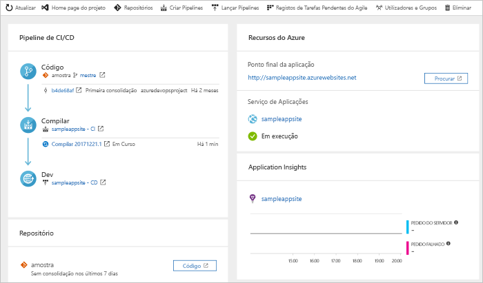

# Criar um pipeline CI/CD para PHP com Azure DevOps Starter

O Azure DevOps Starter apresenta uma experiência simplificada que cria recursos Azure e cria um pipeline de integração contínua (CI) e entrega contínua (CD) para a sua aplicação PHP em Azure Pipelines.  

Se não tiver uma subscrição do Azure, pode obter uma gratuitamente através [do Visual Studio Dev Essentials.](https://visualstudio.microsoft.com/dev-essentials/)

## Iniciar sessão no portal do Azure

 DevOps Starter cria um gasoduto CI/CD em Pipelines Azure. Pode criar uma organização gratuita de novos Azure DevOps ou utilizar uma organização existente. DevOps Projects também cria recursos Azure na subscrição Azure da sua escolha.

1. Inicie sessão no [portal do Microsoft Azure](https://portal.azure.com).

1. Na caixa de pesquisa, escreva **DevOps Starter**e, em seguida, selecione. Clique em **Adicionar** para criar um novo.

     

## Selecione um exemplo de aplicação e serviço do Azure

1. Selecione o exemplo de aplicação PHP. Os exemplos PHP incluem várias opções de arquiteturas de aplicações. A arquitetura de exemplo predefinida é Laravel.
        
1. Deixe a definição predefinitiva e, em seguida, selecione **Seguinte**.  

1. A Aplicação Web Para Contentores é o destino de implementação predefinido. O quadro de aplicação, que escolheu anteriormente, dita o tipo de alvo de implementação do serviço Azure que está disponível aqui.  Deixe o serviço predefinido e, em seguida, selecione **Seguinte**.
 
## Configurar Azure DevOps e uma subscrição da Azure 

1. Crie uma nova organização Azure DevOps ou selecione uma organização existente. 

    1. Escolha um nome para o seu projeto em Azure DevOps. 
    
    1. Selecione a subscrição e localização do Azure, introduza um nome para a sua aplicação e, em seguida, selecione **Fazer**.  
    
    Após alguns minutos, o painel de arranque de DevOps é apresentado no portal Azure. Uma aplicação de amostra é configurada num repositório na sua organização Azure DevOps, uma build runs, e a sua aplicação é implantada para a Azure. Este painel fornece visibilidade no seu repositório de código, no seu pipeline CI/CD e na sua aplicação em Azure.  
        
2. **Selecione Procurar** para ver a sua aplicação de execução.

     
    
   O DevOps Starter configura automaticamente uma construção de CI e um gatilho de libertação.  Agora está pronto para colaborar com uma equipa na sua aplicação PHP, com um processo de CI/CD que implementa automaticamente o seu trabalho mais recente no seu site.

## Consolidar as alterações de código e executar o CI/CD

 DevOps Starter cria um repositório git em Azure Repos ou GitHub. Para ver o repositório e fazer alterações de código na sua aplicação, tome as seguintes medidas:

1. À esquerda do painel de arranque de DevOps, selecione o link para o seu ramo principal. Esta ligação abre uma vista para o repositório Git recentemente criado.

1. Para ver o URL de clone do repositório, selecione **Clone** na parte superior direita do browser. Pode clonar o repositório Git no seu IDE preferido. Nos próximos passos, use o navegador web para fazer e comprometer alterações de código diretamente para o ramo principal.

1. À esquerda, vá para o ficheiro **resources/views/welcome.blade.php.**

1. **Selecione Editar**e, em seguida, faça uma alteração em alguns dos textos.  Por exemplo, altere algum texto para uma das etiquetas div.

1. **Selecione Cometer**e, em seguida, guarde as suas alterações.

1. No seu navegador, vá ao painel de arranque do DevOps. Deve agora ver uma construção em progresso. As alterações que acaba de fazer são automaticamente construídas e implementadas através de um gasoduto CI/CD.

## Examinar o gasoduto CI/CD

 O DevOps Starter configura automaticamente um gasoduto CI/CD completo em Pipelines Azure. Explore e personalize o pipeline, conforme necessário. Para se familiarizar com os oleodutos de construção e libertação, faça o seguinte:

1. No topo do painel de arranque de DevOps, selecione **Build Pipelines**. Este link abre um separador de navegador e o pipeline de construção para o seu novo projeto.

1. Aponte para o campo **Status** e, em seguida, selecione a **elipse** (...). Um menu apresenta várias opções, como fazer fila de uma nova construção, parar uma construção e editar o pipeline de construção.

1. Selecione **Editar**.

1. Neste painel, pode examinar as várias tarefas para o seu oleoduto de construção. A construção executa uma variedade de tarefas, tais como buscar fontes do repositório git, restaurar dependências, e publicar saídas que são usadas para implantações.

1. Na parte superior do pipeline de compilação, selecione o nome do pipeline de compilação.

1. Altere o nome do seu pipeline de construção para algo mais descritivo, selecione, **guarde & fila**e, em seguida, selecione **Save**.

1. No nome do pipeline de compilação, selecione **Histórico**.  O **painel de História** apresenta um rasto de auditoria das suas recentes alterações para a construção. A Azure Pipelines regista quaisquer alterações que sejam feitas ao oleoduto de construção, e permite comparar versões.

1. Selecione **Triggers**. O DevOps Starter criou automaticamente um gatilho de CI, e cada compromisso com o repositório inicia uma nova construção. Opcionalmente, pode optar por incluir ou excluir os ramos do processo de CI.

1. Selecione **Retenção**. Dependendo do seu cenário, pode especificar políticas para manter ou remover um determinado número de construções.

1. Selecione **Construir e Soltar**e, em seguida, selecione **Versões**.  O DevOps Starter cria um oleoduto de libertação para gerir as implementações para o Azure.

1. Selecione a elipse (...) ao lado do seu pipeline de lançamento e, em seguida, **selecione Editar**. O pipeline de lançamento contém um pipeline, que define o processo de lançamento. 

12. Em **Artefactos**, selecione **Remover**. O gasoduto de construção que examinou nos passos anteriores produz a saída que é usada para o artefacto. 

1. Ao lado do ícone **Drop,** selecione o **gatilho de implementação contínua**. Este oleoduto de lançamento tem um disparador de CD ativado, que executa uma implantação sempre que há um novo artefacto de construção disponível. Opcionalmente, pode desativar o gatilho para que as suas implementações exijam uma execução manual. 

1. À esquerda, selecione **Tarefas**. As tarefas são as atividades que o seu processo de implantação realiza. Neste exemplo, foi criada uma tarefa para implementar no Azure App Service.

1. À direita, **selecione Ver ver as versões** para exibir um histórico de lançamentos.

1. Selecione a elipse (...) ao lado de uma das suas versões e, em seguida, selecione  **Abrir**. Estão disponíveis vários menus para explorar nesta vista, como um resumo de versões, itens de trabalho associados e testes.

1. Selecione **Consolidações**. Esta visão mostra compromissos de código que estão associados à implementação específica. 

1. Selecionar **Registos**. Os registos contêm informações úteis sobre o processo de implementação. Podem ser vistos durante e após as implementações.

## Limpar os recursos

Pode eliminar o Azure App Service e outros recursos relacionados quando já não precisa deles. Utilize a funcionalidade **Eliminar** no painel de arranque de devOps.

## Passos seguintes

Quando configuraste o teu processo ci/CD, foram criados automaticamente oleodutos de construção e libertação. Pode modificar estes pipelines de compilação e de lançamento para satisfazer as necessidades da sua equipa. Para saber mais sobre o pipeline CI/CD, consulte este tutorial:

> [!div class="nextstepaction"]
> [Personalizar o processo de CD](/azure/devops/pipelines/release/define-multistage-release-process?view=vsts)