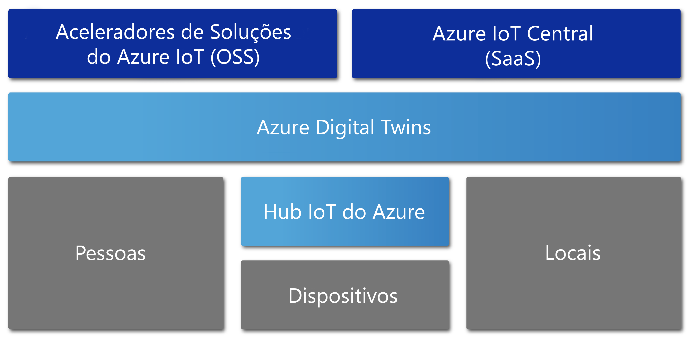

# Descrição geral do Azure Digital Twins

O Azure digital gêmeos Preview é um serviço de IoT do Azure que cria modelos abrangentes do ambiente físico. Ele pode criar grafos de inteligência espacial para modelar as relações e interações entre pessoas, espaços e dispositivos.

Com o Azure digital gêmeos, você pode consultar dados de um espaço físico em vez de muitos sensores diferentes. Esse serviço ajuda a criar experiências de reconhecimento espacial, altamente escalonáveis e reutilizáveis que vinculam dados de streaming em todo o mundo digital e físico. Seus aplicativos são aprimorados por esses recursos contextuais exclusivamente relevantes. 

O Azure digital gêmeos aplica-se a todos os tipos de ambientes, como depósitos, escritórios, escolas, hospitais e bancos. Ele pode até ser usado para estádios, fábricas, estacionamentos, parques, grades inteligentes e cidades. Veja a seguir alguns cenários em que o Azure digital gêmeos pode ser útil:

- Prever as necessidades de manutenção de uma fábrica.
- Analise os requisitos de energia em tempo real para uma grade elétrica.
- Otimize o uso de espaço disponível para um escritório.
- Acompanhe a temperatura diária em vários Estados.
- Monitorar caminhos de drone ocupados.
- Identificar veículos autônomos.
- Analise os níveis de ocupação de um edifício.
- Encontre o registro de caixa mais ocupado em seu repositório.

Seja qual for o cenário de negócios do mundo real, é provável que uma instância digital correspondente possa ser provisionada por meio do Azure digital gêmeos.

O vídeo a seguir faz uma análise mais detalhada do Azure digital gêmeos.

> [!VIDEO https://www.youtube.com/embed/TvN_NxpgyzQ]

## Principais capacidades

O Azure digital gêmeos tem os seguintes recursos principais.

### Gráfico de inteligência espacial

O grafo de [*inteligência espacial*](./concepts-objectmodel-spatialgraph.md#spatial-intelligence-graph), ou *grafo espacial*, é uma representação virtual do ambiente físico. Você pode usá-lo para modelar as relações entre pessoas, lugares e dispositivos.

Considere um aplicativo de utilitário inteligente que envolve vários medidores de uso de eletricidade conectados em uma vizinhança. A empresa do Smart Utility deve monitorar e prever com precisão o uso e a cobrança da eletricidade. Cada dispositivo e sensor devem ser modelados com contexto sobre o local e o cliente que será cobrado. Você pode usar o grafo de inteligência espacial para modelar esses tipos de relações complexas.

### Modelos de objetos gémeos digitais

Os [modelos de objeto de pesquisa digital](./concepts-objectmodel-spatialgraph.md#digital-twins-object-models) são protocolos de dispositivo e esquema de dados predefinidos. Elas alinham as necessidades específicas de domínio da solução para acelerar e simplificar o desenvolvimento.

Por exemplo, um aplicativo de ocupação de sala pode usar tipos de espaço predefinidos como campus, prédio, andar e espaço.

### Vários inquilinos aninhados

Você pode criar soluções que são dimensionadas com segurança e podem ser reutilizadas para vários locatários. Você também pode criar vários sublocatários que podem ser acessados e usados de maneira isolada e segura.

Um exemplo é um aplicativo de utilização de espaço que é configurado para isolar dados de um locatário de dados de outros locatários em um único edifício. Ou o aplicativo é usado para combinar dados para um único locatário com vários edifícios.

### Capacidades de computação avançadas

Com as [funções definidas pelo usuário](./concepts-user-defined-functions.md), você pode definir e executar funções personalizadas em [dados de dispositivo](./concepts-device-ingress.md) de entrada para enviar sinais para pontos de extremidade predefinidos. Esse recurso avançado melhora a personalização e a automação das tarefas do dispositivo.

Um exemplo é um aplicativo do agricultura inteligente que inclui uma função definida pelo usuário para avaliar as leituras do sensor de umidade de solo e a previsão do tempo. Em seguida, o aplicativo envia sinais sobre as necessidades de irrigação.

### Controlo de acesso incorporado

Usando recursos de gerenciamento de acesso e identidade, como [controle de acesso baseado em função](./security-role-based-access-control.md) e [Azure Active Directory](./security-authenticating-apis.md), você pode controlar com segurança o acesso a indivíduos e dispositivos.

Um exemplo é um aplicativo de gerenciamento de instalações que é configurado para permitir occupants de um espaço para definir a temperatura em um intervalo especificado. Os gerentes de instalações têm permissão para definir a temperatura em qualquer espaço para qualquer valor.

### Ecossistema

Você pode conectar uma instância do gêmeos digital do Azure a vários serviços avançados do Azure. Esses serviços incluem Azure Stream Analytics, ia do Azure e armazenamento do Azure. Eles também incluem o Azure Maps, o Microsoft Mixed Reality, o Dynamics 365 ou o Office 365.

Um exemplo é um aplicativo de criação de escritórios inteligentes que usa o Azure digital gêmeos para representar equipes e dispositivos localizados em muitos andares. À medida que os dispositivos transmitem dados dinâmicos para a instância de myup digital provisionada, o Stream Analytics processa esses dados para fornecer informações de chave acionáveis. Os dados são armazenados no armazenamento do Azure e convertidos em um formato de arquivo compartilhável. O arquivo é distribuído em toda a organização usando o Office 365.

## Soluções que tiram partido do Azure Digital Twins

O gêmeos digital do Azure é útil para representar o mundo físico e suas diversas relações. Ele simplifica a modelagem IoT, o processamento de dados, a manipulação de eventos e o rastreamento de dispositivos. Considere apenas alguns dos cenários a seguir em vários setores. Eles se beneficiam do seu uso para:

* Mostre uma empresa de gerenciamento de propriedade os níveis de ocupação de um espaço ao longo do tempo para obter informações sobre as melhores maneiras de configurar seu prédio de escritório.
* Disparar tíquetes de ordem de trabalho para um aplicativo móvel. Use-o para distribuir proteções de segurança e agendar suprimentos e outros serviços em um espaço de varejo ou local esportivo.
* Mostre um occupant de construção que as salas estão ocupadas em um prédio em tempo real. Em seguida, ajude o occupant a reservar espaços de trabalho que atendam às suas necessidades.
* Rastreie onde os ativos estão localizados dentro de um espaço.
* Otimize o carregamento de veículo elétrico modelando as preferências do usuário e as restrições de grade de energia.

## Gêmeos digital do Azure no contexto de outros serviços de IoT

O Azure Digital Twins utiliza o Hub IoT do Azure para ligar os dispositivos de IoT e os sensores que mantêm tudo atualizado com o mundo físico. O diagrama a seguir mostra como o Azure digital gêmeos está relacionado a outros serviços de IoT do Azure.

Para obter mais informações sobre IoT, consulte [tecnologias e soluções de IOT do Azure](../iot-fundamentals/iot-services-and-technologies.md).

## Passos seguintes

Acesse uma breve demonstração sobre o Azure digital gêmeos:

>[!div class="nextstepaction"]
>[Início rápido: localizar salas disponíveis usando o gêmeos digital do Azure](./quickstart-view-occupancy-dotnet.md)

Examine com mais detalhes um aplicativo de gerenciamento de instalações usando o Azure digital gêmeos:

>[!div class="nextstepaction"]
>[Tutorial: Deploy Azure Digital Twins and configure a spatial graph](./tutorial-facilities-setup.md) (Tutorial: Implementar o Azure Digital Twins e configurar um gráfico espacial)

Saiba mais sobre os principais conceitos do Azure Digital Twins:

>[!div class="nextstepaction"]
>[Entender o modelo de objeto digital gêmeos e o grafo de inteligência espacial](./concepts-objectmodel-spatialgraph.md)