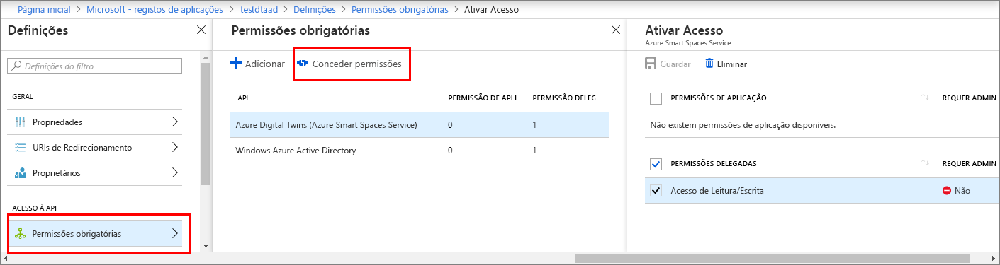

# <a name="how-to-configure-postman-for-azure-digital-twins"></a>Como configurar o postmaster para o Azure digital gêmeos

Este artigo descreve como configurar o cliente REST do postmaster para interagir com e testar as APIs de gerenciamento de gêmeos digital do Azure. Especificamente, ele descreve:

* Como configurar um aplicativo de Azure Active Directory para usar o fluxo de concessão implícita do OAuth 2,0.
* Como usar o cliente REST do postmaster para fazer solicitações HTTP de passagem de token para suas APIs de gerenciamento.
* Como usar o postmaster para fazer solicitações de POSTAgem diversas em suas APIs de gerenciamento.

## <a name="postman-summary"></a>Resumo do postmaster

Introdução ao gêmeos digital do Azure usando uma ferramenta de cliente REST, como o [postmaster](https://www.getpostman.com/) , para preparar seu ambiente de teste local. O cliente do postmaster ajuda a criar rapidamente solicitações HTTP complexas. Baixe a versão da área de trabalho do cliente do postmaster acessando [www.getpostman.com/apps](https://www.getpostman.com/apps).

O [postmaster](https://www.getpostman.com/) é uma ferramenta de teste REST que localiza funcionalidades de solicitação HTTP de chave em uma GUI útil baseada em desktops e em plug-in.

Por meio do cliente do postmaster, as soluções que os desenvolvedores podem especificar o tipo de solicitação HTTP (*post*, *Get*, *Update*, *patch*e *delete*), o ponto de extremidade da API para chamar e o uso de SSL. O postmaster também dá suporte à adição de cabeçalhos de solicitação HTTP, parâmetros, dados de formulário e corpos.

## <a name="configure-azure-active-directory-to-use-the-oauth-20-implicit-grant-flow"></a>Configurar Azure Active Directory para usar o fluxo de concessão implícita do OAuth 2,0

Configure seu aplicativo Azure Active Directory para usar o fluxo de concessão implícita do OAuth 2,0.

1. Abra o painel **permissões de API** para o registro do aplicativo. Selecione **Adicionar um botão de permissão** . No painel **solicitar permissões de API** , selecione a guia **APIs que minha organização usa** e, em seguida, pesquise por:
    
    1. `Azure Digital Twins`. Selecione a API de **gêmeos digital do Azure** .

        [API de pesquisa ](../../includes/media/digital-twins-permissions/aad-aap-search-api-dt.png#lightbox)

    1. Como alternativa, pesquise por `Azure Smart Spaces Service`. Selecione a API de **serviço de espaços inteligentes do Azure** .

        [API de pesquisa do ](../../includes/media/digital-twins-permissions/aad-app-search-api.png#lightbox)

    > [!IMPORTANT]
    > O nome e a ID da API do Azure AD que serão exibidos dependerá do seu locatário:
    > * As contas de locatário e cliente de teste devem Pesquisar `Azure Digital Twins`.
    > * Outras contas da Microsoft devem Pesquisar `Azure Smart Spaces Service`.

1. A API selecionada aparece como **Azure digital gêmeos** no mesmo painel de **permissões de API de solicitação** . Selecione a lista suspensa **ler (1)** e, em seguida, marque a caixa de seleção **ler. gravar** . Selecione o botão **adicionar permissões** .

    [](../../includes/media/digital-twins-permissions/aad-app-req-permissions.png#lightbox)

1. Dependendo das configurações da sua organização, talvez seja necessário executar etapas adicionais para conceder acesso de administrador a essa API. Contate o administrador para obter mais informações. Depois que o acesso de administrador for aprovado, a coluna **consentimento de administrador necessário** no painel **permissões de API** mostrará semelhante ao seguinte para suas APIs:

    [](../../includes/media/digital-twins-permissions/aad-app-admin-consent.png#lightbox)

1. Configure um segundo **URI de redirecionamento** para `https://www.getpostman.com/oauth2/callback`.

    [](media/how-to-configure-postman/authentication-redirect-uri.png#lightbox)

1. Para certificar-se [de que o aplicativo está registrado como um **cliente público**](https://docs.microsoft.com/azure/active-directory/develop/scenario-desktop-app-registration), abra o painel de **autenticação** para o registro do aplicativo e role para baixo nesse painel. Na seção **tipo de cliente padrão** , escolha **Sim** para **tratar aplicativo como um cliente público**e clique em **salvar**.

    Verifique os **tokens de acesso** para habilitar a configuração **Oauth2AllowImplicitFlow** em seu manifest. JSON.

    [](../../includes/media/digital-twins-permissions/aad-public-client.png#lightbox)

1. Copie e mantenha a **ID do aplicativo** de seu Azure Active Directory aplicativo. Ele é usado nas etapas a seguir.

   [ID do aplicativo de ](../../includes/media//digital-twins-permissions/aad-app-reg-app-id.png#lightbox)


## <a name="obtain-an-oauth-20-token"></a>Obter um token 2,0 do OAuth

[!INCLUDE [digital-twins-management-api](../../includes/digital-twins-management-api.md)]

Configure e configure o postmaster para obter um token de Azure Active Directory. Posteriormente, faça uma solicitação HTTP autenticada para o Azure digital gêmeos usando o token adquirido:

1. Acesse [www.getpostman.com](https://www.getpostman.com/) para baixar o aplicativo.
1. Verifique se a **URL de autorização** está correta. Ele deve ter o formato:

    ```plaintext
    https://login.microsoftonline.com/YOUR_AZURE_TENANT.onmicrosoft.com/oauth2/authorize?resource=0b07f429-9f4b-4714-9392-cc5e8e80c8b0
    ```

    | Nome  | Substituir | Exemplo |
    |---------|---------|---------|
    | YOUR_AZURE_TENANT | O nome do seu locatário ou organização | `microsoft` |

1. Selecione a guia **autorização** , selecione **OAuth 2,0**e, em seguida, selecione **obter novo token de acesso**.

    | Campo  | Valor |
    |---------|---------|
    | Tipo de concessão | `Implicit` |
    | URL de retorno de chamada | `https://www.getpostman.com/oauth2/callback` |
    | URL de autenticação | Use a **URL de autorização** da **etapa 2** |
    | ID de Cliente | Use a **ID do aplicativo** para o Azure Active Directory aplicativo que foi criado ou reutilizado da seção anterior |
    | Âmbito | Deixar em branco |
    | Estado | Deixar em branco |
    | Autenticação de cliente | `Send as Basic Auth header` |

1. O cliente agora deve aparecer como:

    [exemplo de token de cliente do ](media/how-to-configure-postman/configure-postman-oauth-token.png#lightbox)

1. Selecione o **token de solicitação**.
  
1. Role para baixo e selecione **usar token**.

## <a name="make-a-multipart-post-request"></a>Fazer uma solicitação de POSTAgem de várias partes

Depois de concluir as etapas anteriores, configure o postmaster para fazer uma solicitação de POSTAgem HTTP de várias partes autenticada:

1. Na guia **cabeçalhos** , adicione um **tipo de conteúdo de chave de** cabeçalho de solicitação HTTP com valor `multipart/mixed`.

   [](media/how-to-configure-postman/configure-postman-content-type.png#lightbox)

1. Serialize dados que não são de texto em arquivos. Os dados JSON seriam salvos como um arquivo JSON.
1. Na guia **corpo** , selecione `form-data`. 
1. Adicione cada arquivo atribuindo um nome de **chave** , selecionando `File`.
1. Em seguida, selecione cada arquivo no botão **escolher arquivo** .

   [exemplo de corpo de formulário de cliente do ](media/how-to-configure-postman/configure-postman-form-body.png#lightbox)

   >[!NOTE]
   > * O cliente do postmaster não exige que partes com várias partes tenham um tipo de **conteúdo** ou disposição de **conteúdo**atribuído manualmente.
   > * Você não precisa especificar esses cabeçalhos para cada parte.
   > * Você deve selecionar `multipart/mixed` ou outro **tipo de conteúdo** apropriado para a solicitação inteira.

1. Por fim, selecione **Enviar** para enviar sua solicitação HTTP post de várias partes. Um código de status de `200` ou `201` indica uma solicitação bem-sucedida. Você também verá a mensagem de resposta apropriada.

## <a name="next-steps"></a>Passos seguintes

- Para saber mais sobre as APIs de gerenciamento de gêmeos digital e como usá-las, leia [como usar as APIs de gerenciamento do Azure digital gêmeos](how-to-navigate-apis.md).

- Use solicitações com várias partes para [Adicionar BLOBs às entidades do Azure digital gêmeos](./how-to-add-blobs.md).

- Para saber mais sobre como autenticar com as APIs de gerenciamento, leia [autenticar com APIs](./security-authenticating-apis.md).
