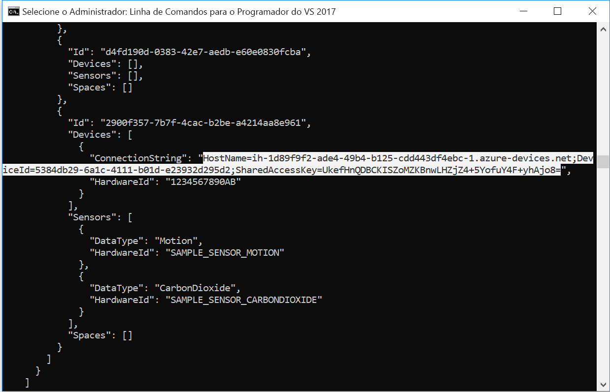
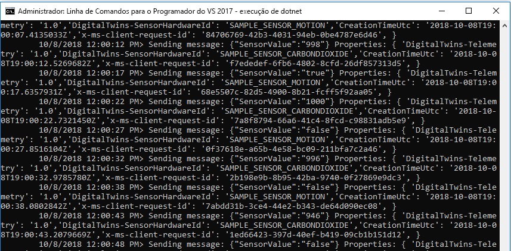
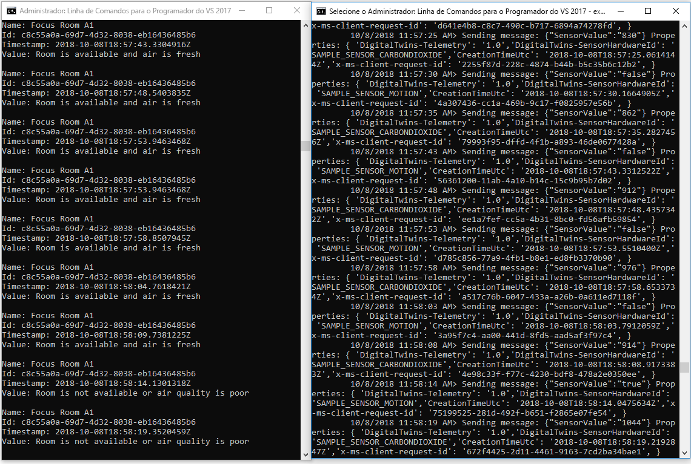

# <a name="quickstart-find-available-rooms-by-using-azure-digital-twins"></a>Início rápido: Salas disponíveis ao utilizar o gémeos Digital do Azure

O serviço de duplos Digital do Azure permite-lhe voltar a criar uma imagem digital do seu ambiente físico. Depois, pode ser notificado por eventos no ambiente e personalizar as respostas para esses eventos.

Este guia de início rápido usa [um par de amostras do .net](https://github.com/Azure-Samples/digital-twins-samples-csharp) para digitalizar uma construção de escritório imaginária. Ele mostra como de salas disponíveis desse edifício. Digital duplos, pode associar vários sensores com o seu ambiente. Também pode descobrir se a qualidade de ar do seu espaço disponível é o ideal com a ajuda de um sensor simulado para emissões de dióxido de carbono. Uma das aplicações de exemplo gera dados de sensor aleatório para o ajudar a visualizar este cenário.

O vídeo seguinte apresenta um resumo da configuração do início rápido:

>[!VIDEO https://www.youtube.com/embed/1izK266tbMI]

## <a name="prerequisites"></a>Pré-requisitos

1. Se não tiver uma conta do Azure, [crie uma conta gratuita](https://azure.microsoft.com/free/?WT.mc_id=A261C142F) antes de começar.

1. As aplicações de dois consola executadas neste início rápido são escritas utilizando C#. Instale o [SDK do .NET Core versão 2.1.403 ou superior](https://www.microsoft.com/net/download) em seu computador de desenvolvimento. Se tiver o .NET Core SDK instalado, certifique-se a versão atual do C# no computador de desenvolvimento. Execute `dotnet --version` em um prompt de comando.

1. Baixe o [projeto C# de exemplo](https://github.com/Azure-Samples/digital-twins-samples-csharp/archive/master.zip). Extraia o arquivo de digital-twins-exemplos-csharp-Master.

## <a name="create-a-digital-twins-instance"></a>Criar uma instância do Digital Twins

Crie uma nova instância do digital gêmeos no [portal](https://portal.azure.com) seguindo as etapas nesta seção.

[!INCLUDE [create-digital-twins-portal](../../includes/digital-twins-create-portal.md)]

## <a name="set-permissions-for-your-app"></a>Definir permissões para a aplicação

Esta secção registra seu aplicativo de exemplo para o Azure Active Directory (Azure AD) para que ele pode aceder à sua instância de duplos Digital. Se já tiver um registo de aplicação do Azure AD, reutilizá-lo para o seu exemplo. Certifique-se de que está configurado conforme descrito nesta secção.

[!INCLUDE [digital-twins-permissions](../../includes/digital-twins-permissions.md)]

## <a name="build-application"></a>Compilar a aplicação

Crie a aplicação de ocupação seguindo estes passos.

1. Abra uma linha de comandos. Vá para a pasta onde os arquivos de `digital-twins-samples-csharp-master.zip` foram extraídos.
1. Execute `cd occupancy-quickstart/src`.
1. Execute `dotnet restore`.
1. Edite [appSettings.json](https://github.com/Azure-Samples/digital-twins-samples-csharp/blob/master/occupancy-quickstart/src/appSettings.json) para atualizar as variáveis seguintes:
    - **ClientID**: Insira a ID do aplicativo do registro do aplicativo do Azure AD, anotada na seção anterior.
    - **Locatário**: Insira a ID de diretório do seu locatário do Azure AD, também anotada na seção anterior.
    - **BaseURL**: a URL de API de gerenciamento da sua instância gêmeos digital está no formato `https://yourDigitalTwinsName.yourLocation.azuresmartspaces.net/management/api/v1.0/`. Substitua os marcadores de posição este URL com os valores para a sua instância da secção anterior.

    Guarde o ficheiro atualizado.

## <a name="provision-graph"></a>Aprovisionar o gráfico

Este passo Aprovisiona o gráfico de geográfico duplos Digital com:

- Vários espaços.
- Um dispositivo.
- Dois sensores.
- Uma função personalizada.
- Uma atribuição de função.

O grafo espacial é provisionado usando o arquivo [provisionSample. YAML](https://github.com/Azure-Samples/digital-twins-samples-csharp/blob/master/occupancy-quickstart/src/actions/provisionSample.yaml) .

1. Execute `dotnet run ProvisionSample`.

    >[!NOTE]
    >A ferramenta de CLI do dispositivo início de sessão do Azure é utilizada para autenticar o utilizador para o Azure AD. O usuário deve inserir um determinado código para autenticar usando [a página de logon da Microsoft](https://microsoft.com/devicelogin) . Depois que o código for inserido, siga as etapas para autenticar. O utilizador tem de ser autenticado quando é executada a ferramenta.

    >[!TIP]
    > Ao executar essa etapa, certifique-se de que suas variáveis foram copiadas corretamente se a seguinte mensagem de erro for exibida: `EXIT: Unexpected error: The input is not a valid Base-64 string ...`

1. O passo de aprovisionamento pode demorar alguns minutos. Ele também fornece um IoT Hub na sua instância de duplos Digital. Ele percorre até que o Hub IoT mostre status =`Running`.

    [](media/quickstart-view-occupancy-dotnet/digital-twins-provision-sample.png#lightbox)

1. No final da execução, copie o `ConnectionString` do dispositivo para uso no exemplo de simulador de dispositivo. Copie apenas a cadeia de caracteres descrita nesta imagem.

    [](media/quickstart-view-occupancy-dotnet/digital-twins-connection-string.png#lightbox)

    >[!TIP]
    > Você pode exibir e modificar o grafo espacial usando o [Visualizador do grafo do gêmeos digital do Azure](https://github.com/Azure/azure-digital-twins-graph-viewer).

Mantenha a janela do console aberta para uso novamente mais tarde.

## <a name="send-sensor-data"></a>Enviar dados do sensor

Compile e execute o aplicativo de dispositivo do sensor Simulator seguindo estas etapas.

1. Abra uma nova linha de comandos. Vá para o projeto que você baixou na pasta `digital-twins-samples-csharp-master`.
1. Execute `cd device-connectivity`.
1. Execute `dotnet restore`.
1. Edit [appSettings. JSON](https://github.com/Azure-Samples/digital-twins-samples-csharp/blob/master/device-connectivity/appsettings.json) para atualizar **DeviceConnectionString** com a `ConnectionString`anterior. Guarde o ficheiro atualizado.
1. Execute `dotnet run` para começar a enviar dados de sensor. Verá enviados para o Digital duplos, conforme mostrado na imagem seguinte.

     [Conectividade de dispositivo ](media/quickstart-view-occupancy-dotnet/digital-twins-device-connectivity.png#lightbox)

1. Permitir que este simulador em execução para que possa visualizar os resultados lado a lado com a ação de passo seguinte. Esta janela mostra os dados de sensor simulado enviados para o Digital duplos. As consultas de passo seguintes em tempo real de salas com ar fresco disponíveis.

    >[!TIP]
    > Ao executar essa etapa, verifique se `DeviceConnectionString` foi copiado corretamente se a seguinte mensagem de erro for exibida: `EXIT: Unexpected error: The input is not a valid Base-64 string ...`

## <a name="find-available-spaces-with-fresh-air"></a>Encontrar espaços disponíveis com ar fresco

O exemplo de sensor simula os valores de dados aleatórios para dois sensores. Eles são motion e emissões de dióxido de carbono. Disponíveis espaços com ar fresco são definidos no exemplo sem presença na sala. Também estão definidos por um nível de dióxido de carbono em 1000 ppm. Se a condição não é atendida, o espaço não está disponível ou a qualidade de ar é fraca.

1. Abra o prompt de comando usado para executar a etapa de provisionamento anteriormente.
1. Execute `dotnet run GetAvailableAndFreshSpaces`.
1. Examinar esse prompt de comando e de linha de comandos de dados do sensor lado a lado.

    O prompt de comando de dados do sensor envia dados simulados de movimento e dióxido para o gêmeos digital a cada cinco segundos. O outro prompt de comando lê o grafo em tempo real para descobrir as salas disponíveis com o ar novo com base em dados simulados aleatórios. Apresenta uma dessas condições em tempo real com base nos dados de sensor que foi enviados pela última vez:
   - `Room is available and air is fresh`
   - `Room is not available or air quality is poor`

     [](media/quickstart-view-occupancy-dotnet/digital-twins-get-available.png#lightbox)

Para entender o que aconteceu neste guia de início rápido e quais APIs foram chamadas, abra [Visual Studio Code](https://code.visualstudio.com/Download) com o projeto espaço de trabalho de código encontrado em `digital-twins-samples-csharp`. Utilize o seguinte comando:

```cmd
<path>\occupancy-quickstart\src>code ..\..\digital-twins-samples.code-workspace
```

Os tutoriais fornecem profundamente o código. Que ensinam como modificar os dados de configuração e o que são chamadas de APIs. Para obter mais informações sobre APIs de gestão, aceda à sua página de Swagger de duplos Digital:

```URL
https://YOUR_INSTANCE_NAME.YOUR_LOCATION.azuresmartspaces.net/management/swagger
```

| Nome | Substituir |
| --- | --- |
| YOUR_INSTANCE_NAME | O nome da sua instância de duplos Digital |
| YOUR_LOCATION | A região do servidor em que sua instância está hospedada |

Ou para sua conveniência, navegue até [digital gêmeos Swagger](https://docs.westcentralus.azuresmartspaces.net/management/swagger).

## <a name="clean-up-resources"></a>Limpar recursos

Os tutoriais entrar em detalhes sobre como:

- Crie uma aplicação para os gestores de recurso aumentar a produtividade de occupant.
- Operar a criação com mais eficiência.

Para continuar para os tutoriais, não limpe os recursos criados neste início rápido. Se não quiser continuar, elimine todos os recursos criados por este início rápido.

1. Elimine a pasta que foi criada quando transferiu o repositório de exemplo.
1. No menu à esquerda na [portal do Azure](https://portal.azure.com), selecione **todos os recursos**. Em seguida, selecione o recurso de duplos Digital. Na parte superior do painel **todos os recursos** , selecione **excluir**.

    > [!TIP]
    > Se você já enfrentou problemas para excluir sua instância digital gêmeos, uma atualização de serviço foi distribuída com a correção. Volte a tentar eliminar a instância.

## <a name="next-steps"></a>Passos seguintes

Este guia de início rápido usou um cenário simples e aplicativos de exemplo para mostrar como o digital gêmeos pode ser usado para encontrar salas com boas condições de trabalho. Para uma análise aprofundada deste cenário, consulte este tutorial:

>[!div class="nextstepaction"]
>[Tutorial: Deploy Azure Digital Twins and configure a spatial graph](tutorial-facilities-setup.md) (Tutorial: Implementar o Azure Digital Twins e configurar um gráfico espacial)
