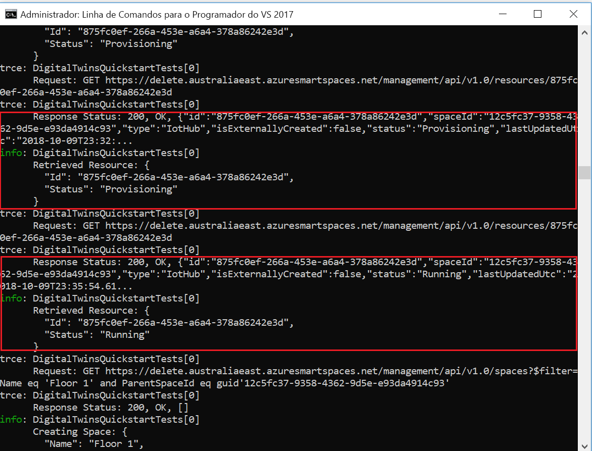

# <a name="quickstart-find-available-rooms-by-using-azure-digital-twins"></a>Início rápido: localizar salas disponíveis usando o gêmeos digital do Azure

O serviço gêmeos do Azure digital permite recriar uma imagem digital do seu ambiente físico. Depois, pode ser notificado por eventos no ambiente e personalizar as respostas para esses eventos.

Este guia de início rápido usa [um par de amostras do .net](https://github.com/Azure-Samples/digital-twins-samples-csharp) para digitalizar uma construção de escritório imaginária. Ele mostra como encontrar as salas disponíveis na criação. Com o digital gêmeos, você pode associar vários sensores ao seu ambiente. Você também pode descobrir se a qualidade do ar de sua sala disponível é ideal com a ajuda de um sensor simulado para dióxido de carbono. Um dos aplicativos de exemplo gera dados de sensor aleatórios para ajudá-lo a visualizar esse cenário.

O vídeo seguinte apresenta um resumo da configuração do início rápido:

>[!VIDEO https://www.youtube.com/embed/1izK266tbMI]

## <a name="prerequisites"></a>Pré-requisitos

1. Se não tiver uma conta do Azure, [crie uma conta gratuita](https://azure.microsoft.com/free/?WT.mc_id=A261C142F) antes de começar.

1. Os dois aplicativos de console executados neste guia de início rápido são escritos C#usando o. Instale o [SDK do .NET Core versão 2.1.403 ou superior](https://www.microsoft.com/net/download) em seu computador de desenvolvimento. Se você tiver o SDK do .NET Core instalado, verifique a versão atual do C# no computador de desenvolvimento. Execute `dotnet --version` em um prompt de comando.

1. Baixe o [projeto C# de exemplo](https://github.com/Azure-Samples/digital-twins-samples-csharp/archive/master.zip). Extraia o arquivo digital-Twins-Samples-Csharp-Master. zip.

## <a name="create-a-digital-twins-instance"></a>Criar uma instância do Digital Twins

Crie uma nova instância do digital gêmeos no [portal](https://portal.azure.com) seguindo as etapas nesta seção.

[!INCLUDE [create-digital-twins-portal](../../includes/digital-twins-create-portal.md)]

## <a name="set-permissions-for-your-app"></a>Definir permissões para a aplicação

Esta seção registra seu aplicativo de exemplo para Azure Active Directory (Azure AD) para que ele possa acessar sua instância de gêmeos digital. Se você já tiver um registro de aplicativo do Azure AD, reutilize-o para seu exemplo. Verifique se ele está configurado conforme descrito nesta seção.

[!INCLUDE [digital-twins-permissions](../../includes/digital-twins-permissions.md)]

## <a name="build-application"></a>Compilar a aplicação

Crie o aplicativo de ocupação seguindo estas etapas.

1. Abra uma linha de comandos. Vá para a pasta onde os arquivos de `digital-twins-samples-csharp-master.zip` foram extraídos.
1. Execute `cd occupancy-quickstart/src`.
1. Execute `dotnet restore`.
1. Edite [appSettings.json](https://github.com/Azure-Samples/digital-twins-samples-csharp/blob/master/occupancy-quickstart/src/appSettings.json) para atualizar as variáveis seguintes:
    - **ClientID**: Insira a ID do aplicativo do registro do aplicativo do Azure AD, anotada na seção anterior.
    - **Locatário**: Insira a ID de diretório do seu locatário do Azure AD, também anotada na seção anterior.
    - **BaseURL**: a URL de API de gerenciamento da sua instância gêmeos digital está no formato `https://yourDigitalTwinsName.yourLocation.azuresmartspaces.net/management/api/v1.0/`. Substitua os espaços reservados nesta URL pelos valores da sua instância da seção anterior.

    Salve o arquivo atualizado.

## <a name="provision-graph"></a>Aprovisionar o gráfico

Esta etapa provisiona o grafo espacial digital gêmeos com:

- Vários espaços.
- Um dispositivo.
- Dois sensores.
- Uma função personalizada.
- Uma atribuição de função.

O grafo espacial é provisionado usando o arquivo [provisionSample. YAML](https://github.com/Azure-Samples/digital-twins-samples-csharp/blob/master/occupancy-quickstart/src/actions/provisionSample.yaml) .

1. Execute `dotnet run ProvisionSample`.

    >[!NOTE]
    >A ferramenta de CLI do Azure de logon do dispositivo é usada para autenticar o usuário no Azure AD. O usuário deve inserir um determinado código para autenticar usando [a página de logon da Microsoft](https://microsoft.com/devicelogin) . Depois que o código for inserido, siga as etapas para autenticar. O usuário deve autenticar quando a ferramenta estiver em execução.

    >[!TIP]
    > Ao executar essa etapa, certifique-se de que suas variáveis foram copiadas corretamente se a seguinte mensagem de erro for exibida: `EXIT: Unexpected error: The input is not a valid Base-64 string ...`

1. A etapa de provisionamento pode levar alguns minutos. Ele também provisiona um hub IoT dentro de sua instância de gêmeos digital. Ele percorre até que o Hub IoT mostre status =`Running`.

    [exemplo de provisionamento de ](media/quickstart-view-occupancy-dotnet/digital-twins-provision-sample1.png#lightbox)

1. No final da execução, copie o `ConnectionString` do dispositivo para uso no exemplo de simulador de dispositivo. Copie somente a cadeia de caracteres descrita nesta imagem.

    [](media/quickstart-view-occupancy-dotnet/digital-twins-provision-sample.png#lightbox)

    >[!TIP]
    > Você pode exibir e modificar o grafo espacial usando o [Visualizador do grafo do gêmeos digital do Azure](https://github.com/Azure/azure-digital-twins-graph-viewer).

Mantenha a janela do console aberta para uso novamente mais tarde.

## <a name="send-sensor-data"></a>Enviar dados do sensor

Compile e execute o aplicativo de dispositivo do sensor Simulator seguindo estas etapas.

1. Abra um novo prompt de comando. Vá para o projeto que você baixou na pasta `digital-twins-samples-csharp-master`.
1. Execute `cd device-connectivity`.
1. Execute `dotnet restore`.
1. Edit [appSettings. JSON](https://github.com/Azure-Samples/digital-twins-samples-csharp/blob/master/device-connectivity/appsettings.json) para atualizar **DeviceConnectionString** com a `ConnectionString`anterior. Salve o arquivo atualizado.
1. Execute `dotnet run` para começar a enviar dados de sensor. Você o verá enviado para o digital gêmeos, conforme mostrado na imagem a seguir.

     [Conectividade de dispositivo ](media/quickstart-view-occupancy-dotnet/digital-twins-device-connectivity.png#lightbox)

1. Permita que esse simulador seja executado para que você possa exibir os resultados lado a lado com a ação da próxima etapa. Esta janela mostra os dados simulados do sensor enviados para o digital gêmeos. A próxima etapa consulta em tempo real para encontrar as salas disponíveis com o novo ar.

    >[!TIP]
    > Ao executar essa etapa, verifique se `DeviceConnectionString` foi copiado corretamente se a seguinte mensagem de erro for exibida: `EXIT: Unexpected error: The input is not a valid Base-64 string ...`

## <a name="find-available-spaces-with-fresh-air"></a>Encontrar espaços disponíveis com ar fresco

O exemplo de sensor simula valores de dados aleatórios para dois sensores. Eles são movimento e dióxido de carbono. Os espaços disponíveis com o ar novo são definidos no exemplo sem presença na sala. Eles também são definidos por um nível de dióxido de carbono em 1.000 ppm. Se a condição não for atendida, o espaço não estará disponível ou a qualidade do ar será ruim.

1. Abra o prompt de comando usado para executar a etapa de provisionamento anteriormente.
1. Execute `dotnet run GetAvailableAndFreshSpaces`.
1. Examine este prompt de comando e o prompt de comando de dados do sensor lado a lado.

    O prompt de comando de dados do sensor envia dados simulados de movimento e dióxido para o gêmeos digital a cada cinco segundos. O outro prompt de comando lê o grafo em tempo real para descobrir as salas disponíveis com o ar novo com base em dados simulados aleatórios. Ele exibe uma dessas condições quase em tempo real com base nos dados do sensor que foram enviados por último:
   - Salas disponíveis com ar fresco.
   - Sala ocupada ou com má qualidade de ar.

     [](media/quickstart-view-occupancy-dotnet/digital-twins-get-available.png#lightbox)

Para entender o que aconteceu neste guia de início rápido e quais APIs foram chamadas, abra [Visual Studio Code](https://code.visualstudio.com/Download) com o projeto espaço de trabalho de código encontrado em `digital-twins-samples-csharp`. Utilize o seguinte comando:

```plaintext
<path>\occupancy-quickstart\src>code ..\..\digital-twins-samples.code-workspace
```

Os tutoriais aprofundam-se no código. Eles ensinam como modificar os dados de configuração e quais APIs são chamadas. Para obter mais informações sobre APIs de gerenciamento, acesse sua página gêmeos do digital do Swagger:

```plaintext
https://YOUR_INSTANCE_NAME.YOUR_LOCATION.azuresmartspaces.net/management/swagger
```

| Nome | Substituir |
| --- | --- |
| YOUR_INSTANCE_NAME | O nome da sua instância de gêmeos digital |
| YOUR_LOCATION | A região do servidor em que sua instância está hospedada |

Ou para sua conveniência, navegue até [digital gêmeos Swagger](https://docs.westcentralus.azuresmartspaces.net/management/swagger).

## <a name="clean-up-resources"></a>Limpar recursos

Os tutoriais entram em detalhes sobre como:

- Crie um aplicativo para que os gerentes de recursos aumentem a produtividade do occupant.
- Opere a compilação com mais eficiência.

Para continuar nos tutoriais, não limpe os recursos criados neste guia de início rápido. Se você não planeja continuar, exclua todos os recursos criados por este guia de início rápido.

1. Exclua a pasta que foi criada quando você baixou o repositório de exemplo.
1. No menu à esquerda na [portal do Azure](https://portal.azure.com), selecione **todos os recursos**. Em seguida, selecione o recurso digital gêmeos. Na parte superior do painel **todos os recursos** , selecione **excluir**.

    > [!TIP]
    > Se você já enfrentou problemas para excluir sua instância digital gêmeos, uma atualização de serviço foi distribuída com a correção. Tente excluir a instância novamente.

## <a name="next-steps"></a>Passos seguintes

Este guia de início rápido usou um cenário simples e aplicativos de exemplo para mostrar como o digital gêmeos pode ser usado para encontrar salas com boas condições de trabalho. Para uma análise detalhada deste cenário, consulte este tutorial:

>[!div class="nextstepaction"]
>[Tutorial: Deploy Azure Digital Twins and configure a spatial graph](tutorial-facilities-setup.md) (Tutorial: Implementar o Azure Digital Twins e configurar um gráfico espacial)
