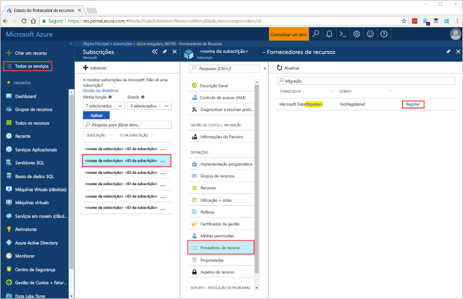
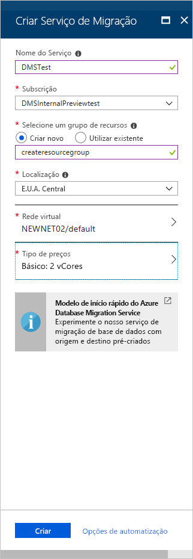
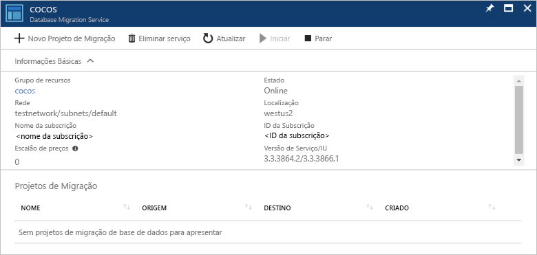

# Início Rápido: Criar uma instância do Azure Database Migration Service com o portal do Azure

Neste Quickstart, você usa o portal Azure para criar uma instância do Azure Database Migration Service.  Depois de criar o caso, pode usá-lo para migrar dados do SQL Server para a Base de Dados Azure SQL.

Se não tiver uma subscrição do Azure, crie uma conta [gratuita](https://azure.microsoft.com/free/) antes de começar.

## Iniciar sessão no portal do Azure

Abra o browser, navegue para o [portal do Microsoft Azure](https://portal.azure.com/) e, em seguida, introduza as suas credenciais para iniciar sessão no portal.

A vista predefinida é o dashboard de serviço.

> [!NOTE]
> Pode criar até 10 instâncias de DMS por subscrição. Se necessitar de um maior número de ocorrências, por favor crie um bilhete de apoio.

## Registar o fornecedor de recursos

Registe o fornecedor de recursos Microsoft.DataMigration antes de criar a primeira instância do Database Migration Service.

1. No portal do Azure, selecione **Todos os serviços** e, em seguida, selecione **Subscrições**.

2. Selecione a subscrição na qual pretende criar a instância do Serviço de Migração da Base de Dados Azure e, em seguida, selecione **fornecedores de Recursos**.

3. Procure por migração e, à direita de **Microsoft.DataMigration**, selecione **Registar**.

    

## Criar uma instância do serviço

1. Selecione +**Crie um recurso** para criar uma instância do Serviço de Migração da Base de Dados Azure.

2. Procure "migração" no marketplace, selecione **Azure Database Migration Service** e, em seguida, no ecrã **Azure Database Migration Service** selecione **Criar**.

3. No ecrã **Criar Serviço de Migração**:

    - Escolha um **Nome de Serviço** que seja memorável e único para identificar o seu caso de Serviço de Migração de Bases de Dados Azure.
    - Selecione a sua **Subscrição** do Azure, na qual pretende criar a instância.
    - Selecione um Grupo de **Recursos** existente ou crie um novo.
    - Escolha a **Localização** que esteja mais próxima do seu servidor de origem ou de destino.
    - Selecione uma **rede Virtual** existente ou crie uma.

        A rede virtual fornece ao Azure Database Migration Service acesso à base de dados de origem e ao ambiente alvo.

        Para obter mais informações sobre como criar uma rede virtual no portal Azure, consulte o artigo [Criar uma rede virtual utilizando o portal Azure](../virtual-network/quick-create-portal.md).

    - Selecione Básico: 1 vCore para o **Escalão de preço**.

        

4. Selecione **Criar**.

    Após alguns momentos, o seu caso de serviço de migração da Base de Dados Azure é criado e pronto a ser utilizado. O Serviço de Migração da Base de Dados Azure apresenta, como mostra a seguinte imagem:

    

## Limpar os recursos

Pode limpar os recursos criados neste Início Rápido ao eliminar o [grupo de recursos do Azure](../azure-resource-manager/management/overview.md). Para eliminar o grupo de recursos, navegue para a instância do Azure Database Migration Service que criou. Selecione o nome do **Grupo de recursos** e selecione **Eliminar grupo de recursos**. Esta ação elimina todos os recursos no grupo de recursos, bem como o próprio grupo.

## Passos seguintes

> [!div class="nextstepaction"]
> [Migrar o SQL Server para a Base de Dados SQL do Azure](tutorial-sql-server-to-azure-sql.md)