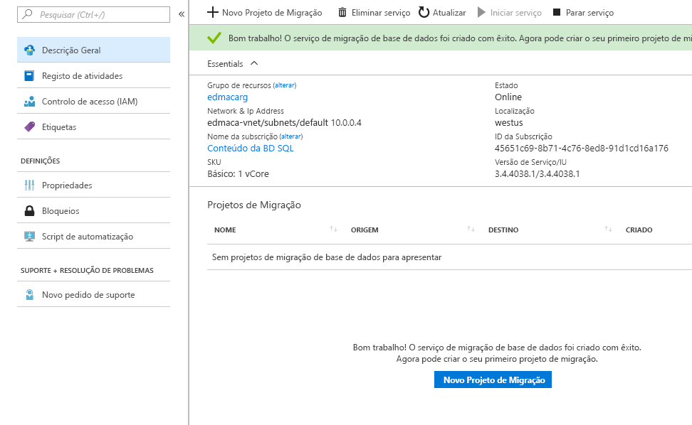

# Início Rápido: Criar uma instância do Azure Database Migration Service com o portal do Azure

Neste guia de início rápido, você usa o portal do Azure para criar uma instância do serviço de migração de banco de dados do Azure.  Depois de criar o serviço, você pode usá-lo para migrar dados do SQL Server local para o banco de dado SQL do Azure.

Se não tiver uma subscrição do Azure, crie uma conta [gratuita](https://azure.microsoft.com/free/) antes de começar.

## Iniciar sessão no portal do Azure

Abra o browser, navegue para o [portal do Microsoft Azure](https://portal.azure.com/) e, em seguida, introduza as suas credenciais para iniciar sessão no portal.

A vista predefinida é o dashboard de serviço.

## Registar o fornecedor de recursos

Registe o fornecedor de recursos Microsoft.DataMigration antes de criar a primeira instância do Database Migration Service.

1. No portal do Azure, selecione **Todos os serviços** e, em seguida, selecione **Subscrições**.

2. Selecione a assinatura na qual você deseja criar a instância do serviço de migração de banco de dados do Azure e, em seguida, selecione **provedores de recursos**.

3. Procure por migração e, à direita de **Microsoft.DataMigration**, selecione **Registar**.

    

## Criar uma instância do serviço

1. Selecione +**criar um recurso** para criar uma instância do serviço de migração de banco de dados do Azure.

2. Procure "migração" no marketplace, selecione **Azure Database Migration Service** e, em seguida, no ecrã **Azure Database Migration Service** selecione **Criar**.

3. No ecrã **Criar Serviço de Migração**:

    - Escolha um **nome de serviço** que seja fácil de memorizar e exclusivo para identificar sua instância do serviço de migração de banco de dados do Azure.
    - Selecione a sua **Subscrição** do Azure, na qual pretende criar a instância.
    - Selecione um **Grupo de Recursos** existente ou crie um novo.
    - Escolha a **Localização** que esteja mais próxima do seu servidor de origem ou de destino.
    - Selecione uma **rede virtual** existente ou crie uma.

        A rede virtual fornece o serviço de migração de banco de dados do Azure com acesso ao banco de dados de origem e ao ambiente de destino.

        Para obter mais informações sobre como criar uma rede virtual no portal do Azure, consulte o artigo [criar uma rede virtual usando o portal do Azure](https://aka.ms/vnet).

    - Selecione Básico: 1 vCore para o **Escalão de preço**.

        

4. Selecione **Criar**.

    Após alguns instantes, sua instância do serviço de migração de banco de dados do Azure é criada e pronta para uso. O serviço de migração de banco de dados do Azure é exibido conforme mostrado na imagem a seguir:

    

## Limpar recursos

Pode limpar os recursos criados neste Início Rápido ao eliminar o [grupo de recursos do Azure](../azure-resource-manager/management/overview.md). Para eliminar o grupo de recursos, navegue para a instância do Azure Database Migration Service que criou. Selecione o nome do **Grupo de recursos** e selecione **Eliminar grupo de recursos**. Esta ação elimina todos os recursos no grupo de recursos, bem como o próprio grupo.

## Passos seguintes

> [!div class="nextstepaction"]
> [Migrar o SQL Server local para a Base de Dados SQL do Azure](tutorial-sql-server-to-azure-sql.md)