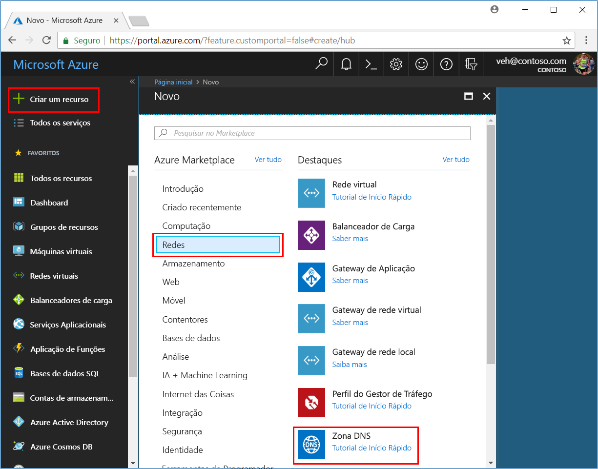
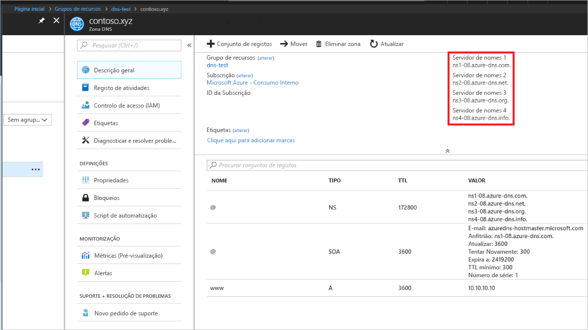

# <a name="quickstart-create-an-azure-dns-zone-and-record-using-the-azure-portal"></a>Quickstart: Criar uma zona Azure DNS e gravar usando o portal Azure

Pode configurar o DNS do Azure para resolver os nomes de anfitrião no seu domínio público. Por exemplo, se adquiriu o nome de domínio *contoso.xyz* a partir de um registrador de nome de domínio, pode configurar o Azure DNS para hospedar o domínio *contoso.xyz* e resolver *`www.contoso.xyz`* para o endereço IP do seu servidor web ou aplicação web.

Neste arranque rápido, criará um domínio de teste e, em seguida, criará um registo de endereço para resolver *www* para o endereço IP *10.10.10.10 .10*.

>[!IMPORTANT]
>Todos os nomes e endereços IP neste quickstart são exemplos que não representam cenários do mundo real.

<!---
You can also perform these steps using [Azure PowerShell](dns-getstarted-powershell.md) or the cross-platform [Azure CLI](dns-getstarted-cli.md).
--->

Se não tiver uma subscrição do Azure, crie uma [conta gratuita](https://azure.microsoft.com/free/?WT.mc_id=A261C142F) antes de começar.

Para todos os passos do portal, inscreva-se no [portal Azure](https://portal.azure.com).

## <a name="prerequisites"></a>Pré-requisitos

- Uma conta Azure com uma subscrição ativa. [Crie uma conta gratuita.](https://azure.microsoft.com/free/?WT.mc_id=A261C142F)

## <a name="sign-in-to-the-azure-portal"></a>Iniciar sessão no portal do Azure

Inicie sessão no [portal do Azure](https://portal.azure.com) com a sua conta do Azure.

## <a name="create-a-dns-zone"></a>Criar uma zona DNS

Uma zona DNS contém as entradas DNS para um domínio. Para começar a hospedar o seu domínio em DNS Azure, cria uma zona DNS para esse nome de domínio. 

**Para criar a zona DNS:**

1. Na parte superior esquerda, **selecione Criar um recurso,** em **seguida, networking**, e depois **zona DNS**.

1. Na página da **zona Do DDS,** escreva ou selecione os seguintes valores:

   - **Nome**: Escreva *contoso.xyz* para este exemplo de arranque rápido. O nome da zona DNS pode ser qualquer valor que ainda não esteja configurado nos servidores Azure DNS. Um valor real seria um domínio que comprou de uma entidade de registo de nomes de domínio.
   - **Grupo de recursos**: Selecione **Criar novo,** insira *o MyResourceGroup* e selecione **OK**. O nome do grupo de recursos deve ser único dentro da assinatura Azure. 

1. Selecione **Criar**.

   

A criação da zona pode demorar alguns minutos.

## <a name="create-a-dns-record"></a>Criar um registo DNS

Cria entradas ou registos DNS para o seu domínio dentro da zona DNS. Crie um novo registo de endereços ou registo 'A' para resolver um nome de anfitrião para um endereço IPv4.

**Para criar um disco 'A':**

1. No portal Azure, em **todos os recursos,** abra a zona **de DNS contoso.xyz** no grupo de recursos **MyResourceGroup.** Pode introduzir *contoso.xyz* na caixa de **nomes filter para** encontrá-lo mais facilmente.

1. No topo da página da **zona DNS,** selecione **+ Conjunto de registos**.

1. Na página **de conjunto de registos adicionar,** digite ou selecione os seguintes valores:

   - **Nome**: Escreva *www*. O nome de registo é o nome de anfitrião que pretende resolver para o endereço IP especificado.
   - **Tipo**: Selecione **A**. Os registos 'A' são os mais comuns, mas existem outros tipos de registo para servidores de correio ('MX'), endereços IP v6 ('AAA') e assim por diante. 
   - **TTL**: Tipo *1*. *O tempo de vida* do pedido dns especifica quanto tempo os servidores DNS e os clientes podem cache uma resposta.
   - **Unidade TTL**: Selecione **Horas**. Esta é a unidade de tempo para o valor **TTL.** 
   - **Endereço IP**: Para este exemplo de arranque rápido, tipo *10.10.10.10.10*. Este valor é o endereço IP que o nome de registo resolve. Num cenário real, introduziria o endereço IP público para o seu servidor Web.

Uma vez que este quickstart é apenas para fins de teste rápido, não há necessidade de configurar os servidores de nomeS DNS Azure em um registrador de nome de domínio. Com um domínio de produção real, você vai querer que qualquer pessoa na Internet resolva o nome do anfitrião para ligar ao seu servidor web ou app. Irá visitar o seu registo de nomes de domínio para substituir os registos do servidor de nomes pelos servidores de nomeS Azure DNS. Para mais informações, consulte [Tutorial: Hospedar o seu domínio em Azure DNS](dns-delegate-domain-azure-dns.md#delegate-the-domain).

## <a name="test-the-name-resolution"></a>Testar a resolução de nomes

Agora que tem uma zona de DNS de teste com um registo de teste 'A', pode testar a resolução do nome com uma ferramenta chamada *nslookup*. 

**Para testar a resolução do nome DNS:**

1. No portal Azure, em **todos os recursos,** abra a zona **de DNS contoso.xyz** no grupo de recursos **MyResourceGroup.** Pode introduzir *contoso.xyz* na caixa de **nomes filter para** encontrá-lo mais facilmente.

1. Copie um dos nomes do servidor de nomes da lista de servidores de nomes na página **'Vista Geral'.** 

   

1. Abra um pedido de comando e executar o seguinte comando:

   ```
   nslookup www.contoso.xyz <name server name>
   ```

   Por exemplo:

   ```
   nslookup www.contoso.xyz ns1-08.azure-dns.com.
   ```

   Deve ver algo como o seguinte ecrã:

   

O nome de anfitrião **www \. contoso.xyz** resolve para **10.10.10.10**, tal como o configura. Este resultado verifica que a resolução de nomes está a funcionar corretamente. 

## <a name="clean-up-resources"></a>Limpar os recursos

Quando já não precisar dos recursos que criou neste quickstart, remova-os eliminando o grupo de recursos **MyResourceGroup.** Abra o grupo de recursos **MyResourceGroup** e selecione **Delete resource group**.

## <a name="next-steps"></a>Passos seguintes

> [!div class="nextstepaction"]
> [Criar registos DNS para uma aplicação Web num domínio personalizado](./dns-web-sites-custom-domain.md)
