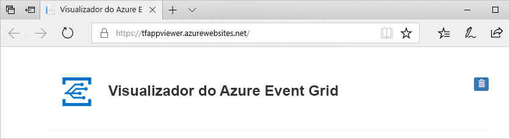
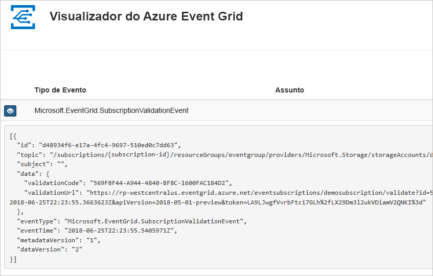

# Quickstart: Route Blob storage events to web endpoint with the Azure portal

O Azure Event Grid é um serviço de eventos para a cloud. Neste artigo, irá utilizar o portal do Azure para criar uma conta de armazenamento de Blobs, subscrever eventos nesse armazenamento de blobs e acionar um evento para ver o resultado. Normalmente, envia eventos para um ponto final que processa os dados de eventos e efetua ações. No entanto, para simplificar este artigo, vai enviar eventos para uma aplicação Web que recolhe e apresenta as mensagens.

[!INCLUDE [quickstarts-free-trial-note.md](../../includes/quickstarts-free-trial-note.md)]

Quando tiver terminado, verá que os dados do evento foram enviados para a aplicação Web.

## Criar uma conta de armazenamento

1. Inscreva-se no [portal Azure](https://portal.azure.com/).

1. Para criar um armazenamento de Blobs, selecione **Criar um recurso**. 

1. Selecione o **Armazenamento** para filtrar as opções disponíveis e selecione **Conta de armazenamento - blob, ficheiro, tabela, fila**.

   

   Para subscrever eventos, tem de criar uma conta de armazenamento de Blobs ou uma conta de armazenamento de fins gerais v2.
   
1. Na página da **conta de armazenamento Criar,** faça os seguintes passos:
    1. Selecione a sua subscrição do Azure. 
    2. Para **o grupo de recursos,** crie um novo grupo de recursos ou selecione um existente. 
    3. Introduza o nome da conta de armazenamento. 
    4. Selecione **Rever + criar**. 

           
    5. Na página **'Rever + criar',** rever as definições e selecionar **Criar**. 

        >[!NOTE]
        > Apenas contas de armazenamento do tipo **StorageV2 (propósito geral v2)** e integração de eventos de suporte **BlobStorage.** **O armazenamento (propósito genral v1)** *não* suporta a integração com a Grade de Eventos.

## Criar um ponto final de mensagem

Antes de subscrever aos eventos do armazenamento de Blobs, vamos criar o ponto final para a mensagem de evento. Normalmente, o ponto final executa as ações com base nos dados do evento. Para simplificar este início rápido, vai implementar uma [aplicação Web pré-criada](https://github.com/Azure-Samples/azure-event-grid-viewer) para apresentar as mensagens de evento. A solução implementada inclui um plano do Serviço de Aplicações, uma aplicação Web do Serviço de Aplicações e o código de origem do GitHub.

1. Selecione **Implementar no Azure** para implementar a solução para a sua subscrição. 

   
2. Na página **de implantação personalizada,** faça os seguintes passos: 
    1. Para **o grupo de recursos,** selecione o grupo de recursos que criou ao criar a conta de armazenamento. Será mais fácil para si limpar depois de terminar o tutorial eliminando o grupo de recursos.  
    2. Para **Nome do Site,** insira um nome para a aplicação web.
    3. Para **hospedar o nome do plano,** insira um nome para o plano de Serviço de Aplicações a utilizar para hospedar a aplicação web.
    4. Selecione a caixa de verificação pois **concordo com os termos e condições acima indicados**. 
    5. Selecione **Comprar**. 

       
1. A implementação pode demorar alguns minutos. Selecione Alertas (ícone da campainha) no portal e, em seguida, selecione **Vá para o grupo de recursos**. 

    
4. Na página do **grupo Recursos,** na lista de recursos, selecione a aplicação web que criou. Você também vê o plano de Serviço de Aplicações e a conta de armazenamento nesta lista. 

    
5. Na página **de Serviço de Aplicações** para a sua aplicação web, selecione o URL para navegar no site. O URL deve estar neste formato: `https://<your-site-name>.azurewebsites.net` .
    
    

6. Confirme que vê o site, mas ainda não foram publicados quais foram os eventos.

   

[!INCLUDE [event-grid-register-provider-portal.md](../../includes/event-grid-register-provider-portal.md)]

## Subscrever a conta de armazenamento de Blobs

Subscreva um tópico para comunicar ao Event Grid os eventos que pretende controlar e para onde enviar os eventos.

1. No portal, navegue para a sua conta de Armazenamento Azure que criou anteriormente. No menu à esquerda, selecione **Todos os recursos** e selecione a sua conta de armazenamento. 
2. Na página da **conta 'Armazenamento',** selecione **Eventos** no menu esquerdo. 
1. Selecione **Mais Opções**, e **Webhook**. Está a enviar eventos para a sua aplicação de espectadores usando um web hook para o ponto final. 

   
3. Na página **'Criar Subscrição de** Eventos', faça os seguintes passos: 
    1. Insira um **nome** para a subscrição do evento.
    2. Insira um **nome** para o tópico do **sistema**. Para conhecer os tópicos do sistema, consulte [a visão geral dos tópicos do sistema.](system-topics.md)

       
    2. Selecione **Web Hook** para **o tipo Endpoint**. 

       
4. Para **Endpoint**, clique em **Selecionar um ponto final**, e insira o URL da sua aplicação web e adicione ao URL da página inicial `api/updates` (por exemplo: `https://spegridsite.azurewebsites.net/api/updates` ), e, em seguida, selecione **Confirmar Seleção**.

   
5. Agora, na página **De Subscrição** de Eventos Criar, selecione **Criar** para criar a subscrição do evento. 

   

1. Verifique a aplicação Web novamente e repare que um evento de validação de subscrição foi enviado para a mesma. Selecione o ícone do olho para expandir os dados do evento. O Event Grid envia o evento de validação para que o ponto final possa verificar que pretende receber dados de eventos. A aplicação Web inclui código para validar a subscrição.

   

Agora, vamos acionar um evento para ver como o Event Grid distribui a mensagem para o ponto final.

## Enviar um evento para o seu ponto final

Aciona um evento para o armazenamento de Blobs ao carregar um ficheiro. O ficheiro não precisa de qualquer conteúdo específico. Os artigos partem do princípio de que tem um ficheiro denominado testfile.txt, mas pode utilizar qualquer ficheiro.

1. No portal Azure, navegue na sua conta de armazenamento Blob e selecione **Recipientes** na página **'Vista Geral'.**

   

1. Selecionar **+ Contentor**. Dar-lhe um nome e usar qualquer nível de acesso e selecione **Criar**. 

   

1. Selecione o novo contentor.

   

1. Para carregar um ficheiro, selecione **Carregar**. Na página **de blob do Upload,** navegue e selecione um ficheiro que pretende carregar para testes e, em seguida, selecione **Upload** nessa página. 

   

1. Navegue para o ficheiro de teste e carregue-o.

1. Acionou o evento e o Event Grid enviou a mensagem para o ponto final que configurou ao subscrever. A mensagem está no formato JSON e contém uma matriz com um ou mais eventos. No exemplo seguinte, a mensagem JSON contém uma matriz com um evento. Veja a sua aplicação web e note que foi recebido um evento **criado pela blob.** 

   

## Limpar os recursos

Se quiser continuar a trabalhar com este evento, não limpe os recursos criados neste artigo. Caso contrário, elimine os recursos que criou neste artigo.

Selecione o grupo de recursos e selecione **Eliminar grupo de recursos**.

## Passos seguintes

Agora que sabe como criar tópicos personalizados e subscrições de eventos, saiba mais sobre o que o Event Grid pode ajudá-lo a fazer:

- [Sobre o Event Grid](overview.md)
- [Encaminhar eventos de armazenamento de Blobs para um ponto final Web personalizado](../storage/blobs/storage-blob-event-quickstart.md?toc=%2fazure%2fevent-grid%2ftoc.json)
- [Monitorizar alterações de máquina virtual com o Azure Event Grid e Logic Apps](monitor-virtual-machine-changes-event-grid-logic-app.md)
- [Transmitir macrodados em fluxo para um armazém de dados](event-grid-event-hubs-integration.md)
