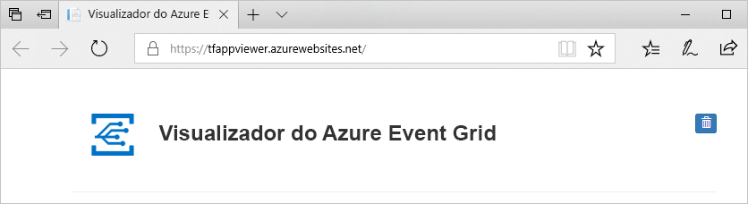
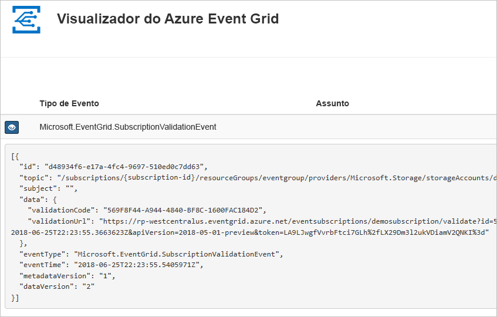
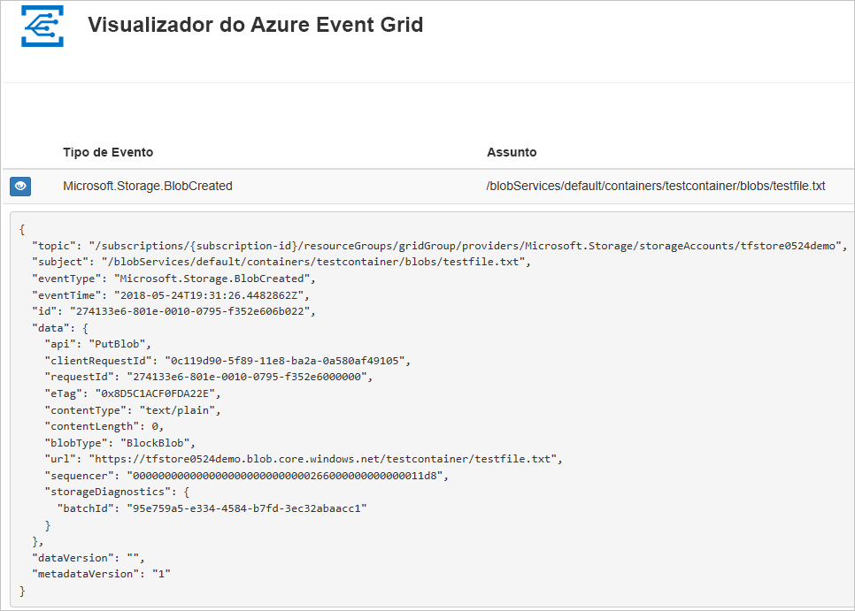

# Quickstart: Route Blob storage events to web endpoint usando um modelo ARM

O Azure Event Grid é um serviço de eventos para a cloud. Neste artigo, você usa um modelo de Gestor de Recursos Azure (modelo ARM) para criar uma conta de armazenamento Blob, subscrever eventos para esse armazenamento de bolhas, e desencadear um evento para ver o resultado. Normalmente, envia eventos para um ponto final que processa os dados de eventos e efetua ações. No entanto, para simplificar este artigo, vai enviar eventos para uma aplicação Web que recolhe e apresenta as mensagens.

[!INCLUDE [About Azure Resource Manager](../../includes/resource-manager-quickstart-introduction.md)]

Se o seu ambiente cumpre os pré-requisitos e se está familiarizado com a utilização de modelos ARM, selecione o botão **Implementar no Azure**. O modelo será aberto no portal do Azure.

## Pré-requisitos

Se não tiver uma subscrição do Azure, crie uma [conta gratuita](https://azure.microsoft.com/free/) antes de começar.

### Criar um ponto final de mensagem

Antes de subscrever aos eventos do armazenamento de Blobs, vamos criar o ponto final para a mensagem de evento. Normalmente, o ponto final executa as ações com base nos dados do evento. Para simplificar este início rápido, vai implementar uma [aplicação Web pré-criada](https://github.com/Azure-Samples/azure-event-grid-viewer) para apresentar as mensagens de evento. A solução implementada inclui um plano do Serviço de Aplicações, uma aplicação Web do Serviço de Aplicações e o código de origem do GitHub.

1. Selecione **Implementar no Azure** para implementar a solução para a sua subscrição. No portal do Azure, indique os valores para os parâmetros.

    [Implementar no Azure](https://portal.azure.com/#create/Microsoft.Template/uri/https%3A%2F%2Fraw.githubusercontent.com%2FAzure-Samples%2Fazure-event-grid-viewer%2Fmaster%2Fazuredeploy.json)
1. A implementação pode demorar alguns minutos. Após a implementação ter sido concluída com êxito, verifique a aplicação Web para verificar se está em execução. Num browser, navegue para: `https://<your-site-name>.azurewebsites.net`

1. Vê o site, mas ainda não foram publicados eventos no mesmo.

   

## Rever o modelo

O modelo utilizado neste início rápido pertence aos [Modelos de Início Rápido do Azure](https://azure.microsoft.com/resources/templates/101-event-grid-subscription-and-storage/).

:::code language="json" source="~/quickstart-templates/101-event-grid-subscription-and-storage/azuredeploy.json":::

Dois recursos Azure são definidos no modelo:

* [**Microsoft.Storage/storageAstas:**](/azure/templates/microsoft.storage/storageaccounts)criar uma conta de Armazenamento Azure.
* [**Microsoft.EventGrid/systemTopics:**](/azure/templates/microsoft.eventgrid/systemtopics)crie um tópico de sistema com o nome especificado para a conta de armazenamento.
* [**Microsoft.EventGrid/systemTopics/eventSubscriptions**](/azure/templates/microsoft.eventgrid/systemtopics/eventsubscriptions): crie uma subscrição da Azure Event Grid para o tópico do sistema.

## Implementar o modelo

1. Selecione a ligação seguinte para iniciar sessão no Azure e abrir um modelo. O modelo cria um cofre chave e um segredo.

    

2. Especificar o **ponto final**: forneça o URL da sua aplicação web e adicione ao URL da `api/updates` página inicial.
3. Selecione **Comprar** para implementar o modelo.

  O portal Azure é usado aqui para implementar o modelo. Também pode utilizar a Azure PowerShell, Azure CLI e REST API. Para aprender outros métodos de implementação, consulte [os modelos de implementação](../azure-resource-manager/templates/deploy-powershell.md).

> [!NOTE]
> Você pode encontrar mais amostras de modelo de Azure Event Grid [aqui.](https://azure.microsoft.com/resources/templates/?resourceType=Microsoft.Eventgrid&pageNumber=1&sort=Popular)

## Validar a implementação

Verifique a aplicação Web novamente e repare que um evento de validação de subscrição foi enviado para a mesma. Selecione o ícone do olho para expandir os dados do evento. O Event Grid envia o evento de validação para que o ponto final possa verificar que pretende receber dados de eventos. A aplicação Web inclui código para validar a subscrição.

Agora, vamos acionar um evento para ver como o Event Grid distribui a mensagem para o ponto final.

Aciona um evento para o armazenamento de Blobs ao carregar um ficheiro. O ficheiro não precisa de qualquer conteúdo específico. Os artigos partem do princípio de que tem um ficheiro denominado testfile.txt, mas pode utilizar qualquer ficheiro.

Quando envia o ficheiro para o armazenamento da Azure Blob, o Event Grid envia uma mensagem para o ponto final que configura quando subscreve. A mensagem está no formato JSON e contém uma matriz com um ou mais eventos. No exemplo seguinte, a mensagem JSON contém uma matriz com um evento. Veja a sua aplicação Web e repare que foi recebido um evento criado por um blob.

## Limpar os recursos

Quando já não for necessário, [elimine o grupo de recursos](../azure-resource-manager/management/delete-resource-group.md?tabs=azure-portal#delete-resource-group
).

## Passos seguintes

Para obter mais informações sobre os modelos do Gestor de Recursos Azure, consulte os seguintes artigos:

* [Documentação do Azure Resource Manager](../azure-resource-manager/index.yml)
* [Definir recursos nos modelos do Azure Resource Manager](/azure/templates/)
* [Modelos de Início Rápido do Azure](https://azure.microsoft.com/resources/templates/)
* [Modelos de grelha de eventos Azure](https://azure.microsoft.com/resources/templates/?resourceType=Microsoft.Eventgrid).
