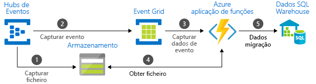

# Escolha entre serviços de mensagens Azure - Event Grid, Event Hubs e Service Bus

O Azure oferece três serviços que ajudam a entregar mensagens de eventos numa solução. Esses serviços são:

* [Event Grid](./index.yml)
* [Hubs de Eventos](../event-hubs/index.yml)
* [Service Bus](../service-bus-messaging/index.yml)

Embora tenham alguns semelhanças, cada serviço foi concebido para determinados cenários. Este artigo descreve as diferenças entre esses serviços e ajuda-o a compreender qual escolher para a sua aplicação. Em muitos casos, os serviços de mensagens são complementares e podem ser utilizados em conjunto.

## Serviços de eventos vs. serviços de mensagens

Há uma distinção importante a ter em atenção entre os serviços que entregam eventos e os serviços que entregam mensagens.

### Evento

Um evento é uma notificação simples de uma condição ou alteração de estado. O publicador do evento não tem nenhum expectativa sobre o modo como o evento é processado. O consumidor do evento decide o que fazer com a notificação. Os eventos podem ser unidades discretas ou fazer parte de uma série.

Os eventos discretos comunicam alterações de estado e são acionáveis. Para dar o passo seguinte, o consumidor só tem de saber que algo aconteceu. Os dados do evento têm informações sobre o que aconteceu, mas não têm os dados que o acionaram. Por exemplo, um evento notifica os consumidores de que foi criado um ficheiro. Poderá ter informações gerais sobre o ficheiro, mas não tem o ficheiro em si. Eventos discretos são ideais para soluções [sem servidor](https://azure.com/serverless) que precisam de escalar.

Os eventos de série comunicam uma condição e são analisáveis. Os eventos são ordenados por tempo e inter-relacionados. O consumidor precisa da série sequenciada de eventos para analisar o que aconteceu.

### Mensagem

Uma mensagem são dados não processados produzidos por um serviço e que vão ser consumidos ou armazenados noutro local. A mensagem contém os dados que acionaram o pipeline de mensagens. O publicador da mensagem tem expectativas sobre a forma como o consumidor processa a mensagem. Existe um contrato entre os dois lados. Por exemplo, o publicador envia uma mensagem com os dados não processados e espera que o consumidor crie um ficheiro a partir dos mesmos e envie uma resposta quando o trabalho estiver concluído.

## Comparação de serviços

| Serviço | Objetivo | Tipo | Quando utilizar |
| ------- | ------- | ---- | ----------- |
| Event Grid | Programação reativa | Distribuição de eventos (discretos) | Reagir a alterações de estado |
| Hubs de Eventos | Pipeline de macrodados | Transmissão de eventos em fluxo (série) | Transmissão de telemetria e dados distribuídos em fluxo |
| Service Bus | Mensagens empresariais de alto valor | Mensagem | Processamento de encomendas e de transações financeiras |

### Event Grid

O Event Grid é um backplane de eventos que permite a programação reativa e orientada para eventos. Utiliza um modelo de publicação-subscrição. Os publicadores emitem eventos, mas não têm expectativas sobre que eventos são processados. Os subscritores decidem que eventos pretendem processar.

O Event Grid está profundamente integrado nos serviços do Azure e pode ser integrado em serviços de terceiros. Ao eliminar a necessidade de consultas constantes, simplifica o consumo de eventos e reduz os custos. Encaminha, de forma eficiente e fiável, os eventos de recursos do Azure e não Azure. Distribui os eventos para pontos finais de subscritor registado. A mensagem do evento tem as informações que sã precisas para reagir a alterações em serviços e aplicações. O Event Grid não é um pipeline de dados e não entrega o objeto propriamente dito que foi atualizado.

A Grade de Eventos suporta a inscrição para eventos que não são entregues a um ponto final.

Tem as seguintes caraterísticas:

* dinamicamente dimensionável
* baixo custo
* sem servidor
* pelo menos uma entrega

### Hubs de Eventos

Os Hubs de Eventos do Azure são um pipeline de macrodados. Facilita a captura, retenção e reprodução de dados de transmissão de telemetria e eventos. Os dados podem ter várias origens em simultâneo. Os Hubs de Eventos permitem que os dados de telemetria e eventos sejam disponibilizados a diversos serviços de análises e infraestruturas de processamento de transmissões em fluxo. Está disponível como fluxos de dados ou lotes de eventos integrados. Este serviço proporciona uma solução única que permite a obtenção de dados rápida para processamento em tempo real, bem como a reprodução repetida dos dados não processados armazenados. Pode capturar os dados de transmissão em fluxo num ficheiro para processamento e análise.

Tem as seguintes caraterísticas:

* baixa latência
* capacidade para receber e processar milhões de eventos por segundo
* pelo menos uma entrega

### Service Bus

O Service Bus destina-se a aplicações empresariais tradicionais. Estas aplicações empresariais precisam de transações, encomendas, deteção de duplicados e consistência instantânea. O Service Bus permite que aplicações [nativas da nuvem](https://azure.microsoft.com/overview/cloudnative/) forneçam uma gestão fiável da transição do Estado para os processos de negócio. Para processar mensagens de alto valor que não podem ser perdidas ou duplicadas, utilize o Azure Service Bus. Além disso, também facilita a comunicação altamente segura em soluções de cloud híbrida e pode ligar sistemas no local existentes a soluções na cloud.

O Service Bus é um sistema de mensagens mediadas. Armazena as mensagens num "mediador" (por exemplo, uma fila) até que a parte consumidora esteja preparada para recebê-las.

Tem as seguintes caraterísticas:

* entrega de mensagens assíncrona fiável (mensagens empresariais como serviço) que requer consulta
* funcionalidades de mensagens avançadas, como FIFO, processamento por lotes/sessões, transações, mensagens não entregues, controlo temporal, encaminhamento e filtragem e deteção de duplicados
* pelo menos uma entrega
* entrega ordenada opcional

## Utilizar os serviços em conjunto

Em alguns casos, pode utilizar os serviços lado a lado para dar resposta a funções distintas. Por exemplo, um site de e-commerce pode usar o Service Bus para processar a encomenda, Os Centros de Eventos para capturar telemetria no site e a Grade de Eventos para responder a eventos como um item foi enviado.

Noutros casos, pode utilizá-los ao mesmo tempo para formar um pipeline de eventos e dados. O Event Grid é utilizado para responder aos eventos dos outros serviços. Para obter um exemplo de como utilizar o Event Grid com os Hubs de Eventos para migrar dados para um armazém de dados, veja [Stream big data into a data warehouse](event-grid-event-hubs-integration.md) (Transmitir macrodados em fluxo para um armazém de dados). A imagem abaixo mostra o fluxo de trabalho da transmissão dos dados em fluxo.

## Passos seguintes
Consulte os seguintes artigos: 
- [Opções de mensagens assíncronas no Azure](/azure/architecture/guide/technology-choices/messaging)
- [Eventos, Pontos de Dados e Mensagens - Escolher o serviço de mensagens Azure certo para os seus dados.](https://azure.microsoft.com/blog/events-data-points-and-messages-choosing-the-right-azure-messaging-service-for-your-data/)
- [Filas de armazenamento e filas de autocarros de serviço - comparadas e contrastadas](../service-bus-messaging/service-bus-azure-and-service-bus-queues-compared-contrasted.md)
- Para começar a utilizar o Event Grid, veja [Criar e encaminhar eventos personalizados com o Azure Event Grid](custom-event-quickstart.md).
- Para começar a utilizar os Hubs de Eventos, veja [Create an Event Hubs namespace and an event hub using the Azure portal](../event-hubs/event-hubs-create.md) (Criar um espaço de nomes dos Hubs de Eventos e um hub de eventos com o portal do Azure).
- Para começar a utilizar o Service Bus, veja [Criar um espaço de nomes do Service Bus com o portal do Azure](../service-bus-messaging/service-bus-create-namespace-portal.md).
