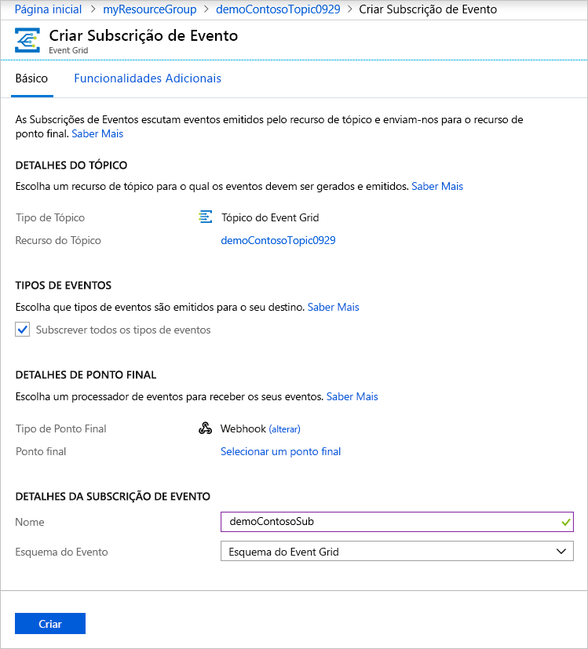

# <a name="quickstart-route-custom-events-to-web-endpoint-with-the-azure-portal-and-event-grid"></a>Início rápido: Encaminhar eventos personalizados para o ponto final da web com o portal do Azure e o Event Grid

O Azure Event Grid é um serviço de eventos para a cloud. Neste artigo, o portal do Azure serve para criar um tópico personalizado, subscrever o tópico personalizado e acionar o evento para ver o resultado. Normalmente, envia eventos para um ponto final que processa os dados de eventos e efetua ações. No entanto, para simplificar este artigo, vai enviar eventos para uma aplicação Web que recolhe e apresenta as mensagens.

Quando tiver terminado, verá que os dados do evento foram enviados para a aplicação Web.


[!INCLUDE [updated-for-az](../../includes/updated-for-az.md)]

[!INCLUDE [quickstarts-free-trial-note.md](../../includes/quickstarts-free-trial-note.md)]

[!INCLUDE [event-grid-register-provider-portal.md](../../includes/event-grid-register-provider-portal.md)]

## <a name="create-a-custom-topic"></a>Criar um tópico personalizado

Um tópico do Event Grid fornece um ponto final definido pelo utilizador no qual publica os eventos. 

1. Inicie sessão no [portal do Azure](https://portal.azure.com/).
2. Selecione **todos os serviços** no menu de navegação à esquerda e procure **Event Grid**e selecione **tópicos do Event Grid**. 

    
3. Sobre o **tópicos do Event Grid** página, selecione **+ adicionar** na barra de ferramentas. 

    
4. Sobre o **criar tópico** página, siga estes passos:
    1. Fornecer um exclusivo **nome** para o tópico personalizado. O nome do tópico deve ser exclusivo, porque este é representado por uma entrada DNS. Não utilize o nome apresentado na imagem. Em vez disso, criar seu próprio nome - tem de ter entre 3 e 50 carateres e conter apenas valores-z, A-Z, 0-9, e "-".
    2. Selecione a sua **subscrição** do Azure.
    3. Selecione um grupo de recursos existente ou selecione **criar novo**e introduza um **nome** para o **grupo de recursos**.
    4. Selecione um **localização** para o tópico do event grid.
    5. Mantenha o valor predefinido **esquema de grelha de eventos** para o **esquema de eventos** campo. 

       
    6. Selecione **Criar**. 
5. Depois de o tópico personalizado ter sido criado, verá a notificação de êxito. Selecione **vá para o grupo de recursos**. 

   
6. Sobre o **grupo de recursos** , selecione o tópico do event grid. 

   
7. Verá o **tópico do Event Grid** página para o event grid. Mantenha esta página aberta. Utilizá-lo mais tarde no início rápido. 

    

## <a name="create-a-message-endpoint"></a>Criar um ponto final de mensagem
Antes de criar uma subscrição para o tópico personalizado, crie um ponto final para a mensagem de evento. Normalmente, o ponto final executa as ações com base nos dados do evento. Para simplificar este início rápido, vai implementar uma [aplicação Web pré-criada](https://github.com/Azure-Samples/azure-event-grid-viewer) para apresentar as mensagens de evento. A solução implementada inclui um plano do Serviço de Aplicações, uma aplicação Web do Serviço de Aplicações e o código de origem do GitHub.

1. Na página do artigo, selecione **implementar no Azure** para implantar a solução à sua subscrição. No portal do Azure, indique os valores para os parâmetros.

   <a href="https://portal.azure.com/#create/Microsoft.Template/uri/https%3A%2F%2Fraw.githubusercontent.com%2FAzure-Samples%2Fazure-event-grid-viewer%2Fmaster%2Fazuredeploy.json" target="_blank"></a>
1. A implementação pode demorar alguns minutos. Após a implementação ter sido concluída com êxito, verifique a aplicação Web para verificar se está em execução. Num browser, navegue para: `https://<your-site-name>.azurewebsites.net`
1. Vê o site, mas ainda não foram publicados eventos no mesmo.

   

## <a name="subscribe-to-custom-topic"></a>Subscrever um tópico personalizado

Subscreva um tópico do Event Grid para comunicar ao Event Grid os eventos que pretende controlar e para onde enviar os eventos.

1. Agora, sobre o **tópico do Event Grid** página para o seu tópico personalizado, selecione **+ subscrição de evento** na barra de ferramentas.

   
2. Sobre o **criar subscrição de evento** página, siga estes passos:
    1. Evento de um **nome** para a subscrição de evento.
    3. Selecione **Hook de Web** para o **tipo de ponto final**. 
    4. Escolher **selecione um ponto de extremidade**. 

       
    5. Para o ponto final do webhook, indique o URL da sua aplicação Web e adicione `api/updates` ao URL da home page. Selecione **Confirmar a Seleção**.

       
    6. Volta a **criar subscrição de evento** página, selecione **criar**.

3. Verifique a aplicação Web novamente e repare que um evento de validação de subscrição foi enviado para a mesma. Selecione o ícone do olho para expandir os dados do evento. O Event Grid envia o evento de validação para que o ponto final possa verificar que pretende receber dados de eventos. A aplicação Web inclui código para validar a subscrição.

    

## <a name="send-an-event-to-your-topic"></a>Enviar um evento para o seu tópico

Agora, vamos acionar um evento para ver como o Event Grid distribui a mensagem para o ponto final. Utilize a CLI do Azure ou o PowerShell para enviar um evento de teste para o seu tópico personalizado. Normalmente, uma aplicação ou serviço do Azure enviaria os dados do evento.

O primeiro exemplo utiliza a CLI do Azure. Obtém o URL e a chave para o tópico personalizado e os dados do evento de exemplo. Utilize o nome do tópico personalizado de `<topic name>`. Este cria dados do evento de exemplo. O elemento `data` do JSON é o payload do evento. Qualquer JSON bem formado pode ir para este campo. Também pode utilizar o campo do assunto para encaminhamento e filtragem avançados. CURL é um utilitário que envia os pedidos HTTP.


### <a name="azure-cli"></a>CLI do Azure
1. No portal do Azure, selecione **Cloud Shell**. Selecione **Bash** no canto superior esquerdo da janela do Cloud Shell. 

    
1. Execute o seguinte comando para obter o **ponto final** para o tópico: Depois de copiar e cole o comando, atualizar o **nome do tópico** e **nome do grupo de recursos** antes de executar o comando. 

    ```azurecli
    endpoint=$(az eventgrid topic show --name <topic name> -g <resource group name> --query "endpoint" --output tsv)
    ```
2. Execute o seguinte comando para obter o **chave** para o tópico personalizado: Depois de copiar e cole o comando, atualizar o **nome do tópico** e **grupo de recursos** nome antes de executar o comando. 

    ```azurecli
    key=$(az eventgrid topic key list --name <topic name> -g <resource group name> --query "key1" --output tsv)
    ```
3. Copie a seguinte instrução com a definição de eventos e prima **ENTER**. 

    ```json
    event='[ {"id": "'"$RANDOM"'", "eventType": "recordInserted", "subject": "myapp/vehicles/motorcycles", "eventTime": "'`date +%Y-%m-%dT%H:%M:%S%z`'", "data":{ "make": "Ducati", "model": "Monster"},"dataVersion": "1.0"} ]'
    ```
4. Execute o seguinte **Curl** comando para publicar o evento:

    ```
    curl -X POST -H "aeg-sas-key: $key" -d "$event" $endpoint
    ```

### <a name="azure-powershell"></a>Azure PowerShell
O segundo exemplo utiliza o PowerShell para efetuar passos semelhantes.

1. No portal do Azure, selecione **Cloud Shell**. Selecione **PowerShell** no canto superior esquerdo da janela do Cloud Shell. Veja o exemplo **Cloud Shell** imagem da janela na secção da CLI do Azure. 
2. Execute o seguinte comando para obter o **ponto final** para o tópico: Depois de copiar e cole o comando, atualizar o **nome do tópico** e **nome do grupo de recursos** antes de executar o comando. 

    ```powershell
    $endpoint = (Get-AzEventGridTopic -ResourceGroupName <resource group name> -Name <topic name>).Endpoint
    ```
3. Execute o seguinte comando para obter o **chave** para o tópico personalizado: Depois de copiar e cole o comando, atualizar o **nome do tópico** e **grupo de recursos** nome antes de executar o comando.

    ```powershell
    $keys = Get-AzEventGridTopicKey -ResourceGroupName gridResourceGroup -Name <topic name>
    ```
4. Prepare o evento. Copie e execute as instruções na janela do Cloud Shell. 

    ```azurepowershell
    $eventID = Get-Random 99999

    #Date format should be SortableDateTimePattern (ISO 8601)
    $eventDate = Get-Date -Format s

    #Construct body using Hashtable
    $htbody = @{
        id= $eventID
        eventType="recordInserted"
        subject="myapp/vehicles/motorcycles"
        eventTime= $eventDate   
        data= @{
            make="Ducati"
            model="Monster"
        }
        dataVersion="1.0"
    }
    
    #Use ConvertTo-Json to convert event body from Hashtable to JSON Object
    #Append square brackets to the converted JSON payload since they are expected in the event's JSON payload syntax
    $body = "["+(ConvertTo-Json $htbody)+"]"
    ```
5. Utilize o **Invoke-WebRequest** cmdlet para enviar o evento. 

    ```powershell
    Invoke-WebRequest -Uri $endpoint -Method POST -Body $body -Headers @{"aeg-sas-key" = $keys.Key1}
    ```

### <a name="verify-in-the-event-grid-viewer"></a>Certifique-se de evento Visualizador de grelha
Acionou o evento e o Event Grid enviou a mensagem para o ponto final que configurou ao subscrever. Verifique a aplicação Web para ver o evento que acabámos de enviar.

```json
{
  "id": "974",
  "eventType": "recordInserted",
  "subject": "myapp/vehicles/motorcycles",
  "eventTime": "2019-03-28T01:11:59+00:00",
  "data": {
    "make": "Ducati",
    "model": "Monster"
  },
  "dataVersion": "1.0",
  "metadataVersion": "1",
  "topic": "/subscriptions/11111111-1111-1111-1111-111111111111/resourceGroups/myegridrg/providers/Microsoft.EventGrid/topics/myegridtopic"
}
```

## <a name="clean-up-resources"></a>Limpar recursos
Se quiser continuar a trabalhar com este evento, não limpe os recursos criados neste artigo. Caso contrário, elimine os recursos que criou neste artigo.

1. Selecione **grupos de recursos** no menu da esquerda. Se não for apresentado no menu da esquerda, selecione **todos os serviços** no menu à esquerda e selecione **grupos de recursos**. 
2. Selecione o grupo de recursos para iniciar o **grupo de recursos** página. 
3. Selecione **eliminar grupo de recursos** na barra de ferramentas. 
4. Confirmar a eliminação ao introduzir o nome do grupo de recursos e selecione **eliminar**. 

    

    O grupo de recursos que ver na imagem foi criado e utilizado por janela do Cloud Shell. Elimine-o se não pretender utilizar mais tarde a janela do Cloud Shell. 

## <a name="next-steps"></a>Passos Seguintes

Agora que sabe como criar tópicos personalizados e subscrições de eventos, saiba mais sobre o que o Event Grid pode ajudá-lo a fazer:

- [Sobre o Event Grid](overview.md)
- [Encaminhar eventos de armazenamento de Blobs para um ponto final Web personalizado](../storage/blobs/storage-blob-event-quickstart.md?toc=%2fazure%2fevent-grid%2ftoc.json)
- [Monitorizar alterações de máquina virtual com o Azure Event Grid e Logic Apps](monitor-virtual-machine-changes-event-grid-logic-app.md)
- [Transmitir macrodados em fluxo para um armazém de dados](event-grid-event-hubs-integration.md)
