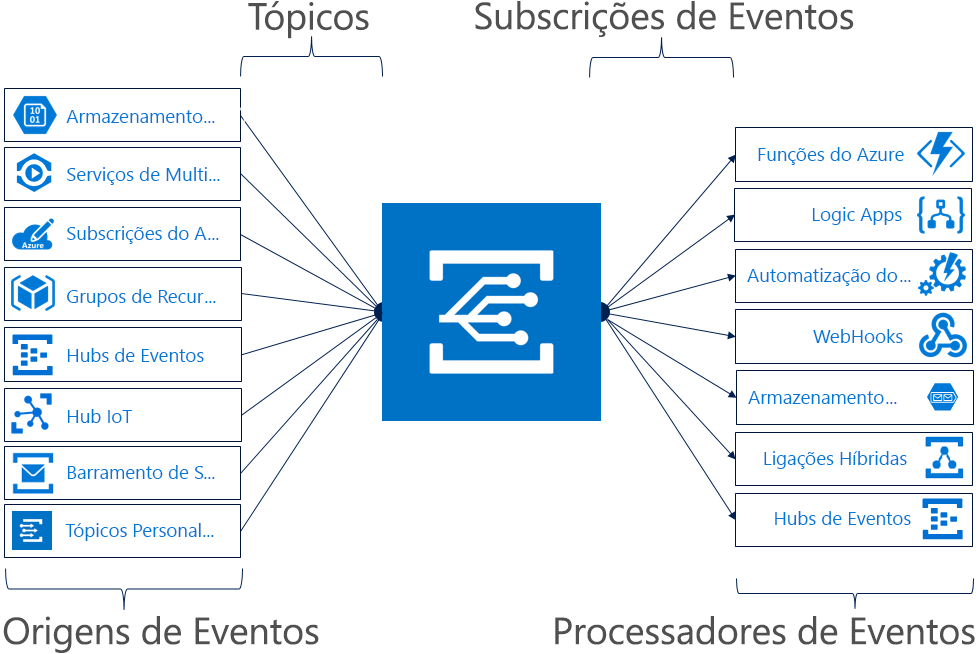

# O que é a grade de eventos do Azure?

O Azure Event Grid permite-lhe criar facilmente aplicações com arquiteturas baseadas em eventos. Primeiro, selecione o recurso do Azure que você deseja assinar e, em seguida, dê ao manipulador de eventos ou ao ponto de extremidade do webhook para o qual enviar o evento. O Event Grid tem suporte incorporado para eventos provenientes de serviços do Azure, como os blobs de armazenamento e os grupos de recursos. O Event Grid também suporta os seus próprios eventos com tópicos personalizados. 

Pode utilizar filtros para encaminhar eventos específicos para diferentes pontos finais, entregar em vários pontos finais e confirmar que os eventos são entregues com confiança.

A grade de eventos do Azure é implantada para maximizar a disponibilidade por meio da disseminação nativa entre vários domínios de falha em cada região e entre zonas de disponibilidade (em regiões que dão suporte a eles). Para obter uma lista de regiões com suporte na grade de eventos, consulte [produtos disponíveis por região](https://azure.microsoft.com/global-infrastructure/services/?products=event-grid&regions=all).

Este artigo mostra uma descrição geral do Azure Event Grid. Se quiser começar a utilizar o Event Grid, veja [Criar e encaminhar eventos personalizados com o Azure Event Grid](custom-event-quickstart.md). 

Esta imagem mostra como a grade de eventos conecta fontes e manipuladores e não é uma lista abrangente de integrações com suporte.

## Origens de eventos

Para obter detalhes completos sobre as capacidades de cada origem, bem como artigos relacionados, veja [origens de eventos](event-sources.md). Atualmente, os seguintes serviços do Azure suportam o envio de eventos para o Event Grid:

* [Assinaturas do Azure (operações de gerenciamento)](event-sources.md#azure-subscriptions)
* [Container Registry](event-sources.md#container-registry)
* [Tópicos personalizados](event-sources.md#custom-topics)
* [Hubs de Eventos](event-sources.md#event-hubs)
* [Hub IoT](event-sources.md#iot-hub)
* [Serviços de Multimédia](event-sources.md#media-services)
* [Grupos de recursos (operações de gerenciamento)](event-sources.md#resource-groups)
* [Service Bus](event-sources.md#service-bus)
* [Blob de armazenamento](event-sources.md#storage)
* [Azure Maps](event-sources.md#maps)

## Processadores de eventos

Para obter detalhes completos sobre as capacidades de cada processador, bem como artigos relacionados, veja [processadores de eventos](event-handlers.md). Atualmente, os seguintes serviços do Azure suportam o processamento de eventos no Event Grid: 

* [Automatização do Azure](event-handlers.md#azure-automation)
* [Funções do Azure](event-handlers.md#azure-functions)
* [Hubs de Eventos](event-handlers.md#event-hubs)
* [Ligações Híbridas](event-handlers.md#hybrid-connections)
* [Aplicações Lógicas](event-handlers.md#logic-apps)
* [Microsoft Flow](https://preview.flow.microsoft.com/connectors/shared_azureeventgrid/azure-event-grid/)
* [Armazenamento de filas](event-handlers.md#queue-storage)
* [Service Bus](event-handlers.md#service-bus-queue)
* [WebHooks](event-handlers.md#webhooks)

## Conceitos

Existem cinco conceitos no Azure Event Grid que lhe permitem começar:

* **Eventos** - o que aconteceu.
* **Origens dos eventos** – onde o evento aconteceu.
* **Tópicos** - o ponto final no qual os publicadores enviam eventos.
* **Assinaturas de evento** -o ponto de extremidade ou mecanismo interno para rotear eventos, às vezes para mais de um manipulador. As subscrições também são utilizadas pelos processadores para filtrar inteligentemente os eventos recebidos.
* **Processadores de eventos** - a aplicação ou o serviço que reage ao evento.

Para obter mais informações sobre estes conceitos, veja [Concepts in Azure Event Grid](concepts.md) (Conceitos no Azure Event Grid).

## Capacidades

Seguem-se algumas das principais funcionalidades do Azure Event Grid:

* **Simplicidade** - aponte e clique para direcionar eventos do seu recurso do Azure para qualquer processador ou ponto final de eventos.
* **Filtragem avançada** – filtre o tipo de evento ou o caminho de publicação de evento para garantir que os manipuladores de eventos recebam apenas eventos relevantes.
* **Fan-out** -assine vários pontos de extremidade para o mesmo evento para enviar cópias do evento para tantos locais quantos forem necessários.
* **Confiabilidade** – repetição de 24 horas com retirada exponencial para garantir que os eventos sejam entregues.
* **Pagar por evento** - pague apenas pela quantidade utilizada no Event Grid.
* **Débito elevado** - crie cargas de trabalho de elevado volume no Event Grid com suporte para milhões de eventos por segundo.
* **Eventos incorporados** - comece a executar rapidamente com os eventos incorporados definidos por recursos.
* **Eventos Personalizados** – utilize a rota e o filtro do Event Grid para entregar, com confiança, eventos personalizados na aplicação.

Para ver uma comparação entre o Event Grid, os Hubs de Eventos e o Service Bus, veja [Choose between Azure services that deliver messages](compare-messaging-services.md) (Escolher entre serviços do Azure que entregam mensagens).

## O que posso fazer com o Event Grid?

A grade de eventos do Azure fornece vários recursos que melhoram muito o trabalho de servidor, a automação de operações e a [integração](https://azure.com/integration) : 

### Arquiteturas de aplicações sem servidor

O Event Grid liga as origens de dados e os processadores de eventos. Por exemplo, use a grade de eventos para disparar uma função sem servidor que analisa imagens quando adicionadas a um contêiner de armazenamento de BLOBs. 

### Automatização de operações

O Event Grid permite-lhe acelerar a automatização e simplificar a aplicação de políticas. Por exemplo, use a grade de eventos para notificar a automação do Azure quando uma máquina virtual ou banco de dados SQL for criado. Use os eventos para verificar automaticamente se as configurações de serviço estão em conformidade, coloque os metadados em ferramentas de operações, marque as máquinas virtuais ou os itens de trabalho de arquivo.

### Integração de aplicações

O Event Grid liga a sua aplicação a outros serviços. Por exemplo, crie um tópico personalizado para enviar os dados de eventos da aplicação para o Event Grid e tire partido da entrega fiável, do encaminhamento avançado e da integração direta no Azure deste serviços. Ou, você pode usar a grade de eventos com aplicativos lógicos para processar dados em qualquer lugar, sem escrever código. 

## Quanto custa o Event Grid?

O Azure Event Grid tem um modelo de preços “pagar por evento”, de modo que só paga pelo que utilizar. As primeiras 100 000 operações por mês são gratuitas. As operações são definidas como entrada de evento, tentativas de entrega de subscrição, chamadas de gestão e filtragem pelo sufixo do requerente. Para obter detalhes, veja a [página de preços](https://azure.microsoft.com/pricing/details/event-grid/).

## Passos seguintes

* [Route Storage Blob events](../storage/blobs/storage-blob-event-quickstart.md?toc=%2fazure%2fevent-grid%2ftoc.json) (Encaminhar eventos do Blob de Armazenamento)  
  Utilize o Event Grid para responder a eventos de blobs de armazenamento.
* [Criar e subscrever eventos personalizados](custom-event-quickstart.md)  
  Utilize o início rápido do Azure Event Grid para começar a enviar os seus próprios eventos personalizados para qualquer ponto final imediatamente.
* [Using Logic Apps as an Event Handler](monitor-virtual-machine-changes-event-grid-logic-app.md) (Utilizar o Logic Apps como Processador de Eventos)  
  Um tutorial sobre como criar uma aplicação com o Logic Apps para reagir a eventos enviados pelo Event Grid.
* [Transmitir macrodados em fluxo para um armazém de dados](event-grid-event-hubs-integration.md)  
  Um tutorial que utiliza as Funções do Azure para transmitir dados em fluxo dos Hubs de Eventos para o SQL Data Warehouse.
* [Event Grid REST API reference](/rest/api/eventgrid) (Referência da API REST do Event Grid)  
  Fornece conteúdo de referência para gerenciar assinaturas de evento, roteamento e filtragem.
