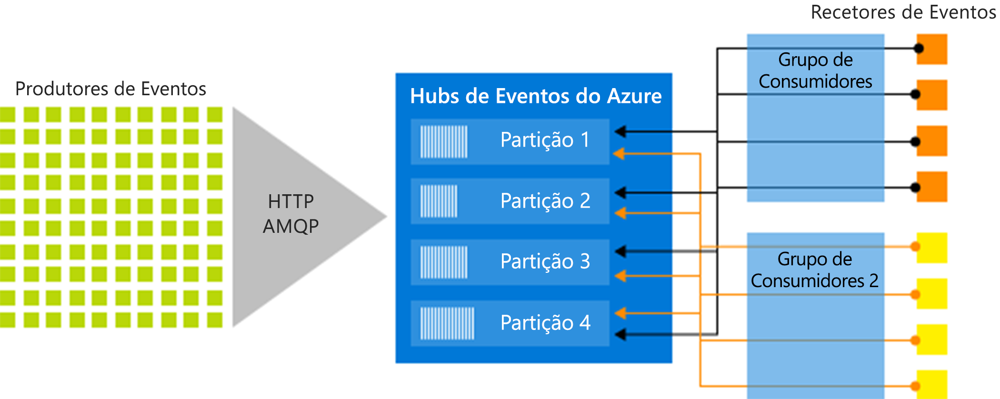

# Hubs de Eventos do Azure – Uma plataforma de transmissão em fluxo de macrodados e um serviço de ingestão de eventos
Os hubs de eventos do Azure são uma plataforma de streaming Big Data e um serviço de ingestão de eventos. Ele pode receber e processar milhões de eventos por segundo. Os dados enviados para um hub de eventos podem ser transformados e armazenados em qualquer fornecedor de análise em tempo real ou adaptadores de armazenamento/criação de batches.

Os cenários a seguir são alguns dos cenários em que você pode usar os hubs de eventos:

- Deteção de anomalias (fraude/valores atípicos)
- Registo de aplicação
- Pipelines de análise, por exemplo, clickstreams
- Dashboarding em direto
- Arquivo de dados
- Processamento de transações
- Processamento de telemetria do utilizador
- Transmissão em fluxo de telemetria do dispositivo

<iframe width="560" height="315" src="https://www.youtube.com/embed/45wgY-VSk9I" frameborder="0" allow="accelerometer; autoplay; encrypted-media; gyroscope; picture-in-picture" allowfullscreen></iframe>

## Por quê utilizar os Hubs de Eventos?

Os dados são valiosos apenas quando existe uma forma fácil de processar e obter informações atempadas de origens de dados. Os hubs de eventos fornecem uma plataforma de processamento de fluxo distribuído com baixa latência e integração direta, com dados e serviços de análise dentro e fora do Azure para criar seu pipeline de Big Data completo.

Os Hubs de Eventos representam a "porta de entrada" para um pipeline de eventos, denominado frequentemente *ingestor de eventos* em arquiteturas de solução. Um ingestor de eventos é um componente ou serviço que se encontra entre os publicadores de eventos e os consumidores de eventos para desacoplar a produção de uma transmissão de eventos do consumo desses eventos. Os hubs de eventos fornecem uma plataforma de streaming unificada com buffer de retenção de tempo, desacoplando produtores de eventos de consumidores de eventos.

As secções seguintes descrevem as principais funcionalidades do serviço Hubs de Eventos do Azure:

## PaaS totalmente gerido

Os hubs de eventos são uma PaaS (plataforma como serviço) totalmente gerenciada com pouca sobrecarga de configuração ou de gerenciamento, para que você se concentre em suas soluções de negócios. [Os Hubs de Eventos para ecossistemas do Apache Kafka](event-hubs-for-kafka-ecosystem-overview.md) oferecem-lhe experiência de PaaS Kafka sem ter de gerir, configurar ou executar os seus clusters.

## Suporte para processamento em tempo real e em lotes

Ingira, coloque em memória intermédia, armazene e processe a sua transmissão em fluxo em tempo real para obter informações acionáveis. Os hubs de eventos usam um [modelo de consumidor particionado](event-hubs-scalability.md#partitions), permitindo que vários aplicativos processem o fluxo simultaneamente e permitindo que você controle a velocidade do processamento.

[Capture](event-hubs-capture-overview.md) seus dados quase em tempo real em um [armazenamento de BLOBs do Azure](https://azure.microsoft.com/services/storage/blobs/) ou [Azure data Lake Storage](https://azure.microsoft.com/services/data-lake-store/) para retenção de longo prazo ou processamento de micro Batch. Você pode obter esse comportamento no mesmo fluxo usado para derivar análises em tempo real. A configuração da captura de dados de evento é rápida. Não há custos administrativos para executá-lo e ele é dimensionado automaticamente com as [unidades de produtividade](event-hubs-scalability.md#throughput-units)dos hubs de eventos. Os hubs de eventos permitem que você se concentre no processamento de dados em vez de na captura de dados.

Os Hubs de Eventos do Azure também se integram nas [Funções do Azure](/azure/azure-functions/) para uma arquitetura sem servidor.

## Escalável

Com os Hubs de Eventos, pode começar com fluxos de dados em megabytes e aumentar para gigabytes ou terabytes. A funcionalidade [Ampliação automática](event-hubs-auto-inflate.md) é uma das muitas opções disponíveis para dimensionar o número de unidades de débito para satisfazer as suas necessidades de utilização.

## Ecossistema avançado

Os [hubs de eventos para Apache Kafka ecossistemas](event-hubs-for-kafka-ecosystem-overview.md) permitem que clientes e aplicativos do [Apache Kafka (1,0 e posteriores)](https://kafka.apache.org/) se comuniquem com os hubs de eventos. Você não precisa configurar, configurar e gerenciar seus próprios clusters Kafka.

Com um ecossistema abrangente disponível em várias [linguagens (.NET, Java, Python, Go, Node.js)](https://github.com/Azure/azure-event-hubs), pode começar facilmente a processar transmissões em fluxo dos Hubs de Eventos. Todas as linguagens de cliente suportadas oferecem integração de nível baixo. O ecossistema também fornece integração direta com os serviços do Azure como Azure Stream Analytics e Azure Functions e, portanto, permite que você crie arquiteturas sem servidor.

## Principais componentes da arquitetura
Os Hubs de Eventos contêm os seguintes [componentes principais](event-hubs-features.md):

- **Produtores de eventos**: Qualquer entidade que envia dados para um hub de eventos. Os publicadores de eventos podem publicar eventos através de HTTPS ou AMQP 1.0 ou Apache Kafka (1.0 ou superior)
- **Partições**: Cada consumidor lê apenas um subconjunto específico, ou partição, do fluxo de mensagens.
- **Grupos de consumidores**: Uma exibição (estado, posição ou deslocamento) de um hub de eventos inteiro. Os grupos de consumidores permitem que os aplicativos de consumo tenham uma exibição separada do fluxo de eventos. Eles lêem o fluxo de forma independente em seu próprio ritmo e com seus próprios deslocamentos.
- **Unidades de produtividade**: Unidades de capacidade adquiridas previamente que controlam a capacidade de taxa de transferência dos hubs de eventos.
- **Receptores de eventos**: Qualquer entidade que lê dados de eventos de um hub de eventos. Todos os consumidores dos hubs de eventos se conectam por meio da sessão do AMQP 1,0. O serviço de hubs de eventos entrega eventos por meio de uma sessão à medida que eles ficam disponíveis. Todos os consumidores de Kafka ligam através do protocolo de Kafka 1.0 e posterior.

A imagem seguinte mostra a arquitetura do processamento de fluxos dos Hubs de Eventos:

## Passos seguintes

Para começar a usar os hubs de eventos, consulte os tutoriais de **eventos de envio e recebimento** :

- [.NET Core](event-hubs-dotnet-standard-getstarted-send.md)
- [.NET Framework](event-hubs-dotnet-framework-getstarted-send.md)
- [Java](event-hubs-java-get-started-send.md)
- [Python](event-hubs-python-get-started-send.md)
- [Node.js](event-hubs-node-get-started-send.md)
- [Go](event-hubs-go-get-started-send.md)
- [C (somente enviar)](event-hubs-c-getstarted-send.md)
- [Apache Storm (somente recebimento)](event-hubs-storm-getstarted-receive.md)

Para saber mais sobre os Hub de Eventos, veja os artigos seguintes:

- [Descrição geral das funcionalidades dos Hubs de Eventos](event-hubs-features.md)
- [Perguntas mais frequentes](event-hubs-faq.md).

