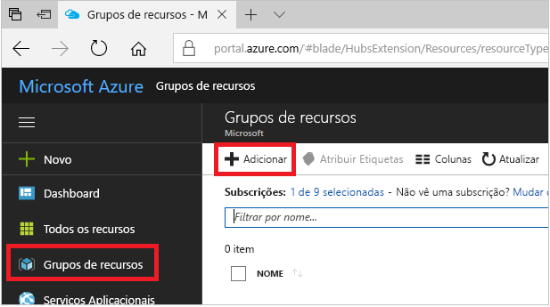
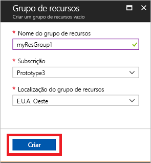
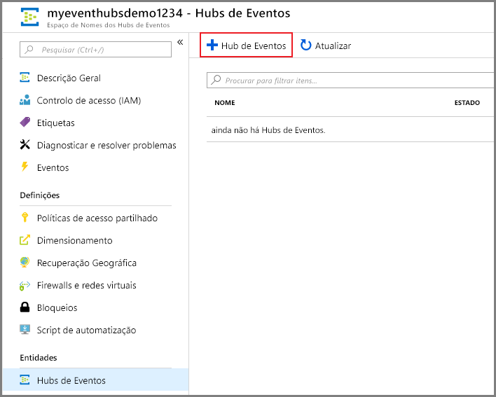
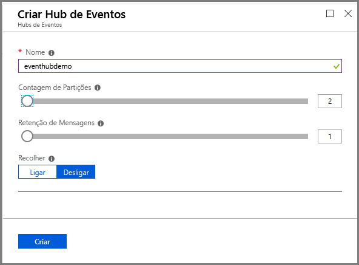

# Início Rápido: Criar um hub de eventos com o portal do Azure
O Azure Event Hubs é uma plataforma de streaming big data e serviço de ingestão de eventos que pode receber e processar milhões de eventos por segundo. Os Hubs de Eventos podem processar e armazenar eventos, dados ou telemetria produzidos por dispositivos e software distribuído. Os dados enviados para um hub de eventos podem ser transformados e armazenados em qualquer fornecedor de análise em tempo real ou adaptadores de armazenamento/criação de batches. Para uma descrição geral detalhada dos Hubs de Eventos, veja [Descrição geral dos Hubs de Eventos](event-hubs-about.md) e [Funcionalidades dos Hubs de Eventos](event-hubs-features.md).

Neste início rápido, vai criar um hub de eventos com o [portal do Azure](https://portal.azure.com).

## Pré-requisitos

Para concluir este início rápido, certifique-se de que tem:

- Subscrição do Azure. Se não tiver uma, [crie uma conta gratuita](https://azure.microsoft.com/free/) antes de começar.

## Criar um grupo de recursos

Um grupo de recursos é uma coleção lógica de recursos do Azure. Todos os recursos são implementados e geridos num grupo de recursos. Para criar um grupo de recursos:

1. Inicie sessão no [portal do Azure](https://portal.azure.com).
1. Na navegação à esquerda, selecione **grupos de recursos.** Em seguida, selecione **Adicionar**.

   

1. Para **Subscrição**, selecione o nome da subscrição Azure na qual pretende criar o grupo de recursos.
1. Digite um nome único **para o grupo de recursos.** O sistema verifica imediatamente a disponibilidade do nome na subscrição do Azure atualmente selecionada.
1. Selecione uma **região** para o grupo de recursos.
1. Selecione **Rever + Criar**.

   
1. Na página **'Rever + Criar',** selecione **Criar**. 

## Criar um espaço de nomes dos Hubs de Eventos

Um espaço de nomes do Event Hubs fornece um recipiente de scoping único, no qual você cria um ou mais centros de eventos. Para criar um espaço de nomes no seu grupo de recursos com o portal, faça as ações seguintes:

1. No portal do Azure, selecione **Criar um recurso** na parte superior esquerda do ecrã.
1. Selecione **todos os serviços** no menu esquerdo e selecione **star `*` ()** ao lado **de Event Hubs** na categoria **Analytics.** Confirme que **os Hubs de Evento são adicionados** aos **FAVORITOS** no menu de navegação à esquerda. 
    
   
1. Selecione **Os Centros de Eventos** em **FAVORITOS** no menu de navegação à esquerda e selecione **Adicione** na barra de ferramentas.

   
1. Na página Criar espaço **de nome,** tome os seguintes passos:  
   1. Selecione a **subscrição** na qual pretende criar o espaço de nomes.  
   1. Selecione o **grupo de recursos** que criou no passo anterior.   
   1. Insira um **nome** para o espaço de nomes. O sistema verifica imediatamente a disponibilidade do nome.  
   1. Selecione um **local** para o espaço de nomes.
   1. Escolha o **nível de preços** (Básico ou Standard). Para conhecer algumas das diferenças entre os níveis básicos e padrão, consulte [os preços dos Event Hubs,](https://azure.microsoft.com/pricing/details/event-hubs/) [diferenças entre níveis](event-hubs-faq.md#what-is-the-difference-between-event-hubs-basic-and-standard-tiers)e [quotas e limites.](event-hubs-quotas.md) 
   1. Deixe as definições das unidades de **produção** como estão. As unidades de débito são unidades de capacidade previamente compradas. Para conhecer as unidades de produção, consulte [a escalabilidade do Event Hubs](event-hubs-scalability.md#throughput-units).  
   1. Selecione **'Rever + Criar** na parte inferior da página'.
      
      
   1. Na página **'Rever + Criar',** rever as definições e selecionar **Criar**. Aguarde pela conclusão da implementação. 
      
      
      
   1. Na página **'Implementação',** selecione **Ir para o recurso** para navegar na página para o seu espaço de nome. 
      
        
   1. Confirme que vê a página **De Nomes do Event Hubs** semelhante ao seguinte exemplo:   
      
             

      > [!NOTE]
      > O Azure Event Hubs fornece-lhe um ponto final kafka. Este ponto final permite que o seu espaço de nomes De Event Hubs compreenda de forma nativa o protocolo de mensagem [Apache Kafka](https://kafka.apache.org/intro) e ASPIs. Com esta capacidade, pode comunicar com os seus centros de eventos como faria com tópicos kafka sem alterar os seus clientes de protocolo ou executar os seus próprios clusters. O Event Hubs suporta as [versões Apache Kafka 1.0](https://kafka.apache.org/10/documentation.html) e posterior. Para mais informações, consulte [Use Event Hubs a partir de aplicações Apache Kafka.](event-hubs-for-kafka-ecosystem-overview.md)
    
## Criar um hub de eventos

Para criar um hub de eventos no espaço de nomes, faça as ações seguintes:

1. Na página De Evento Hubs Namespace, selecione **'Centros de Eventos'** no menu esquerdo.
1. Na parte superior da janela, selecione **+ Centro de Eventos.**
   
    
1. Digite um nome para o seu centro de eventos e, em seguida, **selecione Criar**.
   
    

    A **definição de contagem de divisórias** permite-lhe paralelizar o consumo entre muitos consumidores. Para mais informações, consulte [As Divisórias.](event-hubs-scalability.md#partitions)

    A **definição de retenção de mensagens** especifica quanto tempo o serviço 'Centros de Eventos' mantém os dados. Para mais informações, consulte [a retenção do Evento.](event-hubs-features.md#event-retention)
1. Pode verificar o estado da criação do centro de eventos em alertas. Depois de o centro de eventos ser criado, vê-lo na lista de centros de eventos.

    
    
## Passos seguintes

Neste artigo, criou um grupo de recursos, um espaço de nomes de Hubs de Eventos e um hub de eventos. Para instruções passo a passo para enviar eventos para (ou) receber eventos de um centro de eventos, consulte estes tutoriais: 

- [.NET Core](event-hubs-dotnet-standard-getstarted-send.md)
- [Java](event-hubs-java-get-started-send.md)
- [Python](event-hubs-python-get-started-send.md)
- [JavaScript](event-hubs-node-get-started-send.md)
- [Ir](event-hubs-go-get-started-send.md)
- [C (apenas enviar)](event-hubs-c-getstarted-send.md)
- [Apache Storm (apenas receber)](event-hubs-storm-getstarted-receive.md)

[Azure portal]: https://portal.azure.com/
[3]: ./media/event-hubs-quickstart-portal/sender1.png
[4]: ./media/event-hubs-quickstart-portal/receiver1.png
