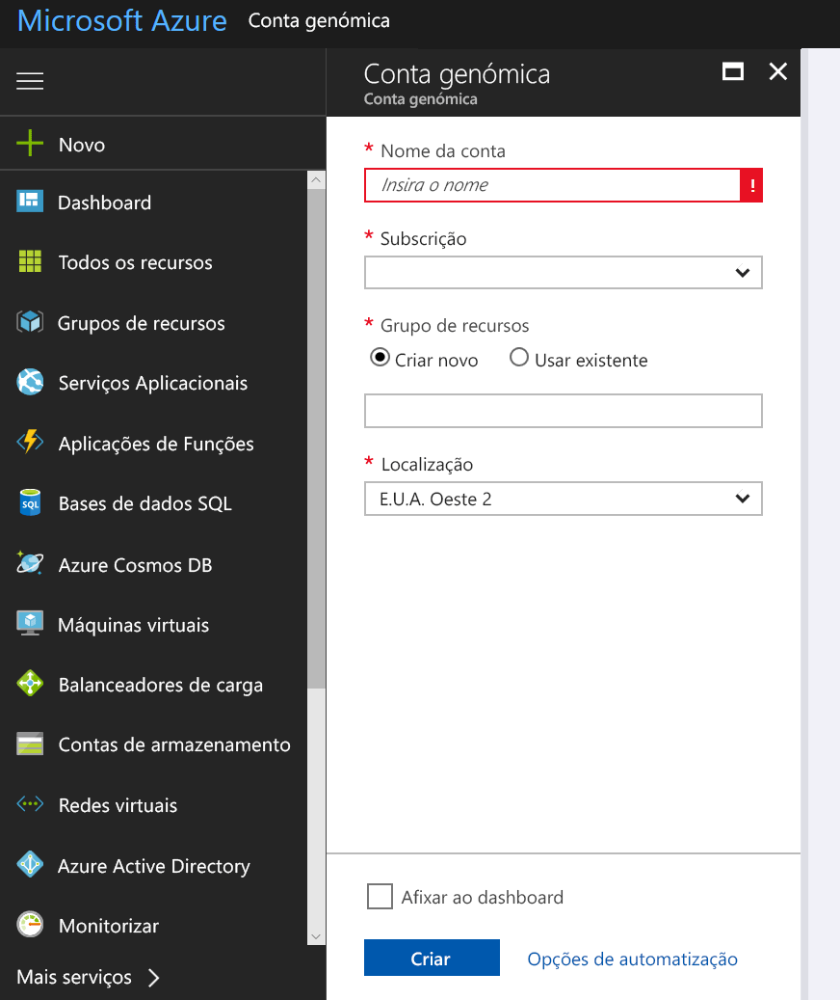
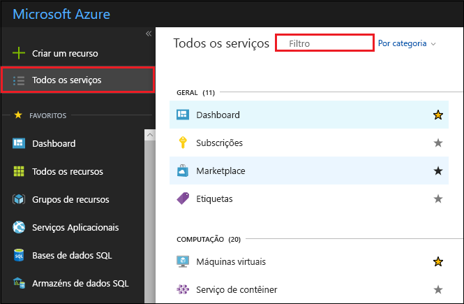
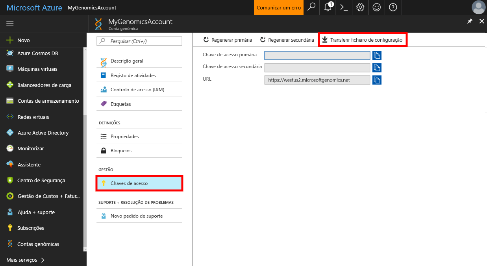

# <a name="quickstart-run-a-workflow-through-the-microsoft-genomics-service"></a>Início Rápido: Executar um fluxo de trabalho através do serviço Microsoft Genomics

Neste quickstart, você envia dados de entrada para uma conta de armazenamento Azure Blob, e execute um fluxo de trabalho através do serviço Microsoft Genomics usando o cliente Python Genomics. O Microsoft Genomics é um serviço dimensionável e seguro para análise secundária que consegue processar rapidamente um genoma, a partir de leituras não processadas e ao produzir leituras alinhadas e chamadas variantes. 

## <a name="prerequisites"></a>Pré-requisitos

- Uma conta Azure com uma subscrição ativa. [Crie uma conta gratuita.](https://azure.microsoft.com/free/?ref=microsoft.com&utm_source=microsoft.com&utm_medium=docs&utm_campaign=visualstudio) 
- [Python 2.7.12+](https://www.python.org/downloads/release/python-2714/), com `pip` instalado, e `python` no caminho do seu sistema. O cliente da Microsoft Genomics não é compatível com o Python 3. 

## <a name="set-up-create-a-microsoft-genomics-account-in-the-azure-portal"></a>Configurar: criar uma conta do Microsoft Genomics no portal do Azure

Para criar uma conta Microsoft Genomics, navegue para [criar uma conta Geómica](https://portal.azure.com/#create/Microsoft.Genomics) no portal Azure. Se ainda não tiver uma subscrição do Azure, crie uma antes de criar uma conta do Microsoft Genomics. 



Configure a conta do Genomics com as informações seguintes, conforme mostrado na imagem anterior. 

 |**Definição**          |  **Valor sugerido**  | **Descrição do campo** |
 |:-------------       |:-------------         |:----------            |
 |Subscrição         | Nome da sua subscrição|Trata-se da unidade de faturação dos serviços do Azure. Para obter detalhes sobre a sua subscrição, veja [Subscrições](https://account.azure.com/Subscriptions) |      
 |Grupo de recursos       | MyResourceGroup       |  Os grupos de recursos permitem-lhe agrupar múltiplos recursos do Azure (conta de armazenamento, conta do Genomics, etc.) num único grupo de gestão simples. Para obter mais informações, veja [Grupos de Recursos](https://docs.microsoft.com/azure/azure-resource-manager/resource-group-overview#resource-groups). Para obter os nomes de grupos de recursos válidos, veja [Regras de Nomenclatura](/azure/architecture/best-practices/resource-naming) |
 |Nome da conta         | MyGenomicsAccount     |Escolha um identificador de conta exclusivo. Para obter os nomes válidos, veja [Regras de Nomenclatura](/azure/architecture/best-practices/resource-naming) |
 |Localização                   | E.U.A.Oeste 2                    |    O serviço está disponível nas regiões E.U.A. Oeste 2, Europa Ocidental e Ásia Sudeste |

Pode selecionar **Notificações** na barra de menu superior para monitorizar o processo de implementação.


Para mais informações sobre a Microsoft Genomics, veja [o que é a Microsoft Genomics?](overview-what-is-genomics.md)

## <a name="set-up-install-the-microsoft-genomics-python-client"></a>Configurar: instalar o cliente Microsoft Genomics Python

Você precisa instalar tanto Python como o cliente Microsoft Genomics Python no seu ambiente local. 

### <a name="install-python"></a>Instalar o Python

O cliente Microsoft Genomics Python é compatível com Python 2.7.12 ou uma versão posterior de 2.7.xx. 2.7.14 é a versão sugerida. Pode encontrar a transferência [aqui](https://www.python.org/downloads/release/python-2714/). 

> [!IMPORTANT]
> Python 3.x não é compatível com Python 2.7.xx.  O MSGen é uma aplicação do Python 2.7. Ao executar o MSGen, certifique-se de que o seu ambiente ativo do Python está a utilizar uma versão 2.7.xx do Python. Poderá receber erros ao tentar utilizar o MSGen com uma versão 3.x do Python.

### <a name="install-the-microsoft-genomics-client"></a>Instalar o cliente Microsoft Genomics

Utilize `pip` python para instalar o cliente Microsoft Genomics `msgen` . As instruções seguintes partem do princípio de que o Python já se encontra no caminho do sistema. Se tiver problemas com `pip` a instalação não reconhecidos, tem de adicionar Python e a sub-dobra de scripts ao seu caminho do sistema.

```
pip install --upgrade --no-deps msgen
pip install msgen
```

Se não quiser `msgen` instalar-se como binário em todo o sistema e modificar pacotes Python em todo o sistema, utilize a `–-user` bandeira com `pip` .
Se utilizar a instalação baseada em pacotes ou setup.py, serão instalados todos os pacotes necessários. Caso contrário, os pacotes básicos necessários `msgen` são 

 * [Azure-storage](https://pypi.python.org/pypi/azure-storage). 
 * [Pedidos](https://pypi.python.org/pypi/requests). 

Pode instalar estes pacotes com `pip`, `easy_install` ou através dos procedimentos padrão `setup.py`. 

### <a name="test-the-microsoft-genomics-client"></a>Testar o cliente Microsoft Genomics
Para testar o cliente microsoft Genomics, descarregue o ficheiro config da sua conta Genomics. No portal Azure, navegue para a sua conta Genomics selecionando **todos os serviços** no canto superior esquerdo e, em seguida, procurando e selecionando contas Geómica.



Selecione a conta Genomics que acabou de fazer, navegue para **As Teclas de Acesso**e descarregue o ficheiro de configuração.



Teste se o cliente Microsoft Genomics Python está a funcionar com o seguinte comando

```Python
msgen list -f "<full path where you saved the config file>"
```

## <a name="create-a-microsoft-azure-storage-account"></a>Criar uma conta de Armazenamento Microsoft Azure 
O serviço Microsoft Genomics espera que as entradas sejam armazenadas como blobs de blocos numa conta de armazenamento do Azure. Também escreve os ficheiros de saída como blobs de blocos num contentor especificado pelo utilizador numa conta de armazenamento do Azure. As entradas e saídas podem residir em contas de armazenamento diferentes.
Se já tiver os dados numa conta de armazenamento do Azure, basta certificar-se de que está na mesma localização da conta do Genomics. Caso contrário, as taxas de saída são incorridos ao executar o serviço Microsoft Genomics. Se ainda não tem uma conta de armazenamento Azure, tem de criar uma e fazer o upload dos seus dados. Pode encontrar mais informações sobre as contas de armazenamento da Azure [aqui,](https://docs.microsoft.com/azure/storage/common/storage-create-storage-account)incluindo o que é uma conta de armazenamento e quais os serviços que fornece. Para criar uma conta de armazenamento Azure, navegue para [criar conta de armazenamento](https://portal.azure.com/#create/Microsoft.StorageAccount-ARM) no portal Azure.  


Configure a sua conta de armazenamento com as seguintes informações, como mostra a imagem anterior. Utilize a maioria das opções padrão para uma conta de armazenamento, especificando apenas que a conta é BlobStorage, não para fins gerais. O armazenamento de blobs pode ser entre duas e cinco vezes mais rápido para transferências e carregamentos.  Recomenda-se o modelo de implementação predefinido, Azure Resource Manager.  

 |**Definição**          |  **Valor sugerido**  | **Descrição do campo** |
 |:-------------------------       |:-------------         |:----------            |
 |Subscrição         | A sua subscrição do Azure |Para obter detalhes sobre a sua subscrição, veja [Subscrições](https://account.azure.com/Subscriptions) |      
 |Grupo de recursos       | MyResourceGroup       |  Pode selecionar o mesmo grupo de recursos que a sua conta Genomics. Para obter nomes de grupos de recursos válidos, consulte [as regras de nomeação](/azure/architecture/best-practices/resource-naming) |
 |Nome da conta de armazenamento         | MyStorageAccount     |Escolha um identificador de conta exclusivo. Para obter nomes válidos, consulte [as regras de nomeação](/azure/architecture/best-practices/resource-naming) |
 |Localização                  | E.U.A.Oeste 2                  | Use a mesma localização da sua conta Genomics, para reduzir os encargos de saída e reduzir a latência.  | 
 |Desempenho                  | Standard                   | A predefinição é Standard. Para obter mais detalhes sobre contas de armazenamento standard e premium, consulte [Introdução ao armazenamento do Microsoft Azure](https://docs.microsoft.com/azure/storage/common/storage-introduction)    |
 |Tipo de conta       | BlobStorage       |  O armazenamento de blobs pode ser entre duas e cinco vezes mais rápido do que para fins gerais para transferências e carregamentos. |
 |Replicação                  | Armazenamento localmente redundante                  | O armazenamento localmente redundante replica os dados no datacenter na região em que foi criada a conta de armazenamento. Para mais informações, consulte [a replicação do Azure Storage](https://docs.microsoft.com/azure/storage/common/storage-redundancy)    |
 |Escalão de acesso                  | Acesso Frequente                   | Um acesso frequente indica que os objetos na conta de armazenamento serão acedidos com mais frequência.    |

Em seguida, selecione **Rever + criar** para criar a sua conta de armazenamento. Tal como fez com a criação da sua conta Genomics, pode selecionar **Notificações** na barra de menu superior para monitorizar o processo de implementação. 

## <a name="upload-input-data-to-your-storage-account"></a>Carregar dados de entrada para a conta de armazenamento

O serviço Microsoft Genomics espera leituras finais emparelhadas (ficheiros fastq ou bam) como ficheiros de entrada. Pode optar por carregar os seus próprios dados ou explorar através dos dados de exemplo disponíveis publicamente fornecidos por si. Se quiser utilizar os dados de exemplo disponíveis publicamente, estão alojados aqui:

[https://msgensampledata.blob.core.windows.net/small/chr21_1.fq.gz](https://msgensampledata.blob.core.windows.net/small/chr21_1.fq.gz)
[https://msgensampledata.blob.core.windows.net/small/chr21_2.fq.gz](https://msgensampledata.blob.core.windows.net/small/chr21_2.fq.gz)

Na sua conta de armazenamento, tem de criar um contentor de blobs para os dados de entrada e um segundo contentor de blobs para os dados de saída.  Carregue os dados de entrada para o contentor de blobs de entrada. Várias ferramentas podem ser usadas para o fazer, incluindo [o Microsoft Azure Storage Explorer,](https://azure.microsoft.com/features/storage-explorer/) [BlobPorter](https://github.com/Azure/blobporter)ou [AzCopy.](https://docs.microsoft.com/azure/storage/common/storage-use-azcopy?toc=%2fazure%2fstorage%2fblobs%2ftoc.json) 

## <a name="run-a-workflow-through-the-microsoft-genomics-service-using-the-python-client"></a>Executar um fluxo de trabalho através do serviço Microsoft Genomics com o cliente Python 

Para executar um fluxo de trabalho através do serviço Microsoft Genomics, edite o ficheiro *config.txt* para especificar o recipiente de armazenamento de entrada e saída para os seus dados.
Abra o ficheiro *config.txt* que descarregou da sua conta Genomics. As secções que precisa de especificar são a sua chave de subscrição e os seis itens na parte inferior, o nome da conta de armazenamento, a chave e o nome do recipiente tanto para a entrada como para a saída. Pode encontrar estas informações navegando nas **teclas** de acesso do portal Azure para a sua conta de armazenamento, ou diretamente do Azure Storage Explorer.  


Se quiser executar o GATK4, desa um `process_name` parâmetro para `gatk4` .

Por predefinição, o serviço Genomics produz ficheiros VCF. Se quiser uma saída gVCF em vez de uma saída de VCF (equivalente a `-emitRefConfidence` GATK 3.x e `emit-ref-confidence` em GATK 4.x), adicione o `emit_ref_confidence` parâmetro ao seu *config.txt* e desafiá-lo para `gvcf` , como mostrado na figura anterior.  Para voltar a alterar para a saída VCF, remova-o do ficheiro *config.txt* ou desfase `emit_ref_confidence` o parâmetro para `none` . 

### <a name="submit-your-workflow-to-the-microsoft-genomics-service-the-microsoft-genomics-client"></a>Submeter o fluxo de trabalho para o serviço Microsoft Genomics através do cliente Python

Utilize o cliente Python do Microsoft Genomics para submeter o seu fluxo de trabalho com o seguinte comando:

```python
msgen submit -f [full path to your config file] -b1 [name of your first paired end read] -b2 [name of your second paired end read]
```

Pode ver o estado dos fluxos de trabalho com o seguinte comando: 
```python
msgen list -f c:\temp\config.txt 
```

Uma vez concluído o seu fluxo de trabalho, pode visualizar os ficheiros de saída na sua conta de armazenamento Azure no recipiente de saída que configura. 

## <a name="next-steps"></a>Próximos passos
Neste artigo, você carregou dados de entrada de amostras para o armazenamento Azure e submeteu um fluxo de trabalho para o serviço Microsoft Genomics através do `msgen` cliente Python. Para saber mais sobre outros tipos de ficheiros de entrada que podem ser utilizados com o serviço Microsoft Genomics, consulte as seguintes páginas: [FASTQ](quickstart-input-pair-FASTQ.md)  |  [BAM](quickstart-input-BAM.md)  |  [Multiple FASTQ ou BAM](quickstart-input-multiple.md). Pode também explorar este tutorial com o nosso [tutorial do bloco de notas do Azure](https://aka.ms/genomicsnotebook).
