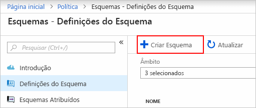
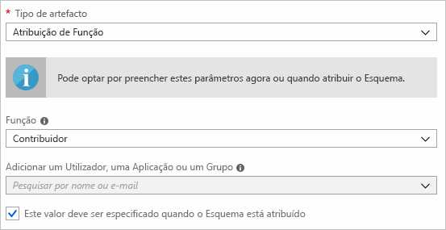
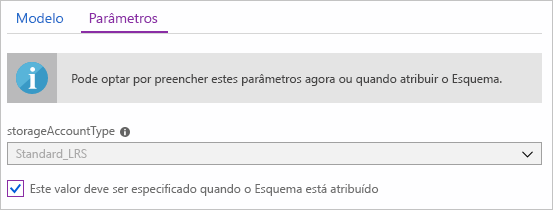
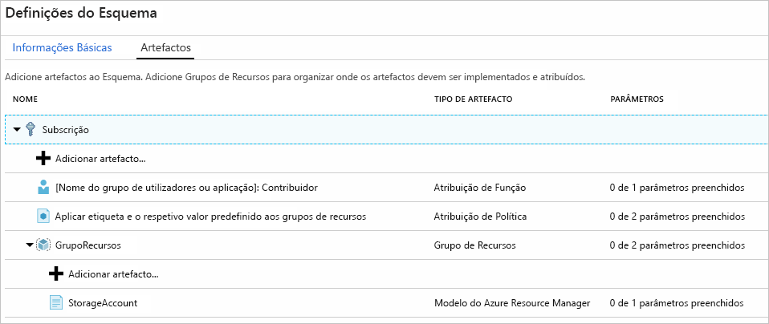
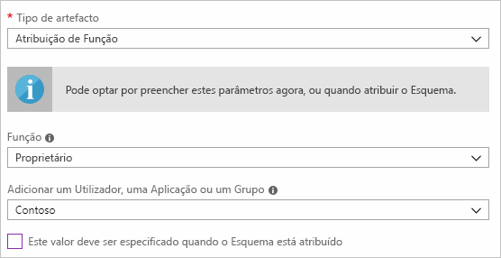
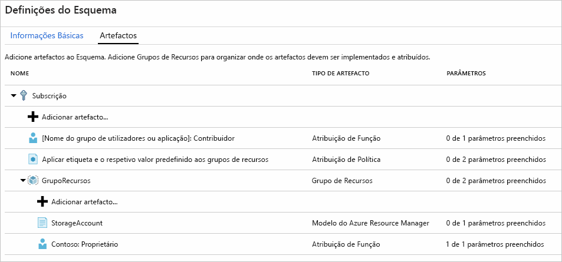
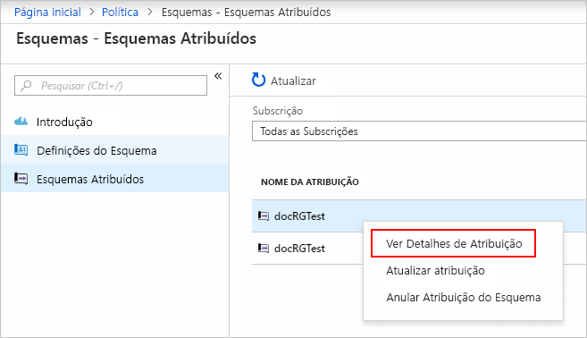

# <a name="define-and-assign-an-azure-blueprint-in-the-portal"></a>Definir e atribuir um esquema de Azure no portal

Aprender a criar e atribuir esquemas permite a definição de padrões comuns para desenvolver configurações reutilizáveis e rapidamente implementáveis com base nos modelos do Resource Manager, política, segurança e muito mais. Neste tutorial, vai aprender a utilizar o Azure Blueprints para realizar algumas das tarefas comuns relacionadas com a criação, publicação e atribuição de um esquema na sua organização, tais como:

> [!div class="checklist"]
> - Criar um novo esquema e adicionar vários artefactos suportados
> - Fazer alterações a um esquema existente ainda no modo de **Rascunho**
> - Marcar um esquema como pronto a atribuir com o estado **Publicado**
> - Atribuir um esquema a uma subscrição existente
> - Verificar o estado e progresso de um esquema atribuído
> - Remover um esquema que foi atribuído a uma subscrição

Se não tiver uma subscrição do Azure, crie uma [conta gratuita](https://azure.microsoft.com/free) antes de começar.

## <a name="create-a-blueprint"></a>Criar um esquema

O primeiro passo na definição de um padrão de conformidade é compor um esquema a partir dos recursos disponíveis. Neste exemplo, vai criar um novo esquema com o nome “MyBlueprint” para configurar as atribuições de função e política para a subscrição, adicionar um novo grupo de recursos e criar uma atribuição de função e o modelo do Resource Manager no novo grupo de recursos.

1. Selecione **todos os serviços** no painel esquerdo. Procure e selecione **esquemas**.

1. Selecione **definições de esquema** da página à esquerda e clique a **+ criar esquema** botão na parte superior da página.

   - Em alternativa, clique em **Criar** na página **Introdução** para ir diretamente para a criação de um esquema.

   

1. Fornecer um **nome do esquema** como "MyBlueprint' (letras e números – até 48 carateres, mas sem espaços ou carateres especiais) para o plano gráfico, mas deixe **esquema Descrição** em branco por agora.  Na **localização da definição** caixa, clique nas reticências à direita, selecione a [grupo de gestão](../management-groups/overview.md) ou uma subscrição onde pretende guardar o plano gráfico e clique em **selecionar**.

1. Certifique-se de que as informações estão corretas (a **nome do esquema** e **localização da definição** campos não não possível alterar mais tarde) e clique em **seguinte: Artefactos** na parte inferior da página ou o **artefactos** separador na parte superior da página.

1. Adicione atribuição de função na subscrição: LEFT-click no **+ adicionar artefacto...**  linha sob **subscrição** e a janela de "Adicionar artefacto" abre no lado direito do browser. Selecione a atribuição de função para _tipo de Artefato_. Sob _função_, selecione "Contribuinte" e deixe o _adicionar utilizador, aplicação ou grupo_ campo com a caixa de verificação indicar uma **parâmetro dinâmico**. Clique em **Adicionar** para adicionar este artefacto ao esquema.

   

   > [!NOTE]
   > A maioria dos _artefactos_ suporta parâmetros. Um parâmetro com um valor atribuído durante a criação do esquema é um **parâmetro estático**. Se o parâmetro for atribuído durante a atribuição do esquema, será um **parâmetro dinâmico**. Para obter mais informações, veja [Parâmetros de esquema](./concepts/parameters.md).

1. Adicione atribuição de política na subscrição: LEFT-click no **+ adicionar artefacto...**  linha sob o artefacto de atribuição de função. Selecione a atribuição de política para _tipo de Artefato_. Altere _Tipo_ para “Incorporado” e, em _Pesquisar_ introduza “etiqueta”. Clique fora da caixa _Pesquisar_ para filtrar os resultados. Selecione “Aplicar etiqueta e valor predefinido aos grupos de recursos” ao clicar na opção. Clique em **Adicionar** para adicionar este artefacto ao esquema.

1. Clique na linha de atribuição de política “Aplicar etiqueta e valor predefinido aos grupos de recursos”. É apresentada a janela com os parâmetros para o artefacto como parte da definição do esquema e que permite definir os parâmetros para todas as atribuições (**parâmetros estáticos**) com base neste esquema, em vez de o fazer durante a atribuição (**parâmetros dinâmicos**). Este exemplo utiliza **parâmetros dinâmicos** durante a atribuição do esquema, por isso, deixe as predefinições como estão e clique em **Cancelar**.

1. Adicione o grupo de recursos na subscrição: LEFT-click no **+ adicionar artefacto...**  linha sob **subscrição**. Selecione o grupo de recursos para o _tipo de Artefato_. Deixe o _nome a apresentar do artefacto_, _nome do grupo de recursos_, e _localização_ campos em branco, mas certifique-se de que a caixa de verificação para cada propriedade de parâmetro para torná-las **parâmetros dinâmicos**. Clique em **Adicionar** para adicionar este artefacto ao esquema.

1. Adicione modelo no grupo de recursos: LEFT-click no **+ adicionar artefacto....** linha sob o **ResourceGroup** entrada. Selecione “Modelo do Azure Resource Manager” para _Tipo de artefacto_, defina _Nome do artefacto a apresentar_ como “StorageAccount” e deixe _Descrição_ em branco. No separador **Modelo** na caixa do editor, cole o seguinte modelo do Resource Manager. Depois de colar o modelo, selecione o **parâmetros** separador e tenha em atenção que os parâmetros de modelo **storageAccountType** e **localização** foram detetados. Cada parâmetro foi automaticamente detectado e preenchido, mas configurado como um **parâmetro dinâmico**. Remover a verificação do **storageAccountType** caixa de verificação e tenha em atenção que o menu suspenso contém apenas valores incluídos no modelo do Resource Manager em **allowedValues**. Marque a caixa para a definir de novo como um **parâmetro dinâmico**. Clique em **Adicionar** para adicionar este artefacto ao esquema.

   > [!IMPORTANT]
   > Se importar o modelo, garanta que o ficheiro é apenas JSON e não inclui HTML. Quando apontar para um URL no GitHub, garanta que clicou em **RAW** para obter o ficheiro JSON puro e não um encapsulado com HTML para apresentação no GitHub. Se o modelo importado não for JSON puro, ocorrerá um erro.

   ```json
   {
       "$schema": "https://schema.management.azure.com/schemas/2015-01-01/deploymentTemplate.json#",
       "contentVersion": "1.0.0.0",
       "parameters": {
           "storageAccountType": {
               "type": "string",
               "defaultValue": "Standard_LRS",
               "allowedValues": [
                   "Standard_LRS",
                   "Standard_GRS",
                   "Standard_ZRS",
                   "Premium_LRS"
               ],
               "metadata": {
                   "description": "Storage Account type"
               }
           },
           "location": {
               "type": "string",
               "defaultValue": "[resourceGroup().location]",
               "metadata": {
                   "description": "Location for all resources."
               }
           }
       },
       "variables": {
           "storageAccountName": "[concat('store', uniquestring(resourceGroup().id))]"
       },
       "resources": [{
           "type": "Microsoft.Storage/storageAccounts",
           "name": "[variables('storageAccountName')]",
           "location": "[parameters('location')]",
           "apiVersion": "2018-07-01",
           "sku": {
               "name": "[parameters('storageAccountType')]"
           },
           "kind": "StorageV2",
           "properties": {}
       }],
       "outputs": {
           "storageAccountName": {
               "type": "string",
               "value": "[variables('storageAccountName')]"
           }
       }
   }
   ```

   

1. O esquema concluído deve ter um aspeto semelhante ao seguinte. Repare que cada artefacto tem “_x_ de _y_ parâmetros preenchidos” na coluna _Parâmetros_. Os **parâmetros dinâmicos** são definidos durante cada atribuição do esquema.

   

1. Agora que todos os artefactos planeados foram adicionados, clique em **Guardar Rascunho** na parte inferior da página.

## <a name="edit-a-blueprint"></a>Editar um esquema

Em [Criar um esquema](#create-a-blueprint), não foi fornecida uma Descrição nem a atribuição da função foi adicionada ao grupo de recursos novo. Ambas as situações podem ser corrigidas com os passos abaixo:

1. Selecione **definições de esquema** partir da página à esquerda.

1. Na lista de esquemas, faça duplo clique num que criou anteriormente e selecione **esquema de edição**.

1. Na **esquema Descrição**, fornecer algumas informações sobre o esquema e os artefatos que compõem ele.  Neste caso, insira algo parecido com: "Este esquema define a atribuição de política e a função de etiquetas na subscrição, cria um ResourceGroup e implementa uma atribuição de função e o modelo de recurso para esse ResourceGroup."

1. Clique em **seguinte: Artefactos** na parte inferior da página ou o **artefactos** separador na parte superior da página.

1. Adicione atribuição de função no grupo de recursos: LEFT-click no **+ adicionar artefacto...**  linha diretamente sob o **ResourceGroup** entrada. Selecione a atribuição de função para _tipo de Artefato_. Sob _função_, selecione "Owner" e remover a verificação para o _adicionar utilizador, aplicação ou grupo_ campo e procure e selecione um utilizador, aplicação ou grupo a adicionar. Este artefacto utiliza um **parâmetro estático** que é o mesmo em cada atribuição deste esquema. Clique em **Adicionar** para adicionar este artefacto ao esquema.

   

1. O esquema concluído deve ter um aspeto semelhante ao seguinte. Repare que a atribuição de função recém-adicionada mostra **1 de 1 parâmetros preenchidos**, o que significa que é um **parâmetro estático**.

   

1. Clique em **Guardar Rascunho** agora que foi atualizado.

## <a name="publish-a-blueprint"></a>Publicar um esquema

Agora que os artefactos planeados foram adicionados ao esquema, é altura de o publicar.
A publicação disponibiliza-o para ser atribuído a uma subscrição.

1. Selecione **definições de esquema** partir da página à esquerda.

1. Na lista de esquemas, faça duplo clique num que criou anteriormente e selecione **publicar esquema**.

1. Na caixa de diálogo apresentada, indique uma **Versão** (letras, números e hífenes com um comprimento máximo de 20 carateres) como “v1” e **Alterar notas** (opcional) como “Primeira publicação”.

1. Clique em **Publicar** na parte inferior da página.

## <a name="assign-a-blueprint"></a>Atribuir um esquema

Após a publicação de um esquema, poderá atribuí-lo a uma subscrição. Atribua o esquema que criou a uma das subscrições na hierarquia do grupo de gestão. Se o plano gráfico é guardado para uma subscrição, só podem ser atribuído a essa subscrição.

1. Selecione **definições de esquema** partir da página à esquerda.

1. Na lista de esquemas, com o botão direito num anteriormente criado (ou selecione as reticências) e selecione **esquema de atribuir**.

1. No **atribuir esquema** , selecione as subscrições que pretende implementar este esquema a partir do **subscrição** pendente.

   - Se existirem suportadas Enterprise ofertas disponíveis a partir [faturação do Azure](../../billing/index.md), uma **criar nova** ligação está ativada no **subscrição** caixa.

     1. Selecione o **criar novo** ligação para criar uma nova subscrição em vez de selecionar os existentes.

        

     1. Fornecer um **nome a apresentar** para a nova subscrição.

     1. Selecione o disponíveis **oferecem** na lista suspensa.

     1. Utilize o botão de reticências para selecionar o [grupo de gestão](../management-groups/index.md) a subscrição será um filho do.

     1. Selecione **criar** na parte inferior da página.

     > [!IMPORTANT]
     > A nova subscrição é criada imediatamente quando **criar** está selecionada.

   > [!NOTE]
   > É criada uma atribuição para cada subscrição selecionada, o que permite fazer alterações posteriormente numa atribuição de subscrição individual, sem forçar alterações nas restantes subscrições selecionadas.

1. Para **nome atribuído**, forneça um nome exclusivo para esta atribuição.

1. Em **Localização**, selecione uma região para criar a identidade gerida. O Azure Blueprint utiliza esta identidade gerida para implementar todos os artefactos no esquema atribuído. Para saber mais, veja [identidades geridas dos recursos do Azure](../../active-directory/managed-identities-azure-resources/overview.md).

1. Deixe o menu pendente **Versão da definição de esquema** das versões **Publicadas** na entrada “v1” (predefinida como a última versão **Publicada**).

1. Em **Atribuição de Bloqueio**, deixe a predefinição **Não Bloquear**. Para obter mais informações, veja [bloqueio de recurso em esquemas](./concepts/resource-locking.md).

1. Para a atribuição de função de nível de subscrição **[grupo de utilizadores ou o nome da aplicação]: Contribuinte**, procure e selecione um utilizador, aplicação ou grupo.

1. Para a atribuição de política ao nível da subscrição, defina o **Nome da Etiqueta** como “CostCenter” e o **Valor da Etiqueta** como “ContosoIT”.

1. Para “ResourceGroup”, indique um **Nome** como “StorageAccount” e uma **Localização** como “EUA Leste 2” no menu pendente.

   > [!NOTE]
   > Para cada artefacto que foi adicionado sob o grupo de recursos durante a definição do esquema, esse artefacto é apresentado com avanço para ficar alinhado com o grupo de recursos ou com o objeto com o qual é implementado. Os artefactos que não aceitam parâmetros ou não têm parâmetros para serem definidos na atribuição são apresentados apenas para informações contextuais.

1. No modelo do Azure Resource Manager, “StorageAccount” selecione “Standard_GRS” para o parâmetro **storageAccountType**.

1. Leia a caixa de informações na parte inferior da página e, em seguida, clique em **Atribuir**.

## <a name="track-deployment-of-a-blueprint"></a>Controlar a implementação de um esquema

Após atribuir um esquema a uma ou mais subscrições, acontecem duas coisas:

- O plano gráfico é adicionado à **atribuído a planos gráficos** página por subscrição atribuída a
- É iniciado o processo de implementação de todos os artefactos definidos pelo esquema

Agora que o esquema foi atribuído a uma subscrição, verifique o progresso da implementação.

1. Selecione **atribuído a planos gráficos** partir da página à esquerda.

1. Na lista de esquemas, faça duplo clique num atribuído anteriormente e selecione **ver os detalhes de atribuição**.

   

1. Sobre o **esquema atribuição** página, confirme que todos os artefactos foram implementados com êxito e que não foram sem erros durante a implantação. Se tiver ocorrido algum erro, veja a [resolução de problemas de esquemas](./troubleshoot/general.md) para obter os passos que determinam o que correu mal.

## <a name="unassign-a-blueprint"></a>Anular a atribuição de um esquema

Se já não precisar de um esquema, remova a atribuição do mesmo de uma subscrição. O esquema pode ter sido substituído por outro mais recente com padrões, políticas e designs atualizados. Quando um esquema é removido, os artefactos atribuídos como parte desse esquema são deixados para trás. Para remover uma atribuição de esquema, siga estes passos:

1. Selecione **atribuído a planos gráficos** partir da página à esquerda.

1. Na lista de esquemas, selecione o plano gráfico que está a ser não atribuídos e, em seguida, clique nas **Unassign esquema** botão na parte superior da página.

1. Leia a mensagem de confirmação e clique em **OK**.

## <a name="delete-a-blueprint"></a>Eliminar um esquema

1. Selecione **definições de esquema** partir da página à esquerda.

1. Com o botão direito no esquema que pretende eliminar e selecione **esquema de eliminação**, em seguida, clique em **Sim** na caixa de diálogo de confirmação.

> [!NOTE]
> Este método de eliminação de esquemas também elimina todas as **Versões publicadas** do esquema selecionado. Para eliminar uma única versão, abra o esquema, clique no separador **Versões publicadas**, selecione e clique na versão que quer eliminar e, em seguida, clique em **Eliminar Esta Versão**. Além disso, um esquema com atribuições não pode ser eliminado até que todas as atribuições de esquemas tenham sido eliminadas.

## <a name="next-steps"></a>Passos Seguintes

- Saber mais sobre o [ciclo de vida do esquema](./concepts/lifecycle.md)
- Compreender como utilizar [parâmetros estáticos e dinâmicos](./concepts/parameters.md)
- Aprender a personalizar a [ordem de sequenciação do esquema](./concepts/sequencing-order.md)
- Saber como utilizar o [bloqueio de recursos de esquema](./concepts/resource-locking.md)
- Saber como [atualizar as atribuições existentes](./how-to/update-existing-assignments.md)
- Resolver problemas durante a atribuição de um esquema com [resolução de problemas gerais](./troubleshoot/general.md)