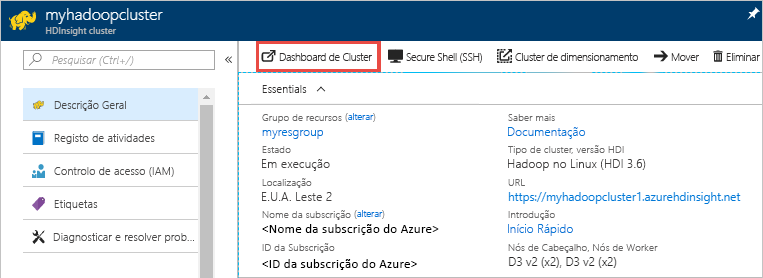
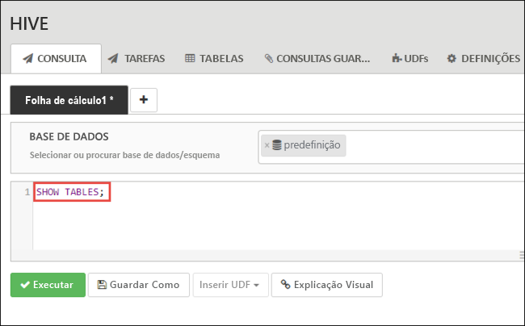
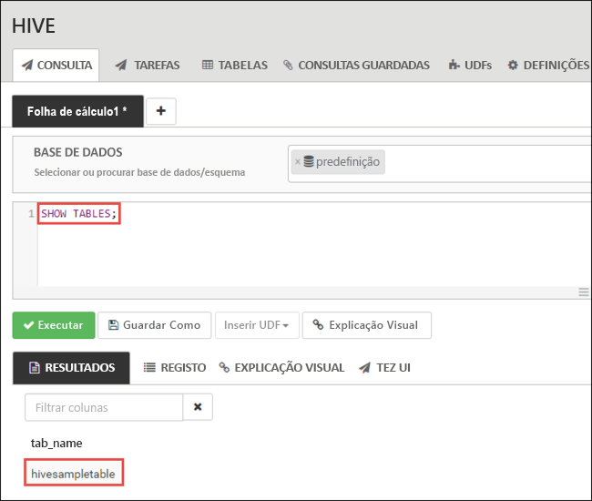
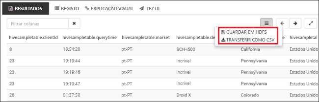

# <a name="quickstart-create-apache-hadoop-cluster-in-azure-hdinsight-using-azure-portal"></a>Início rápido: Criar cluster do Apache Hadoop no HDInsight do Azure através do portal do Azure

Neste artigo, irá aprender a criar [Apache Hadoop](https://hadoop.apache.org/) clusters no HDInsight com o portal do Azure e, em seguida, executar tarefas de Apache Hive no HDInsight. A maioria das tarefas do Hadoop são tarefas de lote. Cria um cluster, executa algumas tarefas e, em seguida, elimina o cluster. Neste artigo, irá realizar as três tarefas.

Neste guia de início rápido, irá utilizar o portal do Azure para criar um cluster do Hadoop no HDInsight. Também pode criar um cluster através do [modelo Azure Resource Manager](apache-hadoop-linux-tutorial-get-started.md).

Atualmente, o HDInsight inclui [sete tipos diferentes de cluster](./apache-hadoop-introduction.md#cluster-types-in-hdinsight). Cada tipo de cluster suporta um conjunto diferente de componentes. Todos os tipos de cluster suportam o Hive. Para obter uma lista dos componentes suportados no HDInsight, consulte [quais são as novidades nas versões de cluster do Apache Hadoop fornecidas pelo HDInsight?](../hdinsight-component-versioning.md)  

Se não tiver uma subscrição do Azure, [crie uma conta gratuita](https://azure.microsoft.com/free/) antes de começar.

## <a name="create-an-apache-hadoop-cluster"></a>Criar um cluster do Apache Hadoop

Nesta secção, irá criar um cluster do Hadoop no HDInsight através do portal do Azure.

1. Inicie sessão no [portal do Azure](https://portal.azure.com).

1. A partir do portal do Azure, navegue para **criar um recurso** > **análise** > **HDInsight**.

    

1. Sob **HDInsight** > **criação rápida** > **Noções básicas**, introduza ou selecione os seguintes valores:

    |Propriedade  |Descrição  |
    |---------|---------|
    |Nome do cluster   | Introduza um nome para o cluster do Hadoop. Uma vez que todos os clusters no HDInsight partilham o mesmo espaço de nomes DNS, este nome tem de ser único. O nome pode consistir em máximo de 59 carateres, incluindo letras, números e hífenes. O primeiro e último carateres do nome não podem ser hífenes. |
    |Subscrição    |  Selecione a sua subscrição do Azure. |
    |Tipo de cluster     | Ignorar por agora. Irá fornecer estas informações no próximo passo deste procedimento.|
    |Nome de utilizador de início de sessão de cluster e a palavra-passe    | O nome de início de sessão predefinido é **admin**. A palavra-passe tem de ter no mínimo 10 carateres e tem de conter, pelo menos, um número, uma letra maiúscula e uma letra minúscula, e um caráter não alfanumérico (exceto os carateres ' " `\). Certifique-se de que **não escolhe** uma palavra-passe comum, tal como "Pass@word1".|
    |Nome de utilizador de Secure Shell (SSH) | O nome de utilizador predefinido é **sshuser**.  Pode indicar outro nome de utilizador SSH. |
    |Utilize a palavra-passe de início de sessão do cluster para SSH| Selecione esta caixa de verificação para utilizar a mesma palavra-passe de utilizador SSH que forneceu para o utilizador de início de sessão do cluster.|
    |Grupo de recursos     | Crie um grupo de recursos ou selecione um existente.  Um grupo de recursos é um contentor de componentes do Azure.  Neste caso, o grupo de recursos contém o cluster do HDInsight e a conta de armazenamento do Azure dependente. |
    |Location    | Selecione uma localização do Azure onde quer criar o cluster.  Selecione uma localização mais próxima de si para obter um melhor desempenho. |

    

1. Selecione **tipo de Cluster** para abrir o **configuração de Cluster** página e, em seguida, forneça os valores seguintes:

    |Propriedade  |Descrição  |
    |---------|---------|
    |Tipo de cluster     | Selecione **Hadoop** |
    |Version     | Selecione **Hadoop 2.7.3 (HDI 3.6)**|

    

    Selecione **selecionar** e, em seguida, selecione **próxima** para avançar para as definições de armazenamento.

1. Partir do **armazenamento** separador, forneça os valores seguintes:

    |Propriedade  |Descrição  |
    |---------|---------|
    |Tipo de armazenamento primário    | Neste artigo, selecione o armazenamento do Azure para utilizar o Azure Storage Blob como conta de armazenamento predefinida. Também pode utilizar o Azure Data Lake Storage como armazenamento predefinido. |
    |Método de seleção     |  Para este artigo, selecione **As minhas subscrições** para utilizar uma conta de armazenamento da sua subscrição do Azure. Para utilizar a conta de armazenamento de outras subscrições, selecione **Chave de acesso** e, em seguida, forneça a chave de acesso dessa conta. |
    |Selecione uma conta de armazenamento   | Selecione **Selecione uma conta de armazenamento** para selecionar uma conta de armazenamento existente ou selecione **criar nova**.|

    Aceite todos os outros valores predefinidos e, em seguida, selecione **seguinte** para avançar para a página de resumo.

    

1. Partir do **resumo** separador, verifique se os valores selecionados nos passos anteriores.

    

1. Selecione **Criar**. A criação de um cluster demora cerca de 20 minutos.

1. Após a criação do cluster, verá a página de descrição geral do cluster no portal do Azure.

        

    Cada cluster tem uma dependência de [conta do Armazenamento do Azure](../hdinsight-hadoop-use-blob-storage.md) ou de [conta do Azure Data Lake](../hdinsight-hadoop-use-data-lake-store.md). É designada de conta de armazenamento predefinida. Cluster do HDInsight e a sua conta do storage predefinida tem de ser colocalizados na mesma região do Azure. A eliminação dos clusters não elimina a conta de armazenamento.

    > [!NOTE]  
    > Para outros métodos de criação de clusters e compreender as propriedades utilizadas neste guia de introdução, consulte [clusters do HDInsight criar](../hdinsight-hadoop-provision-linux-clusters.md).

## <a name="run-apache-hive-queries"></a>Executar consultas do Apache Hive

O [Apache Hive](hdinsight-use-hive.md) é o componente mais popular utilizado no HDInsight. Existem várias formas de executar tarefas do Hive no HDInsight. Neste início rápido, vai utilizar a vista Ambari Hive do portal. Para conhecer outros métodos de submissão de tarefas do Hive, consulte [Utilizar o Hive no HDInsight](hdinsight-use-hive.md).

1. Para abrir o Ambari, a partir da captura de ecrã anterior, selecione **Dashboard de Clusters**.  Também pode navegar até `https://ClusterName.azurehdinsight.net`, onde `ClusterName` é o cluster que criou na secção anterior.

    

2. Introduza o nome de utilizador e a palavra-passe do Hadoop que especificou ao criar o cluster. O nome de utilizador predefinido é **admin**.

3. Abra a **Vista do Hive** conforme mostrado na captura de ecrã seguinte:

    

4. No separador **CONSULTAS**, cole as seguintes declarações HiveQL na folha de cálculo:

    ```sql
    SHOW TABLES;
    ```

    

5. Selecione **Executar**. O separador **RESULTADOS** aparece por baixo do separador **CONSULTA** e apresenta informações sobre a tarefa. 

    Assim que a consulta estiver concluída, o **consulta** guia exibe os resultados da operação. Deverá ver uma tabela denomizada **hivesampletable**. Esta tabela do Hive de exemplo inclui todos os clusters do HDInsight.

    

6. Repita os passos 4 e 5 para executar a seguinte consulta:

    ```sql
    SELECT * FROM hivesampletable;
    ```

7. Também pode guardar os resultados da consulta. Selecione o botão de menu à direita e especifique se quer transferir os resultados como um ficheiro CSV ou armazená-los na conta de armazenamento associada ao cluster.

    

Depois de concluir uma tarefa deo Hive, pode [exportar os resultados para a Base de Dados SQL do Azure ou a base de dados do SQL Server](apache-hadoop-use-sqoop-mac-linux.md). Do mesmo modo, pode [visualizar os resultados com o Excel](apache-hadoop-connect-excel-power-query.md). Para obter mais informações sobre como utilizar o Hive no HDInsight, consulte [utilizar o Apache Hive e o HiveQL com o Apache Hadoop no HDInsight, para analisar um ficheiro de exemplo Apache log4j](hdinsight-use-hive.md).

## <a name="clean-up-resources"></a>Limpar recursos

Depois de concluir o início rápido, pode querer eliminar o cluster. Com o HDInsight, os dados são armazenados no Storage do Azure, pelo que pode eliminar um cluster em segurança quando este não está a ser utilizado. Também lhe é cobrado o valor de um cluster do HDInsight mesmo quando não o está a utilizar. Uma vez que os custos do cluster são muito superiores aos custos do armazenamento, faz sentido do ponto de vista económico eliminar os clusters quando não estiverem a ser utilizados.

> [!NOTE]  
> Se estiver *imediatamente* prosseguir para o artigo seguinte para saber como executar operações de ETL, usando o Hadoop no HDInsight, talvez queira manter o cluster em execução. Isto acontece porque o tutorial tem de criar um cluster do Hadoop novamente. No entanto, se não passam pelo próximo artigo imediatamente, tem de eliminar o cluster agora.

### <a name="to-delete-the-cluster-andor-the-default-storage-account"></a>Para eliminar o cluster e/ou a conta do Storage predefinida

1. Volte ao separador do browser onde tem o portal do Azure. Deverá estar na página de descrição geral do cluster. Se apenas quiser eliminar o cluster, mas quiser manter a conta de armazenamento predefinida, selecione **Eliminar**.

    

2. Se quiser eliminar o cluster e a conta de armazenamento predefinida, selecione o nome do grupo de recursos (realçado na captura de ecrã anterior) para abrir a página do grupo de recursos.

3. Selecione **Eliminar grupo de recursos** para eliminar o grupo de recursos, o qual contém o cluster e a conta de armazenamento predefinida. Tenha em atenção que a eliminação do grupo de recursos elimina a conta de armazenamento. Se pretender manter a conta do Storage, opte por eliminar apenas o cluster.

## <a name="next-steps"></a>Passos Seguintes

Neste início rápido, aprendeu como criar um cluster do HDInsight baseado em Linux com um modelo do Resource Manager e como executar consultas do Hive básicas. No artigo seguinte, irá saber como executar uma operação de ETL (extração, transformação e carregamento) com o Hadoop no HDInsight.

> [!div class="nextstepaction"]
>[Extrair, transformar e carregar dados com o Interactive Query no HDInsight](../interactive-query/interactive-query-tutorial-analyze-flight-data.md)
