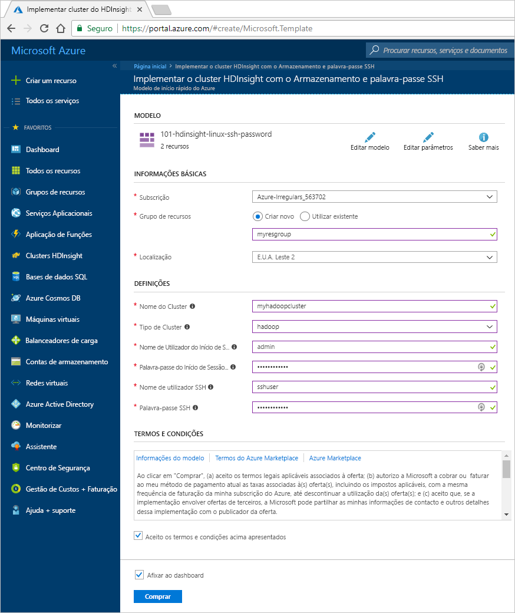
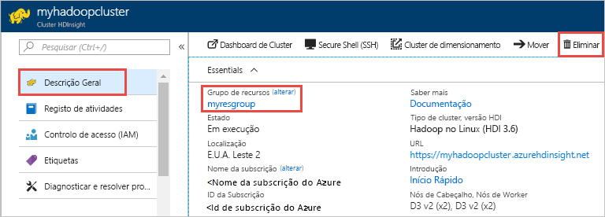

# Quickstart: Criar o cluster Hadoop Apache no Azure HDInsight usando o modelo de Gestor de Recursos

Neste arranque rápido, aprende-se a criar um cluster Apache Hadoop em Azure HDInsight utilizando um modelo de Gestor de Recursos.

Modelos semelhantes podem ser vistos em [modelos de quickstart Azure](https://azure.microsoft.com/resources/templates/?resourceType=Microsoft.Hdinsight&pageNumber=1&sort=Popular). A referência do modelo pode ser encontrada [aqui](https://docs.microsoft.com/azure/templates/microsoft.hdinsight/allversions).  Também pode criar um cluster utilizando o [portal Azure.](apache-hadoop-linux-create-cluster-get-started-portal.md)  

Atualmente, o HDInsight inclui [sete tipos diferentes de cluster](../hdinsight-overview.md#cluster-types-in-hdinsight). Cada tipo de cluster suporta um conjunto diferente de componentes. Todos os tipos de cluster suportam o Hive. Para obter uma lista dos componentes suportados no HDInsight, consulte [Quais são as novidades nas versões de cluster do Hadoop fornecidas pelo HDInsight?](../hdinsight-component-versioning.md)  

Se não tiver uma subscrição do Azure, crie uma [conta gratuita](https://azure.microsoft.com/free/?WT.mc_id=A261C142F) antes de começar.

## Criar um cluster do Hadoop

1. Selecione o botão **Deploy para Azure** abaixo para iniciar sessão no Azure e abra o modelo de Gestor de Recursos no portal Azure.

    

2. Introduza ou selecione os seguintes valores:

    |Propriedade  |Descrição  |
    |---------|---------|
    |Subscrição|  Selecione a sua subscrição do Azure. |
    |Grupo de recursos | Crie um grupo de recursos ou selecione um existente.  Um grupo de recursos é um contentor de componentes do Azure.  Neste caso, o grupo de recursos contém o cluster do HDInsight e a conta de armazenamento do Azure dependente. |
    |Localização | Selecione uma localização do Azure onde pretende criar o cluster.  Selecione uma localização mais próxima de si para obter um melhor desempenho. |
    |Nome do cluster | Introduza um nome para o cluster do Hadoop. Uma vez que todos os clusters no HDInsight partilham o mesmo espaço de nomes DNS, este nome tem de ser único. O nome só pode conter letras minúsculas, números e hífens, e deve começar com uma letra.  Cada hífen tem de ser precedido e seguido de um caráter que não seja um hífen.  O nome também deve ter entre 3 e 59 caracteres de comprimento. |
    |Tipo de Cluster | Selecione **hadoop**. |
    |Nome de login do cluster e senha | O nome de login predefinido é **administrador**. A palavra-passe deve ter pelo menos 10 caracteres de comprimento e deve conter pelo menos um dígito, uma maiúscula e uma letra minúscula, um caracteres não alfanuméricos (exceto os caracteres " \). Certifique-se de que **não escolhe** uma palavra-passe comum, tal como "Pass@word1".|
    |Nome de utilizador e senha sSH| O nome de utilizador predefinido é **sshuser**.  Pode mudar o nome de utilizador do SSH.  A palavra-passe de utilizador do SSH tem os mesmos requisitos que a palavra-passe de início de sessão do cluster.|

    Algumas propriedades foram codificadas no modelo.  Pode configurar estes valores a partir do modelo. Para obter mais explicações sobre estas propriedades, consulte [Create Apache Hadoop clusters in HDInsight](../hdinsight-hadoop-provision-linux-clusters.md).

    > [!NOTE]  
    > Os valores que forem fornecidos têm de ser exclusivos e devem seguir as diretrizes de nomenclatura. O modelo não realiza verificações de validação. Caso os valores fornecidos já estejam a ser utilizados ou não sigam as diretrizes, receberá um erro depois de ter submetido o modelo.  

    

3. Selecione **Concordo com os termos e condições acima indicados**e, em seguida, selecione **Comprar**. Receberá uma notificação de que a sua implantação está em andamento.  A criação de um cluster demora cerca de 20 minutos.

4. Assim que o cluster for criado, receberá uma notificação **de Implementação bem sucedida** com uma ligação de grupo de **recursos.**  A página do **grupo Recursos** listará o seu novo cluster HDInsight e o armazenamento predefinido associado ao cluster. Cada cluster tem uma [conta de Armazenamento Azure](../hdinsight-hadoop-use-blob-storage.md) ou uma dependência da conta de armazenamento de [lagos de dados Azure.](../hdinsight-hadoop-use-data-lake-store.md) É referida como a conta de armazenamento padrão. O cluster HDInsight e a sua conta de armazenamento predefinido devem ser colocalizados na mesma região de Azure. Eliminar aglomerados não apaga a conta de armazenamento.

> [!NOTE]  
> Para outros métodos de criação de clusters e compreensão das propriedades utilizadas neste arranque rápido, consulte [Create HDInsight clusters](../hdinsight-hadoop-provision-linux-clusters.md).

## Limpar recursos

Depois de completar o arranque rápido, poderá querer eliminar o cluster. Com o HDInsight, os seus dados são armazenados no Armazenamento Azure, para que possa eliminar com segurança um cluster quando não estiver a ser utilizado. Também é cobrado por um cluster HDInsight, mesmo quando não está a ser utilizado. Uma vez que as taxas para o cluster são muitas vezes mais do que as taxas de armazenamento, faz sentido económico apagar clusters quando não estão em uso.

> [!NOTE]  
> Se tenciona avançar *imediatamente* para o tutorial seguinte para saber como executar operações de ETL com o Hadoop no HDInsight, talvez seja conveniente manter o cluster em execução. Isto porque no tutorial tens de criar um aglomerado hadoop outra vez. No entanto, se não avançar já para o tutorial seguinte, tem de eliminar o cluster agora.

Para eliminar o cluster e/ou a conta de armazenamento por defeito:

1. Volte ao separador do browser onde tem o portal do Azure. Deverá estar na página de descrição geral do cluster. Se apenas quiser eliminar o cluster, mas quiser manter a conta de armazenamento predefinida, selecione **Eliminar**.

    

2. Se quiser eliminar o cluster e a conta de armazenamento predefinida, selecione o nome do grupo de recursos (realçado na captura de ecrã anterior) para abrir a página do grupo de recursos.

3. Selecione **Eliminar grupo de recursos** para eliminar o grupo de recursos, o qual contém o cluster e a conta de armazenamento predefinida. Tenha em atenção que a eliminação do grupo de recursos elimina a conta de armazenamento. Se pretender manter a conta do Storage, opte por eliminar apenas o cluster.

## Passos seguintes

Neste arranque rápido, aprendeu a criar um cluster Apache Hadoop no HDInsight usando um modelo de Gestor de Recursos. No artigo seguinte, vai aprender a realizar uma operação de ETL (extração, transformação e carregamento) com o Hadoop no HDInsight.

> [!div class="nextstepaction"]
> [Extrair, transformar e carregar dados usando consulta interativa no HDInsight](../interactive-query/interactive-query-tutorial-analyze-flight-data.md)