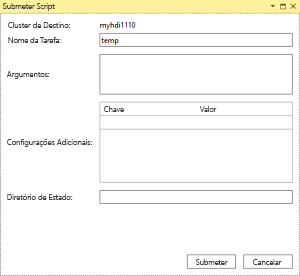
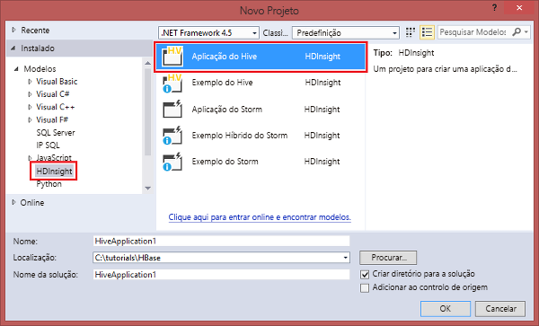

# Utilizar o Data Lake Tools para Visual Studio para ligar ao Azure HDInsight e executar consultas do Apache Hive

Aprenda a usar [Microsoft Azure Data Lake e do Stream Analytics Tools para Visual Studio](https://www.microsoft.com/download/details.aspx?id=49504) (também conhecido como ferramentas do Data Lake) para ligar ao Apache Hadoop clusters no [Azure HDInsight](../hdinsight-hadoop-introduction.md) e submeter consultas do Hive.  

Para obter mais informações sobre a utilização do HDInsight, veja [Introduction to HDInsight](../hdinsight-hadoop-introduction.md) (Introdução ao HDInsight) e [Get started with HDInsight ](apache-hadoop-linux-tutorial-get-started.md) (Começar a utilizar o HDInsight).  

Para obter mais informações sobre como ligar a um cluster do Apache Storm, consulte [desenvolver C# topologias do Apache Storm no HDInsight com o Visual Studio](../storm/apache-storm-develop-csharp-visual-studio-topology.md).

Pode utilizar o Data Lake Tools para Visual Studio para aceder ao Azure Data Lake Analytics e ao HDInsight. Para obter informações sobre o Data Lake Tools, veja [Desenvolver scripts U-SQL com o Data Lake Tools para Visual Studio](../../data-lake-analytics/data-lake-analytics-data-lake-tools-get-started.md).

## Pré-requisitos

Para concluir este tutorial e utilizar o Data Lake Tools para Visual Studio, precisa do seguinte:

* Um cluster do Azure HDInsight. Para criar um cluster do HDInsight, veja [comece por utilizar o Apache Hadoop no Azure HDInsight](apache-hadoop-linux-tutorial-get-started.md). Para executar consultas interativas do Apache Hive, precisa de um [Interactive Query do HDInsight](../interactive-query/apache-interactive-query-get-started.md) cluster.  

* [Visual Studio](https://visualstudio.microsoft.com/downloads/) (2013 ou mais recente).  O [edição de Comunidade do Visual Studio](https://visualstudio.microsoft.com/vs/community/) é gratuito.  Consulte também [instale o Visual Studio 2017](https://docs.microsoft.com/visualstudio/install/install-visual-studio).

  > [!IMPORTANT]  
  > Ferramentas do Data Lake já não é suportada para o Visual Studio 2013. 

## Instalar as Ferramentas do Data Lake para Visual Studio  

* Visual Studio 2017  
  Durante a instalação, certifique-se de incluir, pelo menos, cargas de trabalho **desenvolvimento do Azure** ou **armazenamento de dados e processamento**.  

  Para instalações existentes, na barra de menus, navegue até **ferramentas** > **obter ferramentas e recursos...**  para abrir a instalação do Visual Studio.  Em seguida, selecione, pelo menos, cargas de trabalho **desenvolvimento do Azure** ou **armazenamento de dados e processamento**.

  

* Visual Studio 2013 e 2015  
  [Baixe as ferramentas do Data Lake](https://www.microsoft.com/download/details.aspx?id=49504). Escolha a versão do Data Lake Tools que corresponde à sua versão do Visual Studio.  

> [!NOTE]  
> Atualmente, está disponível apenas a versão em inglês do Data Lake Tools para Visual Studio.

## Atualizar as ferramentas do Data Lake para Visual Studio  

1. Abra o Visual Studio.

2. A partir da barra de menus, navegue para **ferramentas** > **extensões e atualizações...** .

3. Partir do **extensões e atualizações** janela, expanda **atualizações** à esquerda.

4. Se está disponível, uma atualização **do Azure Data Lake e ferramentas de análise de Stream** aparecerá na janela principal.  Selecione **atualização**.

> [!NOTE]  
> Pode utilizar apenas o Data Lake Tools versão 2.3.0.0 ou posterior para ligar a clusters da Consulta Interativa e executar consultas interativas do Hive.

## Ligar a subscrições do Azure
Pode utilizar o Data Lake Tools para Visual Studio para se ligar aos seus clusters do HDInsight, realizar algumas operações de gestão básicas e executar consultas do Hive.

> [!NOTE]  
> Para obter informações sobre a ligação a um cluster do Hadoop genérico, veja [Escrever e submeter consultas do Hive com o Visual Studio](https://blogs.msdn.com/b/xiaoyong/archive/2015/05/04/how-to-write-and-submit-hive-queries-using-visual-studio.aspx).

Para ligar à sua subscrição do Azure:

1. Abra o Visual Studio.

2. A partir da barra de menus, navegue para **View** > **Explorador de servidores**.

3. No Explorador de servidores, clique com botão direito **Azure**, selecione **ligar a subscrição do Microsoft Azure...** e conclua o processo de início de sessão.

4. No Explorador de servidores, é apresentada uma lista dos clusters do HDInsight existentes. Se não tiver clusters, pode criar um através do Portal do Azure, do Azure PowerShell ou do SDK do HDInsight. Para obter mais informações, veja [Create HDInsight clusters](../hdinsight-hadoop-provision-linux-clusters.md) (Criar clusters do HDInsight).

   

5. Expanda um cluster do HDInsight. São apresentadas **Bases de Dados do Hive**, uma conta de armazenamento predefinida, contas de armazenamento ligadas e o **registo do serviço do Hadoop**. Pode expandir ainda mais as entidades.

Depois de se ligar à sua subscrição do Azure, pode realizar as seguintes tarefas.

Ligar-se ao portal do Azure a partir do Visual Studio:

1. No Explorador de servidores, navegue até **Azure** > **HDInsight** e selecione o cluster.

2. Um cluster do HDInsight com o botão direito e selecione **gerir Cluster no Portal do Azure**.

Para fazer perguntas e/ou enviar comentários a partir do Visual Studio:

1. No Explorador de servidores, navegue até **Azure** > **HDInsight**.

2. Com o botão direito **HDInsight** e selecione **fórum de MSDN** para fazer perguntas, ou **enviar comentários** para enviar comentários.

## Explorar recursos ligados
No Explorador de Servidores, pode ver a conta do Storage predefinida e quaisquer contas do Storage ligadas. Se expandir a conta do Storage predefinida, pode ver os contentores incluídos na mesma. A conta do Storage predefinida e o contentor predefinido estão marcados. Clique com o botão direito do rato em qualquer um dos contentores para ver os conteúdos do contentor.

Depois de abrir um contentor, pode utilizar os botões seguintes para carregar, eliminar e transferir blobs:

## Executar consultas interativas do Apache Hive
O [Apache Hive](https://hive.apache.org) é uma infraestrutura de armazém de dados que está incorporada no Hadoop. O Hive é utilizado para resumo de dados, consultas e análises. Pode utilizar o Data Lake Tools para Visual Studio para executar consultas do Hive a partir do Visual Studio. Para obter mais informações sobre o Hive, consulte [utilizar o Apache Hive com HDInsight](hdinsight-use-hive.md).

A [Consulta Interativa](../interactive-query/apache-interactive-query-get-started.md) utiliza o [Hive no LLAP](https://cwiki.apache.org/confluence/display/Hive/LLAP) no Apache Hive 2.1. A Consulta Interativa traz interatividade a consultas complexas de estilo do armazém de dados em conjuntos de dados grandes e armazenados. Executar consultas do Hive no Interactive Query é muito mais rápido em comparação com as tradicionais tarefas de lote do Hive. Para obter mais informações, consulte [tarefas de lote de executar o Apache Hive](#run-hive-batch-jobs).

> [!NOTE]  
> Pode executar consultas interativas do Hive apenas quando ligar a um cluster do [HDInsight Interactive Query](../interactive-query/apache-interactive-query-get-started.md).

Também pode utilizar o Data Lake Tools para Visual Studio para ver o que está dentro de uma tarefa do Hive. O Data Lake Tools para Visual Studio recolhe e analisa os registos do Yarn de determinadas tarefas do Hive.

No Explorador de servidores, navegue até **Azure** > **HDInsight** e selecione o cluster.  Este será o ponto de partida no Explorador de servidores para as seções a seguir.

### Vista hivesampletable
Todos os clusters do HDInsight tem uma tabela de Hive de exemplo do padrão chamada `hivesampletable`.  

A partir do seu cluster, navegue para **bases de dados do Hive** > **predefinido** > **hivesampletable**.

* Para ver `hivesampletable` esquema:  
Expanda **hivesampletable**.

* Para ver `hivesampletable` dados:  
Com o botão direito **hivesampletable**e selecione **vista as primeiras 100 linhas**.  É equivalente a executar a seguinte consulta do Hive com o controlador ODBC do Hive:

   `SELECT * FROM hivesampletable LIMIT 100`

  Pode personalizar a contagem de linhas.

  

### Criar tabelas do Hive
Para criar uma tabela do Hive, pode utilizar a GUI ou utilizar consultas do Hive. Para obter informações sobre como utilizar consultas do Hive, consulte [consultas executar Apache Hive](#run.queries).

1. A partir do seu cluster, navegue para **bases de dados do Hive** > **padrão**.

2. Com o botão direito **predefinição**e selecione **Create Table**.

3. Configure a tabela conforme pretender.  

4. Selecione **Criar Tabela** para submeter a tarefa de criação da nova tabela do Hive.

    

### Criar e executar consultas do Hive
Tem duas opções para criar e executar consultas do Hive:

* Criar consultas ad-hoc
* Criar uma aplicação do Hive

Para criar e executar consultas ad-hoc:

1. Com o botão direito do cluster para executar a consulta e selecione onde pretende **escrever uma consulta do Hive**.  

2. Introduza as consultas do Hive.  

    O editor do Hive suporta IntelliSense. O Data Lake Tools para Visual Studio suportam o carregamento de metadados remotos durante a edição do script do Hive. Por exemplo, se digitar `SELECT * FROM`, o IntelliSense apresenta uma lista de todos os nomes de tabela sugeridos. Quando é especificado um nome de tabela, o IntelliSense lista os nomes das colunas. As ferramentas suportam quase todas as instruções DML do Hive, subconsultas e os UDFs incorporados.

    

    

   > [!NOTE]  
   > O IntelliSense sugere apenas os metadados do cluster selecionado na barra de ferramentas do HDInsight.

3. Escolha o modo de execução:

    * **Interativo**  

      Certifique-se **Interactive** está selecionada e, em seguida, selecione **Execute**.

        

    * **Batch**  

      Certifique-se **Batch** está selecionada e, em seguida, selecione **submeter**.  Se selecionar a opção de submissão avançada, configure **nome da tarefa**, **argumentos**, **configurações adicionais**, e **diretório de estado**para o script.

        

      

      > [!NOTE]  
      > Não pode enviar lotes para clusters do Interactive Query.  Tem de utilizar o modo interativo.

Para criar e executar uma solução do Hive:

1. A partir da barra de menus, navegue para **arquivo** > **New** > **Project...** .

2. No painel esquerdo, navegue até **instalada** > **do Azure Data Lake** > **HIVE (HDInsight)**.  

3. No painel do meio, selecione **Aplicação do Hive**. Introduza as propriedades e, em seguida, selecione **OK**.

    

4. No **Explorador de Soluções**, faça duplo clique em **Script.hql** para abrir o script.

### Resumo da tarefa de exibição e saída

O resumo da tarefa varia ligeiramente entre **Batch** e **Interactive** modo.

Utilize o **Atualize** botão para atualizar o estado até que o estado da tarefa, mude para **concluído**.  

* Para os detalhes da tarefa de **Batch** modo, selecione as ligações na parte inferior para ver **consulta da tarefa**, **resultado da tarefa**, **registo da tarefa**, ou **Registo do yarn**.

* Para os detalhes da tarefa de **Interactive** modo, consulte separadores **saída** e **HiveServer2 saída**.

  

### Gráfico da tarefa de vista

Atualmente, os gráficos da tarefa só são apresentados para tarefas do Hive que utilizam o Tez como motor de execução.  Para obter informações sobre como ativar o Tez, consulte [utilizar o Apache Hive no HDInsight](hdinsight-use-hive.md).  Consulte também [utilizar o Apache Tez, em vez de mapeamento redução](../hdinsight-hadoop-optimize-hive-query.md#use-apache-tez-instead-of-map-reduce).  

Para ver todos os operadores dentro do vértice, faça duplo clique nos vértices do gráfico da tarefa . Também pode apontar para um operador específico para ver mais detalhes sobre o operador.

Gráfico da tarefa pode não aparecer mesmo que seja especificado Tez como motor de execução, não se for iniciada a nenhuma aplicação Tez.  Isto pode acontecer porque a tarefa não contém instruções DML ou as instruções de DML podem retornar sem iniciar um aplicativo de Tez. Por exemplo, `SELECT * FROM table1` não irá iniciar o aplicativo de Tez.

### Detalhes de execução de tarefa

Gráfico da tarefa, pode selecionar **detalhes de execução de tarefa** para obter informações para tarefas do Hive estruturadas e visualizadas. Também pode obter mais detalhes de tarefas. Se ocorrerem problemas de desempenho, pode utilizar a vista para obter mais detalhes sobre o problema. Por exemplo, pode obter informações sobre como funciona cada tarefa e informações detalhadas sobre cada tarefa (leitura/escrita de dados, hora de agendamento/início/fim e assim sucessivamente). Utilize as informações para otimizar as configurações da tarefa ou a arquitetura do sistema, com base nas informações visualizadas.

### Ver tarefas do Hive
Pode ver as consultas da tarefa, a saída da tarefa, os registos da tarefa e os registos Yarn para as tarefas do Hive.

Na versão mais recente das ferramentas, pode ver o conteúdo das tarefas do Hive ao recolher e analisar registos Yarn. Um registo Yarn pode ajudar a investigar problemas de desempenho. Para obter mais informações sobre a forma como o HDInsight recolhe registos Yarn, veja [Access HDInsight application logs programmatically (Aceder programaticamente aos registos de aplicações do HDInsight)](../hdinsight-hadoop-access-yarn-app-logs.md).

Para ver tarefas do Hive:

1. Um cluster do HDInsight com o botão direito e selecione **ver tarefas**. É apresentada uma lista dos trabalhos do Hive executados no cluster.  

2. Selecione uma tarefa. Na janela **Resumo da Tarefa do Hive**, selecione uma das seguintes opções:
    - **Consulta da Tarefa**
    - **Resultado da Tarefa**
    - **Registo da Tarefa**  
    - **Registo do Yarn**

    

## Executar scripts de Apache Pig

1. A partir da barra de menus, navegue para **arquivo** > **New** > **Project...** .

2. No painel esquerdo, navegue até **instalada** > **do Azure Data Lake** > **Pig (HDInsight)**.  

3. No painel do meio, selecione **Pig aplicação**. Introduza as propriedades e, em seguida, selecione **OK**.

4. Na **Explorador de soluções**, faça duplo clique em **Script.pig** para abrir o script.

## Comentários e problemas conhecidos
* Foi corrigido um problema no qual os resultados que são iniciados com valores nulos não são apresentados. Se estiver bloqueado neste problema, contacte a equipa de suporte.
* O script HQL criado pelo Visual Studio é codificado consoante a definição de região local do utilizador. O script não é executado corretamente se carregar o script para um cluster como um ficheiro binário.

## Passos Seguintes
Neste artigo, aprendeu a utilizar o pacote do Data Lake Tools para Visual Studio para ligar a clusters do HDInsight a partir do Visual Studio. Também aprendeu a executar uma consulta do Hive. Para obter mais informações, veja estes artigos:

* [Executar consultas do Apache Hive com as ferramentas do Data Lake para Visual Studio](apache-hadoop-use-hive-visual-studio.md)
* [Utilizar o Hive do Hadoop no HDInsight](hdinsight-use-hive.md)
* [Introdução à utilização do Apache Hadoop no HDInsight](apache-hadoop-linux-tutorial-get-started.md)
* [Submeter tarefas do Apache Hadoop no HDInsight](submit-apache-hadoop-jobs-programmatically.md)
* [Analisar dados do Twitter com o Apache Hadoop no HDInsight](../hdinsight-analyze-twitter-data.md)

