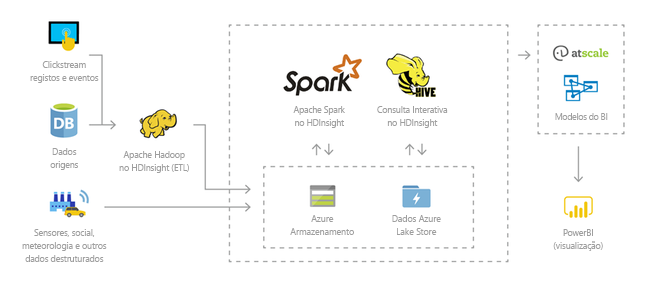
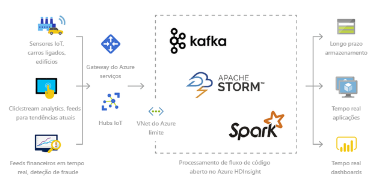
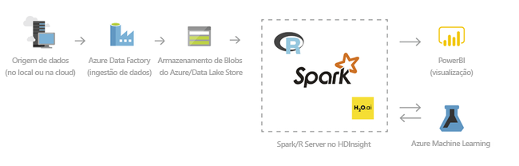
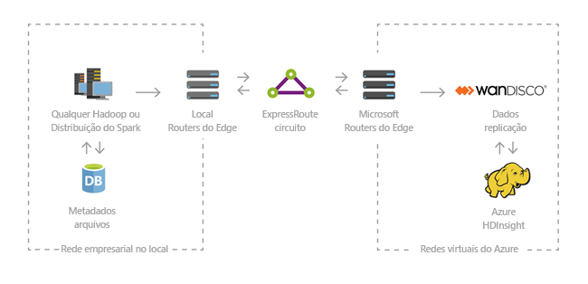

# O que é o Azure HDInsight?

Azure HDInsight é um serviço de análise gerido, de todo espectro e de código aberto na nuvem para empresas. Você pode usar quadros de código aberto como Hadoop, Apache Spark, Apache Hive, LLAP, Apache Kafka, Apache Storm, R, e muito mais.

## O que é o HDInsight e a pilha de tecnologia do Hadoop?

Azure HDInsight é uma distribuição em nuvem de componentes Hadoop. O Azure HDInsight torna mais fácil, rápido e rentável processar quantidades enormes de dados. Pode utilizar as estruturas de código aberto mais populares, como o Hadoop, o Spark, o Hive, o LLAP, o Kafka, o Storm, o R, entre outras. Com estas estruturas, pode permitir um vasto leque de cenários como extrair, transformar e carregar (ETL), armazenamento de dados, machine learning e IoT.

Para ver os componentes da pilha tecnológica do Hadoop disponíveis no HDInsight, veja [Componentes e versões disponíveis com o HDInsight](./hdinsight-component-versioning.md). Para ler mais sobre o Hadoop no HDInsight, veja a [página de funcionalidades do Azure para o HDInsight](https://azure.microsoft.com/services/hdinsight/).

## O que são macrodados?

Os macrodados são recolhidos em volumes cada vez maiores, a velocidades mais rápidas e numa variedade de formatos mais ampla do que nunca. Podem ser históricos (ou seja, armazenados) ou em tempo real (ou seja, transmitidos da origem). Veja [Scenarios for using HDInsight (Cenários para utilizar o HDInsight)](#scenarios-for-using-hdinsight) para saber mais sobre os casos de utilização mais comuns de macrodados.

## Por que devo usar Azure HDInsight?

Esta secção lista as capacidades do Azure HDInsight.

|Funcionalidade  |Description  |
|---------|---------|
|Cloud nativa     |     O Azure HDInsight permite-lhe criar clusters otimizados para serviços Hadoop, Spark, [Interactive (LLAP),](./interactive-query/apache-interactive-query-get-started.md)Kafka, Storm, HBase e ML services on Azure. O HDInsight também oferece um SLA de ponto a ponto em todas as suas cargas de trabalho de produção.  |
|Baixo custo e dimensionável     | O HDInsight permite-lhe escalar cargas de trabalho para cima ou para baixo.Pode reduzir custos criando clusters a pedido e pagando apenas pelo que usa. Também pode criar pipelines de dados para operacionalizar as tarefas. A computação e o armazenamento desassociados oferecem um melhor desempenho e flexibilidade. |
|Seguro e conforme    | O HDInsight permite-lhe proteger os seus ativos de dados empresariais com a Rede Virtual do Azure, a encriptação e a integração no Azure Active Directory. O HDInsight também cumpre os padrões de conformidade mais populares da indústria e do governo.        |
|Monitorização    | O Azure HDInsight integra-se com registos do Azure Monitor para fornecer uma única interface com a qual pode monitorizar todos os seus clusters.        |
|Disponibilidade global | O HDInsight está disponível em mais regiões do que qualquer outra oferta de big data analytics. O Azure HDInsight também está disponível no Azure Government, na China e na Alemanha, o que lhe permite satisfazer as suas necessidades empresariais nas principais áreas soberanas. |  
|Produtividade     |  O Azure HDInsight permite-lhe utilizar ferramentas produtivas avançadas para o Hadoop e o Spark com os seus ambientes de desenvolvimento preferidos. Estes ambientes de desenvolvimento incluem suporte do Visual Studio, VSCode, Eclipse e IntelliJ para Scala, Python, R, Java e .NET. Os cientistas de dados também podem colaborar com blocos de notas populares, como o Jupyter e o Zeppelin.    |
|Extensibilidade     |  Pode expandir os clusters do HDInsight com componentes instalados (Hue, Presto, etc.) através da utilização de ações de script, ao adicionar nós periféricos ou ao integrar noutras aplicações certificadas de macrodados. O HDInsight permite a integração perfeita com as soluções mais populares de macrodados com uma implementação de um só clique.|

## Cenários para utilizar o HDInsight

O Azure HDInsight pode servir para uma variedade de cenários de processamento de macrodados. Podem ser dados históricos (dados já recolhidos e armazenados) ou dados em tempo real (dados transmitidos diretamente da origem). Os cenários para processar esses dados podem ser resumidos nas seguintes categorias:

### Processamento em lotes (ETL)

A extração, transformação e carregamento (ETL) é um processo onde os dados estruturados ou não estruturados são extraídos de origens de dados heterogéneas. Depois, são transformados num formato estruturado e carregados para um arquivo de dados. Pode utilizar os dados transformados para ciência de dados ou armazenamento de dados.

### Armazenamento de dados

Pode utilizar o HDInsight para executar consultas interativas em escalas de petabytes sobre dados estruturados ou não estruturados em qualquer formato. Também pode criar modelos ao ligá-las a ferramentas de BI.

### Internet das Coisas (IoT)

Pode utilizar o HDInsight para processar dados de streaming que são recebidos em tempo real a partir de diferentes tipos de dispositivos. Para obter mais informações, [leia esta mensagem do blogue do Azure que anuncia a pré-visualização pública do Apache Kafka no HDInsight com os discos geridos do Azure](https://azure.microsoft.com/blog/announcing-public-preview-of-apache-kafka-on-hdinsight-with-azure-managed-disks/).

### Ciência dos dados

Pode utilizar o HDInsight para criar aplicações que extraem informações críticas dos dados. Também pode utilizar o Azure Machine Learning para prever futuras tendências para a sua empresa. Para obter mais informações, [leia esta história do cliente](https://customers.microsoft.com/story/pros).

### Híbrido

Pode utilizar o HDInsight para expandir a sua atual infraestrutura de macrodados local no Azure, para tirar partido de capacidades avançadas de análise da cloud.

## Tipos de clusters no HDInsight

O HDInsight inclui tipos de clusters específicos e capacidades de personalização de clusters, como a possibilidade de adicionar componentes, utilitários e linguagens. O HDInsight oferece os seguintes tipos de cluster:

|Tipo de Cluster | Description |
|---|---|
|[Apache Hadoop](./hadoop/apache-hadoop-introduction.md)|Uma estrutura que utiliza HDFS, gestão de recursos YARN e um modelo de programação mapReduce simples para processar e analisar dados de lote em paralelo.|
|[Apache Spark](./spark/apache-spark-overview.md)|Um quadro de processamento paralelo de código aberto que suporta o processamento na memória para aumentar o desempenho de aplicações de análise de big data. Veja [O que é o Apache Spark no HDInsight?](./spark/apache-spark-overview.md)|
|[Apache HBase](./hbase/apache-hbase-overview.md)|Uma base de dados NoSQL construída sobre Hadoop que proporciona acesso aleatório e forte consistência para grandes quantidades de dados não estruturados e semi-estruturados -- potencialmente biliões de linhas vezes milhões de colunas. Veja [O que é o HBase no HDInsight?](./hbase/apache-hbase-overview.md)|
|[Serviços ML](./r-server/r-server-overview.md)|Um servidor para hospedar e gerir processos paralelos e distribuídos R. Fornece cientistas de dados, peritos em estatística e programadores de R com acesso a pedido a métodos dimensionáveis distribuídos de análise no HDInsight. Veja [Descrição geral dos Serviços ML no HDInsight](./r-server/r-server-overview.md).|
|[Apache Storm](./storm/apache-storm-overview.md)|Um sistema de computação distribuído em tempo real para o processamento de grandes fluxos de dados rapidamente. O Storm é fornecido como um cluster gerido no HDInsight. Consulte [Analisar dados de sensores em tempo real através do Storm e do Hadoop](./storm/apache-storm-overview.md).|
|[Consulta Interativa Apache](./interactive-query/apache-interactive-query-get-started.md)|Caching na memória para consultas interativas e mais rápidas da Colmeia. Veja [Use Interactive Query in HDInsight (Utilizar o Interactive Query no HDInsight)](./interactive-query/apache-interactive-query-get-started.md).|
|[Apache Kafka](./kafka/apache-kafka-introduction.md)|Uma plataforma de código aberto que é usada para construir pipelines e aplicações de dados de streaming. O Kafka também fornece uma funcionalidade de fila de mensagens que lhe permite publicar e subscrever transmissões de dados. Consulte [Introduction to Apache Kafka on HDInsight (Introdução ao Apache Kafka no HDInsight)](./kafka/apache-kafka-introduction.md).|

## Componentes de código aberto no HDInsight

O Azure HDInsight permite-lhe criar clusters com estruturas de código aberto tais como Hadoop, Spark, Hive, LLAP, Kafka, Storm, HBase e R. Estes clusters, por padrão, vêm com outros componentes de código aberto que estão incluídos no cluster como Apache Ambari5, Avro5, Apache Hive3, HCatalog2, Apache Mahout2, Apache Hadoop MapReduce3, Apache Hadoop YARN2, Apache Phoenix3, Apache Pig3, Apache Sqoop3, Apache Tez3, Apache Ozie2, e Apache ZooKeeper5.  

## Linguagens de programação no HDInsight

Os clusters do HDInsight, incluindo Spark, HBase, Kafka, Hadoop, entre outros, suportam muitas linguagens de programação. Contudo, algumas não estão instaladas por predefinição. Para bibliotecas, módulos ou pacotes que não estejam instalados por defeito, utilize uma ação de script para instalar o componente.

|Linguagem de programação  |Informações  |
|---------|---------|
|Suporte de linguagens de programação predefinidas     | Por predefinição, os clusters do HDInsight suportam:<ul><li>Java</li><li>Python</li><li>.NET</li><li>Ir</li></ul>  |
|Linguagens de máquina virtual de Java (JVM)     | Podem ser executadas muitas outras linguagens que não Java nas máquinas virtuais Java (JVM). No entanto, se executar algumas destas linguagens, poderá ter de instalar componentes adicionais no cluster. As linguagens baseadas em JVM abaixo são suportadas nos clusters do HDInsight: <ul><li>Clojure</li><li>Jython (Python para Java)</li><li>Scala</li></ul>     |
|Linguagens específicas do Hadoop     | Os clusters do HDInsight suportam as seguintes linguagens que são específicas da pilha de tecnologia do Hadoop: <ul><li>Pig Latin para tarefas do Pig</li><li>HiveQL para tarefas do Hive e SparkSQL</li></ul>        |

## Ferramentas de desenvolvimento para HDInsight

Pode utilizar as ferramentas de desenvolvimento HDInsight, incluindo IntelliJ, Eclipse, Visual Studio Code e Visual Studio, para criar e submeter tarefas e consultas de dados HDInsight com integração simplificada no Azure.

* Kit de ferramentas Azure para IntelliJ10
* Kit de ferramentas Azure para Eclipse6
* Ferramentas Azure HDInsight para VS Code13
* Ferramentas do lago de dados Azure para Visual Studio9

## Business intelligence no HDInsight

As ferramentas de business intelligence (BI) familiares obtêm, analisam e reportam dados integrados no HDInsight através do suplemento Power Query ou Microsoft Hive ODBC Driver:

* [Apache Spark BI a utilizar ferramentas de visualização de dados com o Azure HDInsight](./spark/apache-spark-use-bi-tools.md)

* [Visualizar dados da Apache Hive com o Microsoft Power BI em Azure HDInsight](./hadoop/apache-hadoop-connect-hive-power-bi.md)

* [Visualizar dados de Consulta Interativa do Hive com o Power BI no Azure HDInsight](./interactive-query/apache-hadoop-connect-hive-power-bi-directquery.md)

* [Conecte o Excel a Apache Hadoop com a Consulta de Energia](./hadoop/apache-hadoop-connect-excel-power-query.md) (requer o Windows)

* [Conecte o Excel ao Apache Hadoop com o Controlador ODBC da Microsoft (requer](./hadoop/apache-hadoop-connect-excel-hive-odbc-driver.md) o Windows)

## Residência de dados na região 

Spark, Hadoop, LLAP, Storm e MLService não armazenam os dados dos clientes, pelo que estes serviços satisfazem automaticamente os requisitos de residência de dados na região, incluindo os especificados no [Trust Center.](https://azuredatacentermap.azurewebsites.net/) 

Kafka e HBase armazenam os dados dos clientes. Estes dados são automaticamente armazenados pela Kafka e pela HBase numa única região, pelo que este serviço satisfaz os requisitos de residência de dados na região, incluindo os especificados no [Trust Center.](https://azuredatacentermap.azurewebsites.net/) 

Ferramentas familiares de inteligência empresarial (BI) recuperam, analisam e reportam dados que são integrados com HDInsight utilizando o add-in de Consulta de Energia ou o Controlador ODBC da Microsoft Hive.

## Passos seguintes

* [Criar aglomerado Apache Hadoop em HDInsight](./hadoop/apache-hadoop-linux-create-cluster-get-started-portal.md)
* [Criar um cluster do Apache Spark - Portal](./spark/apache-spark-jupyter-spark-sql-use-portal.md)
* [Segurança empresarial em Azure HDInsight](./domain-joined/hdinsight-security-overview.md)
