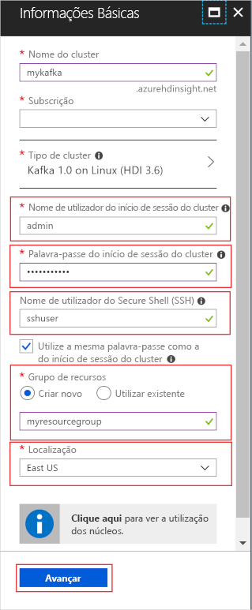
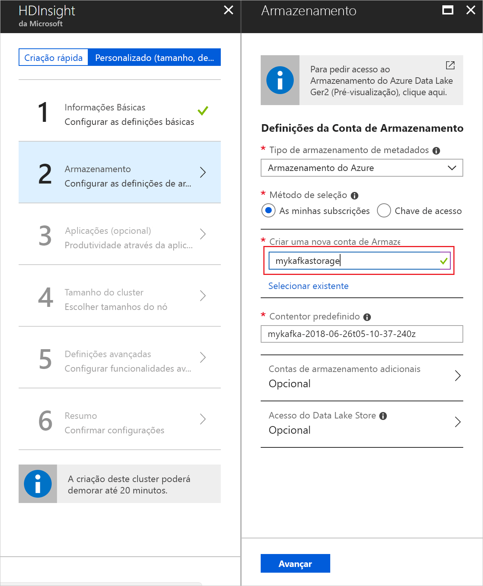
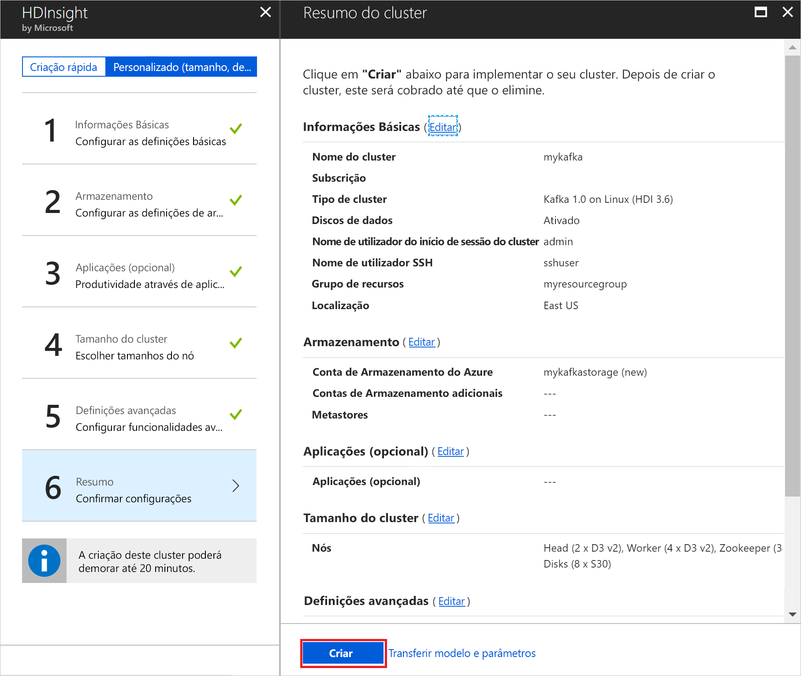

# <a name="quickstart-create-apache-kafka-cluster-in-azure-hdinsight-using-azure-portal"></a>Início rápido: Criar Apache Kafka cluster no Azure HDInsight usando portal do Azure

O Apache Kafka é uma plataforma de código aberto de transmissão em fluxo distribuída. É frequentemente utilizado como mediador de mensagens, uma vez que fornece funcionalidades semelhantes a uma fila de mensagens de publicação-subscrição. 

Neste início rápido, vai aprender a criar um cluster do [Apache Kafka](https://kafka.apache.org) com o portal do Azure. Também vai saber como utilizar utilitários incluídos para enviar e receber mensagens com o Apache Kafka.

[!INCLUDE [delete-cluster-warning](../../../includes/hdinsight-delete-cluster-warning.md)]

Só os recursos dentro da mesma rede virtual podem aceder à API do Apache Kafka. Neste guia de início rápido, irá aceder ao cluster diretamente através de SSH. Para ligar outros serviços, redes ou máquinas virtuais ao Apache Kafka, tem primeiro de criar uma rede virtual e, em seguida, criar os recursos dentro da rede. Para obter mais informações, veja o documento [Ligar ao Apache Kafka com uma rede virtual](apache-kafka-connect-vpn-gateway.md).

Se não tiver uma subscrição do Azure, crie uma [conta gratuita](https://azure.microsoft.com/free/?WT.mc_id=A261C142F) antes de começar.

## <a name="prerequisites"></a>Pré-requisitos

Um cliente SSH. Para obter mais informações, consulte [conectar-se ao HDInsight (Apache Hadoop) usando o ssh](../hdinsight-hadoop-linux-use-ssh-unix.md).

## <a name="create-an-apache-kafka-cluster"></a>Criar um cluster do Apache Kafka

Para criar um Apache Kafka no cluster do HDInsight, utilize os seguintes passos:

1. Inicie sessão no [portal do Azure](https://portal.azure.com).

2. No menu à esquerda, navegue até **+ criar uma** > **análise** > de recursos**HDInsight**.
   
    

3. Em **Informações Básicas**, introduza ou selecione as seguintes informações:

    | Definição | Valor |
    | --- | --- |
    | Nome do Cluster | Um nome exclusivo para o cluster do HDInsight. |
    | Subscrição | Selecione a sua subscrição. |
    
   Selecione __Tipo de Cluster__ para apresentar a **Configuração do Cluster**.
   
   

4. Em __configuração de cluster__, selecione os seguintes valores:

    | Definição | Valor |
    | --- | --- |
    | Tipo de Cluster | Kafka |
    | Version | Kafka 1.1.0 (HDI 3.6) |

    Selecione **selecionar** para salvar as configurações de tipo de cluster e retornar para __noções básicas__.

    

5. Em __Informações Básicas__, introduza ou selecione as seguintes informações:

    | Definição | Valor |
    | --- | --- |
    | Nome de utilizador de início de sessão do cluster | O nome de início de sessão ao aceder a serviços Web ou a APIs REST alojadas no cluster. Mantenha o valor predefinido (administrador). |
    | Palavra-passe de início de sessão do cluster | A palavra-passe de início de sessão ao aceder a serviços Web ou a APIs REST alojadas no cluster. |
    | Nome de utilizador de Secure Shell (SSH) | O início de sessão utilizado ao aceder ao cluster através de SSH. Por predefinição, a palavra-passe é igual à palavra-passe de início de sessão do cluster. |
    | Grupo de Recursos | O grupo de recursos em que o cluster é criado. |
    | Localização | A região do Azure em que o cluster é criado. |

    Cada região do Azure (localização) fornece _domínios de falha_. Um domínio de falha é um agrupamento lógico de hardware subjacente num centro de dados do Azure. Cada domínio de falha partilha um comutador de rede e uma fonte de alimentação. As máquinas virtuais e os discos geridos que implementam os nós num cluster HDInsight são distribuídos por esses domínios de falha. Esta arquitetura limita o possível impacto de falhas físicas de hardware.

    Para obter uma elevada disponibilidade de dados, selecione uma região (localização) que contenha __três domínios de falha__. Para obter informações sobre o número de domínios de falha numa região, consulte o documento [Disponibilidade das máquinas virtuais Linux](../../virtual-machines/windows/manage-availability.md#use-managed-disks-for-vms-in-an-availability-set).

   

    Selecione __Avançar__ para concluir a configuração básica.

6. Neste início rápido, mantenha as predefinições de segurança. Para saber mais sobre o pacote de Segurança Enterprise, visite [Configurar um cluster do HDInsight com Pacote de Segurança Enterprise com o Azure Active Directory Domain Services](../domain-joined/apache-domain-joined-configure-using-azure-adds.md). Para saber como utilizar a sua própria chave para Encriptação de Discos do Apache Kafka, visite [Traga a sua própria chave para o Apache Kafka no Azure HDInsight](apache-kafka-byok.md)

   Se quiser ligar o seu cluster a uma rede virtual, selecione uma rede virtual na lista pendente **Rede Virtual**.

   

7. Em **Armazenamento**, selecione ou crie uma Conta de armazenamento. Para seguir os passos neste documento, deixe os outros campos com os valores predefinidos. Utilize o botão __Seguinte__ para guardar a configuração do armazenamento. Para obter mais informações sobre como usar data Lake Storage Gen2 [, consulte início rápido: Configurar clusters no HDInsight](../../storage/data-lake-storage/quickstart-create-connect-hdi-cluster.md).

   

8. Em __Aplicações (opcional)__ , selecione __Seguinte__ para continuar com as predefinições.

9. Em __Tamanho do cluster__, selecione __Seguinte__ para continuar com as predefinições.

    Para garantir a disponibilidade do Apache Kafka no HDInsight, a entrada do __número de nós de trabalho__ tem de ser definida como 3 ou superior. O valor predefinido é 4.

    A entrada de **discos por nó de trabalho** configura a escalabilidade do Apache Kafka no HDInsight. O Apache Kafka no HDInsight utiliza o disco local das máquinas virtuais no cluster para armazenar dados. O Apache Kafka recebe um fluxo intensivo de dados de E/S, pelo que o [Azure Managed Disks](../../virtual-machines/windows/managed-disks-overview.md) é utilizado para garantir um elevado débito e uma maior capacidade de armazenamento por nó. O tipo de disco gerido pode ser __Standard__ (HDD) ou __Premium__ (SSD). O tipo de disco depende do tamanho da VM utilizado pelos nós de trabalho (mediadores do Apache Kafka). Os discos Premium são utilizados automaticamente com as VMs das séries DS e GS. Todos os outros tipos de VM utilizam discos Standard.

   

10. Em __Definições avançadas__, selecione __Seguinte__ para continuar com as predefinições.

11. Em **Resumo**, reveja a configuração do cluster. Utilize as ligações __Editar__ para alterar quaisquer definições que estejam incorretas. Por fim, selecione **criar** para criar o cluster.

    

    A criação do cluster pode demorar até 20 minutos.

## <a name="connect-to-the-cluster"></a>Ligar ao cluster

1. Para se conectar ao nó principal primário do cluster Apache Kafka, use o comando a seguir. Substitua `sshuser` pelo nome de utilizador SSH. Substitua `mykafka` pelo nome do seu Apache Kafkacluster.

    ```bash
    ssh sshuser@mykafka-ssh.azurehdinsight.net
    ```

2. Quando se liga pela primeira vez ao cluster, o cliente SSH pode apresentar um aviso a indicar que não é possível estabelecer a autenticidade do anfitrião. Quando lhe for pedido, escreva __sim__ e, em seguida, prima __Enter__ para adicionar o anfitrião à lista de servidores fidedignos do seu cliente SSH.

3. Quando lhe for pedido, introduza a palavra-passe do utilizador SSH.

    Quando estiver ligado, verá informações semelhantes ao texto seguinte:
    
    ```output
    Authorized uses only. All activity may be monitored and reported.
    Welcome to Ubuntu 16.04.4 LTS (GNU/Linux 4.13.0-1011-azure x86_64)
    
     * Documentation:  https://help.ubuntu.com
     * Management:     https://landscape.canonical.com
     * Support:        https://ubuntu.com/advantage
    
      Get cloud support with Ubuntu Advantage Cloud Guest:
        https://www.ubuntu.com/business/services/cloud
    
    83 packages can be updated.
    37 updates are security updates.


    Welcome to Apache Kafka on HDInsight.
    
    Last login: Thu Mar 29 13:25:27 2018 from 108.252.109.241
    ```

## <a id="getkafkainfo"></a>Obter as informações do host do Apache Zookeeper e do agente

Ao trabalhar com o Kafka, você deve conhecer os hosts do *Apache Zookeeper* e *do Broker* . Estes anfitriões são utilizados com a API do Apache Kafka e com muitos dos utilitários que são enviados com o Kafka.

Nesta seção, você obtém as informações do host da API REST do Apache Ambari no cluster.

1. Instale o [JQ](https://stedolan.github.io/jq/), um processador de linha de comando JSON. Esse utilitário é usado para analisar documentos JSON e é útil na análise das informações do host. Na conexão SSH aberta, digite o seguinte comando para instalar `jq`:
   
    ```bash
    sudo apt -y install jq
    ```

2. Configurar variáveis de ambiente. Substitua `PASSWORD` e`CLUSTERNAME` pela senha de logon do cluster e nome do cluster, respectivamente, digite o comando:

    ```bash
    export password='PASSWORD'
    export clusterNameA='CLUSTERNAME'
    ```

3. Extraia corretamente o nome do cluster em maiúsculas. A capitalização real do nome do cluster pode ser diferente do esperado, dependendo de como o cluster foi criado. Esse comando obterá o capital real, o armazenará em uma variável e, em seguida, exibirá o nome em maiúsculas e o nome que você forneceu anteriormente. Introduza o seguinte comando:

    ```bash
    export clusterName=$(curl -u admin:$password -sS -G "https://$clusterNameA.azurehdinsight.net/api/v1/clusters" | jq -r '.items[].Clusters.cluster_name')
    echo $clusterName, $clusterNameA
    ```

4. Para definir uma variável de ambiente com informações de host Zookeeper, use o comando a seguir. O comando recupera todos os hosts Zookeeper e, em seguida, retorna apenas as duas primeiras entradas. Isto acontece porque é desejável que exista alguma redundância para o caso de um anfitrião estar inacessível.

    ```bash
    export KAFKAZKHOSTS=`curl -sS -u admin:$password -G http://headnodehost:8080/api/v1/clusters/$clusterName/services/ZOOKEEPER/components/ZOOKEEPER_SERVER | jq -r '["\(.host_components[].HostRoles.host_name):2181"] | join(",")' | cut -d',' -f1,2`
    ```

    Este comando consulta diretamente o serviço do Ambari no nó principal do cluster. Você também pode acessar o Ambari usando o endereço público `https://$CLUSTERNAME.azurehdinsight.net:80/`de. Algumas configurações de rede podem impedir o acesso ao endereço público. Por exemplo, ao utilizar Grupos de Segurança de Rede (NSG) para restringir o acesso ao HDInsight numa rede virtual.

5. Para verificar se a variável de ambiente está definida corretamente, utilize o comando seguinte:

    ```bash
    echo $KAFKAZKHOSTS
    ```

    Este comando devolve informações semelhantes ao texto seguinte:

    `zk0-kafka.eahjefxxp1netdbyklgqj5y1ud.ex.internal.cloudapp.net:2181,zk2-kafka.eahjefxxp1netdbyklgqj5y1ud.ex.internal.cloudapp.net:2181`

6. Para definir uma variável de ambiente com as informações do anfitrião do mediador do Apache Kafka, utilize o comando seguinte:

    ```bash
    export KAFKABROKERS=`curl -sS -u admin:$password -G http://headnodehost:8080/api/v1/clusters/$clusterName/services/KAFKA/components/KAFKA_BROKER | jq -r '["\(.host_components[].HostRoles.host_name):9092"] | join(",")' | cut -d',' -f1,2`
    ```

7. Para verificar se a variável de ambiente está definida corretamente, utilize o comando seguinte:

    ```bash   
    echo $KAFKABROKERS
    ```

    Este comando devolve informações semelhantes ao texto seguinte:
   
    `wn1-kafka.eahjefxxp1netdbyklgqj5y1ud.cx.internal.cloudapp.net:9092,wn0-kafka.eahjefxxp1netdbyklgqj5y1ud.cx.internal.cloudapp.net:9092`

## <a name="manage-apache-kafka-topics"></a>Gerir tópicos do Apache Kafka

O Kafka armazena fluxos de dados em *tópicos*. Pode utilizar o utilitário `kafka-topics.sh` para gerir os tópicos.

* **Para criar um tópico**, utilize o seguinte comando na ligação SSH:

    ```bash
    /usr/hdp/current/kafka-broker/bin/kafka-topics.sh --create --replication-factor 3 --partitions 8 --topic test --zookeeper $KAFKAZKHOSTS
    ```

    Este comando liga ao Zookeeper com as informações do anfitrião armazenadas em `$KAFKAZKHOSTS`. Em seguida, cria um tópico do Apache Kafka denominado **test**. 

    * Os dados armazenados neste tópico estão particionados em oito partições.

    * Cada partição é replicada em três nós de trabalho no cluster.

        Se tiver criado o cluster numa região do Azure que fornece três domínios de falha, utilize um fator de replicação de 3. Caso contrário, utilize um fator de replicação de 4.
        
        Nas regiões com três domínios de falha, um fator de replicação de 3 permite que as réplicas sejam distribuídas pelos domínios de falha. Nas regiões com dois domínios de falha, um fator de replicação de 4 distribui as réplicas uniformemente pelos domínios.
        
        Para obter informações sobre o número de domínios de falha numa região, consulte o documento [Disponibilidade das máquinas virtuais Linux](../../virtual-machines/windows/manage-availability.md#use-managed-disks-for-vms-in-an-availability-set).

        O Apache Kafka não está ciente dos domínios de falha do Azure. Durante a criação de réplicas de partição para tópicos, poderá não distribuir as réplicas corretamente para fins de elevada disponibilidade.

        Para garantir a alta disponibilidade, use a [ferramenta de rebalanceamento de partição Apache Kafka](https://github.com/hdinsight/hdinsight-kafka-tools). Esta ferramenta deve ser executada a partir de uma ligação SSH ao nó principal do cluster do Apache Kafka.

        Para garantir a maior disponibilidade dos seus dados do Apache Kafka, deve reequilibrar as réplicas de partições do tópico quando:

        * Criar um novo tópico ou partição

        * Aumentar verticalmente um cluster

* **Para listar os tópicos**, utilize o seguinte comando:

    ```bash
    /usr/hdp/current/kafka-broker/bin/kafka-topics.sh --list --zookeeper $KAFKAZKHOSTS
    ```

    Este comando apresenta uma lista de tópicos disponíveis no cluster do Apache Kafka.

* **Para eliminar um tópico**, utilize o seguinte comando:

    ```bash
    /usr/hdp/current/kafka-broker/bin/kafka-topics.sh --delete --topic topicname --zookeeper $KAFKAZKHOSTS
    ```

    Este comando elimina o tópico com o nome `topicname`.

    > [!WARNING]  
    > Se eliminar o tópico `test` criado anteriormente, tem de recriá-lo. O mesmo é utilizado por passos mais adiante neste documento.

Para obter mais informações sobre os comandos disponíveis com o utilitário `kafka-topics.sh`, utilize o seguinte comando:

```bash
/usr/hdp/current/kafka-broker/bin/kafka-topics.sh
```

## <a name="produce-and-consume-records"></a>Produzir e consumir registos

O Kafka armazena *registos* nos tópicos. Os registos são produzidos por *produtores* e consumidos por *consumidores*. Os produtores e consumidores comunicam com o serviço do *mediador do Kafka*. Cada nó de trabalho no cluster do HDInsight é um anfitrião do mediador do Apache Kafka.

Utilize os seguintes passos para armazenar os registos no tópico de teste criado anteriormente e, em seguida, leia-os através de um consumidor:

1. Para escrever registos no tópico, utilize o utilitário `kafka-console-producer.sh` a partir da ligação SSH:
   
    ```bash
    /usr/hdp/current/kafka-broker/bin/kafka-console-producer.sh --broker-list $KAFKABROKERS --topic test
    ```
   
    Após este comando, chega a uma linha vazia.

2. Introduza uma mensagem de texto na linha vazia e carregue em Enter. Introduza algumas mensagens desta forma e, em seguida, utilize **Ctrl + C** para regressar à linha de comandos normal. Cada linha é enviada como um registo separado para o tópico do Apache Kafka.

3. Para ler registos do tópico, utilize o utilitário `kafka-console-consumer.sh` a partir da ligação SSH:

    ```bash
    /usr/hdp/current/kafka-broker/bin/kafka-console-consumer.sh --bootstrap-server $KAFKABROKERS --topic test --from-beginning
    ```

    Este comando obtém os registos do tópico e apresenta-os. A utilização de `--from-beginning` indica ao consumidor para iniciar a partir do início da transmissão em fluxo, para que todos os registos sejam obtidos.

    Se estiver a utilizar uma versão antiga do Kafka, substitua `--bootstrap-server $KAFKABROKERS` por `--zookeeper $KAFKAZKHOSTS`.

4. Utilize __Ctrl + C__ para parar o consumidor.

Também podem criar programaticamente produtores e consumidores. Para obter um exemplo de como usar essa API, consulte o documento [Apache Kafka produtor e API do consumidor com o HDInsight](apache-kafka-producer-consumer-api.md) .

## <a name="clean-up-resources"></a>Limpar recursos

Para limpar os recursos criados por este início rápido, pode eliminar o grupo de recursos. Ao eliminar o grupo de recursos também elimina o cluster do HDInsight associado e quaisquer outros recursos associados ao grupo de recursos.

Para remover o grupo de recursos através do Portal do Azure:

1. No Portal do Azure, expanda o menu no lado esquerdo para abrir o menu de serviços e, em seguida, escolha __Grupos de Recursos__, para apresentar a lista dos seus grupos de recursos.
2. Encontre o grupo de recursos a eliminar e, em seguida, clique com o botão direito do rato em __Mais__ (...) no lado direito da lista.
3. Selecione __Eliminar grupo de recursos__ e, em seguida, confirme.

> [!WARNING]  
> A faturação do cluster do HDInsight tem início quando o cluster é criado e termina quando é eliminado. A faturação é rateada por minuto, pelo que deve sempre eliminar o cluster quando deixar de ser utilizado.
> 
> Eliminar um cluster do Apache Kafka no HDInsight elimina quaisquer dados armazenados no Kafka.

## <a name="next-steps"></a>Passos Seguintes

> [!div class="nextstepaction"]
> [Usar Apache Spark com Apache Kafka](../hdinsight-apache-kafka-spark-structured-streaming.md)
