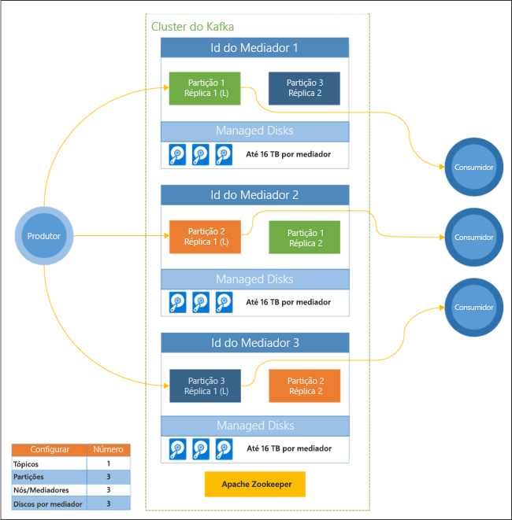

# O que é o Apache Kafka no HDInsight?

O [Apache Kafka](https://kafka.apache.org) é uma plataforma de transmissão em fluxo distribuída de código aberto que pode ser utilizada para criar aplicações e pipelines de dados de transmissão em fluxo em tempo real. O Kafka também fornece a funcionalidade de mediador de mensagem semelhante a uma fila de mensagens, onde pode publicar e subscrever fluxos de dados nomeados. 

Seguem-se as características específicas do Kafka no HDInsight:

* É um serviço gerido que fornece um processo de configuração simplificado. O resultado é uma configuração que é testada e suportada pela Microsoft.

* A Microsoft fornece um Contrato de Nível de Serviço (SLA) de 99,9% de tempo de atividade do Kafka. Para obter mais informações, veja o documento [Informações do SLA para o HDInsight](https://azure.microsoft.com/support/legal/sla/hdinsight/v1_0/).

* Utiliza os Managed Disks do Azure como arquivo de cópias de segurança do Kafka. Os Managed Disks podem fornecer até 16 TB de armazenamento por mediador Kafka. Para obter informações sobre como configurar discos geridos com o Kafka no HDInsight, consulte [aumentar a escalabilidade do Apache Kafka no HDInsight](apache-kafka-scalability.md).

    Para obter mais informações sobre os discos geridos, consulte [Azure Managed Disks](../../virtual-machines/windows/managed-disks-overview.md).

* O Kafka foi concebido com uma única vista dimensional de um bastidor. O Azure separa um bastidor em duas dimensões: Domínios de Atualização (UD) e Domínios de Falha (FD). A Microsoft oferece ferramentas que reequilibram as réplicas e partições do Kafka em UDs e FDs. 

    Para obter mais informações, consulte [elevada disponibilidade com o Apache Kafka no HDInsight](apache-kafka-high-availability.md).

* O HDInsight permite-lhe alterar o número de nós de trabalho (que alojam o mediador Kafka) após a criação do cluster. O escalonamento pode ser executado a partir do portal do Azure, do Azure PowerShell e de outras interfaces de gestão do Azure. Para o Kafka, deve reequilibrar as réplicas de partições após as operações de dimensionamento. Reequilibrar partições permite ao Kafka tirar partido do novo número de nós de trabalho.

    Para obter mais informações, consulte [elevada disponibilidade com o Apache Kafka no HDInsight](apache-kafka-high-availability.md).

* Registos de Monitor do Azure podem ser utilizados para monitorizar o Kafka no HDInsight. Monitor do Azure regista as superfícies máquina virtual informações do nível, como o disco e métricas NIC e métricas de JMX do Kafka.

    Para obter mais informações, consulte [analisar registos para o Apache Kafka no HDInsight](apache-kafka-log-analytics-operations-management.md).

### Apache Kafka no HDInsight arquitetura

O diagrama seguinte mostra uma configuração do Kafka comum que utiliza grupos de consumidores, particionamento e replicação para oferecer leitura paralela de eventos com tolerância a falhas:

O Apache ZooKeeper gere o estado do cluster do Kafka. O Zookeeper foi concebido para transações em simultâneo, resilientes e de baixa latência. 

O Kafka armazena os registos (dados) em **tópicos**. Os registos são produzidos por **produtores** e consumidos por **consumidores**. Os produtores enviam os registos para **mediadores** Kafka. Cada nó de trabalho no cluster HDInsight é um mediador Kafka. 

Registos de partição de tópicos em mediadores. Quando consumir registos, pode utilizar até um consumidor por partição para alcançar o processamento paralelo dos dados.

A replicação é utilizada para duplicar as partições nos nós, ao proteger contra interrupções do nó (mediador). A partição assinalada com *(L)* no diagrama é a partição líder dessa partição específica. O tráfico do produtor é encaminhado para o líder de cada nó mediante a utilização do estado gerido pelo ZooKeeper.

## Porquê utilizar o Apache Kafka no HDInsight?

Seguem-se as tarefas comuns e os padrões que podem ser efetuados com o Kafka no HDInsight:

* **Replicação de dados do Apache Kafka**: O Kafka fornece o utilitário MirrorMaker, que replica os dados entre clusters do Kafka.

    Para obter informações sobre como utilizar o MirrorMaker, consulte [tópicos de replicar o Apache Kafka com o Apache Kafka no HDInsight](apache-kafka-mirroring.md).

* **Padrão de mensagens de publicação-subscrição**: O Kafka fornece uma API de produtor para publicar registos num tópico do Kafka. A API de Consumidor é utilizada ao subscrever um tópico.

    Para obter mais informações, consulte [introdução ao Apache Kafka no HDInsight](apache-kafka-get-started.md).

* **Processamento de Stream**: Kafka é muitas vezes utilizado com o Apache Storm ou Spark para processamento de fluxo em tempo real. O Kafka 0.10.0.0 (versão 3.5 e 3.6 do HDInsight) introduziu uma API de transmissão em fluxo que lhe permite criar soluções de transmissão em fluxo, sem precisar do Storm ou do Spark.

    Para obter mais informações, consulte [introdução ao Apache Kafka no HDInsight](apache-kafka-get-started.md).

* **Dimensionamento horizontal**: Fluxos de partições do Kafka em nós do cluster do HDInsight. Os processos de consumidor podem estar associados a partições individuais para fornecer balanceamento de carga ao consumir registos.

    Para obter mais informações, consulte [introdução ao Apache Kafka no HDInsight](apache-kafka-get-started.md).

* **Na entrega por ordem**: Em cada partição, os registos são armazenados no fluxo pela ordem em que foram recebidos. Ao associar um processo de consumidor por partição, pode garantir que os registos são processados por ordem.

    Para obter mais informações, consulte [introdução ao Apache Kafka no HDInsight](apache-kafka-get-started.md).

## Casos de utilização

* **Mensagens**: Uma vez que suporta a funcionalidade Publicar-subscrever o padrão de mensagem, o Kafka é frequentemente utilizado como um mediador de mensagens.

* **Atividade de controlo**: Uma vez que o Kafka fornece o registo de registos por ordem, ele pode ser usado para controlar e voltar a criar atividades. Por exemplo, ações do utilizador num site ou numa aplicação.

* **Agregação**: Utilizar o processamento de fluxos, pode agregar informações a partir de várias transmissões em fluxo para combinar e centralizar as informações nos dados operacionais.

* **Transformação**: Com o processamento de fluxos, pode combinar e enriquecer os dados de vários tópicos de entrada em uma de ou mais tópicos de saída.

## Passos Seguintes

Utilize as seguintes ligações para saber como utilizar o Apache Kafka no HDInsight:

* [Quickstart: Criar o Apache Kafka no HDInsight](apache-kafka-get-started.md)

* [Tutorial: Utilizar o Apache Spark com o Apache Kafka no HDInsight](../hdinsight-apache-spark-with-kafka.md)

* [Tutorial: Utilizar o Apache Storm com o Apache Kafka no HDInsight](../hdinsight-apache-storm-with-kafka.md)
