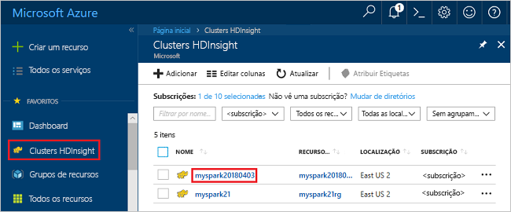
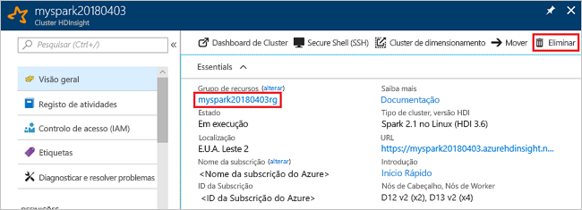

# <a name="quickstart-create-apache-spark-cluster-in-azure-hdinsight-using-azure-portal"></a>Quickstart: Criar cluster Apache Spark em Azure HDInsight usando portal Azure

Saiba como criar um cluster do Apache Spark no Azure HDInsight e como executar consultas do Spark SQL relativamente a tabelas do Hive. O Apache Spark permite uma análise de dados e computação de cluster rápidas através de processamento dentro da memória. Para obter informações sobre o Spark no HDInsight, consulte [descrição geral: Apache Spark no Azure HDInsight](apache-spark-overview.md).

Neste guia de início rápido, irá utilizar o portal do Azure para criar um cluster do Apache Spark no HDInsight. O cluster utiliza o Azure Storage Blob como armazenamento de cluster. Para obter mais informações sobre como utilizar o Armazenamento do Data Lake Ger2, veja [Início rápido: configurar clusters no HDInsight](../../storage/data-lake-storage/quickstart-create-connect-hdi-cluster.md).

> [!IMPORTANT]  
> A faturação dos clusters do HDInsight é rateada ao minuto, quer esteja a utilizá-los ou não. Confirme que elimina o cluster depois de o utilizar. Para obter mais informações, consulte a secção [Limpar recursos](#clean-up-resources) deste artigo.

Se não tiver uma subscrição do Azure, [crie uma conta gratuita](https://azure.microsoft.com/free/) antes de começar.

## <a name="create-an-hdinsight-spark-cluster"></a>Criar um cluster do Apache Spark no HDInsight

1. No portal Azure, selecione **Criar um recurso** > **Analytics** > **HDInsight**.

    

1. Em **Básico**, forneça os seguintes valores:

    |Propriedade  |Descrição  |
    |---------|---------|
    |Subscrição  | Selecione uma subscrição do Azure utilizada para este cluster no menu pendente. A subscrição utilizada para este arranque rápido é **o Azure.** |
    |Grupo de recursos | Especifique se quer criar um novo grupo de recursos ou utilizar um existente. Um grupo de recursos é um contentor que mantém recursos relacionados para uma solução do Azure. O nome do grupo de recursos utilizado para este arranque rápido é **o myResourceGroup**. |
    |Nome do cluster | Dê um nome ao cluster do Apache Spark no HDInsight. O nome do cluster usado para este quickstart é **myspark2019**.|
    |Localização   | Selecione uma localização para o grupo de recursos. O modelo utiliza esta localização para criar o cluster, bem como para o armazenamento predefinido do mesmo. A localização usada para este arranque rápido é **a Leste dos EUA.** |
    |Tipo de cluster| Selecione **Spark** como o tipo de cluster.|
    |Versão cluster|Este campo irá povoar automaticamente com a versão predefinida uma vez selecionado o tipo de cluster.|
    |Nome de utilizador de início de sessão do cluster| Introduza o nome de utilizador de início de sessão do cluster.  O nome padrão é *administrador.* Usa esta conta para entrar no caderno jupyter mais tarde no arranque rápido. |
    |Palavra-passe de início de sessão do cluster| Introduza a palavra-passe de início de sessão do cluster. |
    |Nome de utilizador de Secure Shell (SSH)| Introduza o nome de utilizador SSH. O nome de utilizador SSH utilizado neste guia de início rápido é **sshuser**. Por predefinição, esta conta tem a mesma palavra-passe que a conta *Nome de utilizador de início de sessão do cluster*. |

    

    Selecione **Seguinte: Armazenamento >>** para continuar na página **de Armazenamento.**

1. Em **Armazenamento**, forneça os seguintes valores:

    |Propriedade  |Descrição  |
    |---------|---------|
    |Tipo de armazenamento primário|Utilize o valor predefinido **do Armazenamento Azure**.|
    |Método de seleção|Utilize o valor predefinido **Selecione a partir da lista**.|
    |Conta de armazenamento primária|Use o valor auto-povoado.|
    |Contentor|Use o valor auto-povoado.|

    

    Selecione **Review + crie** para continuar.

1. Em **Análise + criar**, selecione **Criar**. A criação do cluster demora cerca de 20 minutos. Tem de criar o cluster antes de poder avançar para a sessão seguinte.

Caso se depare com um problema ao criar clusters do HDInsight, estes poderão dever-se ao facto de não ter as permissões certas para o fazer. Para obter mais informações, veja [Access control requirements](../hdinsight-hadoop-create-linux-clusters-portal.md) (Requisitos do controlo de acesso).

## <a name="create-a-jupyter-notebook"></a>Criar um bloco de notas do Jupyter

O Jupyter Notebook é um ambiente de bloco de notas interativo que suporta várias linguagens de programação. O bloco de notas permite-lhe interagir com os seus dados, combinar código com texto markdown e realizar visualizações simples.

1. Abra o [Portal do Azure](https://portal.azure.com).

1. Selecione **Clusters do HDInsight** e, em seguida, selecione o cluster que criou.

    

1. No portal, selecione **Dashboards de cluster** e, em seguida, selecione **Jupyter Notebook**. Se lhe for pedido, introduza as credenciais de início de sessão do cluster.

   

1. Selecione **New (Novo)**  > **PySpark** para criar um bloco de notas.

   

   É criado e aberto um novo bloco de notas com o nome Untitled (Untitled.pynb).

## <a name="run-spark-sql-statements"></a>Executar instruções SQL do Spark

SQL (Structured Query Language) é a linguagem mais comum e mais utilizada para consultar e definir dados. O Spark SQL funciona como uma extensão do Apache Spark para o processamento de dados estruturados e utiliza a sintaxe familiar do SQL Server.

1. Verifique se o kernel está pronto. O kernel está pronto quando vir um círculo hollow junto ao nome do kernel no bloco de notas. O círculo sólido indica que o kernel está ocupado.

    

    Quando inicia o bloco de notas pela primeira vez, o kernel efetua algumas tarefas em segundo plano. Aguarde que o kernel esteja preparado.

1. Cole o seguinte código numa célula vazia e, em seguida, prima **SHIFT + ENTER** para o executar. O comando lista as tabelas do Hive no cluster:

    ```PySpark
    %%sql
    SHOW TABLES
    ```

    Quando utiliza um Bloco de Notas do Jupyter com o seu cluster do HDInsight Spark, obtém um `sqlContext` predefinido que pode utilizar para executar consultas do Hive com o Spark SQL. `%%sql` indica ao Bloco de Notas do Jupyter que utilize o `sqlContext` predefinido para executar a consulta do Hive. A consulta devolve as primeiras dez linhas de uma tabela do Hive (**hivesampletable**) que vem em todos os clusters do HDInsight por predefinição. São necessários cerca de 30 segundos para receber os resultados. O resultado tem o seguinte aspeto:

    

    Sempre que executar uma consulta no Jupyter, o título da janela do browser apresenta o estado **(Ocupado)** juntamente com o título do bloco de notas. Também vê um círculo sólido junto ao texto do **PySpark** no canto superior direito.

1. Execute outra consulta para ver os dados no `hivesampletable`.

    ```PySpark
    %%sql
    SELECT * FROM hivesampletable LIMIT 10
    ```

    O ecrã deve atualizar-se e mostrar o resultado da consulta.

    

1. No menu **File (Ficheiro)** do bloco de notas, selecione **Close and Halt (Fechar e Parar)** . Encerrar o bloco de notas liberta os recursos do cluster.

## <a name="clean-up-resources"></a>Limpar recursos

O HDInsight permite guardar os seus dados no Armazenamento do Azure ou no Armazenamento do Azure Data Lake, pelo que pode eliminar um cluster em segurança quando este não estiver a ser utilizado. Também lhe é cobrado o valor de um cluster do HDInsight mesmo quando não o está a utilizar. Uma vez que os custos do cluster são muito superiores aos custos do armazenamento, faz sentido do ponto de vista económico eliminar os clusters quando não estiverem a ser utilizados. Se tenciona trabalhar imediatamente no tutorial listado nos [Passos seguintes](#next-steps), convém manter o cluster.

Regresse ao portal do Azure e selecione **Eliminar**.



Também pode selecionar o nome do grupo de recursos para abrir a página do grupo de recursos e, em seguida, selecionar **Eliminar grupo de recursos**. Ao eliminar o grupo de recursos, está a eliminar o cluster do Spark no HDInsight e a conta de armazenamento predefinida.

## <a name="next-steps"></a>Passos seguintes

Neste guia de início rápido, aprendeu a criar um cluster do Apache Spark no HDInsight e a executar uma consulta do Spark SQL básica. Prossiga para o tutorial seguinte para saber como utilizar um cluster do Spark no HDInsight para executar consultas interativas nos dados de exemplo.

> [!div class="nextstepaction"]
> [Executar consultas interativas em Apache Spark](./apache-spark-load-data-run-query.md)
