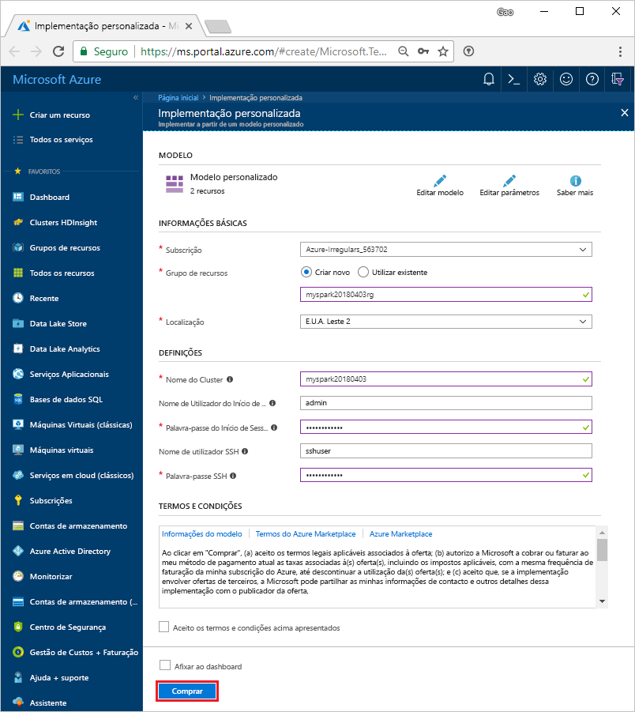
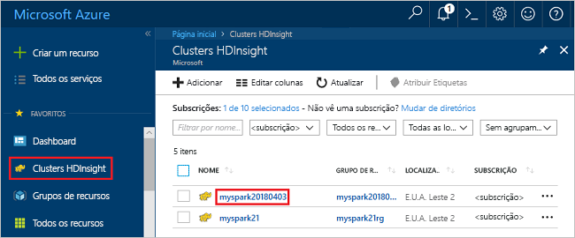
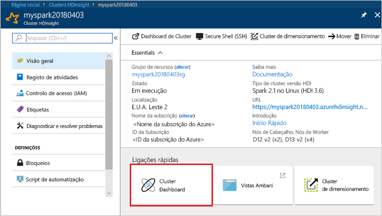
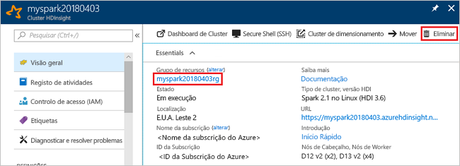

# <a name="quickstart-create-apache-spark-cluster-in-azure-hdinsight-using-resource-manager-template"></a>Quickstart: Criar o cluster Apache Spark em Azure HDInsight usando o modelo de Gestor de Recursos

Neste arranque rápido, você usa um modelo de Gestor de Recursos Azure para criar um cluster Apache Spark em Azure HDInsight. Em seguida, cria-se um portátil Jupyter e usa-o para executar consultas Spark SQL contra as mesas da Apache Hive. O Azure HDInsight é um serviço de análise gerido, de espectro completo e de código aberto para empresas. A estrutura Apache Spark para HDInsight permite análise rápida de dados e computação de cluster utilizando o processamento na memória. O caderno jupyter permite-lhe interagir com os seus dados, combinar código com texto de marcação e fazer visualizações simples.

[Visão geral: Apache Spark on Azure HDInsight](apache-spark-overview.md) | [Apache Spark](https://spark.apache.org/) | [Apache Hive](https://hive.apache.org/) | [Jupyter Notebook](https://jupyter.org/) | [modelos de quickstart azure](https://azure.microsoft.com/resources/templates/?resourceType=Microsoft.Hdinsight&pageNumber=1&sort=Popular)

Se não tiver uma subscrição do Azure, crie uma [conta gratuita](https://azure.microsoft.com/free/?WT.mc_id=A261C142F) antes de começar.

## <a name="create-an-apache-spark-cluster"></a>Criar um cluster do Apache Spark

Crie um cluster Apache Spark no HDInsight utilizando um modelo de Gestor de Recursos Azure. O modelo pode ser encontrado no [GitHub.](https://azure.microsoft.com/resources/templates/101-hdinsight-spark-linux/) Para a sintaxe JSON e propriedades do cluster, consulte [Microsoft.HDInsight/clusters](/azure/templates/microsoft.hdinsight/clusters).

O cluster utiliza o Azure Storage Blob como armazenamento de cluster. Para obter mais informações sobre como utilizar o Armazenamento do Data Lake Ger2, veja [Início rápido: configurar clusters no HDInsight](../../storage/data-lake-storage/quickstart-create-connect-hdi-cluster.md).

> [!IMPORTANT]  
> A faturação dos clusters do HDInsight é rateada ao minuto, quer esteja a utilizá-los ou não. Confirme que elimina o cluster depois de o utilizar. Para obter mais informações, consulte a secção [Limpar recursos](#clean-up-resources) deste artigo.

1. Selecione a seguinte ligação para abrir o modelo no portal do Azure num novo separador do browser:

    <a href="https://portal.azure.com/#create/Microsoft.Template/uri/https%3A%2F%2Fraw.githubusercontent.com%2FAzure%2Fazure-quickstart-templates%2Fmaster%2F101-hdinsight-spark-linux%2Fazuredeploy.json" target="_blank">Implementar no Azure</a>

2. Introduza os seguintes valores:

    | Propriedade | Valor |
    |---|---|
    |Subscrição|Selecione a subscrição do Azure utilizada para criar este cluster. |
    | Grupo de recursos|Crie um grupo de recursos ou selecione um existente. O grupo de recursos é utilizado para gerir recursos do Azure para os seus projetos. O novo nome do grupo de recursos utilizado neste início rápido é **myspark20180403rg**.|
    | Localização|Selecione uma localização para o grupo de recursos. O modelo utiliza esta localização para criar o cluster e o armazenamento padrão do cluster. A localização utilizada neste início rápido é **E.U.A. Leste 2**.|
    | ClusterName|Introduza um nome para o cluster que pretende criar. O novo nome do cluster utilizado neste início rápido é **myspark20180403**.|
    | Nome de login do cluster e senha|O nome de login padrão é administrador. Escolha uma senha para o login do cluster. O nome de início de sessão utilizado neste início rápido é **admin**.|
    | Nome e senha de utilizador sSH|Escolha uma palavra-passe para o utilizador do SSH. O nome de utilizador do SSH utilizado neste início rápido é **sshuser**.|

    

3. Selecione **Concordo com os termos e condições acima indicados,** e depois selecione **Comprar**. Pode ver um novo mosaico intitulado **Implementação da implementação de modelos**. A criação do cluster demora cerca de 20 minutos. Tem de criar o cluster antes de poder avançar para a sessão seguinte.

Se tiver um problema com a criação de clusters HDInsight, pode ser que não tenha as permissões certas para o fazer. Para obter mais informações, veja [Access control requirements](../hdinsight-hadoop-customize-cluster-linux.md#access-control) (Requisitos do controlo de acesso).

## <a name="install-intellijeclipse-for-spark-applications"></a>Instale intelliJ/Eclipse para aplicações Spark

Utilize o Kit de Ferramentas Azure para plug-in IntelliJ/Eclipse para desenvolver aplicações Spark escritas em [Scala,](https://www.scala-lang.org/)e, em seguida, submeta-as a um cluster Azure HDInsight diretamente do ambiente de desenvolvimento integrado IntelliJ/Eclipse (IDE). Para obter mais informações, veja [Utilizar o IntelliJ para criar/submeter a aplicação Apache Spark](./apache-spark-intellij-tool-plugin.md) e [Utilizar o Eclipse para criar/submeter a aplicação Apache Spark](./apache-spark-eclipse-tool-plugin.md).

## <a name="install-vscode-for-pysparkhive-applications"></a>Instalar VSCode para aplicações PySpark/Hive

Saiba como utilizar as Ferramentas do Azure HDInsight para o Visual Studio Code (VSCode) para criar e submeter tarefas de lote do Hive, consultas interativas do Hive, o lote PySpark e scripts interativos PySpark. As Ferramentas do Azure HDInsight podem ser instaladas nas plataformas suportadas pelo VSCode, que incluem o Windows, o Linux e o macOS. Para obter mais informações, veja [Utilizar o VSCode para criar/submeter a aplicação PySpark](../hdinsight-for-vscode.md).

## <a name="create-a-jupyter-notebook"></a>Criar um bloco de notas do Jupyter

[Jupyter Notebook](https://jupyter.org/) é um ambiente de caderno interativo que suporta várias linguagens de programação. O caderno permite-lhe interagir com os seus dados, combinar código com texto de marcação e realizar visualizações simples.

1. Abra o [Portal do Azure](https://portal.azure.com).

2. Selecione **Clusters do HDInsight** e, em seguida, selecione o cluster que criou.

    

3. A partir do portal, na secção **de dashboards cluster,** selecione **Jupyter Notebook**. Se lhe for pedido, introduza as credenciais de início de sessão do cluster.

   

4. Selecione **New (Novo)**  > **PySpark** para criar um bloco de notas.

   

   É criado e aberto um novo bloco de notas com o nome Untitled (Untitled.pynb).

## <a name="run-apache-spark-sql-statements"></a>Executar declarações Apache Spark SQL

SQL (Structured Query Language) é a linguagem mais comum e mais utilizada para consultar e transformar dados. O Spark SQL funciona como uma extensão do Apache Spark para o processamento de dados estruturados e utiliza a sintaxe familiar do SQL Server.

1. Verifique se o kernel está pronto. O kernel está pronto quando vir um círculo hollow junto ao nome do kernel no bloco de notas. O círculo sólido indica que o kernel está ocupado.

    

    Quando inicia o bloco de notas pela primeira vez, o kernel efetua algumas tarefas em segundo plano. Aguarde que o kernel esteja preparado.

1. Cole o seguinte código numa célula vazia e, em seguida, prima **SHIFT + ENTER** para o executar. O comando lista as tabelas do Hive no cluster:

    ```sql
    %%sql
    SHOW TABLES
    ```

    Quando utiliza um Caderno Jupyter com o seu cluster HDInsight, obtém-se uma sessão pré-definida `spark` que pode utilizar para executar consultas de Hive utilizando o Spark SQL. `%%sql` indica ao Bloco de Notas do Jupyter que utilize a sessão `spark` predefinida para executar a consulta do Hive. A consulta devolve as primeiras dez linhas de uma tabela do Hive (**hivesampletable**) que vem em todos os clusters do HDInsight por predefinição. A primeira vez que submeter a consulta, Jupyter criará uma aplicação Spark para o caderno. São precisos cerca de 30 segundos para concluir. Uma vez que a aplicação Spark esteja pronta, a consulta é executada em cerca de um segundo e produz os resultados. O resultado tem o seguinte aspeto:

    

    Sempre que executar uma consulta no Jupyter, o título da janela do browser apresenta o estado **(Ocupado)** juntamente com o título do bloco de notas. Também vê um círculo sólido junto ao texto do **PySpark** no canto superior direito.

1. Execute outra consulta para ver os dados no `hivesampletable`.

    ```sql
    %%sql
    SELECT * FROM hivesampletable LIMIT 10
    ```

    O ecrã deve atualizar-se e mostrar o resultado da consulta.

    

1. No menu **File (Ficheiro)** do bloco de notas, selecione **Close and Halt (Fechar e Parar)** . Desligar o caderno liberta os recursos do cluster, incluindo a aplicação Spark.

## <a name="clean-up-resources"></a>Limpar recursos

O HDInsight guarda os seus dados e os seus cadernos Jupyter no Armazenamento de Dados Azure ou no Armazenamento de Lagos De Dados Azure, para que possa eliminar com segurança um cluster quando não estiver a ser utilizado. Também é cobrado por um cluster HDInsight, mesmo quando não está a ser utilizado. Uma vez que as taxas para o cluster são muitas vezes mais do que as taxas de armazenamento, faz sentido económico apagar clusters quando não estão em uso. Se tenciona trabalhar imediatamente no tutorial listado nos [Passos seguintes](#next-steps), convém manter o cluster.

Regresse ao portal do Azure e selecione **Eliminar**.



Também pode selecionar o nome do grupo de recursos para abrir a página do grupo de recursos e, em seguida, selecionar **Eliminar grupo de recursos**. Ao eliminar o grupo de recursos, elimina tanto o cluster HDInsight como a conta de armazenamento predefinida.

## <a name="next-steps"></a>Passos seguintes

Neste arranque rápido, aprendeu a criar um cluster Apache Spark no HDInsight e executar uma consulta básica de Spark SQL. Avance para o próximo tutorial para aprender a usar um cluster HDInsight para executar consultas interativas em dados de amostra.

> [!div class="nextstepaction"]
> [Executar consultas interativas em Apache Spark](./apache-spark-load-data-run-query.md)
