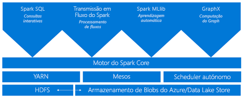

# O que é o Apache Spark no Azure HDInsight

Apache Spark é uma estrutura de processamento paralela que suporta o processamento na memória para aumentar o desempenho de aplicações analíticas de big data. O Apache Spark no Azure HDInsight é a implementação da Microsoft do Apache Spark na cloud. O HDInsight permite criar e configurar clusters do Spark mais facilmente na cloud. Os clusters de faíscas em HDInsight são compatíveis com [o armazenamento Azure Blob](../../storage/common/storage-introduction.md), [Azure Data Lake Storage Gen1,](../../data-lake-store/data-lake-store-overview.md)ou [Azure Data Lake Storage Gen2](../../storage/blobs/data-lake-storage-introduction.md). Por isso, pode utilizá-los para processar os dados armazenados no Azure. Para os componentes e as informações de versão, consulte [os componentes e versões Apache Hadoop no Azure HDInsight](../hdinsight-component-versioning.md).

## O que é o Apache Spark?

O Spark fornece primitivos para a computação de cluster na memória. Um trabalho do Spark pode carregar e colocar em cache dados na memória e consultá-los repetidamente. A computação na memória é muito mais rápida do que aplicações baseadas em discos, como a Hadoop, que partilha dados através do sistema de ficheiros distribuídos por Hadoop (HDFS). O Spark também se integra na linguagem de programação Scala, o que lhe possibilita manipular conjuntos de dados distribuídos, como coleções locais. Não é necessário estruturar tudo como operações de mapa e redução.

Os clusters do Spark no HDInsight oferecem um serviço Spark completamente gerido. Os benefícios da criação de um cluster do Spark no HDInsight estão listados aqui.

| Funcionalidade | Descrição |
| --- | --- |
| Criação fácil |Pode criar um cluster do Spark novo no HDInsight em apenas alguns minutos com o portal do Azure, o Azure PowerShell ou o SDK .NET do HDInsight. Ver [Começar com o cluster Apache Spark em HDInsight](apache-spark-jupyter-spark-sql-use-portal.md). |
| Facilidade de utilização |O cluster de faíscas em HDInsight inclui cadernos Jupyter e Apache Zeppelin. Pode utilizar estes blocos de notas para o processamento e a visualização de dados interativos. Consulte [os cadernos Apache Zeppelin com dados de Faíscas](apache-spark-zeppelin-notebook.md) e Carga Apache [e execute consultas num cluster Apache Spark](apache-spark-load-data-run-query.md).|
| APIs REST |Os clusters de faíscas em HDInsight incluem [Apache Livy,](https://github.com/cloudera/hue/tree/master/apps/spark/java#welcome-to-livy-the-rest-spark-server)um servidor de trabalho spark baseado em REST para submeter e monitorizar remotamente trabalhos. Consulte [a API Apache Spark REST para submeter trabalhos remotos a um cluster HDInsight Spark](apache-spark-livy-rest-interface.md).|
| Suporte para armazenamento Azure | Os clusters de faíscas em HDInsight podem usar a Azure Data Lake Storage Gen1/Gen2 como armazenamento primário ou armazenamento adicional. Para obter mais informações sobre data lake storage gen1, consulte [Azure Data Lake Storage Gen1](../../data-lake-store/data-lake-store-overview.md). Para obter mais informações sobre data lake storage gen2, consulte [Azure Data Lake Storage Gen2](../../storage/blobs/data-lake-storage-introduction.md).|
| Integração com os serviços do Azure |O cluster do Spark no HDInsight é fornecido com um conector para os Hubs de Eventos do Azure. Pode construir aplicações de streaming utilizando os Centros de Eventos. Incluindo Apache Kafka, que já está disponível como parte da Spark. |
| Suporte do ML Server | O suporte do ML Server no HDInsight é prestado como o tipo de cluster dos **Serviços ML**. Pode configurar um cluster dos Serviços ML para executar cálculos R distribuídos com as velocidades prometidas com um cluster do Spark. Para obter mais informações, consulte [o Que é serviços ML em Azure HDInsight](../r-server/r-server-overview.md). |
| Integração com IDEs de terceiros | O HDInsight proporciona vários plug-ins de IDE que são úteis para criar e submeter aplicações para um cluster do Spark no HDInsight. Para obter mais informações, consulte [o Kit de Ferramentas Azure para intelliJ IDEA](apache-spark-intellij-tool-plugin.md), Use Spark & [Hive Tools for VSCode](../hdinsight-for-vscode.md), e [Use Azure Toolkit para Eclipse](apache-spark-eclipse-tool-plugin.md).|
| Consultas em Simultâneo |Os clusters do Spark no HDInsight suportam consultas em simultâneo. Esta capacidade permite que várias consultas de um utilizador ou várias consultas de vários utilizadores e aplicações partilhem os mesmos recursos de cluster. |
| Colocação em cache em SSDs |Pode optar por colocar os dados em cache na memória ou em SSDs ligados aos nós do cluster. A colocação em cache na memória oferece o melhor desempenho às consultas, mas pode ser dispendiosa. A colocação em cache em SSDs é uma excelente opção para melhorar o desempenho das consultas sem que seja necessário criar um cluster com tamanho suficiente para guardar todo o conjunto de dados na memória. Ver [Melhorar o desempenho das cargas de trabalho da Apache Spark utilizando a cache IO IO Azure HDInsight](apache-spark-improve-performance-iocache.md). |
| Integração com Ferramentas de BI |Os clusters do Spark no HDInsight fornecem conectores para ferramentas de BI, como o Power BI, para análise de dados. |
| Bibliotecas Anaconda pré-carregadas |Os clusters do Spark no HDInsight incluem bibliotecas Anaconda pré-instaladas. [A Anaconda](https://docs.continuum.io/anaconda/) disponibiliza cerca de 200 bibliotecas para machine learning, análise de dados, visualização, e assim por diante. |
| Capacidade de adaptabilidade | O HDInsight permite-lhe alterar o número de nós de cluster dinamicamente com a função Autoscale. Ver [conjuntos Azure HDInsight](../hdinsight-autoscale-clusters.md)de escala automática . Além disso, os clusters Spark podem ser eliminados sem perda de dados, uma vez que todos os dados são armazenados no armazenamento Azure Blob, [Azure Data Lake Storage Gen1](../../data-lake-store/data-lake-store-overview.md) ou [Azure Data Lake Storage Gen2](../../storage/blobs/data-lake-storage-introduction.md). |
| SLA |Os clusters do Spark no HDInsight incluem suporte 24 horas por dia, 7 dias por semana e um SLA de 99,9% de tempo ativo. |

Os clusters Apache Spark em HDInsight incluem os seguintes componentes que estão disponíveis nos clusters por padrão.

* [Spark Core](https://spark.apache.org/docs/latest/). Inclui o Spark Core, o Spark SQL, APIs de transmissão em fluxo do Spark, o GraphX e o MLlib.
* [Anaconda](https://docs.continuum.io/anaconda/)
* [Apache Livy](https://github.com/cloudera/hue/tree/master/apps/spark/java#welcome-to-livy-the-rest-spark-server)
* [Caderno Jupyter](https://jupyter.org)
* [Caderno Apache Zeppelin](http://zeppelin-project.org/)

HDInsight Spark agrupa um [controlador ODBC](https://go.microsoft.com/fwlink/?LinkId=616229) para a conectividade a partir de ferramentas BI, como o Microsoft Power BI.

## Arquitetura de cluster do Spark

É fácil entender os componentes da Spark compreendendo como a Spark funciona em clusters HDInsight.

As aplicações spark funcionam como conjuntos independentes de processos num cluster. Coordenado pelo objeto SparkContext no seu programa principal (chamado programa de condutor).

O SparkContext pode ligar-se a vários tipos de cluster managers, que dão recursos através de aplicações. Estes gestores de cluster incluem Apache Mesos, Apache Hadoop YARN, ou o gestor de cluster Spark. No HDInsight, o Spark é executado com o gestor de clusters YARN. Assim que estiver ligado, o Spark adquire executores nos nós de trabalhado do cluster, que são os processos que executam cálculos e armazenam os dados da sua aplicação. Em seguida, envia o código da aplicação (definido pelos ficheiros JAR ou Python transmitidos para o SparkContext) aos executores. Por fim, o SparkContext envia tarefas para os executores executarem.

O SparkContext executa a função principal do utilizador, bem como as diversas operações paralelas nos nós de trabalho. Em seguida, recolhe os resultados das operações. Os nós dos trabalhadores lêem e escrevem dados de e para o sistema de ficheiros distribuídos hadoop. Também colocam em cache os dados transformados na memória como Conjuntos de Dados Distribuídos Resilientes (RDDs).

O SparkContext liga-se ao mestre faísca e é responsável pela conversão de uma aplicação para um gráfico direcionado (DAG) de tarefas individuais. Tarefas que são executadas dentro de um processo de executor nos nós do trabalhador. Cada aplicação obtém os seus próprios processos de executor. Que permanecem acordados durante toda a aplicação e executam tarefas em vários fios.

## Casos de utilização do Spark no HDInsight

Os clusters do Spark no HDInsight permitem os cenários-chave seguintes:

### Análise de dados interativa e BI

Apache Spark in HDInsight armazena dados em Azure Blob Storage, Azure Data Lake Gen1 ou Azure Data Lake Storage Gen2. Especialistas em negócios e decisores chave podem analisar e construir relatórios sobre esses dados. E use o Microsoft Power BI para construir relatórios interativos a partir dos dados analisados. Os analistas podem partir de dados não estruturados/semiestruturados no armazenamento de clusters, definir um esquema para os dados com os blocos de notas e, em seguida, criar modelos de dados através do Microsoft Power BI. Os clusters de faíscas em HDInsight também suportam uma série de ferramentas bi de terceiros. Como o Tableau, facilitando a vida a analistas de dados, especialistas em negócios e decisores-chave.

* [Tutorial: Visualize Spark data using Power BI](apache-spark-use-bi-tools.md) (Tutorial: Utilizar o Power BI para ver dados do Spark)

### Spark Machine Learning

Apache Spark vem com [MLlib.](https://spark.apache.org/mllib/) MLlib é uma biblioteca de machine learning construída em cima da Spark que você pode usar a partir de um cluster Spark em HDInsight. O cluster de faíscas em HDInsight também inclui Anaconda, uma distribuição Python com diferentes tipos de pacotes para machine learning. E com o apoio incorporado para cadernos Jupyter e Zeppelin, você tem um ambiente para criar aplicações de machine learning.

* [Tutorial: Prever temperaturas de construção usando dados de AVAC](apache-spark-ipython-notebook-machine-learning.md)  
* [Tutorial: Prever resultados da inspeção alimentar](apache-spark-machine-learning-mllib-ipython.md)

### Análise de dados de transmissão em fluxo e em tempo real do Spark

Os clusters do Spark no HDInsight oferecem um suporte avançado para a criação de soluções de análise em tempo real. A Spark já tem conectores para ingerir dados de muitas fontes como kafka, Flume, Twitter, ZeroMQ ou tomadas TCP. Spark in HDInsight adiciona suporte de primeira classe para ingerir dados de Azure Event Hubs. Os Hubs de Eventos são o serviço de colocação em fila mais utilizado no Azure. Ter suporte completo para o Event Hubs faz dos clusters Spark em HDInsight uma plataforma ideal para a construção de gasodutos de análise em tempo real.

* [Visão geral do Fluxo de Faíscas Apache](apache-spark-streaming-overview.md)
* [Visão geral do Fluxo Estruturado de Faíscas Apache Spark](apache-spark-structured-streaming-overview.md)

## Passos Seguintes

Nesta visão geral, você tem uma compreensão básica de Apache Spark em Azure HDInsight.  Você pode usar os seguintes artigos para saber mais sobre Apache Spark em HDInsight, e você pode criar um cluster HDInsight Spark e executar ainda mais algumas consultas de amostra Spark:

* [Quickstart: Criar um cluster Apache Spark em HDInsight e executar consulta interativa usando Jupyter](./apache-spark-jupyter-spark-sql-use-portal.md)
* [Tutorial: Carregue dados e execute consultas sobre um trabalho de Apache Spark usando Jupyter](./apache-spark-load-data-run-query.md)
* [Tutorial: Visualize Spark data using Power BI](apache-spark-use-bi-tools.md) (Tutorial: Utilizar o Power BI para ver dados do Spark)
* [Tutorial: Prever temperaturas de construção usando dados de AVAC](apache-spark-ipython-notebook-machine-learning.md)
* [Otimizar empregos de faíscas para desempenho](apache-spark-perf.md)