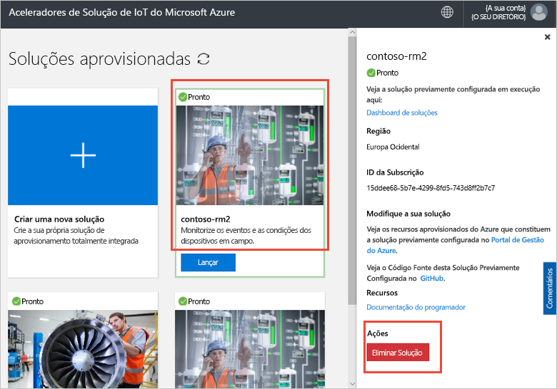

# Ligue um dispositivo IoT DevKit ao acelerador de solução de monitorização remota

[!INCLUDE [iot-suite-selector-connecting](../../includes/iot-suite-selector-connecting.md)]

Este guia de como fazer mostra-lhe como executar uma aplicação de amostra no seu dispositivo IoT DevKit. O código de amostra envia telemetria dos sensores do dispositivo DevKit para o seu acelerador de solução.

O [MXChip IoT DevKit](https://aka.ms/iot-devkit) é um tabuleiro compatível com Arduino com periféricos e sensores ricos. Você pode desenvolver para ele usando [a bancada de trabalho do dispositivo Azure IoT](https://aka.ms/iot-workbench) ou o pacote de extensão [Azure IoT Tools](https://aka.ms/azure-iot-tools) em Visual Studio Code. O [catálogo de projetos](https://microsoft.github.io/azure-iot-developer-kit/docs/projects/) contém aplicações de amostras para ajudá-lo a protótipo soluções IoT.

## Antes de começar

Para completar os passos neste tutorial, primeiro faça as seguintes tarefas:

* Prepare o seu DevKit seguindo os passos no [Connect IoT DevKit AZ3166 para Azure IoT Hub na nuvem](/azure/iot-hub/iot-hub-arduino-iot-devkit-az3166-get-started).

## Projeto de amostra aberta

Para abrir a amostra de monitorização remota no Código VS:

1. Certifique-se de que o seu IoT DevKit não está no seu computador. Inicie primeiro o Código VS e, em seguida, ligue o DevKit ao seu computador.

1. Clique `F1` para abrir a paleta de comando, escreva e selecione **Azure IoT Device Workbench: Open Examples...**. Em seguida, selecione **IoT DevKit** como placa.

1. Encontre **a monitorização remota** e clique em Abrir **Amostra**. Abre-se uma nova janela vs code mostrando a pasta do projeto:

   

## Configure o dispositivo

Para configurar a cadeia de ligação do dispositivo IoT Hub no seu dispositivo DevKit:

1. Mude o IoT DevKit para **o modo de configuração:**

    * Mantenha premir o botão **A**.
    * Empurre e solte o botão **Reset.**

1. O ecrã apresenta o ID de DevKit e `Configuration` .

    

1. Prima **F1** para abrir a paleta de comando, digite e selecione **Azure IoT Device Workbench: Configurações do dispositivo de configuração... > Config Device Connection String**.

1. Cole a cadeia de ligação que copiou anteriormente e prima **Enter** para configurar o dispositivo.

## Compilar o código

Para construir e carregar o código do dispositivo:

1. Prima `F1` para abrir a paleta de comando, digite e selecione **Azure IoT Device Workbench: Upload Device Code**:

1. O Código VS compila e envia o código para o seu dispositivo DevKit:

    

1. O dispositivo DevKit reinicia e executa o código que carregou.

## Testar a amostra

Para verificar se a aplicação da amostra que carregou para o dispositivo DevKit está a funcionar, complete os seguintes passos:

### Ver a telemetria enviada para a solução de Monitorização Remota

Quando a aplicação da amostra é executado, o dispositivo DevKit envia telemetria dos dados dos seus sensores ao longo de Wi-Fi para o seu acelerador de solução. Para ver a telemetria:

1. Vá ao painel de instrumentos da solução e clique no **Device Explorer**.

1. Clique no nome do dispositivo do seu dispositivo DevKit. no separador direito, pode ver a telemetria do DevKit em tempo real:

    

### Controlar o dispositivo DevKit

O acelerador de solução de monitorização remota permite controlar o seu dispositivo remotamente. O código de amostra implementa três métodos que pode ver na secção **Método** quando seleciona o dispositivo na página **Explorer do Dispositivo:**

Para alterar a cor de um dos LEDs DevKit, utilize o método **LedColor:**

1. Selecione o nome do dispositivo da lista de dispositivos e clique nos **Trabalhos**:

    

1. Configure os Empregos utilizando os seguintes valores e clique **em Aplicar:**

   * Selecione Trabalho: **Método de execução**
   * Nome do método: **LedColor**
   * Nome do trabalho: **ChangeLedColor**

     

1. Após alguns segundos, a cor do LED RGB (abaixo do botão A) no seu DevKit altera:

    

## Limpar os recursos

Se planear avançar para os tutoriais, deixe o acelerador de soluções de Monitorização Remota implementado.

Se já não precisar do acelerador de soluções, elimine-o na página Soluções aprovisionadas ao selecioná-lo e, em seguida, clique em Eliminar Solução:

## Problemas e feedback

Se tiver algum problema, consulte [as FAQs IoT DevKit](https://microsoft.github.io/azure-iot-developer-kit/docs/faq/) ou contacte-nos utilizando os seguintes canais:

* [Gitter.im](https://gitter.im/Microsoft/azure-iot-developer-kit)
* [Stack Overflow](https://stackoverflow.com/questions/tagged/iot-devkit)

## Passos seguintes

Agora que aprendeu a ligar um dispositivo DevKit ao seu acelerador de solução de monitorização remota, aqui estão alguns passos sugeridos:

* [Visão geral dos aceleradores de solução Azure IoT](https://docs.microsoft.com/azure/iot-accelerators/)
* [Personalizar a IU](iot-accelerators-remote-monitoring-customize.md)
