# Início Rápido: Experimentar uma solução de monitorização remota baseada na cloud

Este início rápido mostra como implementar o acelerador de soluções de Monitorização Remota de IoT do Azure. Nesta solução baseada na cloud, utilize a página **Dashboard** da solução para visualizar os dispositivos simulados num mapa e a página **Manutenção** para responder a um alerta de pressão de um dispositivo chiller simulado. Pode utilizar este acelerador de soluções como o ponto de partida para a sua própria implementação ou como uma ferramenta de aprendizagem.

A implementação inicial configura o acelerador de soluções para uma empresa denominada Contoso. Enquanto operador na Contoso gere uma seleção de diferentes tipos de dispositivos, como chillers, implementados em ambientes físicos diferentes. Um dispositivo chiller envia telemetria de temperatura, humidade e pressão para o acelerador de soluções de Monitorização Remota.

Este quickstart implementa uma versão **básica** do acelerador de soluções para fins de teste e demonstração que minimiza os custos. Para obter mais informações sobre as diferentes versões que pode implementar, consulte [implementações Básicas e standard](iot-accelerators-remote-monitoring-deploy-cli.md#basic-and-standard-deployments).

Para concluir este início rápido, precisa de uma subscrição ativa do Azure.

Se não tiver uma subscrição Azure, crie uma [conta gratuita](https://azure.microsoft.com/free/?WT.mc_id=A261C142F) antes de começar.

## Implementar a solução

Ao implementar o acelerador de soluções na sua subscrição do Azure, tem de definir algumas opções de configuração.

Inicie sessão em [azureiotsolutions.com](https://www.azureiotsolutions.com/Accelerators) com as credenciais da conta do Azure.

Clique no azulejo de **monitorização remota.** Na página de **Monitorização Remota,** clique em **Tentar Agora:**

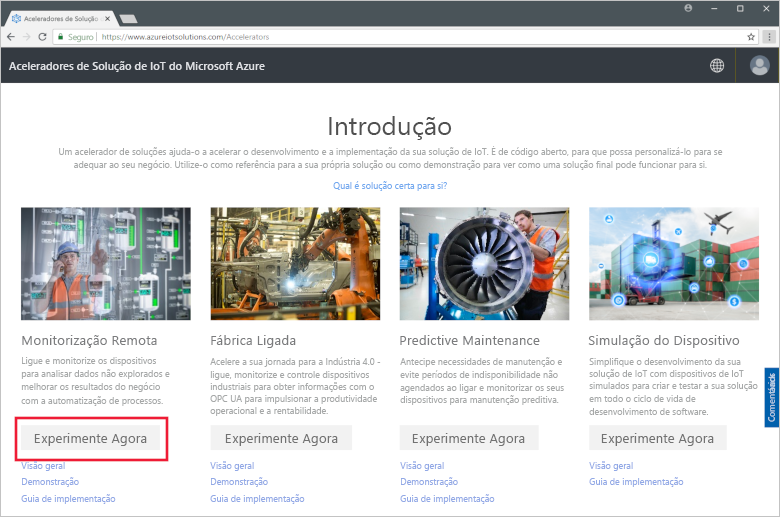

Escolha **C# Microservices** como opções de **implantação**. As implementações de Java e C# têm as mesmas características.

Introduza um **Nome da solução** exclusivo para o acelerador de soluções de Monitorização Remota. Para este início rápido, estamos chamando o nosso **contoso-rm.**

Selecione a **Subscrição** e a **Região** que quer utilizar para implementar o acelerador de soluções. Normalmente, pode escolher a região mais próxima para si. Para este arranque rápido, estamos a usar os **EUA Orientais.**
Pode escolher **a Visual Studio Enterprise,** mas tem de ser um administrador ou utilizador [global](iot-accelerators-permissions.md) para o fazer.

Para iniciar a sua implementação, clique em **Criar**. Este processo demora, pelo menos, cinco minutos a ser executado:

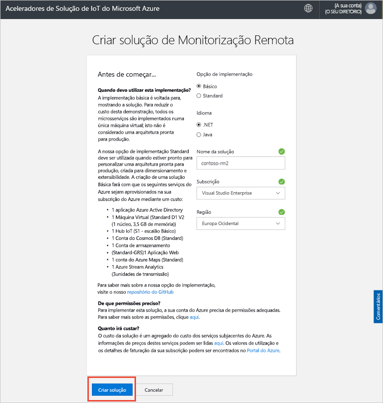

## Iniciar sessão na solução

Quando a implementação na sua subscrição do Azure estiver concluída, verá uma marca de verificação verde e **Preparado** no mosaico da solução. Pode agora iniciar sessão no dashboard do acelerador de soluções de Monitorização Remota.

Na página **Soluções aprovisionadas**, clique no novo acelerador de soluções de Monitorização Remota:

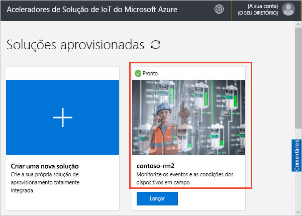

Pode ver informações sobre o acelerador de soluções de Monitorização Remota no painel apresentado. Escolha **ir ao acelerador de soluções** para visualizar o seu acelerador de solução de monitorização remota:

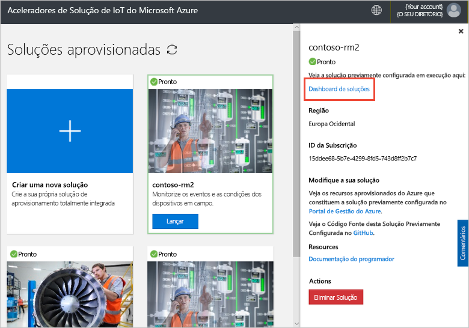

Clique em **Aceitar** para aceitar o pedido de permissões. O dashboard da solução de Monitorização Remota é apresentado no browser:

[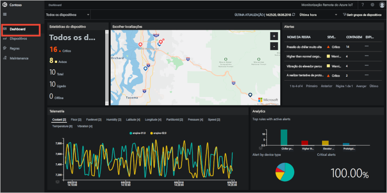](./media/quickstart-remote-monitoring-deploy/solutiondashboard-expanded.png#lightbox)

## Ver os seus dispositivos

O dashboard de soluções mostra as seguintes informações sobre os dispositivos simulados da Contoso:

* O painel **Estatísticas dos dispositivos** mostra informações de resumo sobre alertas e o número total de dispositivos. Na implementação predefinida, a Contoso tem 10 tipos diferentes de dispositivos simulados.

* O painel **Localizações dos dispositivos** mostra onde os dispositivos estão localizados fisicamente. A cor do alfinete mostra quando existem alertas do dispositivo.

* O painel **Alertas** mostra os detalhes de alertas dos dispositivos.

* O painel **Telemetria** mostra a telemetria dos dispositivos. Pode ver os diferentes fluxos de telemetria ao clicar nos tipos de telemetria na parte superior.

* O painel **Análise** mostra informações combinadas sobre os alertas dos dispositivos.

## Responder a um alerta

Como operador na Contoso, pode monitorizar os dispositivos no dashboard de soluções. O painel **Estatísticas dos dispositivos** mostra que ocorreu um número de alertas críticos e o painel **Alertas** mostra que a maioria deles é proveniente de um dispositivo chiller. Para dispositivos chiller da Contoso, uma pressão interna superior a 250 PSI indica que o dispositivo não está a funcionar corretamente.

### Identificar o problema

Na página **Dashboard**, no painel **Alertas**, pode ver o alerta **Pressão do chiller demasiado elevada**. O chiller tem um alfinete vermelho no mapa (pode ter de aplicar zoom ao mapa):

[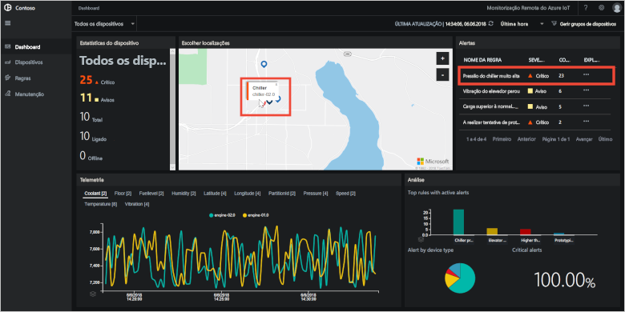](./media/quickstart-remote-monitoring-deploy/dashboardalarm-expanded.png#lightbox)

No painel **Alertas**, clique em **...** na coluna **Explorar** junto à regra **Pressão do chiller demasiado elevada**. Esta ação leva-o para a página **Manutenção** onde pode ver os detalhes da regra que acionou o alerta.

A página de manutenção **Pressão do chiller demasiado elevada** mostra os detalhes da regra que acionou os alertas. A página também indica quando os alertas ocorreram e o dispositivo que os acionaram:

[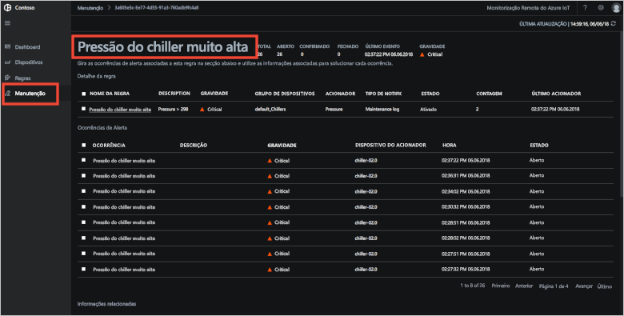](./media/quickstart-remote-monitoring-deploy/maintenancealarmlist-expanded.png#lightbox)

Identificou agora o problema que acionou o alerta e o dispositivo associado. Como operador, os passos seguintes são para reconhecer o alerta e corrigir o problema.

### Corrigir o problema

Para indicar a outros operadores que está a trabalhar no alerta, selecione-o e altere o **Estado do alerta** para **Reconhecido**:

[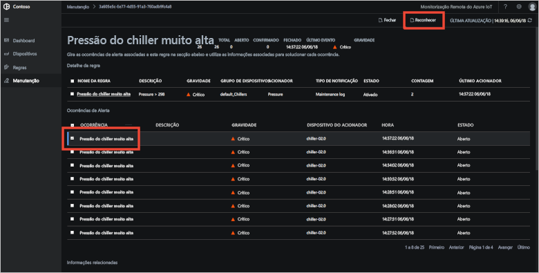](./media/quickstart-remote-monitoring-deploy/maintenanceacknowledge-expanded.png#lightbox)

O valor na coluna de estado muda para **Reconhecido**.

Para agir sobre o chiller, desloque-se para baixo para **Informações relacionadas**, selecione o dispositivo chiller na lista **Dispositivos alertados** e, em seguida, selecione **Tarefas**:

[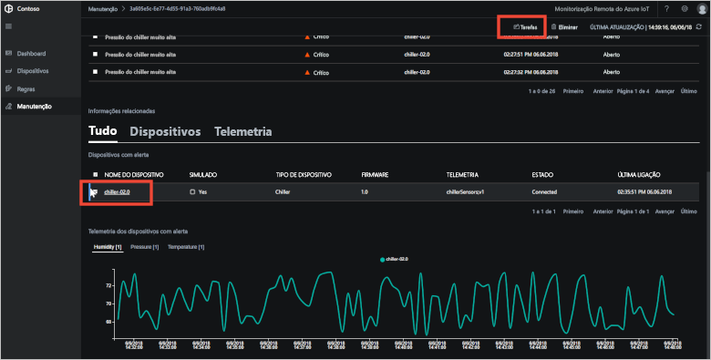](./media/quickstart-remote-monitoring-deploy/maintenanceschedule-expanded.png#lightbox)

No painel **Trabalhos**, escolha **Executar método** e, em seguida, o método **EmergencyValveRelease**. Adicionar o nome do trabalho **ChillerPressureRelease**e clique em **Aplicar**. Estas definições criam uma tarefa para si executada imediatamente.

Para ver o estado da tarefa, volte à página **Manutenção** e veja a lista de tarefas na vista **Tarefas**. Pode precisar esperar alguns segundos para ver que o trabalho está a decorrer:

[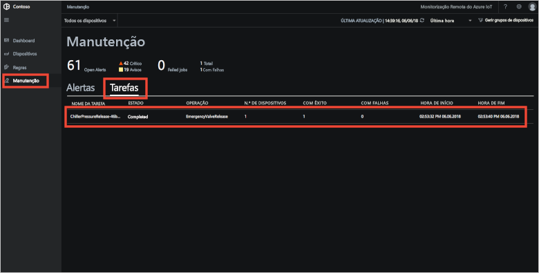](./media/quickstart-remote-monitoring-deploy/maintenancerunningjob-expanded.png#lightbox)

### Verificar se a pressão voltou ao normal

Para ver a telemetria de pressão do chiller, navegue para a página **Dashboard**, selecione **Pressão** no painel de telemetria e confirme se a pressão de **chiller-02.0** voltou ao normal:

[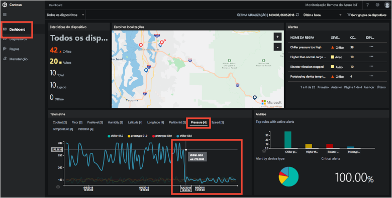](./media/quickstart-remote-monitoring-deploy/pressurenormal-expanded.png#lightbox)

Para fechar o incidente, navegue para a página **Manutenção**, selecione o alerta e defina o estado como **Fechado**:

[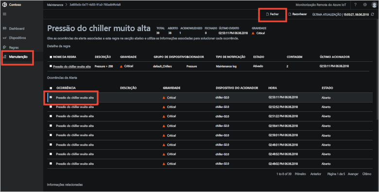](./media/quickstart-remote-monitoring-deploy/maintenanceclose-expanded.png#lightbox)

O valor na coluna de estado muda para **Fechado**.

## Limpar recursos

Se planear avançar para os tutoriais, deixe o acelerador de soluções de Monitorização Remota implementado.

Se já não precisar do acelerador de soluções, elimine-o na página [Soluções aprovisionadas](https://www.azureiotsolutions.com/Accelerators#dashboard) ao selecioná-lo e, em seguida, clique em **Eliminar Solução**:

## Passos seguintes

Neste início rápido, implementou o acelerador de soluções de Monitorização Remota e concluiu uma tarefa de monitorização com os dispositivos simulados na implementação predefinida da Contoso.

Para saber mais sobre o acelerador de soluções que está a utilizar dispositivos simulados, avance para o tutorial seguinte.

> [!div class="nextstepaction"]
> [Tutorial: Monitorizar os seus dispositivos IoT](iot-accelerators-remote-monitoring-monitor.md)