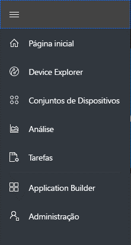
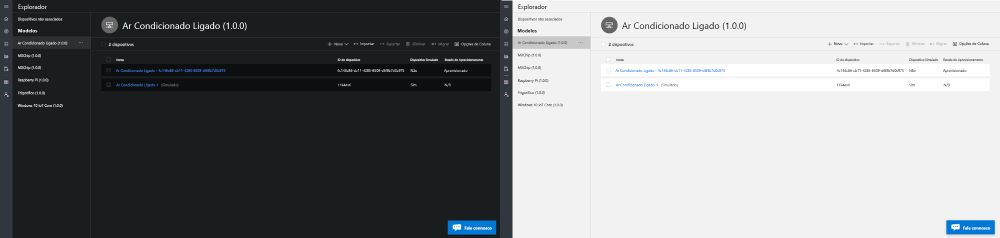
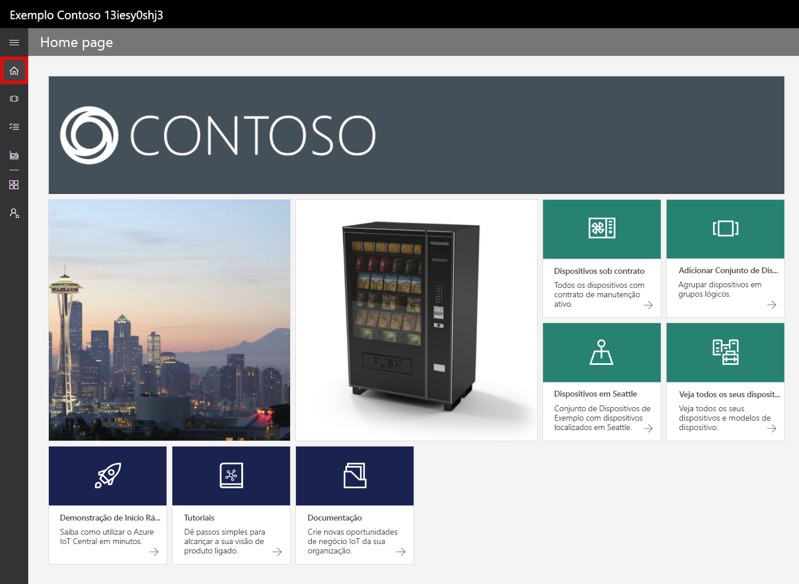
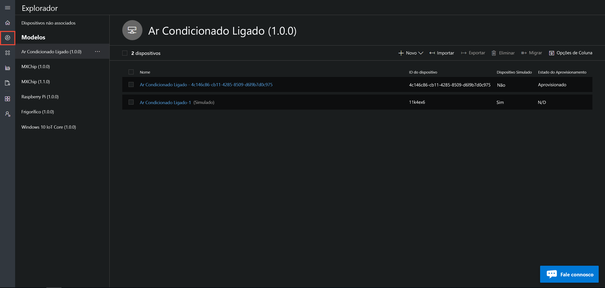
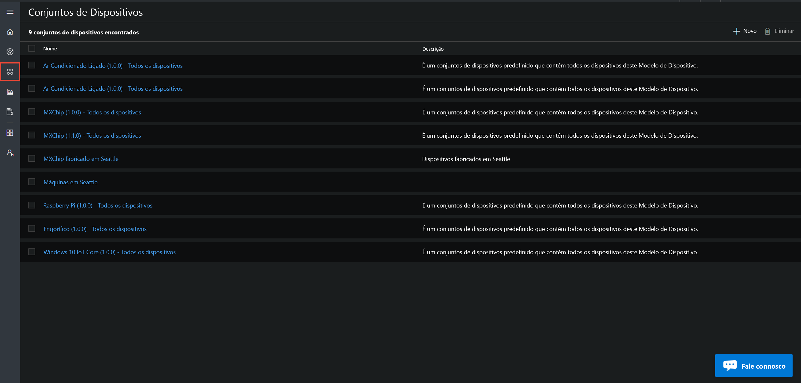
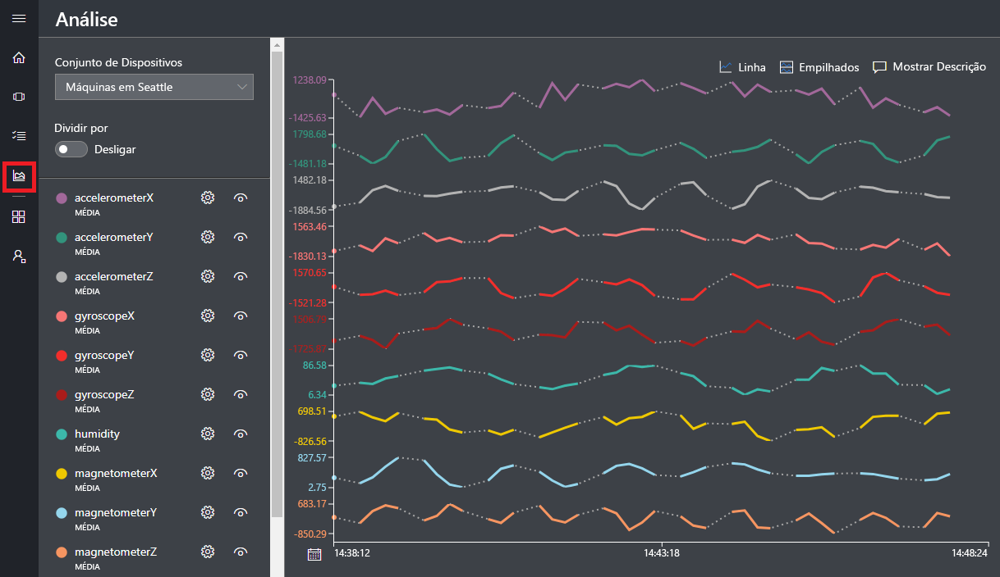
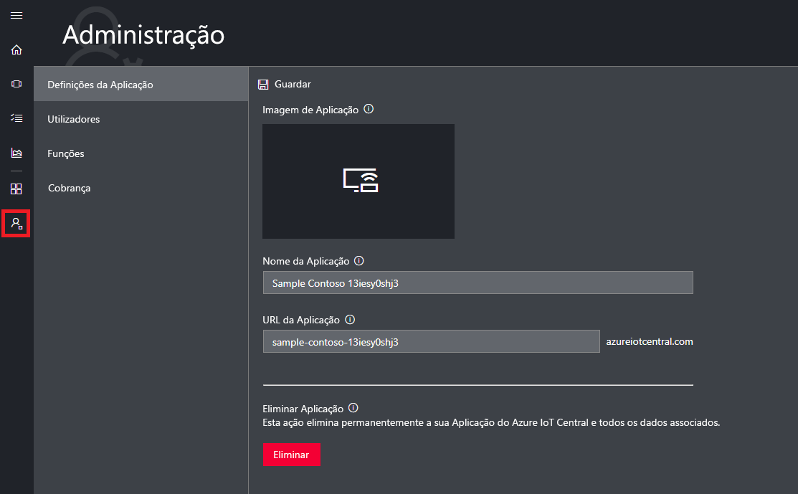

# Apresentação da IU do Azure IoT Central

[!INCLUDE [iot-central-original-pnp](../../includes/iot-central-original-pnp-note.md)]

Este artigo apresenta-lhe a IU do Microsoft Azure IoT Central. Pode utilizar a IU para criar, gerir e utilizar uma solução do Azure IoT Central e os respetivos dispositivos ligados.

Como _construtor_, utilize a IU do Azure IoT Central para definir a sua solução do Azure IoT Central. Pode utilizar a IU para:

- Definir os tipos de dispositivos que ligam à solução.
- Configurar as regras e ações para os seus dispositivos.
- Personalizar a IU para um _operador_ que utiliza a solução.

Como _operador_, utilize a IU do Azure IoT Central para gerir a sua solução do Azure IoT Central. Pode utilizar a IU para:

- Monitorizar os seus dispositivos.
- Configurar os seus dispositivos.
- Resolver e remediar problemas nos seus dispositivos.
- Aprovisionar novos dispositivos.

## Utilizar o menu de navegação à esquerda

Use o menu de navegação à esquerda para acessar as diferentes áreas do aplicativo. Você pode expandir ou recolher a barra de navegação **<** selecionando **>** ou:

:::row:::
  :::column span="":::
      
  :::column-end:::
  :::column span="2":::

      **Dashboard** displays your application dashboard. As a builder, you can customize the dashboard for your operators. Users can also create their own  dashboards.
    
      **Device Explorer** lists the simulated and real devices associated with each device template in the application. As an operator, you use the **Device Explorer** to manage your connected devices.
    
      **Device Sets** enables you to view and create device sets. As an operator, you can create device sets as a logical collection of devices specified by a query.
    
      **Analytics** shows analytics derived from device telemetry for devices and device sets. As an operator, you can create custom views on top of device data to derive insights from your application.
    
      **Jobs** enables bulk device management by having you create and run jobs to perform updates at scale.
    
      **Device Templates** shows the tools a builder uses to create and manage device templates.
    
      **Continuous Data Export** enables an administrator to configure a continuous export to other Azure services such as storage and queues.
    
      **Administration** shows the application administration pages where an administrator can manage application settings, users, and roles.
   :::column-end:::
:::row-end:::

## Pesquisa, ajuda e suporte

O menu superior é apresentado em todas as páginas:

- Para procurar dispositivos e modelos de dispositivo, insira um valor de **pesquisa** .
- Para alterar o idioma ou o tema da interface do usuário, escolha o ícone de **configurações** .
- Para sair do aplicativo, escolha o ícone de **conta** .
- Para obter ajuda e suporte, escolha o menu pendente **Ajuda** para obter uma lista de recursos. Em um aplicativo de avaliação, os recursos de suporte incluem acesso ao [Live Chat](howto-show-hide-chat.md).

Pode escolher entre um tema claro ou um tema escuro para a IU:

> [!NOTE]
> A opção de escolher entre temas claros e escuros não estará disponível se o administrador tiver configurado um tema personalizado para o aplicativo.

## Dashboard

* O painel é a primeira página que você vê quando entra em seu aplicativo de IoT Central do Azure. Como um construtor, você pode personalizar o painel do aplicativo para outros usuários adicionando blocos. Para obter mais informações, veja o tutorial [Personalizar a vista de operador do Azure IoT Central](tutorial-customize-operator.md).

* Como um operador, você pode criar painéis personalizados e alternar entre eles e o painel padrão. Para saber mais, confira o artigo como [criar e gerenciar painéis pessoais](howto-personalize-dashboard.md) .

## Explorador de dispositivos

A página do Explorer mostra os _dispositivos_ em seu aplicativo de IOT central do Azure agrupado por _modelo de dispositivo_.

* Um modelo do dispositivo define um tipo de dispositivo que pode ligar à aplicação. Para obter mais informações, veja [Definir um novo tipo de dispositivo na aplicação do Azure IoT Central](tutorial-define-device-type.md).
* Um dispositivo representa um dispositivo real ou simulado na aplicação. Para obter mais informações, veja [Adicionar um novo dispositivo à aplicação do Azure IoT Central](tutorial-add-device.md).

## Conjuntos de dispositivos

A página _conjuntos de dispositivo_ apresenta os conjuntos de dispositivos criados pelo construtor. Um conjunto de dispositivos é uma coleção de dispositivos relacionados. Um construtor define uma consulta para identificar os dispositivos que estão incluídos num conjunto de dispositivos. Utilize conjuntos de dispositivos quando personalizar a análise na aplicação. Para obter mais informações, veja o artigo [Utilizar conjuntos de dispositivos na aplicação do Azure IoT Central](howto-use-device-sets.md).

## Análise

A página de análise apresenta gráficos que o ajudam a compreender como se comportam os dispositivos ligados à sua aplicação. Um operador utiliza esta página para monitorizar e investigar problemas dos dispositivos ligados. O construtor pode definir os gráficos apresentados nesta página. Para obter mais informações, veja o artigo [Criar análise personalizada para a aplicação do Azure IoT Central](howto-use-device-sets.md).

## Tarefas

A página trabalhos permite executar operações de gerenciamento de dispositivo em massa em seus dispositivos. O construtor utiliza esta página para atualizar as propriedades, as definições e os comandos dos dispositivos. Para obter mais informações, veja o artigo [Executar uma tarefa](howto-run-a-job.md).

## Modelos de dispositivo

A página modelos de dispositivo é onde um construtor cria e gerencia os modelos de dispositivo no aplicativo. Um modelo de dispositivo especifica características de dispositivo, como:

- Medições de telemetria, estado e evento.
- Configurações e propriedades.
- Comandos.
- Regras baseadas em valores de eventos ou telemetria.

Para obter mais informações, veja o tutorial [Definir um novo tipo de dispositivo na aplicação do Azure IoT Central](tutorial-define-device-type.md).

## Exportação de dados contínua

A página de exportação de dados contínua é onde um administrador define como transmitir dados, como telemetria, do aplicativo. Outros serviços podem armazenar os dados exportados ou usá-los para análise. Para saber mais, consulte o artigo [exportar dados no Azure IOT central](howto-export-data.md) .

## Administração

A página Administração contém links para as ferramentas que um administrador usa, como a definição de usuários e funções no aplicativo e a personalização da interface do usuário. Para obter mais informações, veja o artigo [Administrar a aplicação do Azure IoT Central](howto-administer.md).

## Passos Seguintes

Agora que tem uma descrição geral do Azure IoT Central e está familiarizado com o esquema da IU, o passo seguinte sugerido é concluir o início rápido [Criar uma aplicação do Azure IoT Central](quick-deploy-iot-central.md).