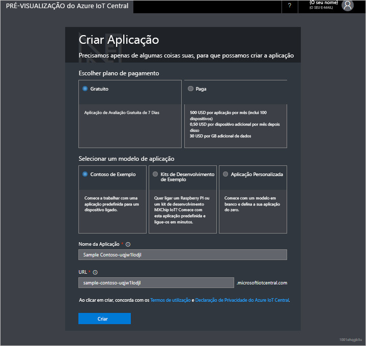

# Criar uma aplicação do Azure IoT Central

[!INCLUDE [iot-central-original-pnp](../../includes/iot-central-original-pnp-note.md)]

Como _construtor_, utilize a IU do Azure IoT Central para definir a sua aplicação do Microsoft Azure IoT Central. Este início rápido mostra como criar uma aplicação do Azure IoT Central que contém um exemplo do _modelo de dispositivo_ e _dispositivos_ simulados.

## Criar uma aplicação

Navegue até o site [do Azure IOT central Application Manager](https://aka.ms/iotcentral) . Tem de iniciar sessão com uma conta Microsoft pessoal ou escolar ou profissional.

Para começar a criar uma nova aplicação do Azure IoT Central, selecione **New Application** (Nova Aplicação). É encaminhado para a página **Create Application** (Criar Aplicação).

Para criar uma nova aplicação do Azure IoT Central:

1. Escolha um plano de pagamento.
   - As aplicações de **avaliação** são gratuitas durante sete dias, até que expiram. Podem ser convertidas em Pay As You Go a qualquer momento antes de expirarem. Se você criar um aplicativo de **avaliação** , precisará inserir suas informações de contato e escolher se deseja receber informações e dicas da Microsoft.
   - As aplicações **Pay As You Go** são cobradas por dispositivo, sendo os primeiros cinco gratuitos. Se você criar um aplicativo **pago conforme o uso** , precisará selecionar seu *diretório*, sua *assinatura do Azure*e uma *região*:
      - O *diretório* é o Azure Active Directory (AD) para criar seu aplicativo. Contém identidades de utilizadores, credenciais e outras informações organizacionais. Se você não tiver um Azure AD, um será criado para você quando você criar uma assinatura do Azure.
      - A *Subscrição do Azure* permite-lhe criar instâncias de serviços do Azure. O IoT Central aprovisiona os recursos na sua subscrição. Se não tiver uma subscrição do Azure, pode criá-la na [página de inscrição do Azure](https://aka.ms/createazuresubscription). Depois de criar a subscrição, regresse à página **Create Application** (Criar Aplicação). A subscrição nova aparece no menu pendente **Azure Subscription** (Subscrição do Azure).
      - A *região* é a localização física na qual pretende criar a aplicação. Por norma, deve escolher a região que está fisicamente mais perto dos dispositivos, de modo a obter um desempenho ideal. Pode ver as regiões em que o Azure IoT Central está disponível na página [Produtos disponíveis por região](https://azure.microsoft.com/regions/services/). Depois de escolher uma região, você não poderá mover o aplicativo para uma região diferente posteriormente.

      Saiba mais sobre os preços na [página de preços do Azure IoT Central](https://azure.microsoft.com/pricing/details/iot-central/).

1. Escolha um modelo de aplicação. Os modelos de aplicação podem conter itens predefinidos, como modelos de dispositivo e dashboards, que o ajudam a começar.

    | Modelo de aplicação | Descrição |
    | -------------------- | ----------- |
    | Amostra Contoso       | Cria uma aplicação que inclui um modelo de dispositivo já criado para uma máquina dispensadora de bebidas. Utilize este modelo para começar a explorar o Azure IoT Central. |
    | Exemplo da Devkits       | Cria uma aplicação com modelos de dispositivo prontos para se poder ligar a dispositivos MXChip ou Raspberry Pi. Se for programador de dispositivos, utilize este modelo para experimentar um destes dispositivos. |
    | Aplicação personalizada   | Cria uma aplicação vazia que pode preencher com os seus próprios modelos de dispositivo e dispositivos. |

1. Insira um nome de aplicativo amigável, como o **contoso IOT**. O Azure IoT Central gera um prefixo de URL exclusivo para si. Pode alterar este prefixo de URL para algo mais memorável.

1. Clique em **Criar**.

## Passos Seguintes

Neste início rápido, criou uma aplicação do IoT Central. O passo seguinte sugerido é:

> [!div class="nextstepaction"]
> [Definir um novo tipo de dispositivo em seu aplicativo de IoT Central do Azure](./tutorial-define-device-type.md)
