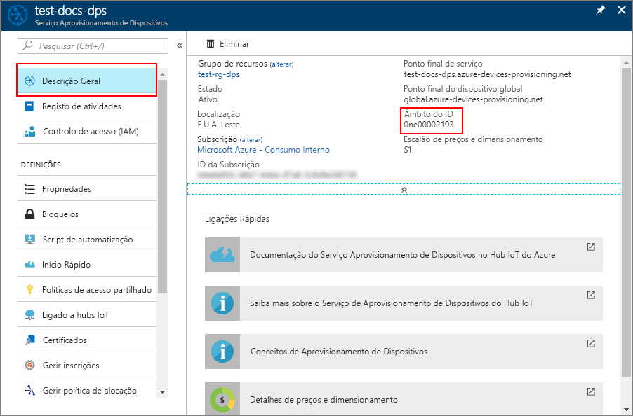

# <a name="how-to-provision-devices-using-symmetric-key-enrollment-groups"></a>Como providenciar dispositivos que utilizem grupos de inscrição chave simétricos

Este artigo demonstra como providenciar de forma segura múltiplos dispositivos chave simétricas a um único Hub IoT utilizando um grupo de inscrição.

Alguns dispositivos podem não ter um certificado, TPM ou qualquer outra funcionalidade de segurança que possa ser usada para identificar de forma segura o dispositivo. O serviço de provisionamento de dispositivos inclui a [chave simétrica.](concepts-symmetric-key-attestation.md) A teta de teclas simétricas pode ser usada para identificar um dispositivo baseado em informações únicas como o endereço MAC ou um número de série.

Se conseguir instalar facilmente um [módulo de segurança de hardware (HSM)](concepts-service.md#hardware-security-module) e um certificado, então essa pode ser uma melhor abordagem para identificar e a provisionar os seus dispositivos. A utilização de um HSM permitir-lhe-á contornar a atualização do código implantado em todos os seus dispositivos, e não teria uma chave secreta incorporada nas imagens do seu dispositivo. Este artigo pressupõe que nem um HSM nem um certificado é uma opção viável. No entanto, presume-se que tem algum método de atualizar o código do dispositivo para utilizar o Serviço de Provisionamento de Dispositivos para o fornecimento destes dispositivos. 

Este artigo também assume que a atualização do dispositivo ocorre num ambiente seguro para impedir o acesso não autorizado à chave do grupo principal ou à chave do dispositivo derivado.

Este artigo é orientado para uma estação de trabalho baseada no Windows. No entanto, pode efetuar os procedimentos no Linux. Para obter um exemplo para Linux, veja [Como aprovisionar para multi-inquilinos](how-to-provision-multitenant.md).

> [!NOTE]
> A amostra utilizada neste artigo está escrita em C. Existe também uma [amostra de chave simétrica de dispositivo C#](https://github.com/Azure-Samples/azure-iot-samples-csharp/tree/master/provisioning/Samples/device/SymmetricKeySample) disponível. Para utilizar esta amostra, faça o download ou clone do [repositório azure-iot-samples-csharp](https://github.com/Azure-Samples/azure-iot-samples-csharp) e siga as instruções em linha no código de amostra. Pode seguir as instruções deste artigo para criar um grupo de inscrição de chaves simétricas utilizando o portal e para encontrar o ID Scope e as chaves primárias e secundárias do grupo de inscrição necessárias para executar a amostra. Também pode criar inscrições individuais utilizando a amostra.

## <a name="overview"></a>Descrição Geral

Será definido um ID de registo único para cada dispositivo com base em informações que identifiquem esse dispositivo. Por exemplo, o endereço MAC ou um número de série.

Será criado um grupo de inscrições que utilize [o atestado de chave simétrica](concepts-symmetric-key-attestation.md) com o Serviço de Provisionamento de Dispositivos. O grupo de inscrições incluirá uma chave-chave de grupo. Esta chave principal será usada para hash cada ID de registo único para produzir uma chave de dispositivo única para cada dispositivo. O dispositivo utilizará essa chave de dispositivo derivada com o seu ID de registo único para atestar com o Serviço de Provisionamento de Dispositivos e ser atribuído a um hub IoT.

O código do dispositivo demonstrado neste artigo seguirá o mesmo padrão que o [Quickstart: Providenciar um dispositivo simulado com teclas simétricas](quick-create-simulated-device-symm-key.md). O código simulará um dispositivo utilizando uma amostra do [Azure IoT C SDK](https://github.com/Azure/azure-iot-sdk-c). O dispositivo simulado atestará com um grupo de inscrição em vez de uma inscrição individual, como demonstrado no arranque rápido.

[!INCLUDE [quickstarts-free-trial-note](../../includes/quickstarts-free-trial-note.md)]


## <a name="prerequisites"></a>Pré-requisitos

* Conclusão do Serviço de Provisionamento de [Dispositivos IoT Hub com o](./quick-setup-auto-provision.md) quickstart do portal Azure.

Os seguintes pré-requisitos são para um ambiente de desenvolvimento do Windows. Para Linux ou macOS, consulte a secção apropriada no preparar o [seu ambiente de desenvolvimento](https://github.com/Azure/azure-iot-sdk-c/blob/master/doc/devbox_setup.md) na documentação SDK.

* [Visual Studio](https://visualstudio.microsoft.com/vs/) 2019 com o ['desenvolvimento do ambiente de trabalho com C++'](/cpp/ide/using-the-visual-studio-ide-for-cpp-desktop-development) habilitado. Visual Studio 2015 e Visual Studio 2017 também são suportados.

* Versão mais recente do [Git](https://git-scm.com/download/) instalada.

## <a name="prepare-an-azure-iot-c-sdk-development-environment"></a>Preparar um ambiente de programação para o SDK C do Azure IoT

Nesta secção, irá preparar um ambiente de programação utilizado para criar o [SDK C do Azure IoT](https://github.com/Azure/azure-iot-sdk-c). 

O SDK inclui o código de amostra para o dispositivo simulado. Esse dispositivo simulado irá tentar fazer o aprovisionamento durante a respetiva sequência de arranque.

1. Descarregue o [sistema de construção CMake](https://cmake.org/download/).

    É importante que os pré-requisitos do Visual Studio (Visual Studio e a carga de trabalho "Desenvolvimento do ambiente de trabalho em C++") estejam instalados no computador, **antes** de iniciar a instalação de `CMake`. Depois de os pré-requisitos estarem assegurados e a transferência verificada, instale o sistema de compilação CMake.

2. Encontre o nome da etiqueta para a [última versão](https://github.com/Azure/azure-iot-sdk-c/releases/latest) do SDK.

3. Abra uma linha de comandos ou a shell do Git Bash. Executar os seguintes comandos para clonar a mais recente versão do repositório [Azure IoT C SDK](https://github.com/Azure/azure-iot-sdk-c) GitHub. Utilize a etiqueta encontrada no passo anterior como o valor para o `-b` parâmetro:

    ```cmd/sh
    git clone -b <release-tag> https://github.com/Azure/azure-iot-sdk-c.git
    cd azure-iot-sdk-c
    git submodule update --init
    ```

    Esta operação deve demorar vários minutos a ser concluída.

4. Crie um `cmake` subdiretório no diretório de raiz do repositório git, e navegue para essa pasta. Executar os seguintes comandos a partir do `azure-iot-sdk-c` diretório:

    ```cmd/sh
    mkdir cmake
    cd cmake
    ```

5. Execute o seguinte comando para compilar uma versão do SDK específica da plataforma de cliente de desenvolvimento. Será gerada uma solução do Visual Studio para o dispositivo simulado no diretório `cmake`. 

    ```cmd
    cmake -Dhsm_type_symm_key:BOOL=ON -Duse_prov_client:BOOL=ON  ..
    ```
    
    Se `cmake` não encontrar o compilador de C++, poderá obter erros de compilação ao executar o comando acima. Se isto acontecer, tente executar o comando seguinte na [linha de comandos do Visual Studio](/dotnet/framework/tools/developer-command-prompt-for-vs). 

    Assim que a compilação for concluída com êxito, as últimas linhas de saída terão um aspeto semelhante ao seguinte:

    ```cmd/sh
    $ cmake -Dhsm_type_symm_key:BOOL=ON -Duse_prov_client:BOOL=ON  ..
    -- Building for: Visual Studio 15 2017
    -- Selecting Windows SDK version 10.0.16299.0 to target Windows 10.0.17134.
    -- The C compiler identification is MSVC 19.12.25835.0
    -- The CXX compiler identification is MSVC 19.12.25835.0

    ...

    -- Configuring done
    -- Generating done
    -- Build files have been written to: E:/IoT Testing/azure-iot-sdk-c/cmake
    ```


## <a name="create-a-symmetric-key-enrollment-group"></a>Criar um grupo de inscrição chave simétrica

1. Inscreva-se no [portal Azure](https://portal.azure.com)e abra a sua instância do Serviço de Provisionamento de Dispositivos.

2. Selecione o **separador 'Gerir' e,** em seguida, clique no botão **de grupo de inscrição Add** no topo da página. 

3. No **Grupo de Inscrição adicionar,** introduza as seguintes informações e clique no botão **Guardar.**

   - **Nome do grupo**: Insira **as mylegacydevices**.

   - **Tipo de Atestado**: Selecione **Chave Simétrica**.

   - **Chaves de Geração Automática**: selecione esta caixa.

   - **Selecione como pretende atribuir dispositivos aos hubs**: Selecione **a configuração estática** para que possa atribuir a um hub específico.

   - **Selecione os hubs IoT a que este grupo pode ser designado:** Selecione um dos seus hubs.

     

4. Depois de guardar a inscrição, a **Chave Primária** e a **Chave Secundária** serão geradas e adicionadas à entrada de inscrição. O seu grupo de inscrição de chaves simétrica aparece como **mísiadevices** sob a coluna Nome do *Grupo* no separador *Grupos de Inscrição.* 

    Abra a inscrição e copie o valor da **Chave Primária** gerada. Esta chave é a chave do seu grupo principal.


## <a name="choose-a-unique-registration-id-for-the-device"></a>Escolha um ID de registo único para o dispositivo

Deve ser definido um ID de registo único para identificar cada dispositivo. Pode utilizar o endereço MAC, número de série ou qualquer informação única do dispositivo. 

Neste exemplo, usamos uma combinação de um endereço MAC e número de série formando o seguinte string para um ID de registo.

```
sn-007-888-abc-mac-a1-b2-c3-d4-e5-f6
```

Crie IDs de registo únicos para cada dispositivo. Os caracteres válidos são alfanuméricos minúsculos e traços ('-').


## <a name="derive-a-device-key"></a>Derivar uma chave de dispositivo 

Para gerar chaves do dispositivo, utilize a chave principal do grupo de inscrição para calcular um [HMAC-SHA256](https://wikipedia.org/wiki/HMAC) do ID de registo de cada dispositivo. O resultado é então convertido em formato Base64 para cada dispositivo.

> [!WARNING]
> O código do dispositivo para cada dispositivo deve incluir apenas a chave do dispositivo derivado correspondente para este dispositivo. Não inclua a chave principal de grupo no código do dispositivo. Uma chave-mestre comprometida tem o potencial de comprometer a segurança de todos os dispositivos que estão a ser autenticados com ele.


# <a name="windows"></a>[Windows](#tab/windows)

Se estiver a utilizar uma estação de trabalho baseada no Windows, pode utilizar o PowerShell para gerar a chave do dispositivo derivado, como mostra o exemplo a seguir.

Substitua o valor da **CHAVE** pela **Chave Primária** que observou anteriormente.

Substitua o valor da **REG_ID** pelo seu ID de registo.

```powershell
$KEY='8isrFI1sGsIlvvFSSFRiMfCNzv21fjbE/+ah/lSh3lF8e2YG1Te7w1KpZhJFFXJrqYKi9yegxkqIChbqOS9Egw=='
$REG_ID='sn-007-888-abc-mac-a1-b2-c3-d4-e5-f6'

$hmacsha256 = New-Object System.Security.Cryptography.HMACSHA256
$hmacsha256.key = [Convert]::FromBase64String($KEY)
$sig = $hmacsha256.ComputeHash([Text.Encoding]::ASCII.GetBytes($REG_ID))
$derivedkey = [Convert]::ToBase64String($sig)
echo "`n$derivedkey`n"
```

```powershell
Jsm0lyGpjaVYVP2g3FnmnmG9dI/9qU24wNoykUmermc=
```

# <a name="linux"></a>[Linux](#tab/linux)

Se estiver a utilizar uma estação de trabalho Linux, pode utilizar o openssl para gerar a chave do dispositivo derivado, como mostra o exemplo seguinte.

Substitua o valor da **CHAVE** pela **Chave Primária** que observou anteriormente.

Substitua o valor da **REG_ID** pelo seu ID de registo.

```bash
KEY=8isrFI1sGsIlvvFSSFRiMfCNzv21fjbE/+ah/lSh3lF8e2YG1Te7w1KpZhJFFXJrqYKi9yegxkqIChbqOS9Egw==
REG_ID=sn-007-888-abc-mac-a1-b2-c3-d4-e5-f6

keybytes=$(echo $KEY | base64 --decode | xxd -p -u -c 1000)
echo -n $REG_ID | openssl sha256 -mac HMAC -macopt hexkey:$keybytes -binary | base64
```

```bash
Jsm0lyGpjaVYVP2g3FnmnmG9dI/9qU24wNoykUmermc=
```

---

Cada dispositivo utiliza a sua chave de dispositivo derivada e iD de registo único para realizar atetação de chave simétrica com o grupo de inscrição durante o provisionamento.


## <a name="create-a-device-image-to-provision"></a>Criar uma imagem do dispositivo para provisão

Nesta secção, irá atualizar uma amostra de provisões denominada **\_ \_ \_ prov dev cliente** localizada no Azure IoT C SDK que configuraste anteriormente. 

Este código de amostra simula uma sequência de arranque do dispositivo que envia o pedido de provisionamento para a sua instância de Serviço de Provisionamento de Dispositivos. A sequência de arranque fará com que o dispositivo seja reconhecido e atribuído ao hub IoT que configuraste no grupo de inscrição. Isto seria concluído para cada dispositivo que seria provisionado usando o grupo de inscrição.

1. No portal do Azure, selecione o separador **Descrição Geral** do Serviço de Aprovisionamento de Dispositivos e anote o valor de **_Âmbito do ID_**.

     

2. No Visual Studio, abra **o** azure_iot_sdks.sln ficheiro de solução que foi gerado pela execução do CMake anteriormente. O ficheiro de solução deve estar na seguinte localização:

    ```
    \azure-iot-sdk-c\cmake\azure_iot_sdks.sln
    ```

3. Na janela *Solution Explorer* (Explorador de Soluções) do Visual Studio, navegue para a pasta **Provision\_Samples**. Expanda o projeto de exemplo com o nome **prov\_dev\_client\_sample**. Expanda **Source Files** (Ficheiros de Origem) e abra **prov\_dev\_client\_sample.c**.

4. Localize a constante `id_scope` e substitua o valor pelo seu **Âmbito do ID** que copiou anteriormente. 

    ```c
    static const char* id_scope = "0ne00002193";
    ```

5. Localize a definição da função `main()` no mesmo ficheiro. Certifique-se de que a variável `hsm_type` está definida como `SECURE_DEVICE_TYPE_SYMMETRIC_KEY`, conforme mostrado abaixo:

    ```c
    SECURE_DEVICE_TYPE hsm_type;
    //hsm_type = SECURE_DEVICE_TYPE_TPM;
    //hsm_type = SECURE_DEVICE_TYPE_X509;
    hsm_type = SECURE_DEVICE_TYPE_SYMMETRIC_KEY;
    ```

6. Encontre a chamada para a `prov_dev_set_symmetric_key_info()` **amostra do cliente prov \_ \_ dev.c \_** que é comentada.

    ```c
    // Set the symmetric key if using they auth type
    //prov_dev_set_symmetric_key_info("<symm_registration_id>", "<symmetric_Key>");
    ```

    Descompromete a chamada de função e substitua os valores do espaço reservado (incluindo os suportes angulares) pelo ID de registo único para o seu dispositivo e a chave de dispositivo derivada que gerou.

    ```c
    // Set the symmetric key if using they auth type
    prov_dev_set_symmetric_key_info("sn-007-888-abc-mac-a1-b2-c3-d4-e5-f6", "Jsm0lyGpjaVYVP2g3FnmnmG9dI/9qU24wNoykUmermc=");
    ```
   
    Guarde o ficheiro.

7. Clique com o botão direito do rato no projeto **prov\_dev\_client\_sample** e selecione **Definir como Projeto de Arranque**. 

8. No menu Visual Studio, selecione **Debug**  >  **Start sem depurar** para executar a solução. Na linha de comandos para recriar o projeto, clique em **Yes** (Sim) para recriar o projeto antes da execução.

    O resultado seguinte é um exemplo do dispositivo simulado a arrancar com êxito e a ligar à instância do serviço de aprovisionamento para atribuição a um hub IoT:

    ```cmd
    Provisioning API Version: 1.2.8

    Registering Device

    Provisioning Status: PROV_DEVICE_REG_STATUS_CONNECTED
    Provisioning Status: PROV_DEVICE_REG_STATUS_ASSIGNING
    Provisioning Status: PROV_DEVICE_REG_STATUS_ASSIGNING

    Registration Information received from service: 
    test-docs-hub.azure-devices.net, deviceId: sn-007-888-abc-mac-a1-b2-c3-d4-e5-f6

    Press enter key to exit:
    ```

9. No portal, navegue para o hub IoT a que o seu dispositivo simulado foi atribuído e clique no **separador Dispositivos IoT.** No fornecimento bem sucedido do simulado ao hub, o seu ID do dispositivo aparece na lâmina **de Dispositivos IoT,** com *status* conforme **ativado**. Poderá ter de clicar no botão **Atualizar** na parte superior. 

     


## <a name="security-concerns"></a>Preocupações com a segurança

Esteja ciente de que isto deixa a chave do dispositivo derivado incluída como parte da imagem para cada dispositivo, o que não é uma melhor prática de segurança recomendada. Esta é uma das razões pelas quais a segurança e a facilidade de utilização são muitas vezes compensações. Deve rever totalmente a segurança dos seus dispositivos com base nos seus próprios requisitos.


## <a name="next-steps"></a>Passos seguintes

* Para saber mais Reprovisioning, consulte [conceitos de reprovisionamento do IoT Hub Device](concepts-device-reprovision.md) 
* [Guia de Início Rápido: aprovisionar um dispositivo simulado com chaves simétricas](quick-create-simulated-device-symm-key.md)
* Para saber mais Deprovisionamento, consulte [Como desprovisionar dispositivos que foram previamente auto-aprovisionados](how-to-unprovision-devices.md)
